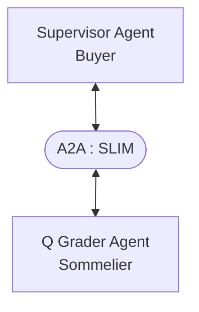
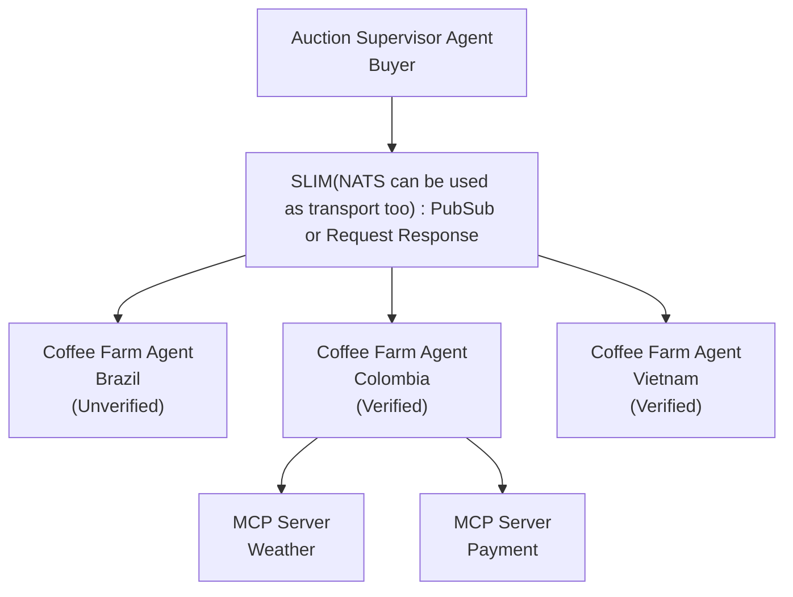
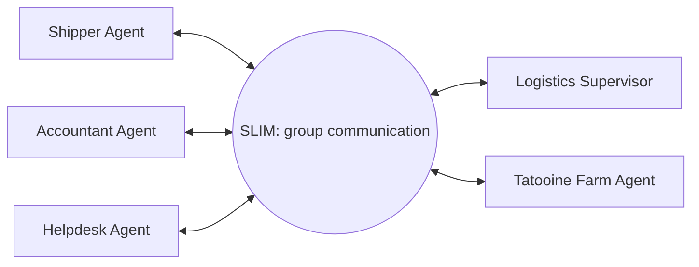

# Get Started with CoffeeAGNTCY

CoffeeAGNTCY is a reference implementation built around a fictitious coffee company to demonstrate how components in the AGNTCY Internet of Agents ecosystem work together.

  

    <iframe style="position:absolute;top:0;left:0;width:100%;height:100%;" src="https://www.youtube.com/embed/kCAe8gHqJ9g" title="AGNTCY Reference Application and SDK" frameborder="0" allow="accelerometer; autoplay; clipboard-write; encrypted-media; gyroscope; picture-in-picture; web-share" referrerpolicy="strict-origin-when-cross-origin" allowfullscreen></iframe>
  

This project is meant to exemplify how AGNTCY and open-source agentic standards interoperate through clean, reproducible example code. It is purposefully designed for developers across experience levels, from those taking their first steps in building agentic systems to those with more experience curious about AGNTCY's offerings.

With CoffeeAGNTCY, you can:

* Learn how to leverage the AGNTCY App SDK Factory to write transport and agentic protocol-agnostic clients and server code.

* Explore SLIM v0.6.0 and its support for request-reply, unicast (fire-and-forget), publisher/subscriber, and group communication patterns (with additional support for NATS transport for publisher/subscriber messaging).

* Enable observability with the AGNTCY Observe SDK.

* Learn how to write simple A2A client and server agents.

* Orchestrate agents using LangGraph via the supervisor-worker agent architecture.

* Understand how to integrate data sources via MCP.

CoffeeAGNTCY exposes two demo apps: Corto and Lungo.

For an in-depth tutorial, see the [CoffeeAGNTCY Tutorial](https://github.com/agntcy/coffeeAgntcy/blob/main/TUTORIAL.md).

## Corto

Corto functions as a minimal demo application. While Lungo expands to showcase the ever-growing ecosystem of agentic tooling, Corto remains intentionally simple, serving as an accessible entry point for developers new to the agentic world or to AGNTCY.

Its role is that of a coffee sommelier: you can ask questions like “What does coffee harvested in Colombia in the summer taste like?” and Corto will respond with a clear, engaging description of its flavor profile.

With just two agents, Corto demonstrates the core patterns of agent-to-agent interaction. A LangChain-based supervisor agent acts as an A2A client, connecting to a Q Grader Agent Sommelier (A2A server) over a SLIM transport connection. AGNTCY’s observability tools are integrated via the SDK to provide an end-to-end view.

Learn more on how to deploy Corto locally by visiting the [Corto deployment guide](https://github.com/agntcy/coffeeAgntcy/blob/main/coffeeAGNTCY/coffee_agents/corto/README.md)

### Lungo

Lungo is our ever-evolving demo application. As AGNTCY expands, Lungo grows alongside it. It adds new features and capabilities, demonstrating how they work together in an interoperable ecosystem. It includes a LangGraph-orchestrated supervisor agent, but instead of connecting to a single farm like Corto, Lungo integrates with different farms and logistics agents in two different setups like publisher/subscriber and group communication.

#### Setup 1: Publisher/Subscriber pattern

Each farm is designed to demonstrate different agentic protocols and implementations. For now, the agents are similar to Corto’s: LangGraph-orchestrated A2A agents that communicate with the exchange using both pub/sub and request–response patterns. The farms are distinguished by "location". In addition to being an A2A server, the Colombia farm acts as a MCP client that connects to a Weather MCP Server and a Payment MCP Server.

All agents and MCP servers use SLIM as the transport layer (can switch between transports: SLIM and NATS), showcasing its flexibility by switching between one-to-many broadcasts via pub/sub and direct agent-to-agent request–response interactions based on the need specified by the prompt. The auction supervisor also supports **streaming responses**, allowing real-time updates as farms respond to queries. To learn more about how this works, explore the [CoffeeAGNTCY SLIM Transport Integration](./slim-coffee-agntcy.md).

AGNTCY's Agent Identity Service handles authentication and implements TBAC (Tool-Based Access Control) to enforce authorization policies across services. TBAC controls which agents can invoke specific services and tools, ensuring secure access control across all communication patterns. To learn more about how this works in Lungo, explore the [CoffeeAGNTCY Identity integration](./identity-coffee-agntcy.md)

#### Setup 2: Group Communication pattern

In this setup, we have multiple LangGraph agents that communicate with each other using SLIM's group communication, where all agents participate in a group session, sending messages and listening for relevant chats from other agents in the group. The logistics supervisor agent sends a message to other agents (farm, shipper, accountant, helpdesk) to fulfill the coffee order, and all other agents listen to the communication and respond accordingly to complete the order. The logistics supervisor supports **streaming responses**, providing real-time order state transitions as each agent processes the order.

Learn more on how to deploy Lungo locally by visiting the [Lungo Deployment Guide](https://github.com/agntcy/coffeeAgntcy/blob/main/coffeeAGNTCY/coffee_agents/lungo/README.md)
