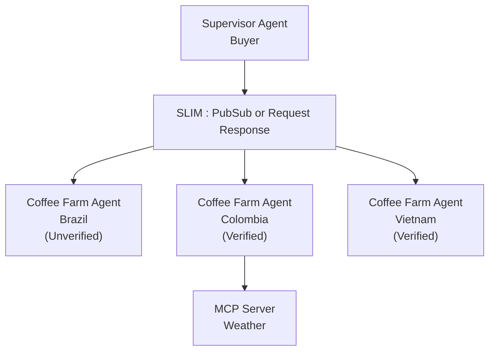

# Get Started with CoffeeAGNTCY

CoffeeAGNTCY is a reference implementation built around a fictitious coffee company to demonstrate how components in the AGNTCY Internet of Agents ecosystem work together.

This project is meant to exemplify how AGNTCY and open-source agentic standards interoperate through clean, reproducible example code. It is purposefully designed for developers across experience levels, from those taking their first steps in building agentic systems to those with more experience curious about AGNTCY's offerings.

With CoffeeAgntcy, you can:
* Learn how to leverage the AGNTCY App SDK Factory to write transport and agentic protocol-agnostic clients and server code.

* Explore SLIM and its support for broadcast and unicast messaging.

* Enable observability with the AGNTCY Observe SDK.

* Learn how to write simple A2A client and server agents

* Orchestrate agents using LangGraph via the supervisor-worker agent architecture

* Understand how to integrate data sources via MCP

CoffeeAGNTCY exposes two demo apps: Corto and Lungo. 

### Corto

Corto functions as a minimal demo application. While Lungo expands to showcase the ever-growing ecosystem of agentic tooling, Corto remains intentionally simple, serving as an accessible entry point for developers new to the agentic world or to AGNTCY.

Its role is that of a coffee sommelier: you can ask questions like “What does coffee harvested in Colombia in the summer taste like?” and Corto will respond with a clear, engaging description of its flavor profile.

With just two agents, Corto demonstrates the core patterns of agent-to-agent interaction. A LangGraph-orchestrated supervisor agent acts as an A2A client, connecting to a Q Grader Agent Sommelier (A2A server) over a SLIM transport connection. AGNTCY’s observability tools are integrated via the SDK to provide an end-to-end view.

Learn more on how to deploy Corto locally by visiting the [Corto deployment guide](https://github.com/agntcy/coffeeAgntcy/blob/main/coffeeAGNTCY/coffee_agents/corto/README.md)

### Lungo

Lungo is our ever-evolving demo application. As AGNTCY expands, Lungo grows alongside it. It adds new features and capabilities, demonstrating how they work together in an interoperable ecosystem. Like the Corto demo, it includes a LangGraph-orchestrated supervisor agent, but instead of connecting to a single farm, Lungo integrates with three.

Each farm is designed to demonstrate different agentic protocols and implementations. For now, the agents are similar to Corto’s: LangGraph-orchestrated A2A agents that communicate with the exchange using both pub/sub and request–response patterns. The farms are distinguished by "location". In addition to being a A2A server, the Colombia farm acts as a MCP client that connects to a Weather MCP Server.

By default, all agents and MCP servers use SLIM as the transport layer, showcasing its flexibility by switching between one-to-many broadcasts via pub/sub and direct agent-to-agent request–response interactions based on the need specified by the prompt. To learn more about how this works, explore the [CoffeeAGNTCY SLIM Integration](./slim-coffee-agntcy.md)

AGNTCY’s Agent Identity Service handles authentication between agents, allowing them to verify each other’s identity before establishing a connection. This exemplifies the requirement within larger agentic networks for secure communication and trust. To learn more about how this works in Lungo, explore the [CoffeeAGNTCY Identity integration](./identity-coffee-agntcy.md) 

Learn more on how to deploy Lungo locally by visiting the [Lungo Deployment Guide](https://github.com/agntcy/coffeeAgntcy/blob/main/coffeeAGNTCY/coffee_agents/lungo/README.md)

