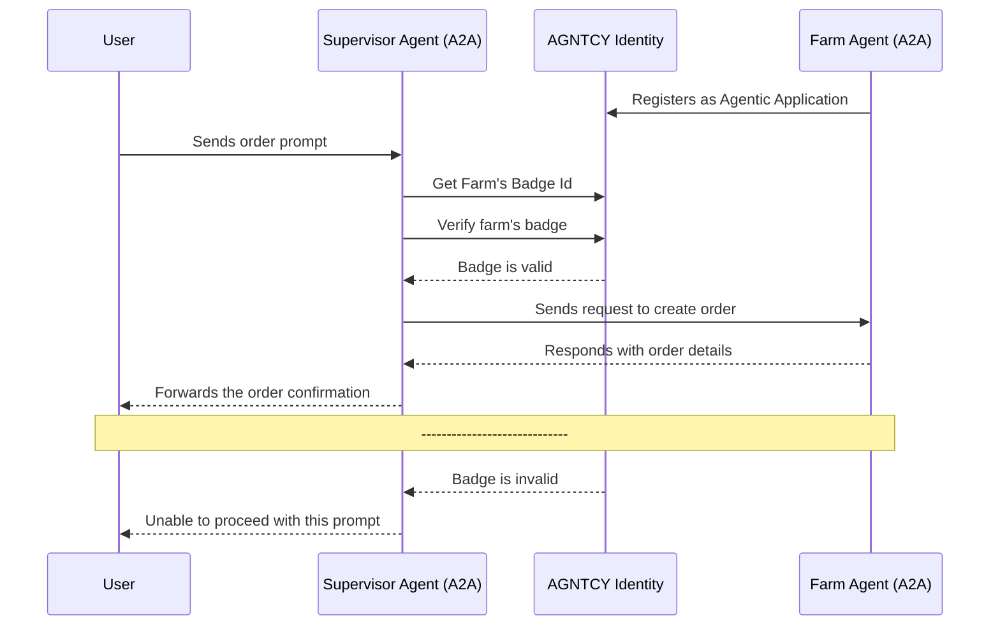
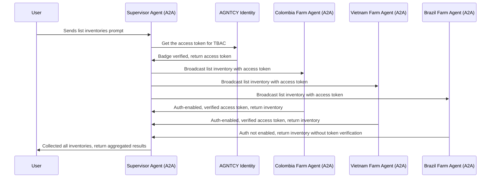
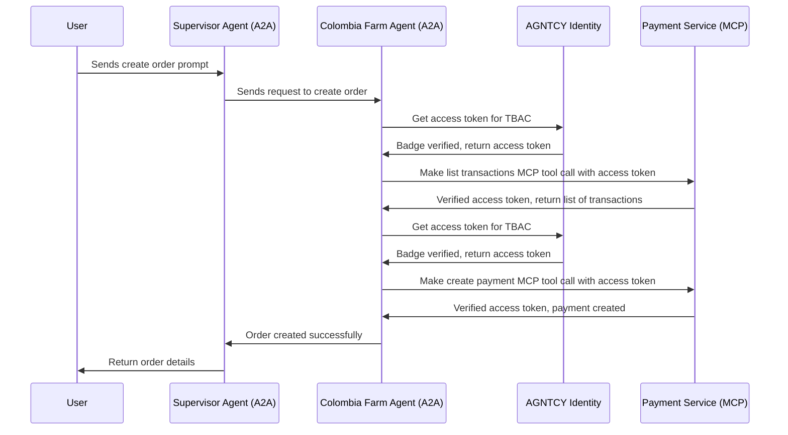

# Identity in CoffeeAGNTCY

!!! info "Setup Guide"
    For setup instructions and testing details, see the [Identity Integration Documentation](https://github.com/agntcy/coffeeAgntcy/blob/main/coffeeAGNTCY/coffee_agents/lungo/docs/identity_integration.md).

CoffeeAGNTCY uses [Ory Hydra](https://www.ory.sh/hydra) as its identity provider (IDP) within the Agent Identity Service. Ory Hydra is an open-source OAuth2 and OpenID Connect server, which aligns with AGNTCY’s commitment to open, collaborative development.

The identity flow shown below outlines how CoffeeAGNTCY’s agents authenticate and verify one another through the Agentic Identity Service. before proceeding with collaborative tasks.

## TBAC (Tool-Based Access Control)

CoffeeAGNTCY demonstrates TBAC implementation at both agent and tool levels, controlling access across different communication patterns.

### Agent-Level TBAC (Broadcasting)

This flow shows how TBAC controls agent-to-agent communication when broadcasting to multiple farms:

### Tool-Level TBAC (Point-to-Point)

This flow demonstrates TBAC enforcement for MCP tool invocations:

For more information on Identity in AGNTCY, see the [Identity documentation.](../identity/identity.md)
