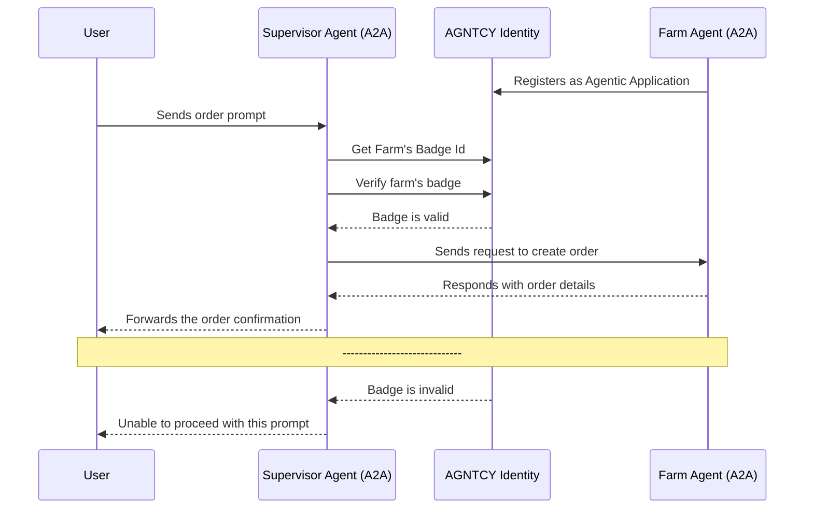

# Identity in CoffeeAGNTCY

CoffeeAGNTCY uses [Ory Hydra](https://www.ory.sh/hydra) as its identity provider (IDP) within the Agent Identity Service. Ory Hydra is an open-source OAuth2 and OpenID Connect server, which aligns with AGNTCY’s commitment to open, collaborative development.

The identity flow shown below outlines how CoffeeAGNTCY’s agents authenticate and verify one another through the Agentic Identity Service. before proceeding with collaborative tasks.

For more information on Identity in AGNTCY, see the [Identity documentation.](../identity/identity.md)
