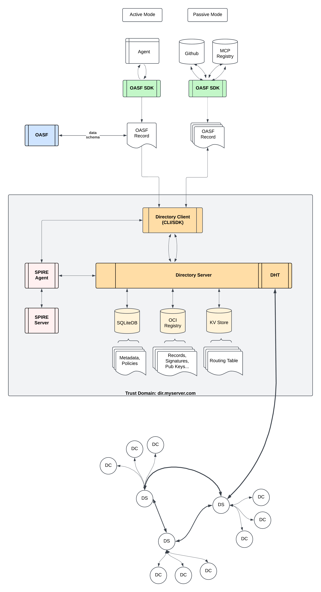

# Architecture

The architecture of the Agent Directory Service (ADS) is designed to support a scalable, secure, and efficient way to manage and distribute agent directory records across a distributed network of servers.

## Components

- **Records**: The fundamental units of information in the ADS, representing individual agents and their capabilities. Each record is uniquely identified and contains metadata describing the agent's skills, attributes, and constraints.

- **Distributed Hash Table (DHT)**: A decentralized storage system that enables efficient lookup and retrieval of directory records. The DHT maps agent skills to record identifiers, allowing for quick discovery of relevant agents based on their capabilities.

- **Content Routing Protocol**: A set of rules and mechanisms for routing requests and responses between agents and directory servers. This protocol ensures that queries for agent capabilities are efficiently directed to the appropriate servers hosting the relevant records.

- **Agent Directory Servers**: Nodes in the ADS network responsible for storing and managing directory records. These servers participate in the DHT and implement the content routing protocol to facilitate agent discovery.

- **Clients**: Tools that allow developers to interact with the ADS, publish agent records, and search for agents based on some criteria.

- **Runtime Discovery**: Components that watch container runtimes (Docker, Kubernetes) for workloads and provide a gRPC API for querying them. Enables dynamic discovery of agents running in containerized environments, with support for resolving A2A agent cards and OASF records from discovered workloads.

- **Event Streaming**: Real-time notification system that publishes Directory events to message brokers, enabling subscribers to react to record changes, discoveries, and other Directory operations.

- **Security and Trust Mechanisms**: Features that ensure the integrity and authenticity of directory records and nodes, including cryptographic signing, verification of claims, secure communication protocols, and access controls.

## Principles

- **Scalability**: The ADS is designed to handle a large number of servers and records, with the ability to scale horizontally by adding more directory servers to the network.

- **Efficiency**: The content routing protocol and DHT structure are optimized for fast lookups and minimal latency in agent discovery.

- **Decentralization**: By leveraging a DHT and distributed servers, the ADS avoids single points of failure and promotes resilience and fault tolerance.

- **Extensibility**: The ADS is built with flexibility in mind, allowing for the addition of new features, protocols, and integrations as needed.

- **Security**: The architecture incorporates robust security measures to protect against unauthorized access, data tampering, and other threats.

- **Interoperability**: The ADS is designed to work seamlessly with other systems and protocols, enabling integration with various agent frameworks and platforms.

## System Architecture Diagram

