# Directory API Reference

This document contains the complete API reference for the Agent Directory.


## core


### core/v1alpha1


#### object.proto.md

## Package: core.v1alpha1

<div class="comment"><span>Copyright AGNTCY Contributors (https://github.com/agntcy) SPDX-License-Identifier: Apache-2.0</span><br/></div>

### Imports

| Import                 | Description |
|------------------------|-------------|
| objects/v1/agent.proto |             |


### Options

| Name | Value | Description |
|------|-------|-------------|


### Enum: ObjectType
<div style="font-size: 12px; margin-top: -10px;" class="fqn">FQN: core.v1alpha1.ObjectType</div>

<div class="comment"><span>ObjectType defines a list of native types. Other types may be used but some operations on the storage layer may not be supported.</span><br/></div>

| Name              | Ordinal | Description |
|-------------------|---------|-------------|
| OBJECT_TYPE_RAW   | 0       | "raw"       |
| OBJECT_TYPE_AGENT | 1       | "agent"     |


#### ObjectType Diagram

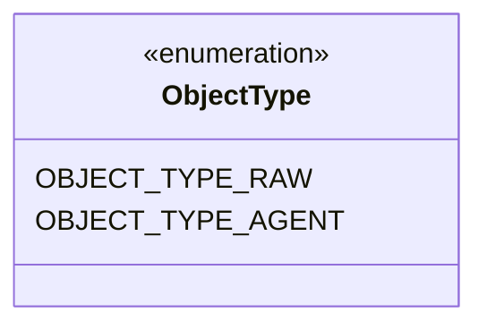
#### ObjectRef Diagram

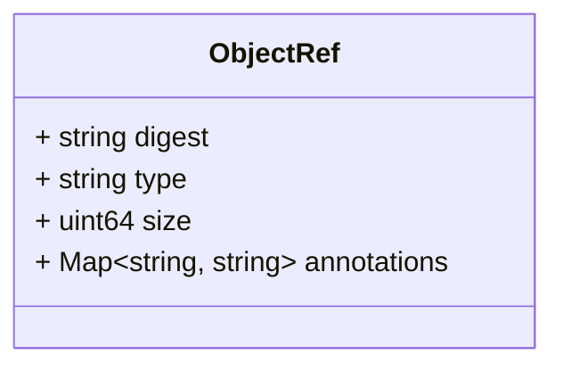
#### Object Diagram

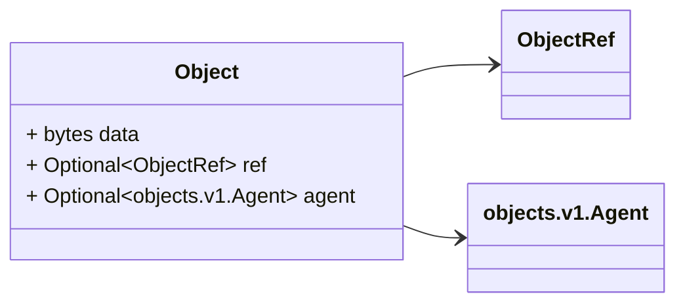

### Message: ObjectRef
<div style="font-size: 12px; margin-top: -10px;" class="fqn">FQN: core.v1alpha1.ObjectRef</div>

<div class="comment"><span>Reference to a typed object in the content store.</span><br/></div>

| Field       | Ordinal | Type           | Label | Description                                                                                                                                                          |
|-------------|---------|----------------|-------|----------------------------------------------------------------------------------------------------------------------------------------------------------------------|
| digest      | 1       | string         |       | Digest of the object data. Digest is used as a globally unique ID of an object. Specs: https://github.com/opencontainers/image-spec/blob/main/descriptor.md#digests  |
| type        | 2       | string         |       | Type of the object. Can be looked up from digest.                                                                                                                    |
| size        | 3       | uint64         |       | Size of the object. Can be looked up from digest.                                                                                                                    |
| annotations | 4       | string, string | Map   | Additional metadata associated with this object. Can be looked up from digest.                                                                                       |


### Message: Object
<div style="font-size: 12px; margin-top: -10px;" class="fqn">FQN: core.v1alpha1.Object</div>

<div class="comment"><span>Object maps a given ref to an actual object.</span><br/></div>

| Field | Ordinal | Type             | Label    | Description                                                                                         |
|-------|---------|------------------|----------|-----------------------------------------------------------------------------------------------------|
| data  | 1       | bytes            |          | Opaque data held by this object. Arbitrary in size. Readers should know how to process this value.  |
| ref   | 2       | ObjectRef        | Optional | This is only needed in push.                                                                        |
| agent | 3       | objects.v1.Agent | Optional | In case ref is pointing to an agent model, this can be set. This is only set on pull.               |


<!-- Created by: Proto Diagram Tool -->
<!-- https://github.com/GoogleCloudPlatform/proto-gen-md-diagrams -->


## objectmanager


### record.proto.md

## Package: objectmanager

<div class="comment"><span>Copyright AGNTCY Contributors (https://github.com/agntcy) SPDX-License-Identifier: Apache-2.0</span><br/></div>

### Imports

| Import                        | Description |
|-------------------------------|-------------|
| objects/v1/agent.proto        |             |
| objects/v2/agent_record.proto |             |
| store/v1alpha2/object.proto   |             |


### Options

| Name | Value | Description |
|------|-------|-------------|


### Service: RecordObjectConverter
<div style="font-size: 12px; margin-top: -10px;" class="fqn">FQN: objectmanager</div>

<div class="comment"><span>Converts Object to an RecordObject and vice versa. This is client-side service only.</span><br/></div>

#### RecordObjectConverter Diagram

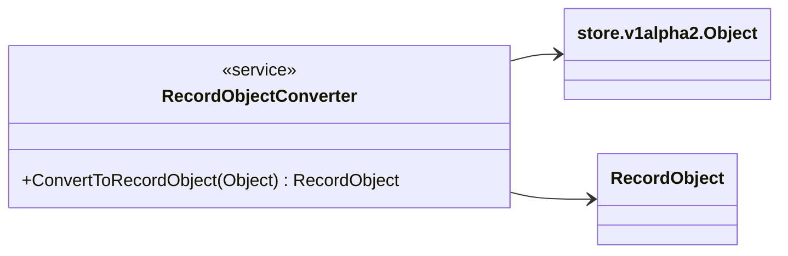

| Method                | Parameter (In) | Parameter (Out) | Description                            |
|-----------------------|----------------|-----------------|----------------------------------------|
| ConvertToRecordObject | Object         | RecordObject    | Converts an Object to a RecordObject.  |


#### RecordObject Diagram

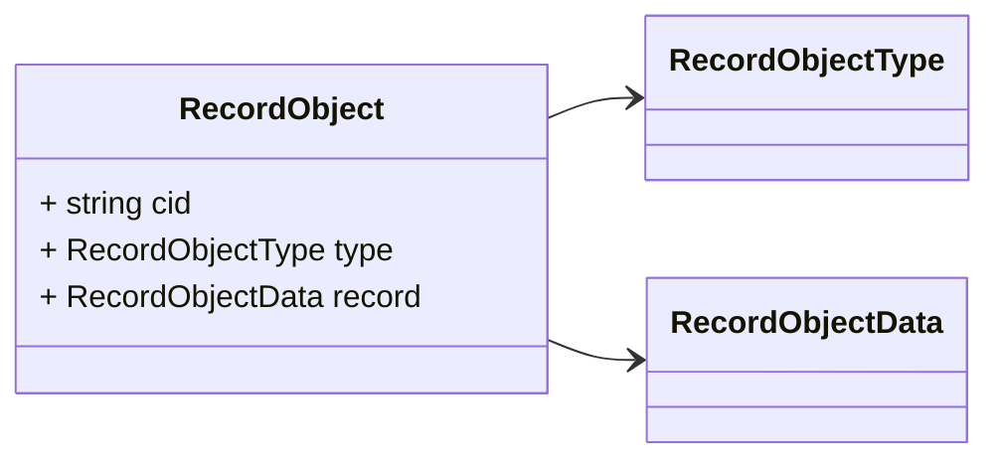
#### RecordObjectData Diagram

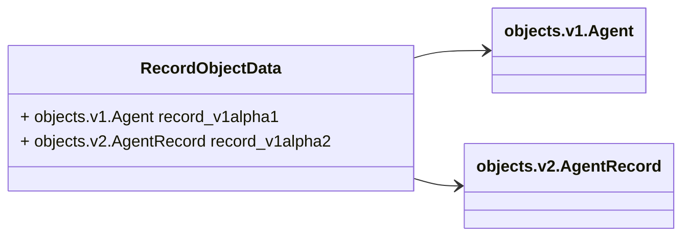

### Message: RecordObject
<div style="font-size: 12px; margin-top: -10px;" class="fqn">FQN: objectmanager.RecordObject</div>

<div class="comment"><span>Unifies different agent records into a single object. Allows to handle different versions of record objects in a single way, without worrying about the schema. RecordObject and Object are composable types.</span><br/></div>

| Field  | Ordinal | Type             | Label | Description          |
|--------|---------|------------------|-------|----------------------|
| cid    | 1       | string           |       | CID of the record.   |
| type   | 2       | RecordObjectType |       | Type of the record.  |
| record | 3       | RecordObjectData |       | Data of the record.  |


### Message: RecordObjectData
<div style="font-size: 12px; margin-top: -10px;" class="fqn">FQN: objectmanager.RecordObjectData</div>

<div class="comment"><span></span><br/></div>

| Field           | Ordinal | Type                   | Label | Description |
|-----------------|---------|------------------------|-------|-------------|
| record_v1alpha1 | 1       | objects.v1.Agent       |       |             |
| record_v1alpha2 | 2       | objects.v2.AgentRecord |       |             |


<!-- Created by: Proto Diagram Tool -->
<!-- https://github.com/GoogleCloudPlatform/proto-gen-md-diagrams -->


## objects


### objects/v1


#### agent.proto.md

## Package: objects.v1

<div class="comment"><span>Copyright AGNTCY Contributors (https://github.com/agntcy) SPDX-License-Identifier: Apache-2.0</span><br/></div>

### Imports

| Import                     | Description |
|----------------------------|-------------|
| objects/v1/extension.proto |             |
| objects/v1/locator.proto   |             |
| objects/v1/signature.proto |             |
| objects/v1/skill.proto     |             |


### Options

| Name | Value | Description |
|------|-------|-------------|


<!-- Created by: Proto Diagram Tool -->
<!-- https://github.com/GoogleCloudPlatform/proto-gen-md-diagrams -->


#### extension.proto.md

## Package: objects.v1

<div class="comment"><span>Copyright AGNTCY Contributors (https://github.com/agntcy) SPDX-License-Identifier: Apache-2.0</span><br/></div>

### Imports

| Import                       | Description |
|------------------------------|-------------|
| google/protobuf/struct.proto |             |


### Options

| Name | Value | Description |
|------|-------|-------------|


#### Extension Diagram

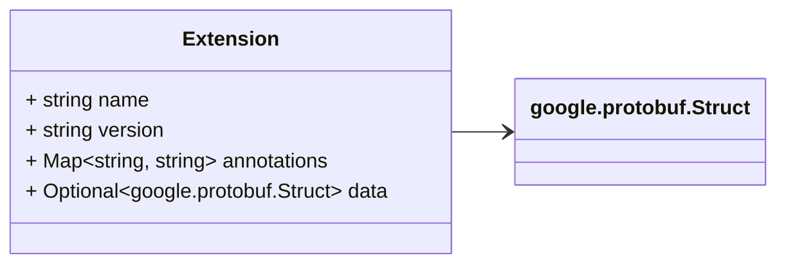

### Message: Extension
<div style="font-size: 12px; margin-top: -10px;" class="fqn">FQN: objects.v1.Extension</div>

<div class="comment"><span>Extensions provide dynamic descriptors for an agent data model. For example, arbitrary data and third-party features can be described using extensions. Key := { This is an immutable object.</span><br/></div>

| Field       | Ordinal | Type                   | Label    | Description                                     |
|-------------|---------|------------------------|----------|-------------------------------------------------|
| name        | 1       | string                 |          | Name of the extension attached to an agent.     |
| version     | 2       | string                 |          | Version of the extension attached to an agent.  |
| annotations | 3       | string, string         | Map      | Metadata associated with this extension.        |
| data        | 4       | google.protobuf.Struct | Optional | Value of the data.                              |


<!-- Created by: Proto Diagram Tool -->
<!-- https://github.com/GoogleCloudPlatform/proto-gen-md-diagrams -->


#### locator.proto.md

## Package: objects.v1

<div class="comment"><span>Copyright AGNTCY Contributors (https://github.com/agntcy) SPDX-License-Identifier: Apache-2.0</span><br/></div>

### Imports

| Import | Description |
|--------|-------------|


### Options

| Name | Value | Description |
|------|-------|-------------|


### Enum: LocatorType
<div style="font-size: 12px; margin-top: -10px;" class="fqn">FQN: objects.v1.LocatorType</div>

<div class="comment"><span>Digest of the source pointed by the { LocatorType defines native types of locators.</span><br/></div>

| Name                        | Ordinal | Description       |
|-----------------------------|---------|-------------------|
| LOCATOR_TYPE_UNSPECIFIED    | 0       | ""                |
| LOCATOR_TYPE_HELM_CHART     | 1       | "helm-chart"      |
| LOCATOR_TYPE_DOCKER_IMAGE   | 2       | "docker-image"    |
| LOCATOR_TYPE_PYTHON_PACKAGE | 3       | "python-package"  |
| LOCATOR_TYPE_SOURCE_CODE    | 4       | "source-code"     |
| LOCATOR_TYPE_BINARY         | 5       | "binary"          |


#### LocatorType Diagram

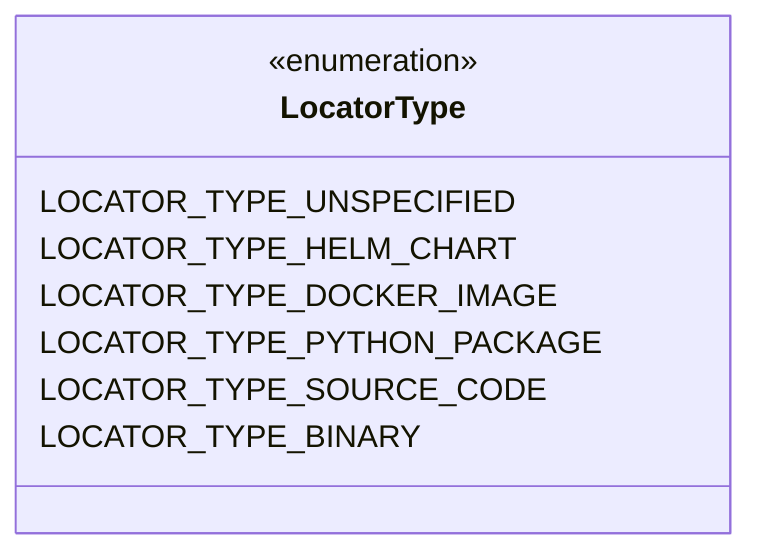
#### Locator Diagram

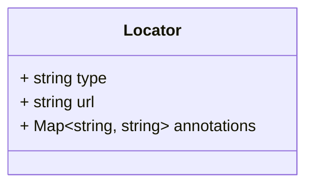

### Message: Locator
<div style="font-size: 12px; margin-top: -10px;" class="fqn">FQN: objects.v1.Locator</div>

<div class="comment"><span>Locator points to the artifact locators for an agent data model. For example, this can include a reference to a helm chart. Key := { This is an immutable object.</span><br/></div>

| Field       | Ordinal | Type           | Label | Description                                                                                                 |
|-------------|---------|----------------|-------|-------------------------------------------------------------------------------------------------------------|
| type        | 1       | string         |       | Type of the locator. Can be custom or native LocatorType.                                                   |
| url         | 2       | string         |       | Location URI where this source can be found/accessed. Specs: https://datatracker.ietf.org/doc/html/rfc1738  |
| annotations | 3       | string, string | Map   | Metadata associated with this locator.                                                                      |


<!-- Created by: Proto Diagram Tool -->
<!-- https://github.com/GoogleCloudPlatform/proto-gen-md-diagrams -->


#### signature.proto.md

## Package: objects.v1

<div class="comment"><span>Copyright AGNTCY Contributors (https://github.com/agntcy) SPDX-License-Identifier: Apache-2.0</span><br/></div>

### Imports

| Import | Description |
|--------|-------------|


### Options

| Name | Value | Description |
|------|-------|-------------|


#### Signature Diagram

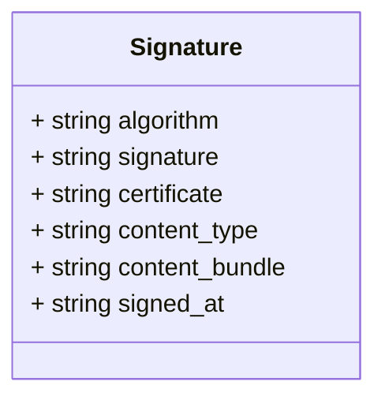

### Message: Signature
<div style="font-size: 12px; margin-top: -10px;" class="fqn">FQN: objects.v1.Signature</div>

<div class="comment"><span></span><br/></div>

| Field          | Ordinal | Type   | Label | Description                                                                                                             |
|----------------|---------|--------|-------|-------------------------------------------------------------------------------------------------------------------------|
| algorithm      | 1       | string |       | The signature algorithm used (e.g., "ECDSA_P256_SHA256")                                                                |
| signature      | 2       | string |       | Base64-encoded signature                                                                                                |
| certificate    | 3       | string |       | Base64-encoded signing certificate                                                                                      |
| content_type   | 4       | string |       | Type of the signature content bundle.                                                                                   |
| content_bundle | 5       | string |       | Base64-encoded signature bundle produced by the signer. It is up to the client to interpret the content of the bundle.  |
| signed_at      | 6       | string |       | Timestamp when signing occurred                                                                                         |


<!-- Created by: Proto Diagram Tool -->
<!-- https://github.com/GoogleCloudPlatform/proto-gen-md-diagrams -->


#### skill.proto.md

## Package: objects.v1

<div class="comment"><span>Copyright AGNTCY Contributors (https://github.com/agntcy) SPDX-License-Identifier: Apache-2.0</span><br/></div>

### Imports

| Import | Description |
|--------|-------------|


### Options

| Name | Value | Description |
|------|-------|-------------|


#### Skill Diagram

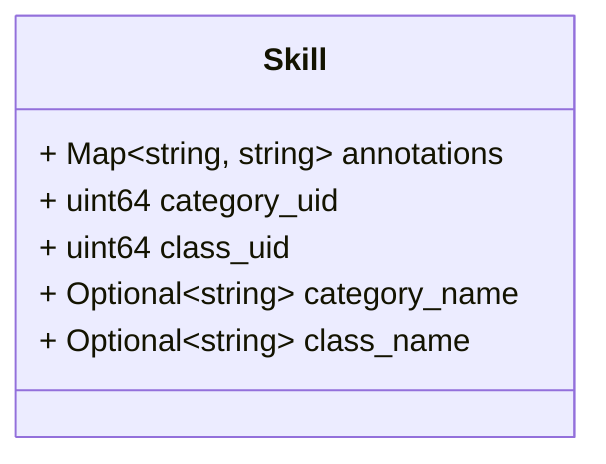

### Message: Skill
<div style="font-size: 12px; margin-top: -10px;" class="fqn">FQN: objects.v1.Skill</div>

<div class="comment"><span>A specific skills that an agent is capable of performing. Specs: https://schema.oasf.agntcy.org/skills. Example (https://schema.oasf.agntcy.org/skills/contextual_comprehension)</span><br/></div>

| Field         | Ordinal | Type           | Label    | Description                                    |
|---------------|---------|----------------|----------|------------------------------------------------|
| annotations   | 1       | string, string | Map      | Additional metadata for this skill.            |
| category_uid  | 2       | uint64         |          | UID of the category.                           |
| class_uid     | 3       | uint64         |          | UID of the class.                              |
| category_name | 4       | string         | Optional | Optional human-readable name of the category.  |
| class_name    | 5       | string         | Optional | Optional human-readable name of the class.     |


<!-- Created by: Proto Diagram Tool -->
<!-- https://github.com/GoogleCloudPlatform/proto-gen-md-diagrams -->


### objects/v2


#### agent_record.proto.md

## Package: objects.v2

<div class="comment"><span>Copyright AGNTCY Contributors (https://github.com/agntcy) SPDX-License-Identifier: Apache-2.0</span><br/></div>

### Imports

| Import                     | Description |
|----------------------------|-------------|
| objects/v2/extension.proto |             |
| objects/v2/locator.proto   |             |
| objects/v2/signature.proto |             |
| objects/v2/skill.proto     |             |


### Options

| Name | Value | Description |
|------|-------|-------------|


#### AgentRecord Diagram

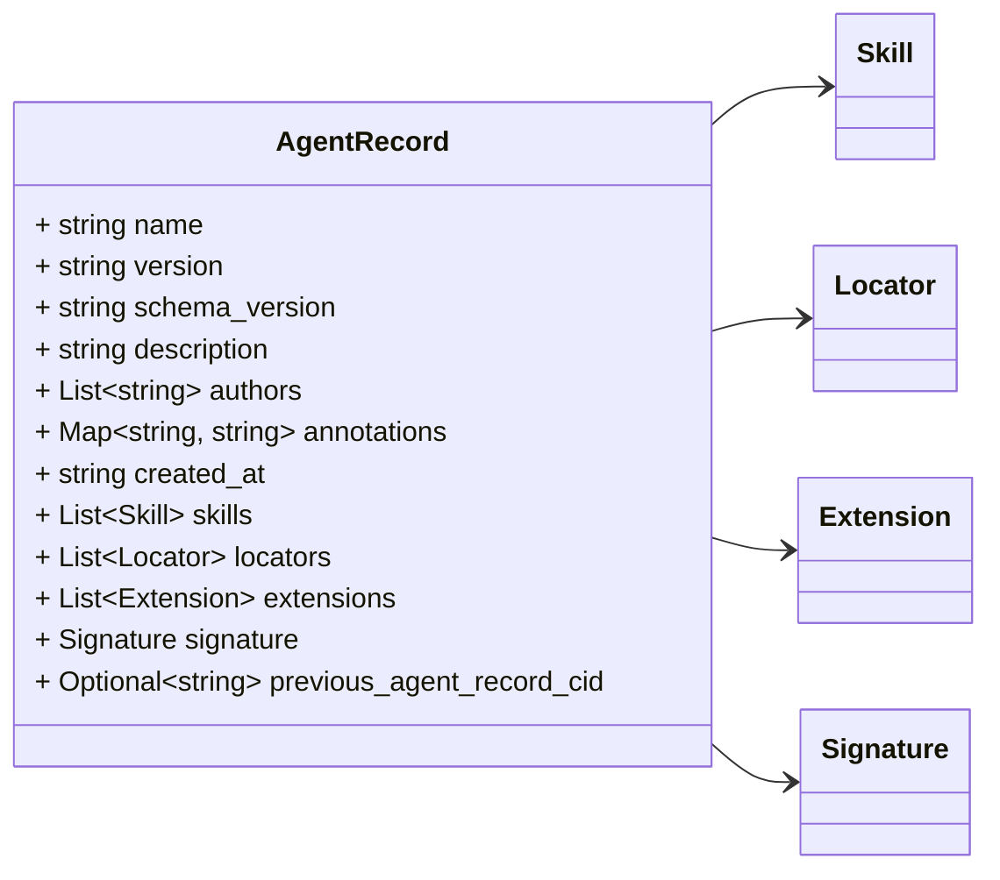

### Message: AgentRecord
<div style="font-size: 12px; margin-top: -10px;" class="fqn">FQN: objects.v2.AgentRecord</div>

<div class="comment"><span>AgentRecord defines a schema for versioned AI agent content representation. The schema provides a way to describe an agent in a structured format. This is a versioned gRPC-based OASF schema. Max size: 4 MB (or to fully fit in a single request) It may be required to support larger agent record size in the future. AgentRecords are stored in a content-addressable store. AgentRecords can be indexed for quick lookups and searches to avoid unnecessary data transfer. All agent records are referenced by a globally-unique content identifier (CID). Specs: https://github.com/multiformats/cid</span><br/></div>

| Field                     | Ordinal | Type           | Label    | Description                                                                                                                                                     |
|---------------------------|---------|----------------|----------|-----------------------------------------------------------------------------------------------------------------------------------------------------------------|
| name                      | 1       | string         |          | Name of the agent.                                                                                                                                              |
| version                   | 2       | string         |          | Version of the agent.                                                                                                                                           |
| schema_version            | 3       | string         |          | Schema version of the agent.                                                                                                                                    |
| description               | 4       | string         |          | Description of the agent.                                                                                                                                       |
| authors                   | 5       | string         | Repeated | List of agent authors, e.g. in the form of `author-name <author-email>`.                                                                                        |
| annotations               | 6       | string, string | Map      | Metadata associated with the agent.                                                                                                                             |
| created_at                | 7       | string         |          | Creation timestamp of the agent in the RFC3339 format. Specs: https://www.rfc-editor.org/rfc/rfc3339.html                                                       |
| skills                    | 8       | Skill          | Repeated | List of skills that the agent can perform.                                                                                                                      |
| locators                  | 9       | Locator        | Repeated | List of source locators where the agent can be found or used from.                                                                                              |
| extensions                | 10      | Extension      | Repeated | Additional information attached to the agent. Extensions are used to generically extend the agent's functionality.                                              |
| signature                 | 11      | Signature      |          | Security signature of the agent.                                                                                                                                |
| previous_agent_record_cid | 99      | string         | Optional | Reference to the previous agent record, if any. Used to link the agent record to its previous versions. Field number is explicitly reserved for extendability.  |


<!-- Created by: Proto Diagram Tool -->
<!-- https://github.com/GoogleCloudPlatform/proto-gen-md-diagrams -->


#### extension.proto.md

## Package: objects.v2

<div class="comment"><span>Copyright AGNTCY Contributors (https://github.com/agntcy) SPDX-License-Identifier: Apache-2.0</span><br/></div>

### Imports

| Import                       | Description |
|------------------------------|-------------|
| google/protobuf/struct.proto |             |


### Options

| Name | Value | Description |
|------|-------|-------------|


#### Extension Diagram

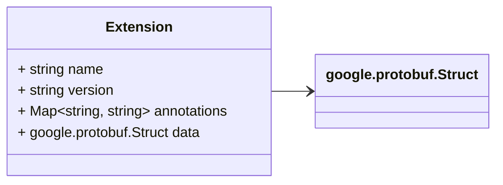

### Message: Extension
<div style="font-size: 12px; margin-top: -10px;" class="fqn">FQN: objects.v2.Extension</div>

<div class="comment"><span>Extensions provide a generic way to attach additional information about an agent to the record. For example, application-specific details can be provided using an extension.</span><br/></div>

| Field       | Ordinal | Type                   | Label | Description                                                                                                                  |
|-------------|---------|------------------------|-------|------------------------------------------------------------------------------------------------------------------------------|
| name        | 1       | string                 |       | Name of the extension. Can be used as a fully qualified name. For example, "org.agntcy.oasf.schema/features/<feature-name>"  |
| version     | 2       | string                 |       | Version of the extension.                                                                                                    |
| annotations | 3       | string, string         | Map   | Metadata associated with the extension.                                                                                      |
| data        | 4       | google.protobuf.Struct |       | Data attached to the extension. Usually a JSON-embedded object.                                                              |


<!-- Created by: Proto Diagram Tool -->
<!-- https://github.com/GoogleCloudPlatform/proto-gen-md-diagrams -->


#### locator.proto.md

## Package: objects.v2

<div class="comment"><span>Copyright AGNTCY Contributors (https://github.com/agntcy) SPDX-License-Identifier: Apache-2.0</span><br/></div>

### Imports

| Import | Description |
|--------|-------------|


### Options

| Name | Value | Description |
|------|-------|-------------|


### Enum: LocatorType
<div style="font-size: 12px; margin-top: -10px;" class="fqn">FQN: objects.v2.LocatorType</div>

<div class="comment"><span>Digest of the source pointed by the { LocatorType defines placeholders for supported locators. Used in string format across APIs.</span><br/></div>

| Name                        | Ordinal | Description       |
|-----------------------------|---------|-------------------|
| LOCATOR_TYPE_UNSPECIFIED    | 0       | ""                |
| LOCATOR_TYPE_HELM_CHART     | 1       | "helm_chart"      |
| LOCATOR_TYPE_DOCKER_IMAGE   | 2       | "docker_image"    |
| LOCATOR_TYPE_PYTHON_PACKAGE | 3       | "python_package"  |
| LOCATOR_TYPE_SOURCE_CODE    | 4       | "source_code"     |
| LOCATOR_TYPE_BINARY         | 5       | "binary"          |


#### LocatorType Diagram


#### Locator Diagram


### Message: Locator
<div style="font-size: 12px; margin-top: -10px;" class="fqn">FQN: objects.v2.Locator</div>

<div class="comment"><span>Locator points to the source where agent can be found at. For example, a locator can be a link to a helm chart.</span><br/></div>

| Field       | Ordinal | Type           | Label | Description                                                                                      |
|-------------|---------|----------------|-------|--------------------------------------------------------------------------------------------------|
| type        | 1       | string         |       | Type of the locator. Supports custom types. Native types are defined in the LocatorType.         |
| url         | 2       | string         |       | Location where the source can be found at. Specs: https://datatracker.ietf.org/doc/html/rfc1738  |
| annotations | 3       | string, string | Map   | Metadata associated with the locator.                                                            |


<!-- Created by: Proto Diagram Tool -->
<!-- https://github.com/GoogleCloudPlatform/proto-gen-md-diagrams -->


#### signature.proto.md

## Package: objects.v2

<div class="comment"><span>Copyright AGNTCY Contributors (https://github.com/agntcy) SPDX-License-Identifier: Apache-2.0</span><br/></div>

### Imports

| Import | Description |
|--------|-------------|


### Options

| Name | Value | Description |
|------|-------|-------------|


#### Signature Diagram

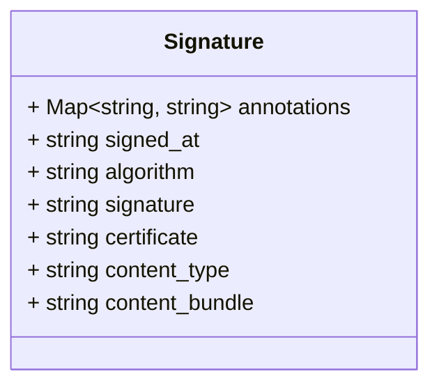

### Message: Signature
<div style="font-size: 12px; margin-top: -10px;" class="fqn">FQN: objects.v2.Signature</div>

<div class="comment"><span>Signature provides the signing and verification details about the agent record.</span><br/></div>

| Field          | Ordinal | Type           | Label | Description                                                                                                             |
|----------------|---------|----------------|-------|-------------------------------------------------------------------------------------------------------------------------|
| annotations    | 1       | string, string | Map   | Metadata associated with the signature.                                                                                 |
| signed_at      | 2       | string         |       | Signing timestamp of the agent record in the RFC3339 format. Specs: https://www.rfc-editor.org/rfc/rfc3339.html         |
| algorithm      | 3       | string         |       | The signature algorithm used (e.g., "ECDSA_P256_SHA256").                                                               |
| signature      | 4       | string         |       | Base64-encoded signature.                                                                                               |
| certificate    | 5       | string         |       | Base64-encoded signing certificate.                                                                                     |
| content_type   | 6       | string         |       | Type of the signature content bundle.                                                                                   |
| content_bundle | 7       | string         |       | Base64-encoded signature bundle produced by the signer. It is up to the client to interpret the content of the bundle.  |


<!-- Created by: Proto Diagram Tool -->
<!-- https://github.com/GoogleCloudPlatform/proto-gen-md-diagrams -->


#### skill.proto.md

## Package: objects.v2

<div class="comment"><span>Copyright AGNTCY Contributors (https://github.com/agntcy) SPDX-License-Identifier: Apache-2.0</span><br/></div>

### Imports

| Import | Description |
|--------|-------------|


### Options

| Name | Value | Description |
|------|-------|-------------|


#### Skill Diagram

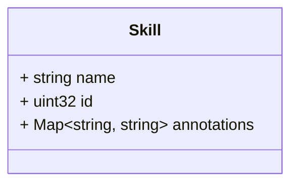

### Message: Skill
<div style="font-size: 12px; margin-top: -10px;" class="fqn">FQN: objects.v2.Skill</div>

<div class="comment"><span>A specific skills that an agent record is capable of performing. Supported skills: https://schema.oasf.agntcy.org/skills</span><br/></div>

| Field       | Ordinal | Type           | Label | Description                                                             |
|-------------|---------|----------------|-------|-------------------------------------------------------------------------|
| name        | 1       | string         |       | UID of the skill in format: org.agntcy.oasf.schema/skills/<skill-name>  |
| id          | 2       | uint32         |       | Unique identifier of the skill.                                         |
| annotations | 3       | string, string | Map   | Metadata associated with the skill.                                     |


<!-- Created by: Proto Diagram Tool -->
<!-- https://github.com/GoogleCloudPlatform/proto-gen-md-diagrams -->


## routing


### routing/v1alpha1


#### peer.proto.md

## Package: routing.v1alpha1

<div class="comment"><span>Copyright AGNTCY Contributors (https://github.com/agntcy) SPDX-License-Identifier: Apache-2.0</span><br/></div>

### Imports

| Import | Description |
|--------|-------------|


### Options

| Name | Value | Description |
|------|-------|-------------|


### Enum: ConnectionType
<div style="font-size: 12px; margin-top: -10px;" class="fqn">FQN: routing.v1alpha1.ConnectionType</div>

<div class="comment"><span></span><br/></div>

| Name                           | Ordinal | Description                                                                    |
|--------------------------------|---------|--------------------------------------------------------------------------------|
| CONNECTION_TYPE_NOT_CONNECTED  | 0       | Sender does not have a connection to peer, and no extra information (default)  |
| CONNECTION_TYPE_CONNECTED      | 1       | Sender has a live connection to peer                                           |
| CONNECTION_TYPE_CAN_CONNECT    | 2       | Sender recently connected to peer                                              |
| CONNECTION_TYPE_CANNOT_CONNECT | 3       | Sender made strong effort to connect to peer repeatedly but failed             |


#### ConnectionType Diagram

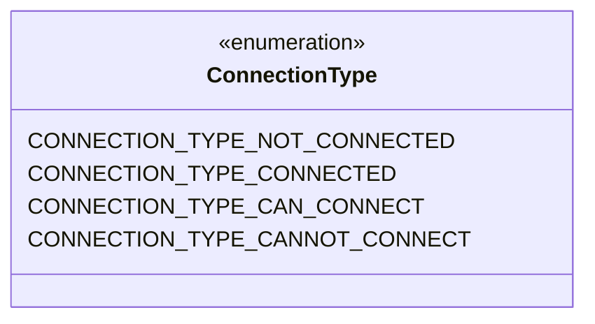
#### Peer Diagram

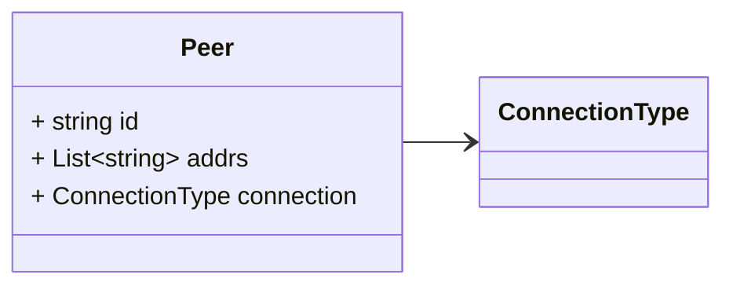

### Message: Peer
<div style="font-size: 12px; margin-top: -10px;" class="fqn">FQN: routing.v1alpha1.Peer</div>

<div class="comment"><span></span><br/></div>

| Field      | Ordinal | Type           | Label    | Description                                                       |
|------------|---------|----------------|----------|-------------------------------------------------------------------|
| id         | 1       | string         |          | ID of a given peer.                                               |
| addrs      | 2       | string         | Repeated | Multiaddrs for a given peer.                                      |
| connection | 3       | ConnectionType |          | Used to signal the sender's connection capabilities to the peer.  |


<!-- Created by: Proto Diagram Tool -->
<!-- https://github.com/GoogleCloudPlatform/proto-gen-md-diagrams -->


#### routing_service.proto.md

## Package: routing.v1alpha1

<div class="comment"><span>Copyright AGNTCY Contributors (https://github.com/agntcy) SPDX-License-Identifier: Apache-2.0</span><br/></div>

### Imports

| Import                      | Description |
|-----------------------------|-------------|
| google/protobuf/empty.proto |             |
| core/v1alpha1/object.proto  |             |
| routing/v1alpha1/peer.proto |             |


### Options

| Name | Value | Description |
|------|-------|-------------|


### Service: RoutingService
<div style="font-size: 12px; margin-top: -10px;" class="fqn">FQN: routing.v1alpha1</div>

<div class="comment"><span>Defines an interface for publication and retrieval of objects across interconnected network.</span><br/></div>

#### RoutingService Diagram

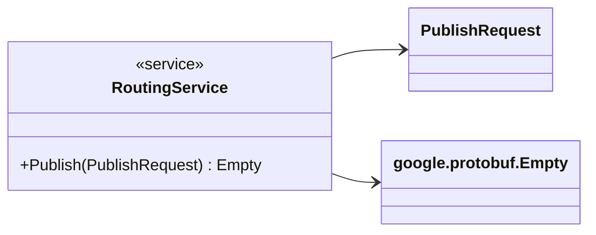

| Method  | Parameter (In) | Parameter (Out) | Description                                                                                                                                                                                                                                                                                                                                                                                |
|---------|----------------|-----------------|--------------------------------------------------------------------------------------------------------------------------------------------------------------------------------------------------------------------------------------------------------------------------------------------------------------------------------------------------------------------------------------------|
| Publish | PublishRequest | Empty           | Notifies the network that the node is providing given object. Listeners should use this event to update their routing tables. They may optionally forward the request to other nodes. Items need to be periodically republished to avoid stale data. It is the API responsibility to fully construct the routing details, these are minimal details needed for us to publish the request.  |


#### ListRequest Diagram

```mermaid
classDiagram
direction LR

%% 

class ListRequest {
  + Optional~Peer~ peer
}
ListRequest --> `Peer`

```
#### ListResponse Diagram

```mermaid
classDiagram
direction LR

%% Target object, if any. If set, it will return only the object with the given reference. Max routing depth. Run a networked query.

class ListResponse {
  + List~Item~ items
}
ListResponse --> `Item`
ListResponse --o `Item`

%% 

class Item {
  + List~string~ labels
  + Map~string,  uint64~ label_counts
  + Peer peer
  + Optional~core.v1alpha1.ObjectRef~ record
}
Item --> `Peer`
Item --> `core.v1alpha1.ObjectRef`

```
#### UnpublishRequest Diagram

```mermaid
classDiagram
direction LR

%% 

class UnpublishRequest {
  + core.v1alpha1.ObjectRef record
  + Optional~bool~ network
}
UnpublishRequest --> `core.v1alpha1.ObjectRef`

```

### Message: ListRequest
<div style="font-size: 12px; margin-top: -10px;" class="fqn">FQN: routing.v1alpha1.ListRequest</div>

<div class="comment"><span></span><br/></div>

| Field | Ordinal | Type | Label    | Description                                                                                                              |
|-------|---------|------|----------|--------------------------------------------------------------------------------------------------------------------------|
| peer  | 1       | Peer | Optional | Target peer. If selected, it returns the skill details for this peer. It may use labels to only return selected labels.  |


### Message: ListResponse
<div style="font-size: 12px; margin-top: -10px;" class="fqn">FQN: routing.v1alpha1.ListResponse</div>

<div class="comment"><span>Target object, if any. If set, it will return only the object with the given reference. Max routing depth. Run a networked query.</span><br/></div>

| Field | Ordinal | Type | Label    | Description                                |
|-------|---------|------|----------|--------------------------------------------|
| items | 1       | Item | Repeated | Returned items that match a given request  |


#### Item Diagram

```mermaid
classDiagram
direction LR

%% 

class Item {
  + List~string~ labels
  + Map~string,  uint64~ label_counts
  + Peer peer
  + Optional~core.v1alpha1.ObjectRef~ record
}
Item --> `Peer`
Item --> `core.v1alpha1.ObjectRef`

```

### Message: Item
<div style="font-size: 12px; margin-top: -10px;" class="fqn">FQN: routing.v1alpha1.ListResponse.Item</div>

<div class="comment"><span></span><br/></div>

| Field        | Ordinal | Type                    | Label    | Description                                                                                                                                                                          |
|--------------|---------|-------------------------|----------|--------------------------------------------------------------------------------------------------------------------------------------------------------------------------------------|
| labels       | 1       | string                  | Repeated | Labels associated with a given object                                                                                                                                                |
| label_counts | 2       | string, uint64          | Map      | Optionally sends count details about individual skill. This is only set when querying labels or our own current peer. For record requests, only returns the data about that record.  |
| peer         | 3       | Peer                    |          | Peer that returned this object.                                                                                                                                                      |
| record       | 4       | core.v1alpha1.ObjectRef | Optional | Found object if any. If empty, then only the labels are important.                                                                                                                   |


### Message: UnpublishRequest
<div style="font-size: 12px; margin-top: -10px;" class="fqn">FQN: routing.v1alpha1.UnpublishRequest</div>

<div class="comment"><span></span><br/></div>

| Field   | Ordinal | Type                    | Label    | Description                                                                                                               |
|---------|---------|-------------------------|----------|---------------------------------------------------------------------------------------------------------------------------|
| record  | 1       | core.v1alpha1.ObjectRef |          | Reference to the record to be unpublished. On unpublish, we read from the local store and remove the associated labels.   |
| network | 2       | bool                    | Optional | Notify the network about the unpublication. This will remove the item from the network and make it no longer searchable.  |


<!-- Created by: Proto Diagram Tool -->
<!-- https://github.com/GoogleCloudPlatform/proto-gen-md-diagrams -->


### routing/v1alpha2


#### peer.proto.md

## Package: routing.v1alpha2

<div class="comment"><span>Copyright AGNTCY Contributors (https://github.com/agntcy) SPDX-License-Identifier: Apache-2.0</span><br/></div>

### Imports

| Import | Description |
|--------|-------------|


### Options

| Name | Value | Description |
|------|-------|-------------|


### Enum: PeerConnectionType
<div style="font-size: 12px; margin-top: -10px;" class="fqn">FQN: routing.v1alpha2.PeerConnectionType</div>

<div class="comment"><span></span><br/></div>

| Name                                | Ordinal | Description                                                                    |
|-------------------------------------|---------|--------------------------------------------------------------------------------|
| PEER_CONNECTION_TYPE_NOT_CONNECTED  | 0       | Sender does not have a connection to peer, and no extra information (default)  |
| PEER_CONNECTION_TYPE_CONNECTED      | 1       | Sender has a live connection to peer.                                          |
| PEER_CONNECTION_TYPE_CAN_CONNECT    | 2       | Sender recently connected to peer.                                             |
| PEER_CONNECTION_TYPE_CANNOT_CONNECT | 3       | Sender made strong effort to connect to peer repeatedly but failed.            |


#### PeerConnectionType Diagram

```mermaid
classDiagram
direction LR
%% 

class PeerConnectionType{
  <<enumeration>>
  PEER_CONNECTION_TYPE_NOT_CONNECTED
  PEER_CONNECTION_TYPE_CONNECTED
  PEER_CONNECTION_TYPE_CAN_CONNECT
  PEER_CONNECTION_TYPE_CANNOT_CONNECT
}
```
#### Peer Diagram

```mermaid
classDiagram
direction LR

%% 

class Peer {
  + string id
  + List~string~ addrs
  + Map~string,  string~ annotations
  + PeerConnectionType connection
}
Peer --> `PeerConnectionType`

```

### Message: Peer
<div style="font-size: 12px; margin-top: -10px;" class="fqn">FQN: routing.v1alpha2.Peer</div>

<div class="comment"><span></span><br/></div>

| Field       | Ordinal | Type               | Label    | Description                                                                                                                                                                                                                                                                                                        |
|-------------|---------|--------------------|----------|--------------------------------------------------------------------------------------------------------------------------------------------------------------------------------------------------------------------------------------------------------------------------------------------------------------------|
| id          | 1       | string             |          | ID of a given peer, typically described by a protocol. For example: - SPIFFE: "spiffe://example.org/service/foo" - JWT: "jwt:sub=alice,iss=https://issuer.example.com" - Tor: "onion:abcdefghijklmno.onion" - DID: "did:example:123456789abcdefghi" - IPFS: "ipfs:QmYwAPJzv5CZsnAzt8auVZRn2E6sD1c4x8pN5o6d5cW4D5"  |
| addrs       | 2       | string             | Repeated | Multiaddrs for a given peer. For example: - "/ip4/127.0.0.1/tcp/4001" - "/ip6/::1/tcp/4001" - "/dns4/example.com/tcp/443/https"                                                                                                                                                                                    |
| annotations | 3       | string, string     | Map      | Additional metadata about the peer.                                                                                                                                                                                                                                                                                |
| connection  | 4       | PeerConnectionType |          | Used to signal the sender's connection capabilities to the peer.                                                                                                                                                                                                                                                   |


<!-- Created by: Proto Diagram Tool -->
<!-- https://github.com/GoogleCloudPlatform/proto-gen-md-diagrams -->


#### record_query.proto.md

## Package: routing.v1alpha2

<div class="comment"><span>Copyright AGNTCY Contributors (https://github.com/agntcy) SPDX-License-Identifier: Apache-2.0</span><br/></div>

### Imports

| Import | Description |
|--------|-------------|


### Options

| Name | Value | Description |
|------|-------|-------------|


### Enum: RecordQueryType
<div style="font-size: 12px; margin-top: -10px;" class="fqn">FQN: routing.v1alpha2.RecordQueryType</div>

<div class="comment"><span>Defines a list of supported record query types.</span><br/></div>

| Name                          | Ordinal | Description                |
|-------------------------------|---------|----------------------------|
| RECORD_QUERY_TYPE_UNSPECIFIED | 0       | Unspecified query type.    |
| RECORD_QUERY_TYPE_SKILL       | 1       | Query for a skill name.    |
| RECORD_QUERY_TYPE_LOCATOR     | 2       | Query for a locator type.  |


#### RecordQueryType Diagram

```mermaid
classDiagram
direction LR
%% Defines a list of supported record query types.

class RecordQueryType{
  <<enumeration>>
  RECORD_QUERY_TYPE_UNSPECIFIED
  RECORD_QUERY_TYPE_SKILL
  RECORD_QUERY_TYPE_LOCATOR
}
```
#### RecordQuery Diagram

```mermaid
classDiagram
direction LR

%% A query to match the record against during discovery. For example: { {

class RecordQuery {
  + RecordQueryType type
  + string value
}
RecordQuery --> `RecordQueryType`

```

### Message: RecordQuery
<div style="font-size: 12px; margin-top: -10px;" class="fqn">FQN: routing.v1alpha2.RecordQuery</div>

<div class="comment"><span>A query to match the record against during discovery. For example: { {</span><br/></div>

| Field | Ordinal | Type            | Label | Description                              |
|-------|---------|-----------------|-------|------------------------------------------|
| type  | 1       | RecordQueryType |       | The type of the query to match against.  |
| value | 2       | string          |       | The query value to match against.        |


<!-- Created by: Proto Diagram Tool -->
<!-- https://github.com/GoogleCloudPlatform/proto-gen-md-diagrams -->


#### routing_service.proto.md

## Package: routing.v1alpha2

<div class="comment"><span>Copyright AGNTCY Contributors (https://github.com/agntcy) SPDX-License-Identifier: Apache-2.0</span><br/></div>

### Imports

| Import                              | Description |
|-------------------------------------|-------------|
| google/protobuf/empty.proto         |             |
| routing/v1alpha2/peer.proto         |             |
| routing/v1alpha2/record_query.proto |             |


### Options

| Name | Value | Description |
|------|-------|-------------|


### Service: RoutingService
<div style="font-size: 12px; margin-top: -10px;" class="fqn">FQN: routing.v1alpha2</div>

<div class="comment"><span>Defines an interface for announcement and discovery of records across interconnected network. Middleware should be used to control who can perform these RPCs. Policies for the middleware can be handled via separate service.</span><br/></div>

#### RoutingService Diagram

```mermaid
classDiagram
direction LR
class RoutingService {
  <<service>>
  +Publish(PublishRequest) Empty
}
RoutingService --> `PublishRequest`
RoutingService --> `google.protobuf.Empty`

```

| Method  | Parameter (In) | Parameter (Out) | Description                                                                                                                                                                                                                                                                                                                                                                                 |
|---------|----------------|-----------------|---------------------------------------------------------------------------------------------------------------------------------------------------------------------------------------------------------------------------------------------------------------------------------------------------------------------------------------------------------------------------------------------|
| Publish | PublishRequest | Empty           | Announce to the network that this peer is providing a given record. This enables other peers to discover this record and retrieve it from this peer. Listeners can use this event to perform custom operations, for example by cloning the record. Items need to be periodically republished (eg. 24h) to the network to avoid stale data. Republication should be done in the background.  |


#### UnpublishRequest Diagram

```mermaid
classDiagram
direction LR

%% 

class UnpublishRequest {
  + string record_cid
}

```
#### SearchRequest Diagram

```mermaid
classDiagram
direction LR

%% 

class SearchRequest {
  + List~RecordQuery~ queries
  + Optional~uint32~ min_match_score
  + Optional~uint32~ limit
}
SearchRequest --> `RecordQuery`

```
#### SearchResponse Diagram

```mermaid
classDiagram
direction LR

%% 

class SearchResponse {
  + string record_cid
  + Peer peer
  + List~RecordQuery~ match_queries
  + uint32 match_score
}
SearchResponse --> `Peer`
SearchResponse --> `RecordQuery`

```
#### ListRequest Diagram

```mermaid
classDiagram
direction LR

%% 

class ListRequest {
  + List~RecordQuery~ queries
  + Optional~uint32~ limit
}
ListRequest --> `RecordQuery`

```
#### ListResponse Diagram

```mermaid
classDiagram
direction LR

%% 

class ListResponse {
  + string record_cid
}

```

### Message: UnpublishRequest
<div style="font-size: 12px; margin-top: -10px;" class="fqn">FQN: routing.v1alpha2.UnpublishRequest</div>

<div class="comment"><span></span><br/></div>

| Field      | Ordinal | Type   | Label | Description                                       |
|------------|---------|--------|-------|---------------------------------------------------|
| record_cid | 1       | string |       | Reference to the agent record to be unpublished.  |


### Message: SearchRequest
<div style="font-size: 12px; margin-top: -10px;" class="fqn">FQN: routing.v1alpha2.SearchRequest</div>

<div class="comment"><span></span><br/></div>

| Field           | Ordinal | Type        | Label    | Description                                                                                                                                                                                                                           |
|-----------------|---------|-------------|----------|---------------------------------------------------------------------------------------------------------------------------------------------------------------------------------------------------------------------------------------|
| queries         | 1       | RecordQuery | Repeated | List of queries to match against the records.                                                                                                                                                                                         |
| min_match_score | 2       | uint32      | Optional | Minimal target query match score. For example, if min_match_score=2, it will return records that match at least two of the queries. If not set, it will return records that match at least one query.                                 |
| limit           | 3       | uint32      | Optional | Limit the number of results returned. If not set, it will return all discovered records. Note that this is a soft limit, as the search may return more results than the limit if there are multiple peers providing the same record.  |


### Message: SearchResponse
<div style="font-size: 12px; margin-top: -10px;" class="fqn">FQN: routing.v1alpha2.SearchResponse</div>

<div class="comment"><span></span><br/></div>

| Field         | Ordinal | Type        | Label    | Description                                |
|---------------|---------|-------------|----------|--------------------------------------------|
| record_cid    | 1       | string      |          | The record that matches the search query.  |
| peer          | 2       | Peer        |          | The peer that provided the record.         |
| match_queries | 3       | RecordQuery | Repeated | The queries that were matched.             |
| match_score   | 4       | uint32      |          | The score of the search match.             |


### Message: ListRequest
<div style="font-size: 12px; margin-top: -10px;" class="fqn">FQN: routing.v1alpha2.ListRequest</div>

<div class="comment"><span></span><br/></div>

| Field   | Ordinal | Type        | Label    | Description                                                                                                  |
|---------|---------|-------------|----------|--------------------------------------------------------------------------------------------------------------|
| queries | 1       | RecordQuery | Repeated | List of queries to match against the records. If set, all queries must match for the record to be returned.  |
| limit   | 2       | uint32      | Optional | Limit the number of results returned. If not set, it will return all records that this peer is providing.    |


### Message: ListResponse
<div style="font-size: 12px; margin-top: -10px;" class="fqn">FQN: routing.v1alpha2.ListResponse</div>

<div class="comment"><span></span><br/></div>

| Field      | Ordinal | Type   | Label | Description                                |
|------------|---------|--------|-------|--------------------------------------------|
| record_cid | 1       | string |       | The record that matches the list queries.  |


<!-- Created by: Proto Diagram Tool -->
<!-- https://github.com/GoogleCloudPlatform/proto-gen-md-diagrams -->


## search


### search/v1alpha2


#### record_query.proto.md

## Package: search.v1alpha2

<div class="comment"><span>Copyright AGNTCY Contributors (https://github.com/agntcy) SPDX-License-Identifier: Apache-2.0</span><br/></div>

### Imports

| Import | Description |
|--------|-------------|


### Options

| Name | Value | Description |
|------|-------|-------------|


### Enum: RecordQueryType
<div style="font-size: 12px; margin-top: -10px;" class="fqn">FQN: search.v1alpha2.RecordQueryType</div>

<div class="comment"><span>Defines a list of supported record query types.</span><br/></div>

| Name                          | Ordinal | Description                  |
|-------------------------------|---------|------------------------------|
| RECORD_QUERY_TYPE_UNSPECIFIED | 0       | Unspecified query type.      |
| RECORD_QUERY_TYPE_NAME        | 1       | Query for an agent name.     |
| RECORD_QUERY_TYPE_VERSION     | 2       | Query for an agent version.  |
| RECORD_QUERY_TYPE_SKILL_ID    | 3       | Query for a skill ID.        |
| RECORD_QUERY_TYPE_SKILL_NAME  | 4       | Query for a skill name.      |
| RECORD_QUERY_TYPE_LOCATOR     | 5       | Query for a locator.         |
| RECORD_QUERY_TYPE_EXTENSION   | 6       | Query for an extension.      |


#### RecordQueryType Diagram

```mermaid
classDiagram
direction LR
%% Defines a list of supported record query types.

class RecordQueryType{
  <<enumeration>>
  RECORD_QUERY_TYPE_UNSPECIFIED
  RECORD_QUERY_TYPE_NAME
  RECORD_QUERY_TYPE_VERSION
  RECORD_QUERY_TYPE_SKILL_ID
  RECORD_QUERY_TYPE_SKILL_NAME
  RECORD_QUERY_TYPE_LOCATOR
  RECORD_QUERY_TYPE_EXTENSION
}
```
#### RecordQuery Diagram

```mermaid
classDiagram
direction LR

%% A query to match the record against during discovery. For example: { {

class RecordQuery {
  + RecordQueryType type
  + string value
}
RecordQuery --> `RecordQueryType`

```

### Message: RecordQuery
<div style="font-size: 12px; margin-top: -10px;" class="fqn">FQN: search.v1alpha2.RecordQuery</div>

<div class="comment"><span>A query to match the record against during discovery. For example: { {</span><br/></div>

| Field | Ordinal | Type            | Label | Description                              |
|-------|---------|-----------------|-------|------------------------------------------|
| type  | 1       | RecordQueryType |       | The type of the query to match against.  |
| value | 2       | string          |       | The query value to match against.        |


<!-- Created by: Proto Diagram Tool -->
<!-- https://github.com/GoogleCloudPlatform/proto-gen-md-diagrams -->


#### search_service.proto.md

## Package: search.v1alpha2

<div class="comment"><span>Copyright AGNTCY Contributors (https://github.com/agntcy) SPDX-License-Identifier: Apache-2.0</span><br/></div>

### Imports

| Import                             | Description |
|------------------------------------|-------------|
| search/v1alpha2/record_query.proto |             |


### Options

| Name | Value | Description |
|------|-------|-------------|


### Service: SearchService
<div style="font-size: 12px; margin-top: -10px;" class="fqn">FQN: search.v1alpha2</div>

<div class="comment"><span></span><br/></div>

#### SearchService Diagram

```mermaid
classDiagram
direction LR
class SearchService {
  <<service>>
  +Search(SearchRequest) Stream~SearchResponse~
}
SearchService --> `SearchRequest`
SearchService --o `SearchResponse`

```

| Method | Parameter (In) | Parameter (Out)          | Description                                                                                                                             |
|--------|----------------|--------------------------|-----------------------------------------------------------------------------------------------------------------------------------------|
| Search | SearchRequest  | Stream\<SearchResponse\> | List records that this peer is currently providing that match the given parameters. This operation does not interact with the network.  |


#### SearchResponse Diagram

```mermaid
classDiagram
direction LR

%% 

class SearchResponse {
  + string record_cid
}

```

### Message: SearchResponse
<div style="font-size: 12px; margin-top: -10px;" class="fqn">FQN: search.v1alpha2.SearchResponse</div>

<div class="comment"><span></span><br/></div>

| Field      | Ordinal | Type   | Label | Description                                              |
|------------|---------|--------|-------|----------------------------------------------------------|
| record_cid | 1       | string |       | The CID of the record that matches the search criteria.  |


<!-- Created by: Proto Diagram Tool -->
<!-- https://github.com/GoogleCloudPlatform/proto-gen-md-diagrams -->


## sign


### sign/v1alpha1


#### sign_service.proto.md

## Package: sign.v1alpha1

<div class="comment"><span>Copyright AGNTCY Contributors (https://github.com/agntcy) SPDX-License-Identifier: Apache-2.0</span><br/></div>

### Imports

| Import                 | Description |
|------------------------|-------------|
| objects/v1/agent.proto |             |


### Options

| Name | Value | Description |
|------|-------|-------------|


### Service: SignService
<div style="font-size: 12px; margin-top: -10px;" class="fqn">FQN: sign.v1alpha1</div>

<div class="comment"><span></span><br/></div>

#### SignService Diagram

```mermaid
classDiagram
direction LR
class SignService {
  <<service>>
  +Sign(SignRequest) SignResponse
}
SignService --> `SignRequest`
SignService --> `SignResponse`

```

| Method | Parameter (In) | Parameter (Out) | Description                                                                                                 |
|--------|----------------|-----------------|-------------------------------------------------------------------------------------------------------------|
| Sign   | SignRequest    | SignResponse    | Sign agents using keyless OIDC based provider or using PEM-encoded private key with an optional passphrase  |


#### SignRequestProvider Diagram

```mermaid
classDiagram
direction LR

%% 

class SignRequestProvider {
  + SignWithOIDC oidc
  + SignWithKey key
}
SignRequestProvider --> `SignWithOIDC`
SignRequestProvider --> `SignWithKey`

```
#### SignResponse Diagram

```mermaid
classDiagram
direction LR

%% 

class SignResponse {
  + objects.v1.Agent agent
}
SignResponse --> `objects.v1.Agent`

```
#### SignWithOIDC Diagram

```mermaid
classDiagram
direction LR

%% 

class SignWithOIDC {
  + string id_token
  + SignOpts options
}
SignWithOIDC --> `SignOpts`
SignWithOIDC --o `SignOpts`

%% List of sign options for OIDC

class SignOpts {
  + Optional~string~ fulcio_url
  + Optional~string~ rekor_url
  + Optional~string~ timestamp_url
  + Optional~string~ oidc_provider_url
}

```
#### SignWithKey Diagram

```mermaid
classDiagram
direction LR

%% 

class SignWithKey {
  + bytes private_key
  + Optional~bytes~ password
}

```
#### VerifyRequest Diagram

```mermaid
classDiagram
direction LR

%% 

class VerifyRequest {
  + objects.v1.Agent agent
  + VerifyRequestProvider provider
}
VerifyRequest --> `objects.v1.Agent`
VerifyRequest --> `VerifyRequestProvider`

```
#### VerifyRequestProvider Diagram

```mermaid
classDiagram
direction LR

%% 

class VerifyRequestProvider {
  + VerifyWithOIDC oidc
  + VerifyWithKey key
}
VerifyRequestProvider --> `VerifyWithOIDC`
VerifyRequestProvider --> `VerifyWithKey`

```
#### VerifyWithOIDC Diagram

```mermaid
classDiagram
direction LR

%% 

class VerifyWithOIDC {
  + string expected_issuer
  + string expected_signer
}

```
#### VerifyWithKey Diagram

```mermaid
classDiagram
direction LR

%% 

class VerifyWithKey {
  + bytes public_key
}

```
#### VerifyResponse Diagram

```mermaid
classDiagram
direction LR

%% 

class VerifyResponse {
  + bool success
}

```

### Message: SignRequestProvider
<div style="font-size: 12px; margin-top: -10px;" class="fqn">FQN: sign.v1alpha1.SignRequestProvider</div>

<div class="comment"><span></span><br/></div>

| Field | Ordinal | Type         | Label | Description |
|-------|---------|--------------|-------|-------------|
| oidc  | 1       | SignWithOIDC |       |             |
| key   | 2       | SignWithKey  |       |             |


### Message: SignResponse
<div style="font-size: 12px; margin-top: -10px;" class="fqn">FQN: sign.v1alpha1.SignResponse</div>

<div class="comment"><span></span><br/></div>

| Field | Ordinal | Type             | Label | Description   |
|-------|---------|------------------|-------|---------------|
| agent | 1       | objects.v1.Agent |       | Signed agent  |


### Message: SignWithOIDC
<div style="font-size: 12px; margin-top: -10px;" class="fqn">FQN: sign.v1alpha1.SignWithOIDC</div>

<div class="comment"><span></span><br/></div>

| Field    | Ordinal | Type     | Label | Description               |
|----------|---------|----------|-------|---------------------------|
| id_token | 1       | string   |       | Token for OIDC provider   |
| options  | 2       | SignOpts |       | Signing options for OIDC  |


#### SignOpts Diagram

```mermaid
classDiagram
direction LR

%% List of sign options for OIDC

class SignOpts {
  + Optional~string~ fulcio_url
  + Optional~string~ rekor_url
  + Optional~string~ timestamp_url
  + Optional~string~ oidc_provider_url
}

```

### Message: SignOpts
<div style="font-size: 12px; margin-top: -10px;" class="fqn">FQN: sign.v1alpha1.SignWithOIDC.SignOpts</div>

<div class="comment"><span>List of sign options for OIDC</span><br/></div>

| Field             | Ordinal | Type   | Label    | Description                                                                                      |
|-------------------|---------|--------|----------|--------------------------------------------------------------------------------------------------|
| fulcio_url        | 1       | string | Optional | Fulcio authority access URL (default value: https://fulcio.sigstage.dev)                         |
| rekor_url         | 2       | string | Optional | Rekor validator access URL (default value: https://rekor.sigstage.dev)                           |
| timestamp_url     | 3       | string | Optional | Timestamp authority access URL (default value: https://timestamp.sigstage.dev/api/v1/timestamp)  |
| oidc_provider_url | 4       | string | Optional | OIDC provider access URL (default value: https://oauth2.sigstage.dev/auth)                       |


### Message: SignWithKey
<div style="font-size: 12px; margin-top: -10px;" class="fqn">FQN: sign.v1alpha1.SignWithKey</div>

<div class="comment"><span></span><br/></div>

| Field       | Ordinal | Type  | Label    | Description                         |
|-------------|---------|-------|----------|-------------------------------------|
| private_key | 1       | bytes |          | Private key used for signing        |
| password    | 2       | bytes | Optional | Password to unlock the private key  |


### Message: VerifyRequest
<div style="font-size: 12px; margin-top: -10px;" class="fqn">FQN: sign.v1alpha1.VerifyRequest</div>

<div class="comment"><span></span><br/></div>

| Field    | Ordinal | Type                  | Label | Description                   |
|----------|---------|-----------------------|-------|-------------------------------|
| agent    | 1       | objects.v1.Agent      |       | Signed agent to be verified   |
| provider | 2       | VerifyRequestProvider |       | Verification provider to use  |


### Message: VerifyRequestProvider
<div style="font-size: 12px; margin-top: -10px;" class="fqn">FQN: sign.v1alpha1.VerifyRequestProvider</div>

<div class="comment"><span></span><br/></div>

| Field | Ordinal | Type           | Label | Description |
|-------|---------|----------------|-------|-------------|
| oidc  | 1       | VerifyWithOIDC |       |             |
| key   | 2       | VerifyWithKey  |       |             |


### Message: VerifyWithOIDC
<div style="font-size: 12px; margin-top: -10px;" class="fqn">FQN: sign.v1alpha1.VerifyWithOIDC</div>

<div class="comment"><span></span><br/></div>

| Field           | Ordinal | Type   | Label | Description                          |
|-----------------|---------|--------|-------|--------------------------------------|
| expected_issuer | 1       | string |       | Expected issuer in the signed agent  |
| expected_signer | 2       | string |       | Expected signer in the signed agent  |


### Message: VerifyWithKey
<div style="font-size: 12px; margin-top: -10px;" class="fqn">FQN: sign.v1alpha1.VerifyWithKey</div>

<div class="comment"><span></span><br/></div>

| Field      | Ordinal | Type  | Label | Description                              |
|------------|---------|-------|-------|------------------------------------------|
| public_key | 1       | bytes |       | Public key to validate the signed agent  |


### Message: VerifyResponse
<div style="font-size: 12px; margin-top: -10px;" class="fqn">FQN: sign.v1alpha1.VerifyResponse</div>

<div class="comment"><span></span><br/></div>

| Field   | Ordinal | Type | Label | Description                |
|---------|---------|------|-------|----------------------------|
| success | 1       | bool |       | The verify process result  |


<!-- Created by: Proto Diagram Tool -->
<!-- https://github.com/GoogleCloudPlatform/proto-gen-md-diagrams -->


### sign/v1alpha2


#### sign_service.proto.md

## Package: sign.v1alpha2

<div class="comment"><span>Copyright AGNTCY Contributors (https://github.com/agntcy) SPDX-License-Identifier: Apache-2.0</span><br/></div>

### Imports

| Import                        | Description |
|-------------------------------|-------------|
| objects/v2/agent_record.proto |             |


### Options

| Name | Value | Description |
|------|-------|-------------|


### Service: SignService
<div style="font-size: 12px; margin-top: -10px;" class="fqn">FQN: sign.v1alpha2</div>

<div class="comment"><span></span><br/></div>

#### SignService Diagram

```mermaid
classDiagram
direction LR
class SignService {
  <<service>>
  +Sign(SignRequest) SignResponse
}
SignService --> `SignRequest`
SignService --> `SignResponse`

```

| Method | Parameter (In) | Parameter (Out) | Description                                                                                                 |
|--------|----------------|-----------------|-------------------------------------------------------------------------------------------------------------|
| Sign   | SignRequest    | SignResponse    | Sign record using keyless OIDC based provider or using PEM-encoded private key with an optional passphrase  |


#### SignRequestProvider Diagram

```mermaid
classDiagram
direction LR

%% 

class SignRequestProvider {
  + SignWithOIDC oidc
  + SignWithKey key
}
SignRequestProvider --> `SignWithOIDC`
SignRequestProvider --> `SignWithKey`

```
#### SignResponse Diagram

```mermaid
classDiagram
direction LR

%% 

class SignResponse {
  + objects.v2.AgentRecord record
}
SignResponse --> `objects.v2.AgentRecord`

```
#### SignWithOIDC Diagram

```mermaid
classDiagram
direction LR

%% 

class SignWithOIDC {
  + string id_token
  + SignOpts options
}
SignWithOIDC --> `SignOpts`
SignWithOIDC --o `SignOpts`

%% List of sign options for OIDC

class SignOpts {
  + Optional~string~ fulcio_url
  + Optional~string~ rekor_url
  + Optional~string~ timestamp_url
  + Optional~string~ oidc_provider_url
}

```
#### SignWithKey Diagram

```mermaid
classDiagram
direction LR

%% 

class SignWithKey {
  + bytes private_key
  + Optional~bytes~ password
}

```
#### VerifyRequest Diagram

```mermaid
classDiagram
direction LR

%% 

class VerifyRequest {
  + objects.v2.AgentRecord record
  + VerifyRequestProvider provider
}
VerifyRequest --> `objects.v2.AgentRecord`
VerifyRequest --> `VerifyRequestProvider`

```
#### VerifyRequestProvider Diagram

```mermaid
classDiagram
direction LR

%% 

class VerifyRequestProvider {
  + VerifyWithOIDC oidc
  + VerifyWithKey key
}
VerifyRequestProvider --> `VerifyWithOIDC`
VerifyRequestProvider --> `VerifyWithKey`

```
#### VerifyWithOIDC Diagram

```mermaid
classDiagram
direction LR

%% 

class VerifyWithOIDC {
  + string expected_issuer
  + string expected_signer
}

```
#### VerifyWithKey Diagram

```mermaid
classDiagram
direction LR

%% 

class VerifyWithKey {
  + bytes public_key
}

```
#### VerifyResponse Diagram

```mermaid
classDiagram
direction LR

%% 

class VerifyResponse {
  + bool success
}

```

### Message: SignRequestProvider
<div style="font-size: 12px; margin-top: -10px;" class="fqn">FQN: sign.v1alpha2.SignRequestProvider</div>

<div class="comment"><span></span><br/></div>

| Field | Ordinal | Type         | Label | Description |
|-------|---------|--------------|-------|-------------|
| oidc  | 1       | SignWithOIDC |       |             |
| key   | 2       | SignWithKey  |       |             |


### Message: SignResponse
<div style="font-size: 12px; margin-top: -10px;" class="fqn">FQN: sign.v1alpha2.SignResponse</div>

<div class="comment"><span></span><br/></div>

| Field  | Ordinal | Type                   | Label | Description    |
|--------|---------|------------------------|-------|----------------|
| record | 1       | objects.v2.AgentRecord |       | Signed record  |


### Message: SignWithOIDC
<div style="font-size: 12px; margin-top: -10px;" class="fqn">FQN: sign.v1alpha2.SignWithOIDC</div>

<div class="comment"><span></span><br/></div>

| Field    | Ordinal | Type     | Label | Description               |
|----------|---------|----------|-------|---------------------------|
| id_token | 1       | string   |       | Token for OIDC provider   |
| options  | 2       | SignOpts |       | Signing options for OIDC  |


#### SignOpts Diagram

```mermaid
classDiagram
direction LR

%% List of sign options for OIDC

class SignOpts {
  + Optional~string~ fulcio_url
  + Optional~string~ rekor_url
  + Optional~string~ timestamp_url
  + Optional~string~ oidc_provider_url
}

```

### Message: SignOpts
<div style="font-size: 12px; margin-top: -10px;" class="fqn">FQN: sign.v1alpha2.SignWithOIDC.SignOpts</div>

<div class="comment"><span>List of sign options for OIDC</span><br/></div>

| Field             | Ordinal | Type   | Label    | Description                                                                                      |
|-------------------|---------|--------|----------|--------------------------------------------------------------------------------------------------|
| fulcio_url        | 1       | string | Optional | Fulcio authority access URL (default value: https://fulcio.sigstage.dev)                         |
| rekor_url         | 2       | string | Optional | Rekor validator access URL (default value: https://rekor.sigstage.dev)                           |
| timestamp_url     | 3       | string | Optional | Timestamp authority access URL (default value: https://timestamp.sigstage.dev/api/v1/timestamp)  |
| oidc_provider_url | 4       | string | Optional | OIDC provider access URL (default value: https://oauth2.sigstage.dev/auth)                       |


### Message: SignWithKey
<div style="font-size: 12px; margin-top: -10px;" class="fqn">FQN: sign.v1alpha2.SignWithKey</div>

<div class="comment"><span></span><br/></div>

| Field       | Ordinal | Type  | Label    | Description                         |
|-------------|---------|-------|----------|-------------------------------------|
| private_key | 1       | bytes |          | Private key used for signing        |
| password    | 2       | bytes | Optional | Password to unlock the private key  |


### Message: VerifyRequest
<div style="font-size: 12px; margin-top: -10px;" class="fqn">FQN: sign.v1alpha2.VerifyRequest</div>

<div class="comment"><span></span><br/></div>

| Field    | Ordinal | Type                   | Label | Description                   |
|----------|---------|------------------------|-------|-------------------------------|
| record   | 1       | objects.v2.AgentRecord |       | Signed record to be verified  |
| provider | 2       | VerifyRequestProvider  |       | Verification provider to use  |


### Message: VerifyRequestProvider
<div style="font-size: 12px; margin-top: -10px;" class="fqn">FQN: sign.v1alpha2.VerifyRequestProvider</div>

<div class="comment"><span></span><br/></div>

| Field | Ordinal | Type           | Label | Description |
|-------|---------|----------------|-------|-------------|
| oidc  | 1       | VerifyWithOIDC |       |             |
| key   | 2       | VerifyWithKey  |       |             |


### Message: VerifyWithOIDC
<div style="font-size: 12px; margin-top: -10px;" class="fqn">FQN: sign.v1alpha2.VerifyWithOIDC</div>

<div class="comment"><span></span><br/></div>

| Field           | Ordinal | Type   | Label | Description                           |
|-----------------|---------|--------|-------|---------------------------------------|
| expected_issuer | 1       | string |       | Expected issuer in the signed record  |
| expected_signer | 2       | string |       | Expected signer in the signed record  |


### Message: VerifyWithKey
<div style="font-size: 12px; margin-top: -10px;" class="fqn">FQN: sign.v1alpha2.VerifyWithKey</div>

<div class="comment"><span></span><br/></div>

| Field      | Ordinal | Type  | Label | Description                               |
|------------|---------|-------|-------|-------------------------------------------|
| public_key | 1       | bytes |       | Public key to validate the signed record  |


### Message: VerifyResponse
<div style="font-size: 12px; margin-top: -10px;" class="fqn">FQN: sign.v1alpha2.VerifyResponse</div>

<div class="comment"><span></span><br/></div>

| Field   | Ordinal | Type | Label | Description                |
|---------|---------|------|-------|----------------------------|
| success | 1       | bool |       | The verify process result  |


<!-- Created by: Proto Diagram Tool -->
<!-- https://github.com/GoogleCloudPlatform/proto-gen-md-diagrams -->


## store


### store/v1alpha1


#### store_service.proto.md

## Package: store.v1alpha1

<div class="comment"><span>Copyright AGNTCY Contributors (https://github.com/agntcy) SPDX-License-Identifier: Apache-2.0</span><br/></div>

### Imports

| Import                      | Description |
|-----------------------------|-------------|
| google/protobuf/empty.proto |             |
| core/v1alpha1/object.proto  |             |


### Options

| Name | Value | Description |
|------|-------|-------------|


### Service: StoreService
<div style="font-size: 12px; margin-top: -10px;" class="fqn">FQN: store.v1alpha1</div>

<div class="comment"><span>Defines an interface for content-addressable storage service for arbitrary data such as blobs, files, etc. It may also store metadata for pushed objects.</span><br/></div>

#### StoreService Diagram

```mermaid
classDiagram
direction LR
class StoreService {
  <<service>>
  +Push(Stream~Object~) ObjectRef
}
StoreService --o `core.v1alpha1.Object`
StoreService --> `core.v1alpha1.ObjectRef`

```

| Method | Parameter (In)   | Parameter (Out) | Description                                                  |
|--------|------------------|-----------------|--------------------------------------------------------------|
| Push   | Stream\<Object\> | ObjectRef       | Push performs streamed write operation for provided object.  |


<!-- Created by: Proto Diagram Tool -->
<!-- https://github.com/GoogleCloudPlatform/proto-gen-md-diagrams -->


### store/v1alpha2


#### object.proto.md

## Package: store.v1alpha2

<div class="comment"><span>Copyright AGNTCY Contributors (https://github.com/agntcy) SPDX-License-Identifier: Apache-2.0</span><br/></div>

### Imports

| Import | Description |
|--------|-------------|


### Options

| Name | Value | Description |
|------|-------|-------------|


### Enum: ObjectType
<div style="font-size: 12px; margin-top: -10px;" class="fqn">FQN: store.v1alpha2.ObjectType</div>

<div class="comment"><span>Defines a list of supported object data types. Some values may be reserved for future use. These types are used as a "codec" in the CID.</span><br/></div>

| Name                    | Ordinal | Description                       |
|-------------------------|---------|-----------------------------------|
| OBJECT_TYPE_UNSPECIFIED | 0       | invalid type, should not be used  |
| OBJECT_TYPE_RAW         | 1       | Common Object Types               |


#### ObjectType Diagram

```mermaid
classDiagram
direction LR
%% Defines a list of supported object data types. Some values may be reserved for future use. These types are used as a "codec" in the CID.

class ObjectType{
  <<enumeration>>
  OBJECT_TYPE_UNSPECIFIED
  OBJECT_TYPE_RAW
}
```
#### ObjectRef Diagram

```mermaid
classDiagram
direction LR

%% Reference to a content-addressable object.

class ObjectRef {
  + string cid
}

```
#### Object Diagram

```mermaid
classDiagram
direction LR

%% Object is a generic data structure that can hold arbitrary data. It is used to store and associate objects in a content-addressable store.

class Object {
  + string cid
  + ObjectType type
  + Map~string,  string~ annotations
  + string created_at
  + uint64 size
}
Object --> `ObjectType`

```

### Message: ObjectRef
<div style="font-size: 12px; margin-top: -10px;" class="fqn">FQN: store.v1alpha2.ObjectRef</div>

<div class="comment"><span>Reference to a content-addressable object.</span><br/></div>

| Field | Ordinal | Type   | Label | Description                                                                                         |
|-------|---------|--------|-------|-----------------------------------------------------------------------------------------------------|
| cid   | 1       | string |       | Globally-unique content identifier (CID) of the object. Specs: https://github.com/multiformats/cid  |


### Message: Object
<div style="font-size: 12px; margin-top: -10px;" class="fqn">FQN: store.v1alpha2.Object</div>

<div class="comment"><span>Object is a generic data structure that can hold arbitrary data. It is used to store and associate objects in a content-addressable store.</span><br/></div>

| Field       | Ordinal | Type           | Label | Description                                                                                                                                                  |
|-------------|---------|----------------|-------|--------------------------------------------------------------------------------------------------------------------------------------------------------------|
| cid         | 1       | string         |       | Globally-unique content identifier of the object. Encodes fully-qualified type of the object as part of "codec". Specs: https://github.com/multiformats/cid  |
| type        | 2       | ObjectType     |       | Type of the object. Can be extracted from CID.                                                                                                               |
| annotations | 3       | string, string | Map   | Metadata associated with the object.                                                                                                                         |
| created_at  | 4       | string         |       | Creation timestamp of the object in the RFC3339 format. Specs: https://www.rfc-editor.org/rfc/rfc3339.html                                                   |
| size        | 5       | uint64         |       | Size of the object in bytes.                                                                                                                                 |


<!-- Created by: Proto Diagram Tool -->
<!-- https://github.com/GoogleCloudPlatform/proto-gen-md-diagrams -->


#### store_service.proto.md

## Package: store.v1alpha2

<div class="comment"><span>Copyright AGNTCY Contributors (https://github.com/agntcy) SPDX-License-Identifier: Apache-2.0</span><br/></div>

### Imports

| Import                      | Description |
|-----------------------------|-------------|
| google/protobuf/empty.proto |             |
| store/v1alpha2/object.proto |             |


### Options

| Name | Value | Description |
|------|-------|-------------|


### Service: StoreService
<div style="font-size: 12px; margin-top: -10px;" class="fqn">FQN: store.v1alpha2</div>

<div class="comment"><span>Defines an interface for content-addressable storage service for arbitrary objects such as blobs, files, etc. It may also store metadata for pushed objects. Store service can be implemented by various storage backends, such as local file system, OCI registry, etc. Middleware should be used to control who can perform these RPCs. Policies for the middleware can be handled via separate service.</span><br/></div>

#### StoreService Diagram

```mermaid
classDiagram
direction LR
class StoreService {
  <<service>>
  +Push(Stream~Object~) ObjectRef
}
StoreService --o `Object`
StoreService --> `ObjectRef`

```

| Method | Parameter (In)   | Parameter (Out) | Description                                                                                                                                                                                                                                                        |
|--------|------------------|-----------------|--------------------------------------------------------------------------------------------------------------------------------------------------------------------------------------------------------------------------------------------------------------------|
| Push   | Stream\<Object\> | ObjectRef       | Push performs streamed write operation for the provided object. Objects must be sent in chunks if larger than 4MB. All objects are stored in raw format. Some object types such as OASF records may be validated. CID is ignored and is generated by the service.  |


<!-- Created by: Proto Diagram Tool -->
<!-- https://github.com/GoogleCloudPlatform/proto-gen-md-diagrams -->


#### sync_service.proto.md

## Package: store.v1alpha2

<div class="comment"><span>Copyright AGNTCY Contributors (https://github.com/agntcy) SPDX-License-Identifier: Apache-2.0</span><br/></div>

### Imports

| Import                      | Description |
|-----------------------------|-------------|
| google/protobuf/empty.proto |             |
| store/v1alpha2/object.proto |             |


### Options

| Name | Value | Description |
|------|-------|-------------|


### Service: SyncService
<div style="font-size: 12px; margin-top: -10px;" class="fqn">FQN: store.v1alpha2</div>

<div class="comment"><span>SyncService provides functionality for synchronizing objects between Directory nodes. This service enables one-way synchronization from a remote Directory node to the local node, allowing distributed Directory instances to share and replicate objects. The service supports both on-demand synchronization and tracking of sync operations through their lifecycle.</span><br/></div>

#### SyncService Diagram

```mermaid
classDiagram
direction LR
class SyncService {
  <<service>>
  +CreateSync(CreateSyncRequest) CreateSyncResponse
}
SyncService --> `CreateSyncRequest`
SyncService --> `CreateSyncResponse`

```

| Method     | Parameter (In)    | Parameter (Out)    | Description                                                                                                                                                                                                                |
|------------|-------------------|--------------------|----------------------------------------------------------------------------------------------------------------------------------------------------------------------------------------------------------------------------|
| CreateSync | CreateSyncRequest | CreateSyncResponse | CreateSync initiates a new synchronization operation from a remote Directory node. The operation is non-blocking and returns immediately with a sync ID that can be used to track progress and manage the sync operation.  |


### Enum: SyncStatus
<div style="font-size: 12px; margin-top: -10px;" class="fqn">FQN: store.v1alpha2.SyncStatus</div>

<div class="comment"><span>SyncStatus enumeration defines the possible states of a synchronization operation.</span><br/></div>

| Name                    | Ordinal | Description                                                         |
|-------------------------|---------|---------------------------------------------------------------------|
| SYNC_STATUS_UNSPECIFIED | 0       | Default/unset status - should not be used in practice               |
| SYNC_STATUS_PENDING     | 1       | Sync operation has been created but not yet started                 |
| SYNC_STATUS_IN_PROGRESS | 2       | Sync operation is actively discovering and transferring objects     |
| SYNC_STATUS_COMPLETED   | 3       | Sync operation completed successfully with all objects transferred  |
| SYNC_STATUS_FAILED      | 4       | Sync operation encountered an error and stopped                     |


#### SyncStatus Diagram

```mermaid
classDiagram
direction LR
%% SyncStatus enumeration defines the possible states of a synchronization operation.

class SyncStatus{
  <<enumeration>>
  SYNC_STATUS_UNSPECIFIED
  SYNC_STATUS_PENDING
  SYNC_STATUS_IN_PROGRESS
  SYNC_STATUS_COMPLETED
  SYNC_STATUS_FAILED
}
```
#### CreateSyncResponse Diagram

```mermaid
classDiagram
direction LR

%% CreateSyncResponse contains the result of creating a new synchronization operation.

class CreateSyncResponse {
  + string sync_id
}

```
#### ListSyncsRequest Diagram

```mermaid
classDiagram
direction LR

%% ListSyncsRequest specifies parameters for listing synchronization operations.

class ListSyncsRequest {
  + Optional~uint32~ limit
  + Optional~uint32~ offset
}

```
#### ListSyncsItem Diagram

```mermaid
classDiagram
direction LR

%% ListSyncItem represents a single synchronization in the list of all syncs.

class ListSyncsItem {
  + string sync_id
  + SyncStatus status
  + string remote_directory_url
}
ListSyncsItem --> `SyncStatus`

```
#### GetSyncRequest Diagram

```mermaid
classDiagram
direction LR

%% GetSyncRequest specifies which synchronization status to retrieve.

class GetSyncRequest {
  + string sync_id
}

```
#### GetSyncResponse Diagram

```mermaid
classDiagram
direction LR

%% GetSyncResponse provides detailed information about a specific synchronization operation.

class GetSyncResponse {
  + string sync_id
  + SyncStatus status
  + string remote_directory_url
  + string created_time
  + string last_update_time
}
GetSyncResponse --> `SyncStatus`

```
#### DeleteSyncRequest Diagram

```mermaid
classDiagram
direction LR

%% DeleteSyncRequest specifies which synchronization to delete.

class DeleteSyncRequest {
  + string sync_id
}

```
#### DeleteSyncResponse Diagram

```mermaid
classDiagram
direction LR

%% DeleteSyncResponse

class DeleteSyncResponse {
}

```
#### RequestRegistryCredentialsRequest Diagram

```mermaid
classDiagram
direction LR

%% 

class RequestRegistryCredentialsRequest {
  + string requesting_node_id
}

```
#### RequestRegistryCredentialsResponse Diagram

```mermaid
classDiagram
direction LR

%% 

class RequestRegistryCredentialsResponse {
  + bool success
  + string error_message
  + string remote_registry_url
  + BasicAuthCredentials basic_auth
}
RequestRegistryCredentialsResponse --> `BasicAuthCredentials`

```
#### BasicAuthCredentials Diagram

```mermaid
classDiagram
direction LR

%% Supporting credential type definitions

class BasicAuthCredentials {
  + string username
  + string password
}

```

### Message: CreateSyncResponse
<div style="font-size: 12px; margin-top: -10px;" class="fqn">FQN: store.v1alpha2.CreateSyncResponse</div>

<div class="comment"><span>CreateSyncResponse contains the result of creating a new synchronization operation.</span><br/></div>

| Field   | Ordinal | Type   | Label | Description                                                                                                                                   |
|---------|---------|--------|-------|-----------------------------------------------------------------------------------------------------------------------------------------------|
| sync_id | 1       | string |       | Unique identifier for the created synchronization operation. This ID can be used with other SyncService RPCs to monitor and manage the sync.  |


### Message: ListSyncsRequest
<div style="font-size: 12px; margin-top: -10px;" class="fqn">FQN: store.v1alpha2.ListSyncsRequest</div>

<div class="comment"><span>ListSyncsRequest specifies parameters for listing synchronization operations.</span><br/></div>

| Field  | Ordinal | Type   | Label    | Description                                         |
|--------|---------|--------|----------|-----------------------------------------------------|
| limit  | 2       | uint32 | Optional | Optional limit on the number of results to return.  |
| offset | 3       | uint32 | Optional | Optional offset for pagination of results.          |


### Message: ListSyncsItem
<div style="font-size: 12px; margin-top: -10px;" class="fqn">FQN: store.v1alpha2.ListSyncsItem</div>

<div class="comment"><span>ListSyncItem represents a single synchronization in the list of all syncs.</span><br/></div>

| Field                | Ordinal | Type       | Label | Description                                           |
|----------------------|---------|------------|-------|-------------------------------------------------------|
| sync_id              | 1       | string     |       | Unique identifier of the synchronization operation.   |
| status               | 2       | SyncStatus |       | Current status of the synchronization operation.      |
| remote_directory_url | 3       | string     |       | URL of the remote Directory being synchronized from.  |


### Message: GetSyncRequest
<div style="font-size: 12px; margin-top: -10px;" class="fqn">FQN: store.v1alpha2.GetSyncRequest</div>

<div class="comment"><span>GetSyncRequest specifies which synchronization status to retrieve.</span><br/></div>

| Field   | Ordinal | Type   | Label | Description                                                   |
|---------|---------|--------|-------|---------------------------------------------------------------|
| sync_id | 1       | string |       | Unique identifier of the synchronization operation to query.  |


### Message: GetSyncResponse
<div style="font-size: 12px; margin-top: -10px;" class="fqn">FQN: store.v1alpha2.GetSyncResponse</div>

<div class="comment"><span>GetSyncResponse provides detailed information about a specific synchronization operation.</span><br/></div>

| Field                | Ordinal | Type       | Label | Description                                                                                                                         |
|----------------------|---------|------------|-------|-------------------------------------------------------------------------------------------------------------------------------------|
| sync_id              | 1       | string     |       | Unique identifier of the synchronization operation.                                                                                 |
| status               | 2       | SyncStatus |       | Current status of the synchronization operation.                                                                                    |
| remote_directory_url | 3       | string     |       | URL of the remote Directory node being synchronized from.                                                                           |
| created_time         | 4       | string     |       | Timestamp when the synchronization operation was created in the RFC3339 format. Specs: https://www.rfc-editor.org/rfc/rfc3339.html  |
| last_update_time     | 5       | string     |       | Timestamp of the most recent status update for this synchronization in the RFC3339 format.                                          |


### Message: DeleteSyncRequest
<div style="font-size: 12px; margin-top: -10px;" class="fqn">FQN: store.v1alpha2.DeleteSyncRequest</div>

<div class="comment"><span>DeleteSyncRequest specifies which synchronization to delete.</span><br/></div>

| Field   | Ordinal | Type   | Label | Description                                                    |
|---------|---------|--------|-------|----------------------------------------------------------------|
| sync_id | 1       | string |       | Unique identifier of the synchronization operation to delete.  |


### Message: DeleteSyncResponse
<div style="font-size: 12px; margin-top: -10px;" class="fqn">FQN: store.v1alpha2.DeleteSyncResponse</div>

<div class="comment"><span>DeleteSyncResponse</span><br/></div>

| Field | Ordinal | Type | Label | Description |
|-------|---------|------|-------|-------------|


### Message: RequestRegistryCredentialsRequest
<div style="font-size: 12px; margin-top: -10px;" class="fqn">FQN: store.v1alpha2.RequestRegistryCredentialsRequest</div>

<div class="comment"><span></span><br/></div>

| Field              | Ordinal | Type   | Label | Description                                                                    |
|--------------------|---------|--------|-------|--------------------------------------------------------------------------------|
| requesting_node_id | 1       | string |       | Identity of the requesting node For example: spiffe://example.org/service/foo  |


### Message: RequestRegistryCredentialsResponse
<div style="font-size: 12px; margin-top: -10px;" class="fqn">FQN: store.v1alpha2.RequestRegistryCredentialsResponse</div>

<div class="comment"><span></span><br/></div>

| Field               | Ordinal | Type                 | Label | Description                                            |
|---------------------|---------|----------------------|-------|--------------------------------------------------------|
| success             | 1       | bool                 |       | Success status of the credential negotiation           |
| error_message       | 2       | string               |       | Error message if negotiation failed                    |
| remote_registry_url | 3       | string               |       | URL of the remote Registry being synchronized from.    |
| basic_auth          | 4       | BasicAuthCredentials |       | Registry credentials (oneof based on credential type)  |


### Message: BasicAuthCredentials
<div style="font-size: 12px; margin-top: -10px;" class="fqn">FQN: store.v1alpha2.BasicAuthCredentials</div>

<div class="comment"><span>Supporting credential type definitions</span><br/></div>

| Field    | Ordinal | Type   | Label | Description |
|----------|---------|--------|-------|-------------|
| username | 1       | string |       |             |
| password | 2       | string |       |             |


<!-- Created by: Proto Diagram Tool -->
<!-- https://github.com/GoogleCloudPlatform/proto-gen-md-diagrams -->

