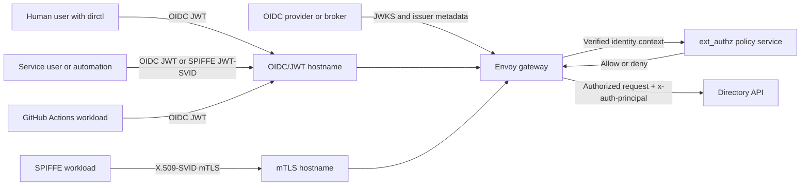

# OIDC Authentication for Directory

Directory supports an optional `oidc-gateway` authentication layer for users, automation, and workloads that access the API from outside the cluster. This keeps external access standards-based while preserving SPIFFE/SPIRE as the primary trust model for in-cluster workloads and service-to-service communication.

At a high level:

- Directory is OIDC IdP agnostic for external access.
- `Envoy` and `ext_authz` form the authentication and authorization layer at the edge.
- `Dex` is one useful deployment pattern, not a requirement.
- `oidc-gateway` v1.1.1 accepts OIDC JWT, SPIFFE JWT-SVID, and SPIFFE X.509-SVID identities, and can expose OIDC/JWT and X.509-SVID mTLS traffic on separate hostnames from one gateway deployment.
- Internal backend trust can remain SPIFFE-based even when external callers use OIDC bearer tokens.

## Why Use OIDC

The default Directory deployment model is a strong fit for in-cluster workloads that already use SPIFFE/SPIRE. OIDC becomes useful when you also need authenticated access from outside the cluster, for example:

- Developers using `dirctl` from a laptop or workstation.
- Service users and scheduled jobs running outside Kubernetes.
- CI workflows such as GitHub Actions.
- Enterprise users authenticating through an existing IdP.

This gateway layer is optional. If you only need in-cluster, SPIFFE-native access, you do not need to enable it.

### What This Is Not

To avoid confusion with other documentation in this section:

- This page is about external OIDC authentication for Directory API access.
- It is not the same as SPIRE OIDC discovery used in federation-related docs.
- It does not replace SPIFFE/SPIRE for internal workload trust.

## External OIDC Compared to Internal SPIFFE Trust

These two layers solve different problems and should be described separately:

- OIDC handles caller identity for remote users and automation.
- SPIFFE/SPIRE handles workload identity and service trust inside the platform.

Directory does not need to choose one or the other globally. A common deployment pattern is:

- Remote callers authenticate with OIDC
- Envoy validates tokens and calls `ext_authz`
- Authorized requests are forwarded to the Directory API
- Backend services continue using SPIFFE-aware trust and identity

## Architecture Overview



At the edge:

1. A client presents an OIDC JWT, SPIFFE JWT-SVID, or SPIFFE X.509-SVID.
2. Envoy validates bearer JWTs with `jwt_authn` on the OIDC/JWT listener, or validates downstream SPIFFE mTLS on the mTLS listener.
3. `ext_authz` maps trusted identity data to a canonical principal and role policy.
4. Only authorized requests reach the Directory API.

With `oidc-gateway` v1.1.1, the recommended production shape is a single gateway deployment with two optional downstream endpoints:

- `envoy.endpoints.oidc` plus `ingress.oidc` for human users, CI, and automation that present bearer JWTs.
- `envoy.endpoints.mtls` plus `ingress.mtls` for SPIFFE X.509-SVID clients. This listener typically requires a client certificate and does not run Envoy `jwt_authn`; `ext_authz` authorizes the SPIFFE principal derived from the TLS session. The downstream TLS listener advertises HTTP/2 (`h2`) with ALPN for gRPC client compatibility.

This keeps token handling and policy enforcement at the edge rather than spreading it across clients and backend services.

!!! note "v1.1.1 mTLS gRPC compatibility"

    `oidc-gateway` v1.1.1 fixes downstream gRPC interoperability for the SPIFFE X.509-SVID mTLS listener by advertising HTTP/2 (`h2`) with ALPN in Envoy's downstream TLS configuration. If mTLS clients fail during the TLS handshake with an error similar to `credentials: cannot check peer: missing selected ALPN property`, upgrade the gateway to v1.1.1 or verify that the rendered Envoy listener includes `alpn_protocols: ["h2"]`.

## Supported Identity Patterns

### Human Interactive Login

Human users typically authenticate with `dirctl auth login`, using browser-based PKCE, headless login, or device flow. This is the best fit for operators and developers who need interactive CLI access to a remote Directory.

Use the [CLI Reference](dir-cli-reference.md#global-options) for command examples and token cache behavior.

### Service Users and Non-Interactive Automation

Service users, bots, and external automation can pass a pre-issued bearer token by flag or environment variable. This is useful when a machine identity already receives tokens from a trusted OIDC issuer and does not need an interactive login flow.

This pattern is a good fit for:

- Cron jobs
- External controllers
- MCP agents
- Service integrations running outside the cluster

### GitHub Actions Workload Identity

GitHub Actions can present short-lived OIDC workload identity tokens instead of long-lived static credentials. This lets Directory authorize specific workflows without requiring personal access tokens or other long-lived secrets.

This should be treated as workload identity, not human login federation.

## IdP-Agnostic by Design

Directory does not depend on a single identity provider. The OIDC layer is designed to work with standards-compliant providers as long as you configure trusted issuers, audiences, and claim mappings appropriately.

Supported IdPs include the following:

- [Zitadel](https://zitadel.com/)
- [Keycloak](https://www.keycloak.org/)
- [Auth0](https://auth0.com/)
- [Okta](https://www.okta.com/)
- [Microsoft Entra ID](https://www.microsoft.com/en-us/security/business/identity-access/azure-active-directory)
- [Dex](https://github.com/dexidp/dex)

Directory trusts OIDC tokens at the edge through configuration and policy. It does not require a Directory-specific identity system.

### Where Dex Fits in the Architecture

Dex is best understood as an optional broker or convenience layer, especially when you want a lightweight way to support human login and upstream federation.

Dex can be a good choice when you want:

- GitHub-backed login for human users.
- A simple OIDC facade in front of upstream identity sources.
- A lightweight IdP component for a demo, lab, or small deployment.

Dex is not required if you:

- Already have an enterprise OIDC provider.
- Want Directory to trust an existing IdP directly.
- Mainly need machine-to-machine or workload identity from another standard issuer.

### Choosing Direct IdP Integration Versus Dex

Use direct IdP integration when:

- Your organization already standardizes on an OIDC provider.
- Want fewer identity components in the deployment.
- Want Directory to consume tokens issued by your enterprise platform directly.

Use Dex when you want:

- A broker in front of upstream identity systems.
- GitHub federation for human login.
- A simpler lab or reference deployment pattern that is easy to explain and reproduce.

In both cases, the Directory-facing model is the same: the edge validates tokens, `ext_authz` evaluates policy, and the Directory API receives only authorized requests.

## Relationship to `dirctl` and Deployment Configuration

The two main operator touchpoints are:

- [CLI Reference](dir-cli-reference.md#global-options) for `dirctl auth login`, `dirctl auth status`, `--auth-mode=oidc`, and pre-issued token usage
- deployment configuration for Envoy and the `ext_authz` layer that trusts one or more issuers and maps verified identities to principals and roles

When documenting or configuring this feature, it helps to think in three layers:

1. Client behavior: how `dirctl` or automation gets and sends tokens.
2. Edge trust: how Envoy validates JWTs from trusted issuers.
3. Authorization policy: how `ext_authz` maps identities and enforces access.

## `oidc-gateway` Configuration Walkthrough

The staging example in [`dir-staging/applications/oidc-gateway/dev/values.yaml`](https://github.com/agntcy/dir-staging/blob/main/applications/oidc-gateway/dev/values.yaml) is a good reference for how this model is wired in practice.

The public `dir` chart no longer embeds an `envoy-authz` add-on. Starting with the standalone `oidc-gateway` model, deploy the gateway as its own Helm application in front of the internal Directory API service.

The configuration is split into four main areas:

- Envoy edge behavior
- `ext_authz` principal extraction and RBAC
- SPIFFE and backend trust
- External ingress exposure

To configure `oidc-gateway`:

1. Configure Envoy as the Edge

    The `envoy` block defines how Envoy fronts the internal Directory API:

    ```yaml
    envoy:
      endpoints:
        oidc:
          enabled: true
          port: 8080
          servicePort: 8080
          downstreamTls:
            enabled: false
            requireClientCertificate: false
        mtls:
          enabled: true
          port: 8443
          servicePort: 8443
          downstreamTls:
            enabled: true
            requireClientCertificate: true

      backend:
        address: "dir-apiserver.dir.svc.cluster.local"
        port: 8888
        streamingPath: "/agntcy.dir.events.v1.EventService/Listen"
        listenRouteTimeout: 0s

      oidc:
        issuers:
          - name: dex
            enabled: true
            issuer: "https://dex.example.com"
            jwksUri: "https://dex.example.com/keys"
            jwksHost: "dex.example.com"
        github:
          enabled: true
          issuer: "https://token.actions.githubusercontent.com"
          jwksUri: "https://token.actions.githubusercontent.com/.well-known/jwks"
          jwksHost: "token.actions.githubusercontent.com"
          audiences:
            - "dir"

      spiffe:
        enabled: true
        trustDomain: example.org
        className: dir-spire
    ```

    This block does these important things:

    - `endpoints.oidc` exposes the listener that accepts OIDC JWT, GitHub OIDC, and SPIFFE JWT-SVID bearer tokens.
    - `endpoints.mtls` exposes the listener that accepts SPIFFE X.509-SVID client certificates over downstream mTLS. In v1.1.1, downstream TLS listeners advertise HTTP/2 (`h2`) with ALPN for gRPC clients.
    - `backend.*` points Envoy at the internal Kubernetes Service for the Directory API, not at either public ingress hostname.
    - `oidc.issuers[]` creates Envoy `jwt_authn` providers and JWKS clusters for bearer JWT validation.
    - `oidc.github.*` enables JWT validation for GitHub Actions workload identity tokens.
    - `spiffe.*` keeps Envoy-to-Directory traffic anchored in SPIFFE/SPIRE-based service trust.

    If you use a different IdP such as Zitadel, Keycloak, Auth0, Okta, or Entra ID, replace the Dex issuer and JWKS values with the corresponding issuer metadata for that provider.

2. Configure `ext_authz` Principal Extraction

    After Envoy validates a bearer token, it forwards the verified JWT payload to the authorization server. The `authServer.oidc` block controls how `ext_authz` interprets that payload and turns it into a canonical principal:

    ```yaml
    authServer:
      oidc:
        claims:
          principalClaim: "sub"
          emailClaimPath: "email"
        headers:
          authPrincipal: "x-auth-principal"
        issuers:
          - providerKey: "dex"
            provider: "https://dex.example.com"
            authFamily: "oidc"
          - providerKey: "github"
            provider: "https://token.actions.githubusercontent.com"
            authFamily: "oidc"
        denyList: []
    ```

    This is where you define the trust boundary for authorization:

    - `claims.principalClaim` selects which claim becomes the default OIDC principal value. `sub` is the safest generic default.
    - `claims.emailClaimPath` tells `ext_authz` where to read email-like identity metadata when present.
    - `headers.authPrincipal` sets the upstream header that carries the canonical principal to Directory. The default is `x-auth-principal`.
    - `issuers[].provider` must match the token `iss` value.
    - `issuers[].providerKey` is the stable short name used in policy strings such as `oidc:dex:alice`.
    - `issuers[].authFamily` is usually `oidc`. Use `spiffe` for SPIFFE JWT-SVID issuers.
    - `denyList` blocks specific canonical principals or email claim values before RBAC evaluation.

    Envoy strips client-supplied values for the configured principal header before forwarding requests, so clients cannot spoof `x-auth-principal`.

3. Use Canonical Principal Strings in Roles

    The `roles` section is where the high-level access model becomes concrete:

    ```yaml
    roles:
      admin:
        allowedMethods: ["*"]
        principals:
          - "oidc:dex:alice"

      viewer:
        allowedMethods:
          - "/agntcy.dir.store.v1.StoreService/Pull"
          - "/agntcy.dir.search.v1.SearchService/SearchRecords"
        principals:
          - "oidc:dex:reader-service"

      ci-writer:
        allowedMethods:
          - "/agntcy.dir.store.v1.StoreService/Push"
          - "/agntcy.dir.search.v1.SearchService/SearchRecords"
        principals:
          - "oidc:github:repo:your-org/your-repo:workflow:import-records.yaml:ref:refs/heads/main"
    ```

    Supported principal forms include:

    - `oidc:<providerKey>:<principal>`
    - `oidc:github:repo:<owner>/<repo>:workflow:<workflow-file>:ref:<git-ref>`
    - `spiffe:spiffe://<trust-domain>/<path>`

    GitHub workflow wildcard matching is intentionally strict. A wildcard may contain exactly one `*`, it must be the final character, and it is only supported in the branch ref segment, for example:

    ```text
    oidc:github:repo:your-org/your-repo:workflow:deploy.yaml:ref:refs/heads/release-*
    ```

    Practical guidance:

    - keep roles least-privilege
    - grant write methods only where needed
    - list specific GitHub workflow principals rather than trusting all workflows
    - prefer explicit principals over broad catch-all mappings

4. Expose the Gateway Externally

    The `ingress` block controls whether each gateway endpoint is reachable from outside the cluster:

    ```yaml
    ingress:
      oidc:
        enabled: true
        className: nginx
        host: "gateway.example.com"
        annotations:
          nginx.ingress.kubernetes.io/backend-protocol: "GRPC"
          nginx.ingress.kubernetes.io/grpc-backend: "true"
        tls:
          enabled: true
          secretName: ""

      mtls:
        enabled: true
        className: nginx-internal
        host: "gateway-mtls.example.com"
        annotations:
          nginx.ingress.kubernetes.io/ssl-passthrough: "true"
          nginx.ingress.kubernetes.io/backend-protocol: "GRPCS"
        tls:
          enabled: true
          secretName: ""
    ```

    `ingress.oidc.host` is the hostname that remote `dirctl` users, SDK clients, or CI workflows target when they present bearer JWTs. `ingress.mtls.host` is the separate hostname for SPIFFE X.509-SVID callers; use an ingress controller/class that supports TLS passthrough so Envoy, not the ingress controller, terminates mTLS and sees the client certificate.

    In TLS-passthrough mode, `tls.secretName` is intentionally empty. The ingress object still advertises the TLS host for SNI routing, but the certificate is provided by Envoy via SPIFFE/SPIRE instead of by an ingress TLS secret.

### Recommended Mental Model for the YAML

When reading or editing the staging values, use this sequence:

1. `envoy.backend`: where should authorized requests go?
2. `envoy.oidc.*`: which bearer-token issuers can Envoy validate?
3. `envoy.endpoints.*`: which downstream listener(s) and Service ports are exposed?
4. `envoy.spiffe.*`: how does Envoy authenticate to Directory and, optionally, accept SPIFFE X.509-SVID clients?
5. `authServer.oidc.issuers`: how does `ext_authz` map verified issuers to canonical principal prefixes?
6. `authServer.oidc.roles`: which canonical principals can call which methods?
7. `ingress.oidc` / `ingress.mtls`: how do external clients reach the correct gateway listener?

That sequence mirrors the actual request path:

Client identity -> Envoy validation -> `ext_authz` canonical principal mapping -> role check -> Directory API.

## Further Reading

- [CLI Reference](dir-cli-reference.md) for command-level usage
- [Quickstart](dir-quickstart.md) and [Deploy](dir-deployment-local.md) for deployment entry points
- [Production Deployment](dir-prod-deployment.md) for production topology and external endpoints
- [Running a Federated Directory Instance](dir-federation-setup.md) for network federation guidance
