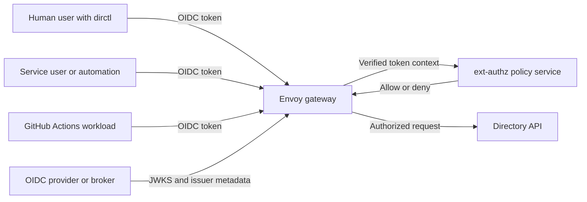

# OIDC Authentication for Directory

Directory supports an optional OIDC-based authentication layer for users and automation that access the API from outside the cluster. This keeps external access standards-based while preserving SPIFFE/SPIRE as the primary trust model for in-cluster workloads and service-to-service communication.

At a high level:

- Directory is OIDC IdP agnostic for external access.
- `Envoy` and `ext-authz` form the authentication and authorization layer at the edge.
- `Dex` is one useful deployment pattern, not a requirement.
- Internal backend trust can remain SPIFFE-based even when external callers use OIDC.

## Why Use OIDC

The default Directory deployment model is a strong fit for in-cluster workloads that already use SPIFFE/SPIRE. OIDC becomes useful when you also need authenticated access from outside the cluster, for example:

- Developers using `dirctl` from a laptop or workstation.
- Service users and scheduled jobs running outside Kubernetes.
- CI workflows such as GitHub Actions.
- Enterprise users authenticating through an existing IdP.

This OIDC layer is optional. If you only need in-cluster, SPIFFE-native access, you do not need to enable it.

### What This Is Not

To avoid confusion with other documentation in this section:

- This page is about external OIDC authentication for Directory API access.
- It is not the same as SPIRE OIDC discovery used in federation-related docs.
- It does not replace SPIFFE/SPIRE for internal workload trust.

## External OIDC Compared to Internal SPIFFE Trust

These two layers solve different problems and should be described separately:

- OIDC handles caller identity for remote users and automation.
- SPIFFE/SPIRE handles workload identity and service trust inside the platform.

Directory does not need to choose one or the other globally. A common deployment pattern is:

- Remote callers authenticate with OIDC
- Envoy validates tokens and calls `ext-authz`
- Authorized requests are forwarded to the Directory API
- Backend services continue using SPIFFE-aware trust and identity

## Architecture Overview



At the edge:

1. A client gets an OIDC token from a trusted issuer.
2. Envoy `jwt_authn` validates issuer, signature, and audience.
3. `ext-authz` maps trusted claims to a canonical principal and role policy.
4. Only authorized requests reach the Directory API.

This keeps token handling and policy enforcement at the edge rather than spreading it across clients and backend services.

## Supported Identity Patterns

### Human Interactive Login

Human users typically authenticate with `dirctl auth login`, using browser-based PKCE, headless login, or device flow. This is the best fit for operators and developers who need interactive CLI access to a remote Directory.

Use the [CLI Guide](directory-cli.md#authentication) for command examples and token cache behavior.

### Service Users and Non-Interactive Automation

Service users, bots, and external automation can pass a pre-issued bearer token by flag or environment variable. This is useful when a machine identity already receives tokens from a trusted OIDC issuer and does not need an interactive login flow.

This pattern is a good fit for:

- Cron jobs
- External controllers
- MCP agents
- Service integrations running outside the cluster

### GitHub Actions Workload Identity

GitHub Actions can present short-lived OIDC workload identity tokens instead of long-lived static credentials. This lets Directory authorize specific workflows without requiring personal access tokens or other long-lived secrets.

This should be treated as workload identity, not human login federation.

## IdP-Agnostic by Design

Directory does not depend on a single identity provider. The OIDC layer is designed to work with standards-compliant providers as long as you configure trusted issuers, audiences, and claim mappings appropriately.

Supported IdPs include the following:

- [Zitadel](https://zitadel.com/)
- [Keycloak](https://www.keycloak.org/)
- [Auth0](https://auth0.com/)
- [Okta](https://www.okta.com/)
- [Microsoft Entra ID](https://www.microsoft.com/en-us/security/business/identity-access/azure-active-directory)
- [Dex](https://github.com/dexidp/dex)

Directory trusts OIDC tokens at the edge through configuration and policy. It does not require a Directory-specific identity system.

### Where Dex Fits in the Architecture

Dex is best understood as an optional broker or convenience layer, especially when you want a lightweight way to support human login and upstream federation.

Dex can be a good choice when you want:

- GitHub-backed login for human users.
- A simple OIDC facade in front of upstream identity sources.
- A lightweight IdP component for a demo, lab, or small deployment.

Dex is not required if you:

- Already have an enterprise OIDC provider.
- Want Directory to trust an existing IdP directly.
- Mainly need machine-to-machine or workload identity from another standard issuer.

### Choosing Direct IdP Integration Versus Dex

Use direct IdP integration when:

- Your organization already standardizes on an OIDC provider.
- Want fewer identity components in the deployment.
- Want Directory to consume tokens issued by your enterprise platform directly.

Use Dex when you want:

- A broker in front of upstream identity systems.
- GitHub federation for human login.
- A simpler lab or reference deployment pattern that is easy to explain and reproduce.

In both cases, the Directory-facing model is the same: the edge validates OIDC tokens, `ext-authz` evaluates policy, and the Directory API receives only authorized requests.

## Relationship to `dirctl` and Deployment Configuration

The two main operator touchpoints are:

- [`directory-cli.md`](directory-cli.md) for user-facing commands such as `dirctl auth login`, `dirctl auth status`, `--auth-mode=oidc`, and pre-issued token usage
- deployment configuration for the Envoy and `ext-authz` layer that trusts one or more OIDC issuers and maps claims to principals and roles

When documenting or configuring this feature, it helps to think in three layers:

1. Client behavior: how `dirctl` or automation gets and sends tokens.
2. Edge trust: how Envoy validates JWTs from trusted issuers.
3. Authorization policy: how `ext-authz` maps claims and enforces access.

## `envoy-authz` Configuration Walkthrough

The staging example in [`dir-staging/applications/dir/dev/values.yaml`](https://github.com/agntcy/dir-staging/blob/main/applications/dir/dev/values.yaml) is a good reference for how this model is wired in practice.

The configuration is split into four main areas:

- Feature enablement
- Envoy edge behavior
- `ext-authz` claim and role mapping
- External ingress exposure

To configure `envoy-authz`:

1. Enable the Add-On

    The top-level switch is:

    ```yaml
    apiserver:
      envoyAuthz:
        enabled: true
    ```

    Keep this disabled when you only need in-cluster SPIFFE-based access. Enable it when external users or automation need to reach Directory through the OIDC-aware gateway.

2. Configure Envoy as the OIDC-Aware Edge

    The `apiserver.envoy-authz.envoy` block defines how Envoy fronts the internal Directory API:

    ```yaml
    apiserver:
      envoy-authz:
        envoy:
          backend:
            address: "dir-apiserver.dir.svc.cluster.local"
            port: 8888
          oidc:
            dex:
              enabled: true
              issuer: "https://dex.example.com"
              jwksUri: "https://dex.example.com/keys"
            github:
              enabled: true
              issuer: "https://token.actions.githubusercontent.com"
              jwksUri: "https://token.actions.githubusercontent.com/.well-known/jwks"
          spiffe:
            enabled: true
    ```

    This block does four important things:

    - `backend.*` points Envoy at the internal Kubernetes Service for the Directory API, not at the public ingress hostname.
    - `oidc.dex.*` enables JWT validation for human or device-flow tokens issued by Dex.
    - `oidc.github.*` enables JWT validation for GitHub Actions workload identity tokens.
    - `spiffe.*` keeps Envoy-to-Directory traffic anchored in SPIFFE/SPIRE-based service trust.

    If you use a different IdP such as Zitadel, Keycloak, Auth0, Okta, or Entra ID, the Dex-specific issuer and JWKS values would be replaced with the corresponding issuer metadata for that provider.

3. Map Claims to Principals in `ext-authz`

    After Envoy validates the token, `apiserver.envoy-authz.authServer.oidc` controls how `ext-authz` interprets claims and turns them into principals:

    ```yaml
    apiserver:
      envoy-authz:
        authServer:
          oidc:
            claims:
              userID: "sub"
              emailPath: "email"
            issuers: []
            principalType:
              mode: "auto"
              machineIdentityClaim: "client_id"
    ```

    This is where you define the trust boundary for authorization:

    - `claims.userID` selects which claim identifies a human user. `sub` is the safest generic default.
    - `claims.emailPath` tells `ext-authz` where to read email-like identity metadata when present.
    - `issuers` maps trusted issuers to principal types such as `user`, `client`, or `github`.
    - `principalType.mode` controls whether principal classification is inferred automatically or forced to a specific type.
    - `machineIdentityClaim` tells `ext-authz` which claim to use for service-client identities.

    A typical issuer mapping looks like this:

    ```yaml
    issuers:
      - provider: "https://dex.example.com"
        principalType: "user"
      - provider: "https://token.actions.githubusercontent.com"
        principalType: "github"
    ```

    This is the bridge between a validated token and the principal form used by policy, such as:

    - `user:<issuer>:<subject>`
    - `client:<issuer>:<client_id>`
    - `ghwf:repo:<owner>/<repo>:workflow:<workflow-file>:ref:<git-ref>`

4. Map Principals to Roles and Allowed Methods

    The `roles` section is where the high-level access model becomes concrete:

    ```yaml
    roles:
      admin:
        allowedMethods: ["*"]
        users: []
        clients: []
        githubWorkflows: []

      viewer:
        allowedMethods:
          - "/agntcy.dir.store.v1.StoreService/Pull"
          - "/agntcy.dir.search.v1.SearchService/SearchRecords"
    ```

    This section answers two questions:

    - which principals belong to a role
    - which gRPC methods that role may call

    In the staging example, roles are separated for broad admin access, read-oriented access, and CI-oriented write access. That is the part you tune most often for real deployments.

    Practical guidance:

    - keep roles least-privilege
    - grant write methods only where needed
    - list specific GitHub workflow principals rather than trusting all workflows
    - prefer explicit users or clients over broad catch-all mappings

5. Expose the Gateway Externally

    The `apiserver.envoy-authz.ingress` block controls whether the OIDC-aware gateway is reachable from outside the cluster:

    ```yaml
    apiserver:
      envoy-authz:
        ingress:
          enabled: true
          className: nginx
          host: "gateway.example.com"
          annotations:
            nginx.ingress.kubernetes.io/backend-protocol: "GRPC"
          tls:
            enabled: true
    ```

    This is the hostname that remote `dirctl` users, SDK clients, or CI workflows target. When ingress is disabled, the OIDC layer may still exist in-cluster, but it is not exposed for external callers.

### Recommended Mental Model for the YAML

When reading or editing the staging values, use this sequence:

1. `envoyAuthz.enabled`: should the add-on exist at all?
2. `envoy-authz.envoy.backend`: where should authorized requests go?
3. `envoy-authz.envoy.oidc.*`: which issuers can Envoy validate?
4. `envoy-authz.authServer.oidc.issuers`: how does `ext-authz` classify those issuers?
5. `envoy-authz.authServer.oidc.roles`: which principals can call which methods?
6. `envoy-authz.ingress.*`: how do external clients reach the gateway?

That sequence mirrors the actual request path:

Client token -> Envoy validation -> `ext-authz` principal mapping -> role check -> Directory API.

## Further Reading

- [CLI Guide](directory-cli.md) for command-level usage
- [Getting Started](dir-getting-started.md) for deployment entry points
- [Production Deployment](prod-deployment.md) for production topology and external endpoints
- [Running a Federated Directory Instance](partner-prod-federation.md) for network federation guidance
