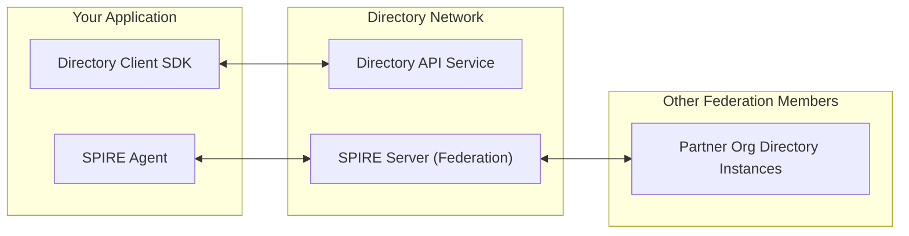

# Directory Public Staging Environment

This page describes the Directory public staging environment and how to connect your organization to it. You establish trust by federating your SPIRE server with the Directory SPIRE server using one of two supported bundle endpoint profiles: `https_web` (used by the testbed and recommended for most cases) or `https_spiffe` (SPIFFE mutual TLS).

!!! note
    The public staging environment is for development and testing. Keep in mind the following:

    - There are no SLA or data persistence guarantees.
    - This environment is not for production use.
    - This environment is ideal for prototyping, integration, and exploration.

## Architecture Overview

The following diagram shows how your application, the Directory network, and other federation members connect via the Directory API and SPIRE federation.



## Available Endpoints

Use the following endpoints to reach the public staging Directory API, SPIRE federation, and status dashboard.

| Service              | URL                                   | Purpose                                     |
| -------------------- | ------------------------------------- | ------------------------------------------- |
| Directory API    | `https://api.directory.agntcy.org`    | Main API for agent discovery and management |
| SPIRE Federation | `https://spire.directory.agntcy.org`  | SPIRE server for secure identity federation |
| Status Dashboard | `https://status.directory.agntcy.org` | Real-time service status and monitoring     |

For the testbed production deployment the following endpoints are available:

- `prod.api.ads.outshift.io`
- `prod.zot.ads.outshift.io` (for sync)
- `prod.spire.ads.outshift.io` (spire federation)
- `prod.oidc-discovery.spire.ads.outshift.io` (for OIDC discovery)

## Quick Start Guide

This section walks you through preparing your environment, configuring the client, and completing federation so you can use the public staging Directory.

### Prerequisites

Before you begin, ensure you have:

- A SPIRE server set up in your organization.
- Basic understanding of SPIFFE/SPIRE concepts.
- Directory client SDK or CLI tools available.

### Prepare Your Environment

#### Option 1: Using Directory CLI

Install the CLI:

    ```bash
    # Using Homebrew (Linux/macOS)
    brew tap agntcy/dir https://github.com/agntcy/dir
    brew install dirctl
    
    # Or download directly from releases
    curl -L https://github.com/agntcy/dir/releases/latest/download/dirctl-linux-amd64 -o dirctl
    chmod +x dirctl
    sudo mv dirctl /usr/local/bin/
    ```

#### Option 2: Using Directory Client SDK

Choose your preferred language:

=== "Go SDK"

      ```go
      package main

      import (
         "context"
         "log"
         
         "github.com/agntcy/dir/client"
      )

      func main() {
         // Create client with SPIRE support
         config := &client.Config{
            ServerAddress:     "api.directory.agntcy.org",
            SpiffeSocketPath:  "/tmp/spire-agent/public.sock",
         }
         client, _ := client.New(client.WithConfig(config))

         // Test connection
         _, err := client.Ping(context.Background())
         if err != nil {
            log.Printf("❌ Connection failed: %v", err)
            return
         }

         log.Println("✅ Connected to Directory!")

         // Run workflows...
      }
      ```

=== "Python SDK"

      ```python
      from agntcy.dir_sdk.client import Config, Client

      def main():
         # Create client with SPIRE support
         config = Config(
            server_address="api.directory.agntcy.org",
            spiffe_socket_path="/tmp/spire-agent/public.sock"
         )
         client = Client(config)

         # Test connection
         try:
            client.ping()
            print("✅ Connected to Directory!")
         except Exception as e:
            print(f"❌ Connection failed: {e}")

         # Run workflows...

      if __name__ == "__main__":
         main()
      ```

=== "JavaScript SDK"

      ```javascript
      import {Config, Client} from 'agntcy-dir';

      async function main() {
         // Create client with SPIRE support
         const config = new Config({
            serverAddress: "api.directory.agntcy.org",
            spiffeEndpointSocket: "/tmp/spire-agent/public.sock",
         });
         const transport = await Client.createGRPCTransport(config);
         const client = new Client(config, transport);

         // Test connection
         try {
            await client.ping();
            console.log('✅ Connected to Directory!');
         } catch (error) {
            console.error('❌ Connection failed:', error.message);
         }

         // Run workflows...
      }

      main();
      ```

    !!! note
        This SDK is intended for Node.js applications only and does not work in web browsers.

### Federation Setup

To interact with the Directory, you need to establish a trusted federation between your SPIRE server and the Directory SPIRE server.

### Step 1: Prepare Your Federation Request

Create a federation file with your SPIRE server details. The Directory supports two bundle endpoint profiles; choose the one that matches your environment.

**Option A: https_web profile** (recommended for testbed and most deployments)

Federation over standard HTTPS using CA-signed certificates. No bootstrap bundle exchange is required. The testbed uses this profile.

```yaml
# onboarding/federation/your-org.com.yaml
className: dir-spire
trustDomain: your-org.com
bundleEndpointURL: https://spire.your-org.com
bundleEndpointProfile:
  type: https_web
```

**Option B: https_spiffe profile**

Federation over SPIFFE mutual TLS using X.509-SVIDs. Requires a one-time bootstrap bundle exchange with the Directory and SSL passthrough on your ingress.

```yaml
# onboarding/federation/your-org.com.yaml
className: dir-spire
trustDomain: your-org.com
bundleEndpointURL: https://spire.your-org.com
bundleEndpointProfile:
  type: https_spiffe
  endpointSPIFFEID: spiffe://your-org.com/spire/server
trustDomainBundle: |-
  {
    "keys": [
      {
        "use": "x509-svid",
        "kty": "RSA",
        "n": "your-public-key-here...",
        "e": "AQAB",
        "x5c": ["your-certificate-chain-here..."]
      }
    ]
  }
```

!!! note
    Organizations must establish their own secure procedures for exchanging bootstrap bundles with federation partners. The bundle exchange mechanism (email, file transfer, version control, etc.) should align with organizational security policies.

To get your trust bundle (for `https_spiffe` or for sharing with the Directory):

```bash
# Export your SPIRE server trust bundle
spire-server bundle show -format spiffe > your-trust-bundle.json
```

### Step 2: Submit Federation Request

Submit your federation configuration to the Directory by adding a file to the [dir-staging](https://github.com/agntcy/dir-staging) repository and opening a pull request:

1. Fork and clone the dir-staging repository:

   ```bash
   git clone https://github.com/your-username/dir-staging.git
   cd dir-staging
   ```

2. Add your federation file under `onboarding/federation/` using the same structure as in Step 1. Name the file after your trust domain (e.g. `your-org.com.yaml`):

   ```bash
   # Create or edit your federation file
   # Path: onboarding/federation/your-org.com.yaml
   ```

   For `https_web` (testbed / recommended): include `className`, `trustDomain`, `bundleEndpointURL`, and `bundleEndpointProfile.type: https_web`.  
   For `https_spiffe`: also include `endpointSPIFFEID` and `trustDomainBundle` in the same file.

3. Submit a pull request to the upstream [agntcy/dir-staging](https://github.com/agntcy/dir-staging) repo:

   - Title: `federation(<Trust Domain>): add [Your Organization]`
   - Description: Brief description of your organization and use case.
   - Files: Your new or updated file under `onboarding/federation/`.

### Step 3: Configure Your SPIRE Server

Add the Directory SPIRE server as a federation peer in your SPIRE server configuration. Obtain the Directory trust bundle from the [dir-staging onboarding resources](https://github.com/agntcy/dir-staging/tree/main/onboarding) (or from the Directory team after your federation request is approved) and configure it in your SPIRE server per your deployment method.

### Step 4: Verify Federation

```bash
# Check federation status
spire-server federation list

# Should show the federated trust domain
spire-server federation show --trustDomain dir.agntcy.org
```

## Use Cases

You can find various usage examples in the [Usage Scenarios](./scenarios.md) section.

## Troubleshooting

### Connection Issues

**Problem**: Cannot connect to Directory API

```bash
# Check SPIRE agent status
spire-agent api fetch x509-svid

# Verify network connectivity
curl -v https://api.directory.agntcy.org
```

### Federation Issues

**Problem**: SPIRE federation not working

```bash
# Verify trust bundle exchange
spire-server federation show --trustDomain dir.agntcy.org

# Test bundle endpoint connectivity
curl https://spire.directory.agntcy.org/
```

### Common Error Messages

| Error                                           | Solution                                                   |
| ----------------------------------------------- | ---------------------------------------------------------- |
| `connection refused`                            | Check if SPIRE agent is running and socket path is correct |
| `x509: certificate signed by unknown authority` | Verify trust bundle configuration                          |
| `context deadline exceeded`                     | Check network connectivity and firewall settings           |
| `permission denied`                             | Ensure proper SPIFFE ID registration and policies          |

## Getting Help

### Community Support

- [GitHub Issues](https://github.com/agntcy/dir/issues) for bugs and feature requests.
- [GitHub Discussions](https://github.com/agntcy/dir/discussions) for questions and community help.

For the next steps and getting started, see the [Quick Start Guide](./getting-started.md). For sample applications, see the [Usage Scenarios](./scenarios.md).
