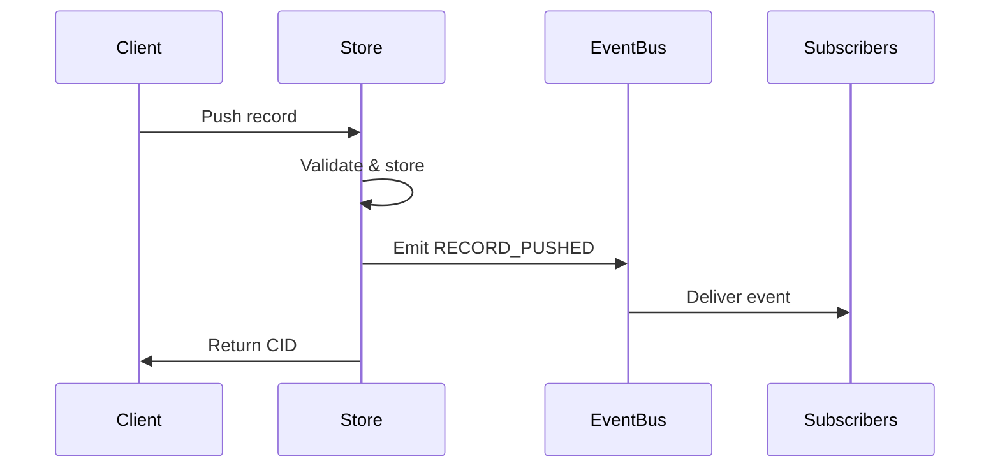
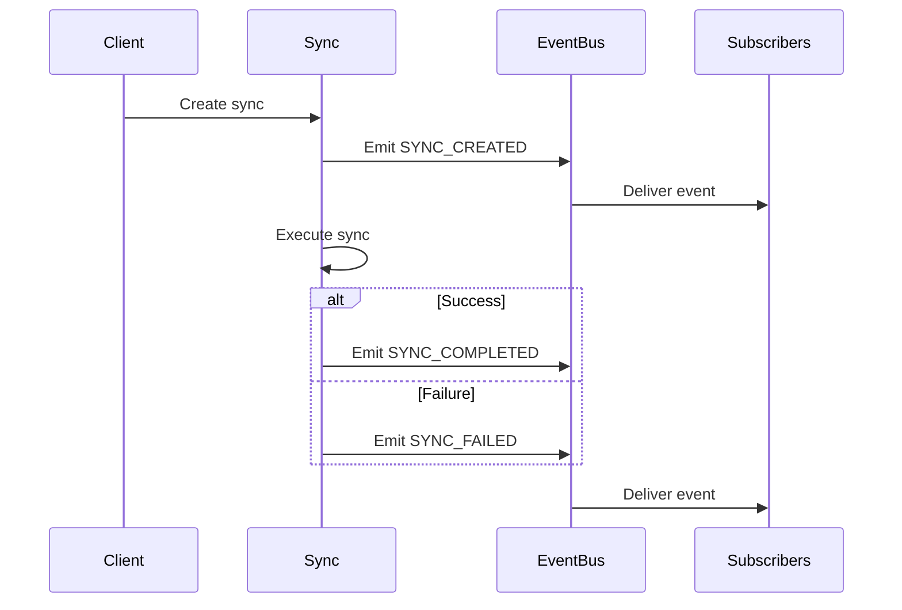

# Event Streaming

The Directory Event Service provides real-time monitoring of system operations through a
lightweight streaming API. This enables external applications, monitoring systems, and automation
tools to react to changes as they occur across the distributed directory network.

## Overview

Events are emitted for key operations across all Directory services, including storage, routing,
synchronization, and signing activities. The event system delivers notifications in real-time from
the moment of subscription, without maintaining history or supporting replay functionality.

### Supported Event Types

The Directory tracks 9 distinct event types organized by service:

| Service | Event Types | Description |
|---------|-------------|-------------|
| **Store** | RECORD_PUSHED<br/>RECORD_PULLED<br/>RECORD_DELETED | Local storage operations |
| **Routing** | RECORD_PUBLISHED<br/>RECORD_UNPUBLISHED | Network announcement operations |
| **Sync** | SYNC_CREATED<br/>SYNC_COMPLETED<br/>SYNC_FAILED | Directory synchronization operations |
| **Sign** | RECORD_SIGNED | Cryptographic signing operations |

## Key Characteristics

- **Real-time delivery**: Events are delivered immediately as operations occur
- **Forward-only**: No historical events or replay capability
- **Filtered subscriptions**: Server-side filtering by event type, labels, and CIDs
- **Type-safe**: Protocol buffer enums prevent invalid event types
- **Asynchronous**: Event publishing never blocks API operations

## Using the CLI

The `dirctl events listen` command provides real-time event monitoring with flexible filtering
options.

### Listen to All Events

```bash
# Listen to all system events
dirctl events listen
```

**Output:**
```
Listening to events (press Ctrl+C to stop)...

[14:23:15] RECORD_PUSHED: bafybeigdyrzt5sfp7udm7hu76uh7y26nf3efuylqabf3oclgtqy55fbzdi
[14:23:17] RECORD_PUBLISHED: bafybeigdyrzt5sfp7udm7hu76uh7y26nf3efuylqabf3oclgtqy55fbzdi
[14:23:20] SYNC_CREATED: sync-12345
[14:23:35] SYNC_COMPLETED: sync-12345 {"remote_url":"https://remote.dir.example.com","record_count":"5"}
```

### Filter by Event Type

```bash
# Only receive storage events
dirctl events listen --types RECORD_PUSHED,RECORD_PULLED,RECORD_DELETED

# Only receive routing events
dirctl events listen --types RECORD_PUBLISHED,RECORD_UNPUBLISHED

# Only receive synchronization events
dirctl events listen --types SYNC_CREATED,SYNC_COMPLETED,SYNC_FAILED
```

### Filter by Labels

Monitor events for records with specific skill taxonomies or other labels:

```bash
# Monitor AI-related records
dirctl events listen --labels /skills/AI

# Monitor specific research domain
dirctl events listen --labels /domains/research

# Combine multiple labels
dirctl events listen --labels /skills/AI,/domains/research
```

### Filter by CID

Track operations on specific records:

```bash
# Monitor a specific record
dirctl events listen --cids bafybeigdyrzt5sfp7udm7hu76uh7y26nf3efuylqabf3oclgtqy55fbzdi

# Monitor multiple records
dirctl events listen --cids bafybe...,bafkyb...
```

### JSON Output

For programmatic processing:

```bash
# JSON format output
dirctl events listen --json
```

```json
{
  "id": "550e8400-e29b-41d4-a716-446655440000",
  "type": "EVENT_TYPE_RECORD_PUSHED",
  "timestamp": "2025-10-18T14:23:15.123456Z",
  "resource_id": "bafybeigdyrzt5sfp7udm7hu76uh7y26nf3efuylqabf3oclgtqy55fbzdi",
  "labels": ["/skills/AI", "/domains/research"]
}
```

### Combine Filters

All filter types can be combined for precise event monitoring:

```bash
# Monitor AI record storage operations
dirctl events listen \
  --types RECORD_PUSHED,RECORD_PULLED \
  --labels /skills/AI \
  --json
```

## Using the Go SDK

The Directory Go client provides a streaming API for event consumption:

```go
package main

import (
    "context"
    "fmt"
    
    "github.com/agntcy/dir/client"
    eventsv1 "github.com/agntcy/dir/api/events/v1"
)

func main() {
    // Create client
    c, err := client.New(
        client.WithAddress("localhost:8080"),
    )
    if err != nil {
        panic(err)
    }
    defer c.Close()
    
    // Subscribe to all events
    ctx := context.Background()
    result, err := c.ListenStream(ctx, &eventsv1.ListenRequest{})
    if err != nil {
        panic(err)
    }
    
    // Receive events using StreamResult pattern
    for {
        select {
        case resp := <-result.ResCh():
            event := resp.GetEvent()
            fmt.Printf("[%s] %s: %s\n",
                event.GetTimestamp().AsTime().Format("15:04:05"),
                event.GetType(),
                event.GetResourceId())
        case err := <-result.ErrCh():
            panic(err)
        case <-result.DoneCh():
            return
        case <-ctx.Done():
            return
        }
    }
}
```

### Subscribe with Filters

```go
// Subscribe to specific event types
result, err := c.ListenStream(ctx, &eventsv1.ListenRequest{
    EventTypes: []eventsv1.EventType{
        eventsv1.EventType_EVENT_TYPE_RECORD_PUSHED,
        eventsv1.EventType_EVENT_TYPE_RECORD_PUBLISHED,
    },
})

// Subscribe with label filter
result, err := c.ListenStream(ctx, &eventsv1.ListenRequest{
    LabelFilters: []string{"/skills/AI"},
})

// Subscribe with CID filter
result, err := c.ListenStream(ctx, &eventsv1.ListenRequest{
    CidFilters: []string{"bafybeigdyrzt5sfp7udm7hu76uh7y26nf3efuylqabf3oclgtqy55fbzdi"},
})
```

## Using the Python SDK

```python
from agntcy.dir_sdk.client import Client
from agntcy.dir_sdk.models import events_v1

# Create client
client = Client(address="localhost:8080")

# Subscribe to events
request = events_v1.ListenRequest()
stream = client.events_client.Listen(request)

# Receive events
try:
    for response in stream:
        event = response.event
        print(f"[{event.type}] {event.resource_id}")
except KeyboardInterrupt:
    pass
finally:
    client.close()
```

### Subscribe with Filters

```python
# Subscribe to specific event types
request = events_v1.ListenRequest(
    event_types=[
        events_v1.EventType.EVENT_TYPE_RECORD_PUSHED,
        events_v1.EventType.EVENT_TYPE_RECORD_PUBLISHED,
    ]
)

# Subscribe with label filter
request = events_v1.ListenRequest(
    label_filters=["/skills/AI"]
)

# Subscribe with CID filter
request = events_v1.ListenRequest(
    cid_filters=["bafybeigdyrzt5sfp7udm7hu76uh7y26nf3efuylqabf3oclgtqy55fbzdi"]
)
```

## Use Cases

### Monitoring and Observability

Track system activity for operational awareness:

```bash
# Monitor all operations in production
dirctl events listen --json | tee events.log

# Alert on failed syncs
dirctl events listen --types SYNC_FAILED | \
  while read line; do
    echo "ALERT: $line"
    # Send notification
  done
```

### Automation and Integration

React to events programmatically:

```go
// Automatically publish records after they're pushed
for {
    select {
    case resp := <-result.ResCh():
        event := resp.GetEvent()
        if event.GetType() == eventsv1.EventType_EVENT_TYPE_RECORD_PUSHED {
            cid := event.GetResourceId()
            // Automatically publish to network
            _, err := c.Publish(ctx, &routingv1.PublishRequest{
                RecordRef: &corev1.RecordRef{Cid: cid},
            })
        }
    case err := <-result.ErrCh():
        return fmt.Errorf("stream error: %w", err)
    case <-result.DoneCh():
        return nil
    case <-ctx.Done():
        return ctx.Err()
    }
}
```

### Audit and Compliance

Maintain audit trails for critical operations:

```bash
# Record all signature events
dirctl events listen --types RECORD_SIGNED --json >> audit.jsonl
```

### Development and Debugging

Monitor system behavior during development:

```bash
# Watch all events during testing
dirctl events listen --json | jq .

# Track specific record through the system
dirctl events listen --cids $RECORD_CID
```

## Event Lifecycle

Events are emitted at specific points in operation lifecycles:

### Storage Operations



### Synchronization Operations



## Best Practices

### For Client Applications

**Handle Connection Failures**

Implement retry logic with exponential backoff:

```go
backoff := time.Second
for {
    result, err := c.ListenStream(ctx, req)
    if err != nil {
        time.Sleep(backoff)
        backoff *= 2
        continue
    }
    
    // Process events...
    for {
        select {
        case resp := <-result.ResCh():
            // Process event
        case err := <-result.ErrCh():
            // Connection error - will retry with backoff
            goto reconnect
        case <-result.DoneCh():
            goto reconnect
        case <-ctx.Done():
            return
        }
    }
    
reconnect:
    time.Sleep(backoff)
    backoff = min(backoff*2, time.Minute)
}
```

**Use Appropriate Filters**

Filter server-side to reduce bandwidth and processing:

```go
// ✅ Good: Filter on server
result, _ := c.ListenStream(ctx, &eventsv1.ListenRequest{
    EventTypes: []eventsv1.EventType{eventsv1.EventType_EVENT_TYPE_RECORD_PUSHED},
})

// ❌ Bad: Filter on client
result, _ := c.ListenStream(ctx, &eventsv1.ListenRequest{})
for {
    select {
    case resp := <-result.ResCh():
        if resp.GetEvent().GetType() == eventsv1.EventType_EVENT_TYPE_RECORD_PUSHED {
            // Process...
        }
    // ... other cases
    }
}
```

**Set Appropriate Timeouts**

Use context timeouts to prevent hanging connections:

```go
ctx, cancel := context.WithTimeout(context.Background(), 5*time.Minute)
defer cancel()

result, err := c.ListenStream(ctx, req)
```

### For Production Deployments

- **Monitor dropped events**: Check server logs for slow consumer warnings
- **Use structured logging**: JSON output enables log aggregation and analysis
- **Implement graceful shutdown**: Properly close streams on application termination
- **Consider buffering**: Local buffering can smooth over temporary processing delays

## Limitations

Understanding the event system's design constraints:

### No Event History

Events are only delivered from subscription time forward. Historical events are not stored or
available for replay. Applications requiring event history must maintain their own storage.

### At-Most-Once Delivery

If a subscriber cannot keep up with event delivery, events may be dropped. The system prioritizes
overall performance over guaranteed delivery to slow consumers.

### No Ordering Guarantees

Events from different services may arrive in any order. Applications requiring strict ordering
should use timestamps or implement their own sequencing logic.

### Per-Server Scope

Each Directory server maintains its own event bus. Events are not propagated across server
instances in a distributed deployment.

## Configuration

Event system behavior can be tuned via server configuration:

```yaml
# /etc/agntcy/dir/server.config.yml
events:
  # Buffer size per subscriber (default: 100)
  # Larger values allow subscribers to fall behind temporarily
  subscriber_buffer_size: 100
  
  # Log warnings when events are dropped (default: true)
  log_slow_consumers: true
  
  # Debug logging for all events (default: false)
  # Very verbose - use only for debugging
  log_published_events: false
```

**Environment Variables:**

```bash
DIRECTORY_SERVER_EVENTS_SUBSCRIBER_BUFFER_SIZE=100
DIRECTORY_SERVER_EVENTS_LOG_SLOW_CONSUMERS=true
DIRECTORY_SERVER_EVENTS_LOG_PUBLISHED_EVENTS=false
```

!!! note
    The `subscriber_buffer_size` parameter controls memory usage. Larger buffers reduce event
    dropping but consume more memory per subscriber.

## See Also

- [Events API Reference](dir-events-v1-api.md) - Protocol buffer definitions and message formats
- [CLI Reference](directory-cli.md) - Complete CLI command documentation
- [SDK Reference](directory-sdk.md) - Language-specific SDK usage guides
- [Getting Started](getting-started.md) - Initial setup and deployment guide

