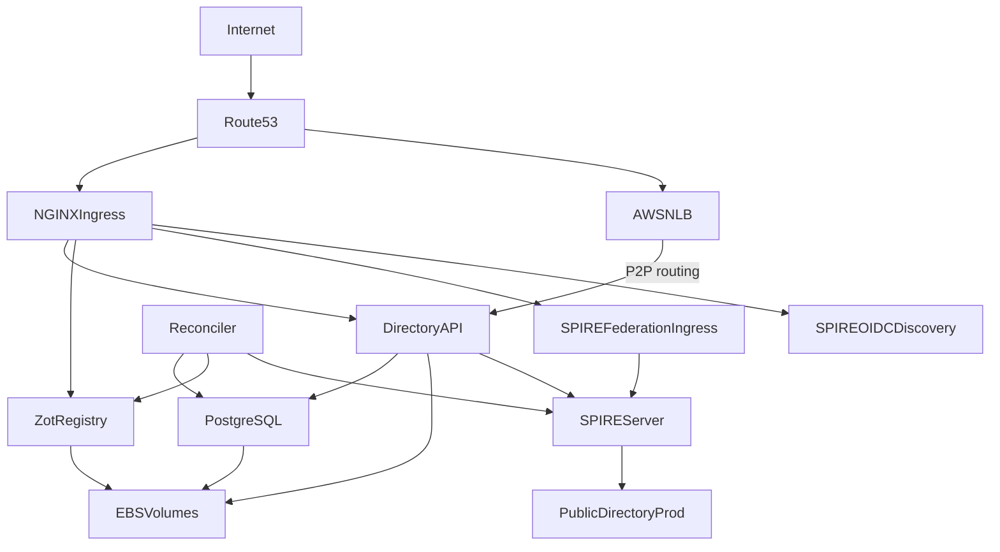

# Federation on Amazon EKS

This guide is the opinionated AWS happy path for running your own AGNTCY Directory instance and federating it with the public Directory network.

It makes the following choices for you:

- Amazon Web Services
- Amazon EKS
- Helm-first deployment
- `https_web` SPIRE federation
- NGINX ingress
- Route53 with ExternalDNS
- cert-manager with Let's Encrypt
- EBS-backed persistence
- Zot as the OCI registry
- SPIRE as the workload identity system

If you want the reference material behind this guide, see the following guides:

 - [Production Deployment](prod-deployment.md)
 - [Running a Federated Directory Instance](partner-prod-federation.md)
 - [Federation Bundle Profiles](federation-profiles.md)
 - [Federation Best Practices and Troubleshooting](federation-troubleshooting.md)

This document is intentionally narrow. It does not try to cover GitOps, Azure, GCP, on-premises deployment, or the `https_spiffe` profile. The goal is to give first-time operators one concrete path that they can follow end to end.

## What You Will Build



## Decisions Before You Start

Choose these before you install anything:

- Your SPIRE trust domain.

    This is permanent for the deployment.

- Your public DNS names.

- Your federation profile.

    This guide always uses `https_web`.

To keep the mental model simple, this guide uses the same base domain for both DNS and the trust domain:

- Trust domain: `partner.example.com`
- Directory API: `api.partner.example.com`
- Zot: `zot.partner.example.com`
- P2P routing: `routing.partner.example.com`
- SPIRE federation endpoint: `spire.partner.example.com`
- SPIRE OIDC discovery: `oidc-discovery.spire.partner.example.com`

!!! note

    Do not split these in your first deployment. You can change them later.

## Version Pins Used in This Guide

These pins match the current staging deployment references at the time this guide was written:

| Component | Source | Version |
|-----------|--------|---------|
| Directory Helm chart | `oci://ghcr.io/agntcy/dir/helm-charts/dir` | `v1.2.0` |
| Directory apiserver image | `ghcr.io/agntcy/dir-apiserver` | `v1.2.0` |
| Directory reconciler image | `ghcr.io/agntcy/dir-reconciler` | `v1.2.0` |
| SPIRE Helm chart | `spiffe/spire` | `0.28.3` |

!!! note

    Older Directory docs still show `v1.0.0` examples. Prefer the versions above for a fresh deployment.

## Before You Start

This guide assumes you already have:

- An EKS cluster running and reachable with `kubectl`
- An ingress-nginx controller installed in the cluster
- `--enable-ssl-passthrough=true` enabled on that ingress controller
- cert-manager installed with a production ClusterIssuer such as `letsencrypt-prod`
- ExternalDNS configured to manage records in your Route53 hosted zone
- An EBS-backed StorageClass named `ebs-sc-encrypted`
- `kubectl`, `helm`, `openssl`, `jq`, and `htpasswd` installed locally

This guide does not try to provision the AWS infrastructure from zero in the main flow. For the AWS-specific provisioning considerations, see the [Appendix](#appendix-best-effort-aws-provisioning-notes).

## Setting Up Federation Using AWS EKS

1. Export the Variables Used by the Rest of the Guide

    ```bash
    export TRUST_DOMAIN="partner.example.com"
    export BASE_DOMAIN="partner.example.com"

    export DIR_API_HOST="api.${BASE_DOMAIN}"
    export DIR_ZOT_HOST="zot.${BASE_DOMAIN}"
    export DIR_ROUTING_HOST="routing.${BASE_DOMAIN}"
    export SPIRE_FEDERATION_HOST="spire.${BASE_DOMAIN}"
    export SPIRE_OIDC_HOST="oidc-discovery.spire.${BASE_DOMAIN}"

    export DIR_NAMESPACE="dir"
    export SPIRE_NAMESPACE="spire"
    export CERT_ISSUER="letsencrypt-prod"
    export STORAGE_CLASS="ebs-sc-encrypted"
    ```

2. Verify the Cluster Add-Ons Before You Deploy Anything

    Check that the required controllers and storage class already exist:

    ```bash
    kubectl get ns
    kubectl get deployment -A | egrep 'ingress-nginx|cert-manager|external-dns'
    kubectl get storageclass
    kubectl get clusterissuer
    ```

    Confirm that the ingress-nginx controller has SSL passthrough enabled:

    ```bash
    kubectl get deployment -n ingress-nginx ingress-nginx-controller -o yaml | \
      grep enable-ssl-passthrough
    ```

    Expected result:

    - `ingress-nginx-controller` is present
    - `cert-manager` is present
    - `external-dns` is present
    - your `ClusterIssuer` exists
    - `ebs-sc-encrypted` exists
    - the ingress controller arguments include `--enable-ssl-passthrough=true`

    If any of these are missing, stop here and resolve them first. This guide assumes the platform layer is already working.

3. Generate the Credentials Used by Directory and Zot

    Use generated values instead of hardcoding static credentials in your shell history or values files:

    ```bash
    export DIR_OCI_ADMIN_PASSWORD="$(openssl rand -base64 24)"
    export DIR_SYNC_PASSWORD="$(openssl rand -base64 24)"
    export DIR_DB_PASSWORD="$(openssl rand -base64 24)"

    htpasswd -nbB admin "${DIR_OCI_ADMIN_PASSWORD}" > zot.htpasswd
    htpasswd -nbB user "${DIR_SYNC_PASSWORD}" >> zot.htpasswd

    openssl genpkey -algorithm Ed25519 -out node.privkey
    ```

    Keep `node.privkey` on disk. It will be injected into the Helm release via `--set-file` later.

4. Install SPIRE for `https_web` Federation

    Add the hardened SPIRE chart repository and install the CRDs:

    ```bash
    helm repo add spiffe https://spiffe.github.io/helm-charts-hardened
    helm repo update

    helm upgrade --install spire-crds spire-crds \
      --repo https://spiffe.github.io/helm-charts-hardened \
      --namespace spire-crds \
      --create-namespace
    ```

    Create `spire-values.yaml`:

    ```bash
    cat <<EOF > spire-values.yaml
    global:
      spire:
        trustDomain: ${TRUST_DOMAIN}
        clusterName: eks
        namespaces:
          create: false
        ingressControllerType: other

      installAndUpgradeHooks:
        enabled: false

      deleteHooks:
        enabled: false

    spire-server:
      federation:
        enabled: true
        tls:
          spire:
            enabled: false
          certManager:
            enabled: true
            issuer:
              create: false
            certificate:
              issuerRef:
                kind: ClusterIssuer
                name: ${CERT_ISSUER}
        ingress:
          enabled: true
          className: nginx
          controllerType: other
          host: ${SPIRE_FEDERATION_HOST}
          tlsSecret: spire-federation-cert
          annotations:
            cert-manager.io/cluster-issuer: ${CERT_ISSUER}
            external-dns.alpha.kubernetes.io/hostname: ${SPIRE_FEDERATION_HOST}
            nginx.ingress.kubernetes.io/ssl-passthrough: "false"
            nginx.ingress.kubernetes.io/backend-protocol: "HTTPS"
            nginx.ingress.kubernetes.io/proxy-ssl-server-name: "on"
            nginx.ingress.kubernetes.io/proxy-ssl-name: "${SPIRE_FEDERATION_HOST}"
            # SPIRE serves its own self-signed cert on the backend; the ingress
            # controller cannot validate it, so upstream verification is disabled.
            nginx.ingress.kubernetes.io/proxy-ssl-verify: "off"
      controllerManager:
        watchClassless: true
        className: dir-spire
        identities:
          clusterFederatedTrustDomain:
            enabled: true
          clusterSPIFFEIDs:
            default:
              federatesWith:
                - prod.ads.outshift.io

    spiffe-oidc-discovery-provider:
      ingress:
        enabled: true
        className: nginx
        host: ${SPIRE_OIDC_HOST}
        annotations:
          cert-manager.io/cluster-issuer: ${CERT_ISSUER}
          external-dns.alpha.kubernetes.io/hostname: ${SPIRE_OIDC_HOST}
      config:
        domains:
          - ${SPIRE_OIDC_HOST}
    EOF
    ```

    Install SPIRE:

    ```bash
    helm upgrade --install spire spiffe/spire \
      --version 0.28.3 \
      --namespace "${SPIRE_NAMESPACE}" \
      --create-namespace \
      -f spire-values.yaml
    ```

    Wait for SPIRE to become healthy:

    ```bash
    kubectl wait --for=condition=ready pod -n "${SPIRE_NAMESPACE}" \
      -l app.kubernetes.io/name=server --timeout=300s

    kubectl wait --for=condition=ready pod -n "${SPIRE_NAMESPACE}" \
      -l app.kubernetes.io/name=agent --timeout=300s
    ```

5. Verify the SPIRE Public Endpoints

    Check that the ingress objects and public certificates exist:

    ```bash
    kubectl get ingress -n "${SPIRE_NAMESPACE}"
    kubectl get certificate -n "${SPIRE_NAMESPACE}"
    ```

    Verify the federation endpoint:

    ```bash
    curl -I "https://${SPIRE_FEDERATION_HOST}"
    ```

    Verify the OIDC discovery document:

    ```bash
    curl "https://${SPIRE_OIDC_HOST}/.well-known/openid-configuration" | jq .
    ```

    Confirm that Route53 and ExternalDNS have published the hostnames:

    ```bash
    dig +short "${SPIRE_FEDERATION_HOST}"
    dig +short "${SPIRE_OIDC_HOST}"
    ```

    At this point, your SPIRE bundle endpoint should already be externally reachable over standard HTTPS.

6. Create the Directory Values File

    Create `dir-values.yaml`:

    ```bash
    cat <<EOF > dir-values.yaml
    apiserver:
      image:
        repository: ghcr.io/agntcy/dir-apiserver
        tag: v1.2.0
        pullPolicy: IfNotPresent

      spire:
        enabled: true
        className: dir-spire
        trustDomain: ${TRUST_DOMAIN}
        useCSIDriver: true
        dnsNameTemplates:
          - ${DIR_API_HOST}
        federation:
          - className: dir-spire
            trustDomain: prod.ads.outshift.io
            bundleEndpointURL: https://prod.spire.ads.outshift.io
            bundleEndpointProfile:
              type: https_web

      routingService:
        type: LoadBalancer
        cloudProvider: "aws"
        aws:
          internal: false
          nlbTargetType: "instance"
        externalTrafficPolicy: Local
        annotations:
          external-dns.alpha.kubernetes.io/hostname: "routing.${BASE_DOMAIN}"

      config:
        listen_address: "0.0.0.0:8888"
        oasf_api_validation:
          disable: true
        authn:
          enabled: true
          mode: "x509"
          socket_path: "unix:///run/spire/agent-sockets/api.sock"
          audiences:
            - "spiffe://${TRUST_DOMAIN}/spire/server"
        authz:
          enabled: true
          enforcer_policy_file_path: "/etc/agntcy/dir/authz_policies.csv"
        store:
          provider: "oci"
          oci:
            # Use the external address, not the internal .svc.cluster.local name.
            # The apiserver shares this address with remote peers via the
            # RequestRegistryCredentials RPC so they can pull records during sync.
            registry_address: "${DIR_ZOT_HOST}"
            auth_config:
              insecure: "false"
              username: "admin"
              password: "${DIR_OCI_ADMIN_PASSWORD}"
        routing:
          listen_address: "/ip4/0.0.0.0/tcp/5555"
          key_path: /etc/routing/node.privkey
          datastore_dir: /etc/routing/datastore
          directory_api_address: "${DIR_API_HOST}:443"
          gossipsub:
            enabled: true
        sync:
          auth_config:
            username: "user"
            password: "${DIR_SYNC_PASSWORD}"
        publication:
          scheduler_interval: "1h"
          worker_count: 1
          worker_timeout: "30m"
        database:
          type: "postgres"
          postgres:
            host: ""
            port: 5432
            database: "dir"
            # PostgreSQL runs as a subchart in the same namespace, so traffic
            # stays within the pod network. Use "require" or "verify-full" if
            # your PostgreSQL instance is external or crosses a network boundary.
            ssl_mode: "disable"

      authz_policies_csv: |
        p,${TRUST_DOMAIN},*
        p,*,/agntcy.dir.store.v1.StoreService/Pull
        p,*,/agntcy.dir.store.v1.StoreService/PullReferrer
        p,*,/agntcy.dir.store.v1.StoreService/Lookup
        p,*,/agntcy.dir.store.v1.SyncService/RequestRegistryCredentials

      pvc:
        create: true
        storageClassName: ${STORAGE_CLASS}
        size: 20Gi

      strategy:
        type: Recreate

      ingress:
        enabled: true
        className: nginx
        annotations:
          nginx.ingress.kubernetes.io/ssl-passthrough: "true"
          nginx.ingress.kubernetes.io/backend-protocol: "GRPCS"
          external-dns.alpha.kubernetes.io/hostname: ${DIR_API_HOST}
        hosts:
          - host: ${DIR_API_HOST}
            paths:
              - path: /
                pathType: ImplementationSpecific
        tls:
          - hosts:
              - ${DIR_API_HOST}

      postgresql:
        enabled: true
        auth:
          username: "dir"
          password: "${DIR_DB_PASSWORD}"
          database: "dir"
        primary:
          persistence:
            enabled: true
            storageClass: ${STORAGE_CLASS}
            size: 20Gi

      reconciler:
        enabled: true
        image:
          repository: ghcr.io/agntcy/dir-reconciler
          tag: v1.2.0
          pullPolicy: IfNotPresent
        config:
          database:
            type: "postgres"
            postgres:
              host: ""
              port: 5432
              database: "dir"
              ssl_mode: "disable"
          local_registry:
            registry_address: "${DIR_ZOT_HOST}"
            repository_name: ""
            auth_config:
              insecure: false
          regsync:
            enabled: true
            interval: "1m"
            timeout: "30m"
            authn:
              enabled: true
              mode: "x509"
              socket_path: "unix:///run/spire/agent-sockets/api.sock"
          indexer:
            enabled: true
            interval: "30m"

      secrets:
        # privKey is injected via --set-file in the helm install command.
        # PEM data is multiline and cannot be safely embedded in a YAML heredoc.
        syncAuth:
          username: "user"
          password: "${DIR_SYNC_PASSWORD}"
        ociAuth:
          username: "admin"
          password: "${DIR_OCI_ADMIN_PASSWORD}"
        postgresAuth:
          username: "dir"
          password: "${DIR_DB_PASSWORD}"

      zot:
        persistence: true
        pvc:
          create: true
          accessModes: ["ReadWriteOnce"]
          storage: 100Gi
          storageClassName: ${STORAGE_CLASS}
        mountSecret: true
        authHeader: "admin:${DIR_OCI_ADMIN_PASSWORD}"
        secretFiles:
          htpasswd: |-
    $(sed 's/^/        /' zot.htpasswd)
        mountConfig: true
        ingress:
          enabled: true
          className: nginx
          annotations:
            cert-manager.io/cluster-issuer: ${CERT_ISSUER}
            external-dns.alpha.kubernetes.io/hostname: ${DIR_ZOT_HOST}
          hosts:
            - host: ${DIR_ZOT_HOST}
              paths:
                - path: /
                  pathType: ImplementationSpecific
          tls:
            - secretName: zot-public-tls
              hosts:
                - ${DIR_ZOT_HOST}
    EOF
    ```

    !!! note

        The routing datastore, PostgreSQL, and Zot PVCs are all pinned to `ebs-sc-encrypted`. If your cluster uses a different default StorageClass, update the `storageClassName` values for each component before you install Directory.

7. Install Directory

    ```bash
    helm upgrade --install dir oci://ghcr.io/agntcy/dir/helm-charts/dir \
      --version v1.2.0 \
      --namespace "${DIR_NAMESPACE}" \
      --create-namespace \
      -f dir-values.yaml \
      --set-file apiserver.secrets.privKey=node.privkey
    ```

    `--set-file` reads the PEM file and passes its exact bytes to the chart, which base64-encodes them into the Kubernetes Secret. This avoids the multiline-in-YAML corruption that would happen if the key were embedded directly in the values file.

    Wait for the main workloads:

    ```bash
    kubectl wait --for=condition=ready pod -n "${DIR_NAMESPACE}" \
      -l app.kubernetes.io/name=apiserver --timeout=300s

    kubectl get pods -n "${DIR_NAMESPACE}"
    kubectl get svc -n "${DIR_NAMESPACE}"
    kubectl get ingress -n "${DIR_NAMESPACE}"
    kubectl get pvc -n "${DIR_NAMESPACE}"
    ```

8. Verify the Directory Endpoints and Certificates

    Check that the public API hostname presents the SPIFFE-issued certificate rather than the ingress default certificate:

    ```bash
    echo | openssl s_client -connect "${DIR_API_HOST}:443" \
      -servername "${DIR_API_HOST}" 2>/dev/null | \
      openssl x509 -noout -subject
    ```

    If SSL passthrough is working, the certificate subject should come from SPIRE and not from the ingress controller.

    Confirm that the API server successfully obtained an X.509-SVID:

    ```bash
    kubectl logs -n "${DIR_NAMESPACE}" -l app.kubernetes.io/name=apiserver | \
      grep "Successfully obtained valid X509-SVID"
    ```

    Verify that Zot is reachable over HTTPS:

    ```bash
    curl -u "admin:${DIR_OCI_ADMIN_PASSWORD}" "https://${DIR_ZOT_HOST}/v2/_catalog"
    ```

    Verify the DNS records:

    ```bash
    dig +short "${DIR_API_HOST}"
    dig +short "${DIR_ZOT_HOST}"
    ```

    Verify the persistent volumes:

    ```bash
    kubectl get pvc -n "${DIR_NAMESPACE}" -o wide
    ```

    The PVCs should be `Bound` and backed by EBS.

9. Confirm Federation with the Public Directory

    The first proof point is that your SPIRE server can fetch the public Directory trust bundle:

    ```bash
    kubectl exec -n "${SPIRE_NAMESPACE}" spire-server-0 -c spire-server -- \
      spire-server bundle list -id spiffe://prod.ads.outshift.io -format spiffe
    ```

    If the bundle is missing:

    - check that your SPIRE federation endpoint is externally reachable
    - check that `https://prod.spire.ads.outshift.io` is reachable from the cluster
    - check cert-manager and DNS for `${SPIRE_FEDERATION_HOST}`

10. Onboard Your Trust Domain into `dir-staging`

    Your cluster trusting prod is only half of the setup. The public production Directory must also learn how to trust your SPIRE domain.

    Create a file named `onboarding/federation/${TRUST_DOMAIN}.yaml` in your `dir-staging` fork with this content:

    ```yaml
    className: dir-spire
    trustDomain: partner.example.com
    bundleEndpointURL: https://spire.partner.example.com
    bundleEndpointProfile:
      type: https_web
    ```

    Then:

    1. Open a pull request against `agntcy/dir-staging`.
    1. Wait for the maintainers to merge it and roll it out.
    1. Make sure the public side also adds the authorization policy for your trust domain.

    Until that pull request is merged and applied, prod will not accept requests authenticated with your trust domain.

11. Validate from a SPIRE-Enabled Client

    The easiest client validation is to run `dirctl` from an environment that already has a SPIRE agent socket for your trust domain.

    Set the client environment:

    ```bash
    export DIRECTORY_CLIENT_SERVER_ADDRESS="${DIR_API_HOST}:443"
    export DIRECTORY_CLIENT_SPIFFE_SOCKET_PATH="/tmp/spire-agent/public.sock"
    ```

    Then run a basic connectivity check against your own Directory:

    ```bash
    dirctl info bafytest123
    # Expected: Error: record not found
    ```

    Once the `dir-staging` onboarding pull request is merged, validate access to the public Directory as well:

    ```bash
    dirctl pull bafytest123 \
      --server-addr prod.api.ads.outshift.io \
      --spiffe-socket-path "${DIRECTORY_CLIENT_SPIFFE_SOCKET_PATH}"
    # Expected: Error: record not found
    ```

    If you want a fuller post-deployment smoke test against your own Directory, use the normal Directory CLI workflows from [Directory CLI Guide](directory-cli.md):

    - `dirctl push record.json`
    - `dirctl info <cid>`
    - `dirctl search --name <name>`
    - `dirctl sync create https://prod.api.ads.outshift.io:443`

## Troubleshooting

If you get stuck, check these first:

- `certificate is valid for ingress.local`: SSL passthrough is not working, or the API ingress is configured with a terminating TLS secret.
- `certificate signed by unknown authority` on the federation endpoint: cert-manager or the ClusterIssuer is misconfigured.
- missing prod bundle in SPIRE: your cluster cannot reach `https://prod.spire.ads.outshift.io`, or your SPIRE federation controller settings are wrong.
- `Pending` PVCs: your EBS CSI setup or StorageClass defaulting is incomplete.
- prod rejects your trust domain after local federation works: your `dir-staging` onboarding pull request has not been merged or rolled out yet.

For in-depth troubleshooting, see [Federation Best Practices and Troubleshooting](federation-troubleshooting.md).

## Appendix: Best-Effort AWS Provisioning Notes

!!! note

    This appendix is intentionally marked as best effort. It reflects the AWS shape assumed by the rest of the guide, but it was not validated end to end in the environment used to write this document.

If you do not already have the platform prerequisites, these are the usual AWS building blocks you need before the main walkthrough starts:

### EKS Cluster

1. Create an EKS cluster in subnets that allow the ingress controller and worker nodes to reach the public internet.
2. Use managed node groups unless your platform team already standardizes on Karpenter or a custom node model.
3. Make sure the cluster can provision EBS volumes through the EBS CSI driver.

### Route53 and DNS

1. Create or reuse a hosted zone for the base domain.
2. Make sure ExternalDNS can write records into that zone.
3. Reserve the five public names used in this guide:

    - `api.<domain>`
    - `zot.<domain>`
    - `routing.<domain>`
    - `spire.<domain>`
    - `oidc-discovery.spire.<domain>`

### IAM and Workload Identity

1. ExternalDNS usually needs an IAM role that can change Route53 records.
2. cert-manager may need additional AWS permissions if you use Route53-based DNS challenges instead of an HTTP challenge flow.
3. If your platform uses IAM Roles for Service Accounts (IRSA) or the newer EKS Pod Identity, create those bindings before you install the controllers. AWS recommends EKS Pod Identity for new EC2-based clusters; IRSA is still required for Fargate workloads.

### Ingress and Load Balancers

1. The ingress-nginx controller must be exposed through an AWS load balancer that is reachable from the public internet.
2. The Directory API path depends on SSL passthrough, so verify that the ingress controller keeps that capability when you customize the Service annotations.
3. The public production deployment model uses an AWS Network Load Balancer for TCP passthrough. If your platform defaults to a different load balancer behavior, validate it carefully before exposing the API hostname.

### Security Groups and Networking

1. Worker nodes and the ingress load balancer must allow inbound HTTPS from the internet for the public hostnames.
2. Egress must allow the cluster to reach:

    - Let's Encrypt
    - Route53 APIs, if used by your controller setup
    - `https://prod.spire.ads.outshift.io`

3. If your company routes outbound traffic through a NAT or firewall, confirm that cert-manager and SPIRE can still complete their external calls.

### Storage

1. Make `ebs-sc-encrypted` the default StorageClass if you want the subcharts to inherit EBS automatically.
2. Verify after install that PostgreSQL, Zot, and the routing datastore PVC all bind to the expected StorageClass.

### A Good First Cut

If your platform team asks what they need to hand you before you can follow the main guide, ask for this:

- A working EKS cluster
- Ingress-nginx with SSL passthrough
- cert-manager with a production ClusterIssuer
- ExternalDNS wired to Route53
- An encrypted EBS StorageClass named `ebs-sc-encrypted`
- Public DNS delegation for your chosen domain
