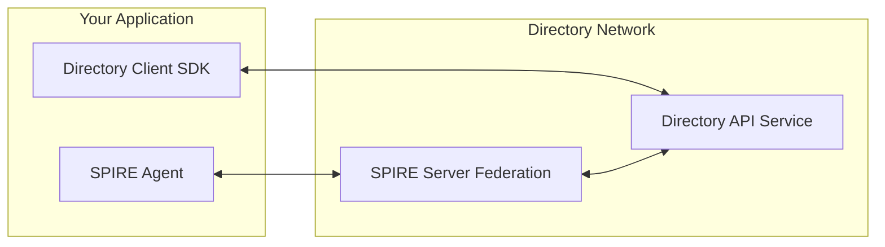

# Connect to the Public Directory

Connect your applications to the public Directory network at `prod.api.ads.outshift.io` to discover and publish AI agents. This guide walks you through SPIRE federation and client configuration.

There are three scenarios for connecting your applications to the public Directory network.

| Scenario | You have | Deployment |
|----------|----------|------------|
| dirctl / dir-admin | SPIRE + dirctl chart | Chart creates Federation CRs and configures the workload |
| SDK App | SPIRE + your app using Directory SDK | Manually apply Federation CR to SPIRE; app mounts SPIRE agent socket |
| Directory instance | SPIRE + Directory (API server) | Directory chart or dir-staging configures federation |

The process is similar for all three scenarios but there are differences in the SPIRE configuration.

!!! note "Public Staging Environment"
    The public Directory at `prod.*.ads.outshift.io` is for development and testing—no SLA or data persistence guarantees. Ideal for prototyping, integration, and exploration.

## Prerequisites

- SPIRE server in your organization (or deploy one via [Getting Started](getting-started.md))
- Unique trust domain for federation (e.g. `your-org.com`—`example.org` from Getting Started is local-only)
- Basic understanding of [SPIFFE/SPIRE](https://spiffe.io/docs/latest/spiffe-about/overview/)

!!! important "Coming from Getting Started?"

    If you ran a local instance, your SPIRE uses `example.org` for local testing only. To connect to the public Directory, you need a unique trust domain and a publicly reachable SPIRE federation endpoint. See [Production Deployment](prod-deployment.md) for production setup, then return here for federation.

## Available Endpoints

| Service | URL | Purpose |
|---------|-----|---------|
| Directory API | `https://prod.api.ads.outshift.io` | Main API for agent discovery and management |
| SPIRE Federation | `https://prod.spire.ads.outshift.io` | SPIRE server for secure identity federation |
| Status Dashboard | `https://prod.status.ads.outshift.io` | Real-time service status and monitoring |

## Choosing a Federation Profile

Directory supports two federation profiles. Start with `https_web` unless you have specific requirements.

| Profile | SSL Passthrough | Bootstrap Bundle | Best For |
|---------|-----------------|------------------|----------|
| `https_web` | Not required | Not required | Most organizations, cloud deployments |
| `https_spiffe` | Required | Required | Air-gapped environments, zero-trust architectures |

For detailed comparison, see [Federation Profiles](federation-profiles.md).

## Submitting Your Federation File

Federation is bidirectional: you submit your federation file to Directory, and you deploy Directory's federation file to your SPIRE.

Create and submit your federation file:

1. Fork [agntcy/dir-staging](https://github.com/agntcy/dir-staging)

2. Create your federation file in `onboarding/federation/`:

    ```bash
    git clone https://github.com/your-username/dir-staging.git
    cd dir-staging/onboarding/federation/
    
    # https_web (recommended) or https_spiffe
    cp .federation.web.template.yaml your-org.com.yaml
    vim your-org.com.yaml
    ```

3. Submit a pull request with the title `federation: add <your-org.com>` to the [agntcy/dir-staging](https://github.com/agntcy/dir-staging) repository with one of the federation file templates:

    === "https_web (recommended)"

        ```yaml
        className: dir-spire
        trustDomain: your-org.com
        bundleEndpointURL: https://spire.your-org.com
        bundleEndpointProfile:
          type: https_web
        ```

    === "https_spiffe (requires bootstrap bundle exchange)"

        ```yaml
        className: dir-spire
        trustDomain: your-org.com
        bundleEndpointURL: https://spire.your-org.com
        bundleEndpointProfile:
          type: https_spiffe
          endpointSPIFFEID: spiffe://your-org.com/spire/server
        trustDomainBundle: |-
          { "keys": [ ... ] }
        ```

4. Extract your trust bundle: `spire-server bundle show -format spiffe`. See [Federation Profiles](federation-profiles.md) and [Federation Profile Configuration](federation-profile-configuration.md) for more details.

!!! tip "className"
    The `className: dir-spire` must match your SPIRE Controller Manager's `className`. For Directory deployments, it must also match `apiserver.spire.className`. If you use [dir-staging](https://github.com/agntcy/dir-staging), it is already configured.

## Configuring Your SPIRE to Use Directory's Federation

After your federation request is approved, add the Directory's federation to your SPIRE.

Obtain `prod.ads.outshift.io.yaml` from [dir-staging/onboarding/federation/](https://github.com/agntcy/dir-staging/tree/main/onboarding/federation).

There are three methods to configure your SPIRE to use Directory's federation, depending on your scenario.

=== "dirctl / dir-admin"

    The dirctl chart creates Federation CRs and configures the workload. Add to your dirctl/dir-admin values:

    ```yaml
    spire:
      enabled: true
      federation:
      - className: dir-spire
        trustDomain: prod.ads.outshift.io
        bundleEndpointURL: https://prod.spire.ads.outshift.io
        bundleEndpointProfile:
          type: https_web

    env:
      - name: DIRECTORY_CLIENT_SERVER_ADDRESS
        value: prod.api.ads.outshift.io:443
    ```

=== "SDK App (no chart)"

    Your app uses the Directory SDK and has no Helm chart. Manually add federation to your SPIRE:

    1. **Create and apply** a `ClusterFederatedTrustDomain` resource. Use the content of [prod.ads.outshift.io.yaml](https://github.com/agntcy/dir-staging/blob/main/onboarding/federation/prod.ads.outshift.io.yaml) as the `spec`:

      ```yaml
      apiVersion: spire.spiffe.io/v1alpha1
      kind: ClusterFederatedTrustDomain
      metadata:
        name: prod-ads-outshift-io
      spec:
        className: dir-spire
        trustDomain: prod.ads.outshift.io
        bundleEndpointURL: https://prod.spire.ads.outshift.io
        bundleEndpointProfile:
          type: https_web
      ```

    2. **Deploy your app** with SPIRE agent socket mounted (or SPIFFE CSI driver). Ensure your SPIRE Controller Manager watches the same `className`.

    3. **Configure the SDK** with `prod.api.ads.outshift.io` as the server address. See [SDK Reference](directory-sdk.md).

=== "Directory Instance"

    You deploy Directory (API server) and want it to federate with the public network.

    **If using dir-staging:**

    ```bash
    task gen:dir
    # ArgoCD syncs automatically
    ```

    **Manual deployment**—add to your DIR values:

    ```yaml
    apiserver:
      spire:
        federation:
        - className: dir-spire
          trustDomain: prod.ads.outshift.io
          bundleEndpointURL: https://prod.spire.ads.outshift.io
          bundleEndpointProfile:
            type: https_web
    ```

### Verify SPIRE Configuration

SPIRE logs should show `Bundle refreshed` with `trust_domain=prod.ads.outshift.io`.

## Configuring Client and Verifying

There are three methods to configure your client to use Directory's federation.

=== "dirctl / dir-admin"

    The chart configures `DIRECTORY_CLIENT_SERVER_ADDRESS` and SPIRE attestation. Ensure your workload uses the SPIFFE CSI driver or mounts the SPIRE agent socket. Verify:

    ```bash
    kubectl exec -n your-spire-namespace deployment/spire-server -c spire-server -- \
      /opt/spire/bin/spire-server federation list
    # Should show: Trust Domain: prod.ads.outshift.io

    # Test from a pod running dirctl
    dirctl pull bafytest123
    # Expected: Error: record not found (connection and authentication work)
    ```

=== "SDK App"

    Your app must mount the SPIRE agent socket (or use the SPIFFE CSI driver) and configure the SDK with `prod.api.ads.outshift.io`. See [SDK Reference](directory-sdk.md) for Go, Python, and JavaScript.

=== "Local CLI"

    1. **Install dirctl** (see [CLI Reference](directory-cli.md)):

      ```bash
      brew tap agntcy/dir https://github.com/agntcy/dir
      brew install dirctl
      ```

    2. **Configure** (SPIRE agent socket must be available locally):

      ```bash
      export DIRECTORY_CLIENT_SERVER_ADDRESS="prod.api.ads.outshift.io:443"
      export DIRECTORY_CLIENT_SPIFFE_SOCKET_PATH="/tmp/spire-agent/public.sock"
      ```

    3. **Verify:** `dirctl pull bafytest123` (expected: record not found—proves connection works)

## Architecture



## Use Cases

See [Features and Usage Scenarios](scenarios.md) for sample applications and workflows.

## Next Steps

- Publish agents: Use `dirctl push` or the SDK to publish records to the public Directory.
- Deploy your own instance: See [Production Deployment](prod-deployment.md) for AWS EKS and federation.
- Explore scenarios: [Features and Usage Scenarios](scenarios.md) for build, store, sign, discover, and search workflows.
- Federation issues: See [Federation Best Practices and Troubleshooting](federation-troubleshooting.md) for operational guidance and common errors.
