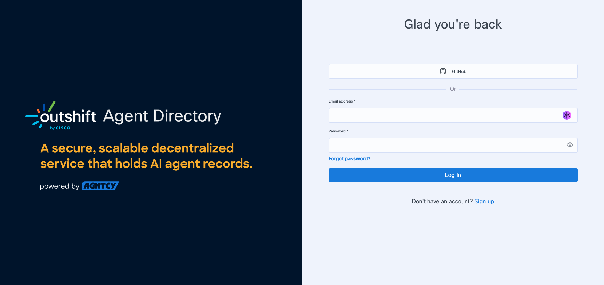
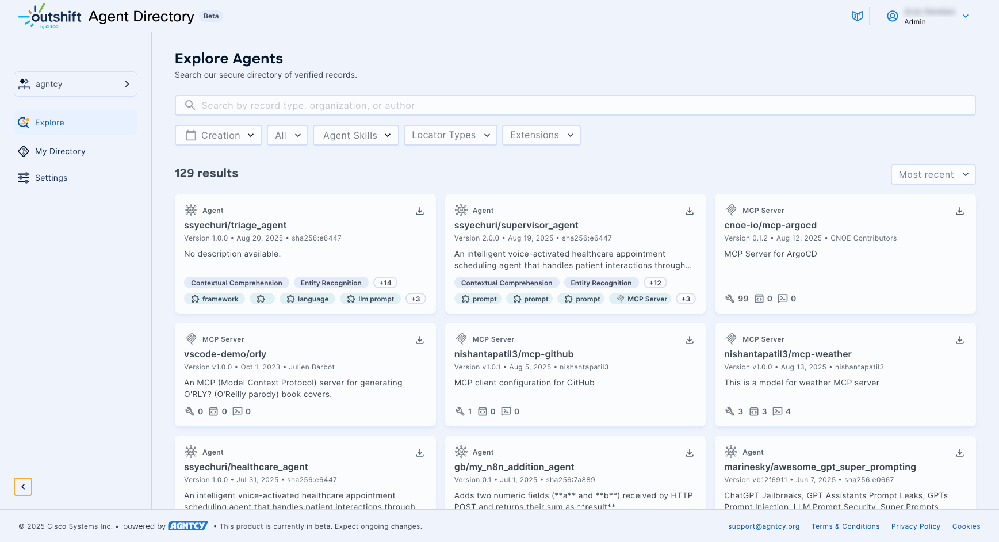
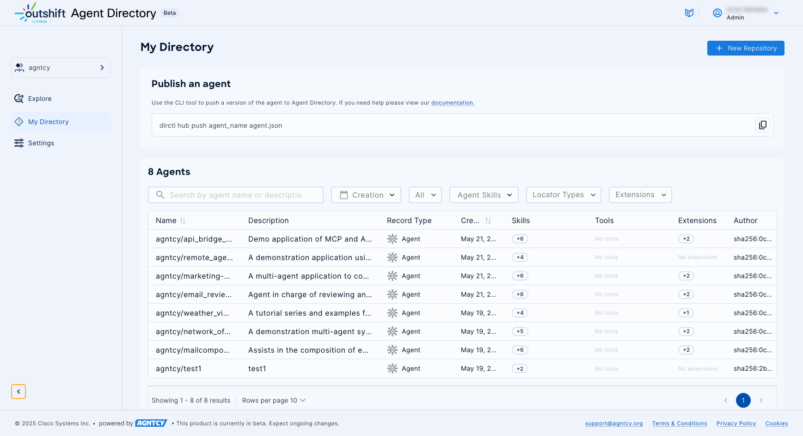
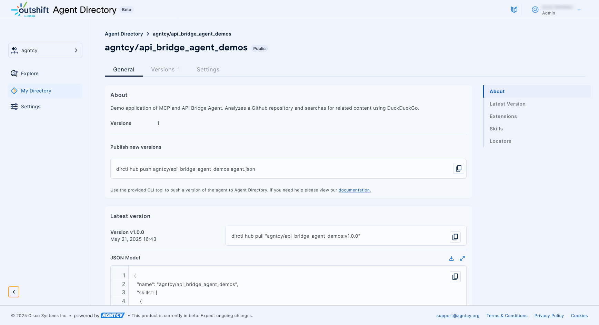
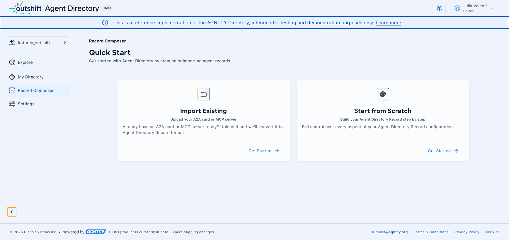
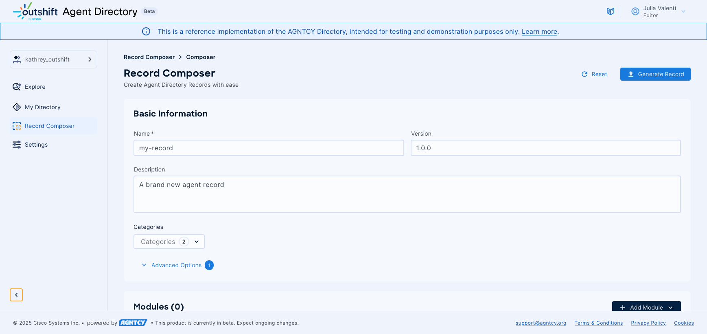
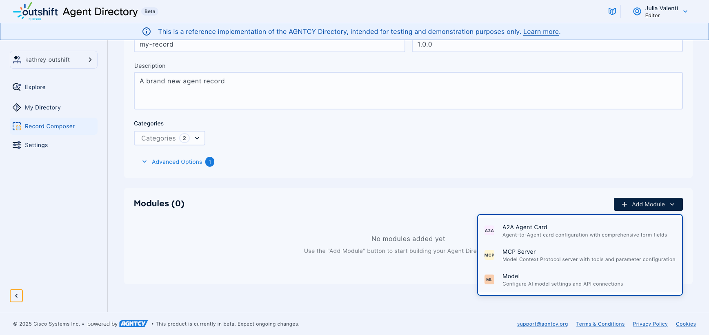
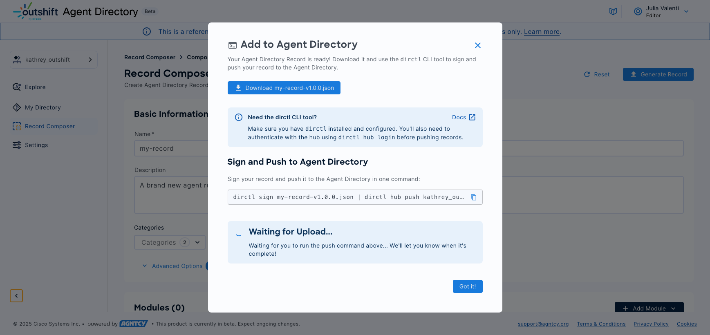
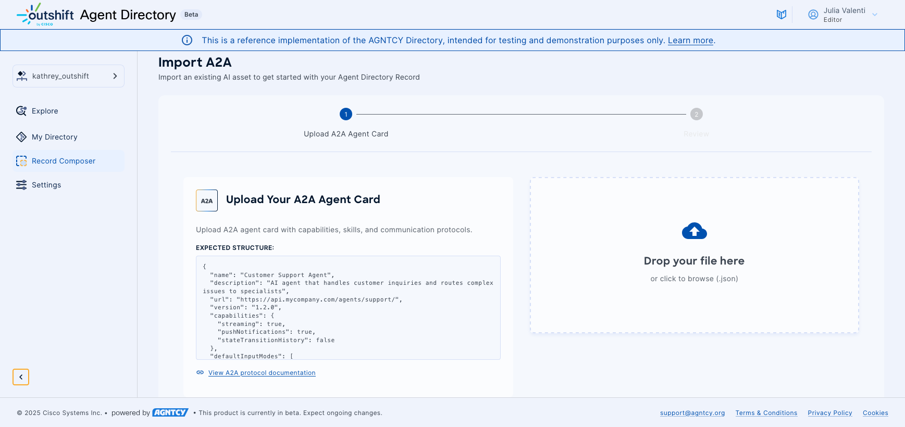
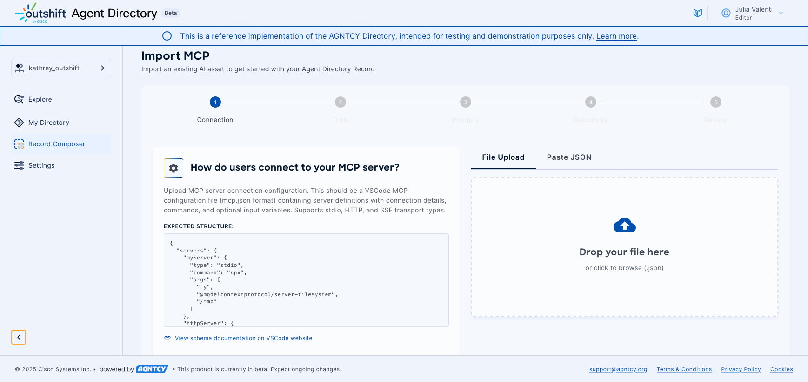

# Hosted Outshift Agent Directory, powered by AGNTCY

A public hosted instance of the Agent Directory is available at
[https://agent-directory.outshift.com/](https://agent-directory.outshift.com/). In
this section we describe the main features of this instance which is provided __AS
IS__ to the community to help users familiarize themselves with the Agent
Directory.

Outshift Agent Directory (aka "Hub") is designed to provide a robust multi-organization platform for hosting and
managing Agent Directory Records, which we will refer to as simply "records" or
"agent records." Outshift Agent Directory acts as a centralized
point for organizing and accessing agent records. This hosted service is enhanced by a
gRPC API that supports efficient service communication and integration, ensuring
seamless interaction between components.

Outshift Agent Directory serves as a central platform for hosting and managing various
agent-related services. The main purpose of the Agent Directory Service
component is to provide a comprehensive solution
for developers and IT admins to register, discover, and manage records in an
organized manner. By offering a secure environment for authentication and user
management, it ensures that organizations can confidently manage their agent
directories and related services.

## Core Concepts

The Outshift Agent Directory is organized around a few basic concepts:

* Users - A user is the basic unit of authentication and authorization in the
Hub, usually corresponding to a human or service account.
* Organization - An organization provides a way to group users for sharing agents
and handling administrative tasks. A user can belong to many organizations, but
organizations are flat and cannot belong to one another.
* Agent Records - An Agent Record is a collection of data and metadata about a
particular agentic application or service. The schema of the Record is defined
in [OASF](../oasf/open-agentic-schema-framework.md) and contains, for example, a
[collection of skills](../oasf/taxonomy.md).
* Repositories - An agent repository collects agent records that describe
different versions of the same agent into one location to provide an overview of
its history and current status. A record can belong to only one repo, while a
user or organization may access many different repos and by extension their
agent records.

The [Agent Directory Service (ADS)](../dir/overview.md) provides storage for agent records
while the frontend hosted Outshift Agent Directory provides access control with
Users and their Organizations and management of agent records in their Repositories.

## Features

Outshift Agent Directory, powered by AGNTCY, enables users to:

* View and search for public agent, A2A card, or MCP server records.
* View your organization's public and private agent, A2A card, or MCP server records.
* Publish agent, A2A card, or MCP server records to an agent repository.
* Access multiple separate organizations.
* Invite other users to your organizations.

## Using the Hub

### Signing up for the hosted Outshift Agent Directory and Logging in

To get started with the hosted Outshift Agent Directory, sign up for free at the [Outshift Agent Directory
homepage](https://agent-directory.outshift.com/). You can sign up with your GitHub account or
by providing an email and password. Once your account is created, simply log in.
When first logging in, you are prompted to create a name for your default
organization. This organization is a personal space where all repositories
belong to you.



### View and Search for Agents

The Explore page allows users to browse and search through available agent repositories.



You can refine the results using predefined filters and open search:

* Use the **Search** bar to search for a text string in a repository name. To clear the search bar, click the **×**.
* Use the **Creation** filter to narrow the results by the date of creation of the record.
* Use the record type drop down menu to filter by agent or MCP server records.
* Use the drop-down **Agent Skills** list to narrow the results by skill.
* Use the drop-down **Locators** list to narrow the results by locator type.
* Use the drop-down **Extensions** list to narrow the results by extension type.
* Use the drop-down sort by list to sort the displayed items by most recent or oldest.

### Manage Records Associated with Your Organization

The My Directory Page allows you to manage repositories and view agent, A2A card, or MCP server records in the Outshift Agent Directory. Here the records are displayed in a table.

You can refine the results using predefined filters and open search:

* Use the **Search** bar to search for a text string in a repository name. To clear the search bar, click the **×**.
* Use the **Creation** filter to narrow the results by the date of creation of the record.
* Use the record type drop down menu to filter by agent or MCP server records.
* Use the drop-down **Agent Skills** list to narrow the results by skill.
* Use the drop-down **Locators** list to narrow the results by locator type.
* Use the drop-down **Extensions** list to narrow the results by extension type.



#### Agent Actions

Clicking the three dots (**⁝**) at the end of any row in the Agent Directory table opens a drop-down list of actions you can perform on that record.

* Click **Edit** to edit the record.
* Click **Delete** to remove the record from the directory, including all of its agent records.

#### Record Details

Clicking on an agent, A2A card, or MCP server repository opens the Record Details page with further
information on the repository.



The **General** tab lists the following information from the record:

* A description and the creator of the record.
* The version number and date of publishing.
* The extensions of the record.
* For agent records:
    * The skills associated with the agent.
    * The locators of the agent.
* For MCP server records:
    * The tools of the MCP server.
    * The resources of the MCP server.
    * The prompts of the MCP server.

The **Versions** tab lists the published versions of the record and the CLI command to push a new version of the record.

The **Settings** tab allows the owner to change the visibility of the agent.

## Add an Agent Directory Record to the Outshift Agent Directory

Agent directory records are associated with a repository. A repository must
exist first for an agent record to be added to it.

### Create a New Repository

To add an agent, A2A card, or MCP server repository in the Outshift Agent Directory:

1. Click the **+ New Repository** button.
1. Enter the repository name.
1. Select the visibility for your repository.
    * Public repositories appear in search results.
    * Private repositories are only visible in your organization.
1. Click **Publish**.
1. Click **Finish**.

At this point, you have an empty repository ready for agent, A2A card, or MCP server records.

### Adding an Agent Directory Record to a Repository

Adding an Agent Directory Record has the following prerequisites:

1. The Outshift Agent Directory command line tool, `dirctl`.
1. A signed agent record that conforms to Outshift Agent Directory requirements.

#### Installing `dirctl`

Binary packages and installation of the Outshift Agent Directory `dirctl`
command line tool are available in multiple forms on GitHub:

* [Container image](https://github.com/agntcy/dir/pkgs/container/dir-ctl)
* [Homebrew](https://github.com/agntcy/dir/tree/main/HomebrewFormula)
* [Binary](https://github.com/agntcy/dir/releases)

After installation, use the `dirctl` and `dirctl hub` commands to list the available commands.

#### Creating an Agent Directory Record

An Agent Directory record is stored in JSON format. The record is specific
to one entry in the Agent Directory. The structure of each AD record is
defined by the
[OASF](/docs/oasf/open-agentic-schema-framework.md)
starting at the root with an [Agent object](https://schema.oasf.outshift.com/objects/).

To be useful, an agent, A2A card, or MCP server record should include at least the following:

* Name of the agent, A2A card, or MCP server.

    !!! note
        The name must match the organization and repository name in the Outshift Agent Directory.

* Version of the agent, A2A card, or MCP server (use semantic convention).
* Description: something to help any viewer understand what your agent, A2A card, or MCP server does, what is the use case it is applicable to, expected inputs and outputs, LLM used, runtime, etc.
* Locator, per [OASF locator objects](https://schema.oasf.outshift.com/objects/locator?extensions=)
  * type(s) (source code, agent as a service, docker image, etc) matching the supported types in the OASF locator objects
  *  url (corresponding address to find the agent)
* Skills, following the [OASF skills schema](https://schema.oasf.outshift.com/skills?extensions=)

And it will look like this:

```json
{
  "name": "organization/my-agent",
  "version": "2.0",
  "description": "This agent takes any text input and condenses it down to 3 bullets of less than 100 characters each using any LLM.",
  "locators": [
    {
      "url": "https://github.com/example/agent_A",
      "type": "package-source-code"
    }
  ],
  "skills": [
    {
      "class_uid": 10201
    }
  ]
}
```

#### Using the Record Composer

As an alternative to manually creating JSON files, the Outshift Agent Directory provides a web-based Record Composer that simplifies the creation of Agent Directory Records through a guided interface. This tool streamlines the record creation process while ensuring compliance with [OASF schema requirements](../oasf/open-agentic-schema-framework.md).

The Record Composer offers the following features:

- Guided forms with real-time validation.
- Import capabilities to document existing configurations.
- Seamless integration with the Hub's organizational structure.

##### Accessing the Record Composer

To access the Record Composer, log into your Outshift Agent Directory account at [https://agent-directory.outshift.com/](https://agent-directory.outshift.com/) and click **Record Composer** in the left navigation menu. The interface provides immediate access to the record creation workflow within your organization's context.

##### Getting Started with Record Creation

The Record Composer offers two primary approaches to creating agent directory records. You can import existing A2A cards or MCP server configurations to quickly convert your current setups into OASF-compliant records. Alternatively, you can start from scratch to build records with complete control over all fields and configurations.



##### Configuring Record Metadata

Every agent directory record requires fundamental metadata that integrates seamlessly with your Hub organization. The composer automatically prefixes record names with your organization identifier and pre-populates author information from your Hub profile. 

You need to provide the following details:

- A unique name for your agent.
- A comprehensive description that helps users understand the agent's purpose and capabilities.
- A semantic version following standard conventions.



You can also provide skill classifications in-line with the [OASF taxonomy](https://schema.oasf.outshift.com/main_skills). This skill classification aids in discoverability within the Hub's search functionality, helping users find agents with specific capabilities. Optional fields such as license information, searchable tags, and locator URLs following the [OASF locator schema](https://schema.oasf.outshift.com/objects/locator?extensions=) can be added to provide additional context and accessibility.

##### Adding Functional Modules

The modular architecture of OASF records allows you to document different types of agent capabilities through specialized module types. Each module represents a specific functional aspect of your agent or service that you want to communicate to directory users.



If your agent uses A2A (Agent-to-Agent), you can add A2A Agent Card modules to document and communicate the existence of your A2A capabilities to users browsing the directory. These modules capture essential details about your agent's endpoint URL, supported protocol versions, input and output handling modes, and specific capabilities such as streaming support or push notifications. This documentation helps other developers understand what A2A features your agent supports.

MCP Server modules allow you to document the existence and capabilities of your Model Context Protocol server for directory users. These modules communicate server connection details across different transport methods including stdio, HTTP, and Server-Sent Events. You can document available tool definitions with their parameter schemas, prompt configurations with argument specifications, and resource metadata with access patterns to inform potential integrators about your MCP server's capabilities.

Model Configuration modules enable you to document which AI models and providers your agent utilizes, helping users understand your agent's underlying capabilities. These modules communicate information about provider selection from supported services like OpenAI and Anthropic, model name and version specifications, API endpoint details, and generation parameters such as temperature and token limits that your agent employs.

##### Validation and Quality Assurance

The Record Composer implements comprehensive validation that operates in real-time as you build your record. This validation system ensures OASF schema compliance while checking against your organization's specific policies and existing record inventory.

The validation process includes schema compliance verification to ensure your record meets format specifications, organizational rule enforcement to maintain consistency within your Hub organization, and conflict detection that prevents duplicate name and version combinations across your repositories. Additionally, the system validates URL accessibility for locator fields and ensures all required information is present for successful Hub publication.

##### Downloading and Publishing Records

Once your record passes validation, the composer generates an OASF-compliant JSON file ready for publication to the Hub. The interface provides clear instructions for the subsequent signing and publishing process using the `dirctl` command-line tool.



The generated file integrates seamlessly with the existing `dirctl` workflow, maintaining compatibility with the established signing and publishing procedures described in the following sections of this documentation.

##### Importing Existing Configurations

The Record Composer supports importing existing agent configurations to accelerate the record creation process and facilitate migration from other formats.

For A2A Agent Cards, you can upload JSON files directly from your `.well-known/agent.json` endpoint. The system automatically extracts agent capabilities, skills, and protocol versions, converting them into the appropriate OASF module format. This automated extraction significantly reduces manual data entry while ensuring accuracy in the conversion process.



MCP Server configurations can be imported through a structured multi-step process that handles the complexity of Model Context Protocol specifications. The import workflow guides you through documenting connection details for server transport, documenting available tools from `tools/list` endpoints, documenting prompt capabilities from `prompts/list` endpoints, and documenting resource information from `resources/list` endpoints. Each step supports both file upload and direct JSON input with comprehensive schema validation.



#### Signing Agent Directory Records using `dirctl`

You must sign the record before pushing it to the Outshift Agent Directory. Unsigned records are
rejected by the API.

To sign an agent, A2A card, or MCP server record in the file `record.json` using the default provider [Sigstore](https://www.sigstore.dev/), run:

```shell
dirctl sign record.json > record.signed.json
```

The signing service login page opens in your browser. Use your credentials to log in. The
agent, A2A card, or MCP server record will be augmented with a generated signature and will be output
in JSON format.

You can validate the record using the [OASF Schema API](https://schema.oasf.outshift.com/doc/index.html#/Validation/SchemaWeb.SchemaController.validate_object).

The signed agent, A2A card, or MCP server record can be pushed to the Hub.

For further details on signing, see the [Agent Directory HOWTO](../dir/scenarios.md#signing-and-verification).

### Pushing Agent Directory Records using `dirctl`

Once all prerequisites are met, you are ready to push an agent record to an agent repository
that you have write access to. If the repository does not exist, it will be
created automatically with visibility set as private.

Pushing and pulling Agent Directory records is done using the `dirctl` tool.

From your terminal window:

1. Login to your Outshift Agent Directory account

      ```dirctl hub login```

    The login page opens in your browser. Use your credentials to log in.

1. Verify your Outshift Agent Directory organizations and which one you are currently logged into:

      ```dirctl hub orgs```

1. Switch organizations as needed to the organization that you want to push your agent record to:

      ```dirctl hub orgs switch```

1. Push your signed, conforming agent record to the desired organization/repository:

      ```dirctl hub push <organization/repository_name> <signed record json>```

1. When you're done, logout of your hub account

      ```dirctl hub logout```

#### Pulling Agent Directory Records using `dirctl`

You can also pull an Agent Directory record via `dirctl` using the command listed on the agent details page.

#### Verifying an Agent Directory Record Signature

The verification process allows validation of the agent record signature
against a specific identity.

To verify that an agent record is properly signed, you can run `dirctl
verify agent.json`.

To verify the signature against a specific identity, for example to check if an
agent record originates from GitHub Agntcy users, run:

```bash
dirctl verify agent.json \
                 --oidc-issuer "(.*)github.com(.*)" \
                 --oidc-identity "(.*)@agntcy.com"
```

For further details on verification, please see
[the Agent Directory HOWTO](../dir/scenarios.md#signing-and-verification).

## Managing Organizations and Users

### Settings

The settings page allows you to manage your organizations and their users.

#### List Organizations

Organizations represent groups of users within the Hub, each with its own
repositories. Users can be members of many organizations. The organizations
available to you are listed under the **Organizations** tab.

#### Switch Organization

The organization the user is currently signed in is displayed in bold in the organization list and indicated in the dropdown at the top of the left side menu.

To switch organization:

1. Click on the dropdown at the top of the left side menu
1. Select the organization to switch to
1. Follow the login procedure

#### Create a new organization

To create a new organization:

1. Click the **+ Create Organization** button.
1. Enter the organization name.
1. Click the **Create organization** button.
1. Click the **Finish** button.

#### Manage Users

The list of users of the current organization is accessible by clicking on the organization (in bold) in the list.

You can invite other users to the organization by clicking the **+ Invite User**
button.

!!! note
    You cannot invite other users to your personal organization created
    during signing up. To collaborate with others, create a new organization and invite them to it.

## Troubleshooting pushing agents to the Outshift Agent Directory

`Error: failed to validate access token: invalid session token`
You forgot to login to your Outshift Agent Directory account

`Error: failed to push agent: could not receive response: rpc error: code = InvalidArgument desc = agent: invalid value in agent name`
The “agent name” attribute in the json file does not match the organization/repository in the Hub.

`Error: failed to push agent: could not receive response: rpc error: code = AlreadyExists desc = agent: data model with same version already exists`
You are trying to upload a new agent record with the same name and version as one that exists already. Update the version number in the json file.

Details on other uses of the `dirctl` command to interact with the
Agent Directory are
[available in the documentation](https://github.com/agntcy/dir/pkgs/container/dir-ctl).
After installation, use the `dirctl hub` command to list the available commands.
