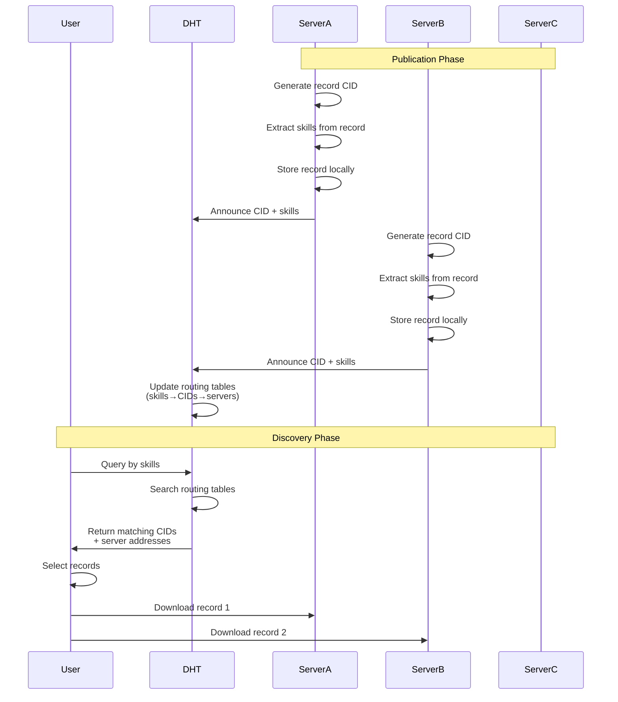

# Overview

The Agent Directory Service (ADS) is a distributed directory service designed to
store metadata for AI agent applications. This metadata, stored as directory
records, enables the discovery of agent applications with specific skills for
solving various problems.
The implementation features distributed directories that interconnect through a
content-routing protocol. This protocol maps agent skills to directory record
identifiers and maintains a list of directory servers currently hosting those
records.
Directory records are identified by globally unique names that are routable
within a DHT (Distributed Hash Table) to locate peer directory servers.
Similarly, the skill taxonomy is routable in the DHT to map skillsets to records
that announce those skills.

The Agent Directory leverages the [OASF](../oasf/open-agentic-schema-framework.md) to
describe AI agents and provides a set of APIs and tools to build, store, publish
and discover AI agents across the network by their attributes and constraints.
Directory also leverages the [CSIT](../csit/csit.md) for continuous system
integration and testing across different versions, environments, and features.

Each directory record must include skills from a defined taxonomy, as specified
in the [Taxonomy of AI Agent Skills](../oasf/taxonomy.md) from the [OASF](../oasf/open-agentic-schema-framework.md).
While all record data is modeled using the [OASF](../oasf/open-agentic-schema-framework.md), only skills are
leveraged for content routing in the distributed network of directory servers.
The ADS specification is under active development and is published as an
Internet Draft at [ADS Spec](https://spec.dir.agntcy.org). The source code is
available in the [ADS Spec sources](https://github.com/agntcy/dir-spec).
The current reference implementation, written in Go, provides server and client
nodes with gRPC and protocol buffer interfaces. The directory record storage is
built on [ORAS](https://oras.land) (OCI Registry As Storage), while data
distribution uses the [zot](https://zotregistry.dev) OCI server implementation.

## Features

ADS enables several key capabilities for the agentic AI ecosystem:

- **Capability-Based Discovery**: Agents publish structured metadata describing their
functional characteristics as described by the [OASF](../oasf/open-agentic-schema-framework.md).
The system organizes this information using hierarchical taxonomies,
enabling efficient matching of capabilities to requirements.
- **Verifiable Claims**: While agent capabilities are often subjectively evaluated,
ADS provides cryptographic mechanisms for data integrity and provenance tracking.
This allows users to make informed decisions about agent selection.
- **Semantic Linkage**: Components can be securely linked to create various relationships
like version histories for evolutionary development, collaborative partnerships where
complementary skills solve complex problems, and dependency chains for composite agent workflows.
- **Distributed Architecture**: Built on proven distributed systems principles,
ADS uses content-addressing for global uniqueness and implements distributed hash tables (DHT)
for scalable content discovery across decentralized networks.

## Naming

In distributed systems, having a reliable and collision-resistant naming scheme
is crucial. The agent directory uses cryptographic hashes to generate globally
unique identifiers for data records.
ADS leverages [Content Identifiers](https://github.com/multiformats/cid) for
naming directory records. CIDs provide a self-describing, content-addressed
naming scheme that ensures data integrity and immutability.

## Content Routing

ADS implements capability-based record discovery through a hierarchical skill
taxonomy. This architecture enables:

1. Capability Announcement:
    1. Multi-agent systems can publish their capabilities by encoding them as skill taxonomies.
    2. Each record contains metadata describing the agent's functional capabilities.
    3. Skills are structured in a hierarchical format for efficient matching.
2. Discovery Process: The system performs a two-phase discovery operation:
    1. Matches queried capabilities against the skill taxonomy to determine records by their identifier.
    2. Identifies the server nodes storing relevant records.
3. Distributed Resolution: Local nodes execute targeted retrievals based on:
    1. Skill matching results: Evaluates capability requirements.
    2. Server location information: Determines optimal data sources.

ADS uses libp2p [Kad-DHT](https://docs.libp2p.io/concepts/discovery-routing/kaddht/)
for server and content discovery.

## Distributed Object Storage

ADS differs from block storage systems like
[IPFS](https://ipfs.tech/) in its approach to distributed object storage.
The differences are described in the following sections.

### Simplified Content Retrieval

1. ADS directly stores complete records rather than splitting them into blocks.
2. No special optimizations needed for retrieving content from multiple sources.
3. Records are retrieved as complete units using standard OCI protocols.

### OCI Integration

ADS leverages the OCI distribution specification for content storage and retrieval:

1. Records are stored and transferred using OCI artifacts.
2. Any OCI distribution-compliant server can participate in the network.
3. Servers retrieve records directly from each other using standard OCI protocols.

While ADS uses [zot](https://zotregistry.dev) as its reference OCI server implementation, the system works
with any server that implements the OCI distribution specification.

## Flow Diagrams

