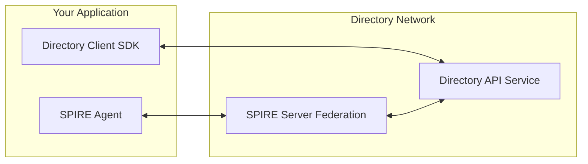

# Running a Federated Directory Instance

This guide explains how to federate your Directory instance (`partner.io`) with the public production Directory at `prod.ads.outshift.io`. The prod instance uses the `https_web` bundle endpoint profile (Let's Encrypt, standard HTTPS). Your instance must use `https_web` as well for compatibility.

Partnering with the Production Directory involves two trust domains. `partner.io` is your instance's trust domain and `prod.ads.outshift.io` is the production Directory's trust domain.

Assumptions:

- Your endpoints are publicly available: `spire.partner.io`, `oidc-discovery.spire.partner.io`, `zot.partner.io`, `api.partner.io`.
- Let's Encrypt production issuer with cert-manager is deployed in your cluster (`letsencrypt-prod` or equivalent).
- NGINX (or compatible) Ingress controller is available.

## Prerequisites

- Kubernetes cluster with an Ingress controller.
- cert-manager with a Let's Encrypt production issuer (`letsencrypt-prod` or equivalent).
- Public DNS records pointing to your Ingress (or LoadBalancer).

## Setting up the Federation

1. Deploy SPIRE with https_web federation

    SPIRE must use the `https_web` profile so it can fetch prod's bundle over standard HTTPS (Let's Encrypt). The prod federation endpoint is `https://prod.spire.ads.outshift.io`.

    ??? example "Deploy SPIRE with https_web federation"

          ```bash
          helm repo add spiffe https://spiffe.github.io/helm-charts-hardened/
          helm repo update

          helm upgrade --install --create-namespace -n spire-crds spire-crds spire-crds \
            --repo https://spiffe.github.io/helm-charts-hardened/

          helm upgrade --install -n spire spire spire \
            --repo https://spiffe.github.io/helm-charts-hardened/ \
            -f - <<'EOF'
          global:
            spire:
              trustDomain: partner.io
              clusterName: partner
              namespaces:
                create: false
              ingressControllerType: other

            installAndUpgradeHooks:
              enabled: false
            deleteHooks:
              enabled: false

          spire-server:
            federation:
              enabled: true
              tls:
                spire:
                  enabled: false
                certManager:
                  enabled: true
                  issuer:
                    create: false
                  certificate:
                    issuerRef:
                      kind: ClusterIssuer
                      name: letsencrypt-prod
              ingress:
                enabled: true
                className: nginx
                controllerType: other
                host: spire.partner.io
                tlsSecret: spire-partner-federation-cert
                annotations:
                  cert-manager.io/cluster-issuer: letsencrypt-prod
                  external-dns.alpha.kubernetes.io/hostname: spire.partner.io
                  nginx.ingress.kubernetes.io/ssl-passthrough: "false"
                  nginx.ingress.kubernetes.io/backend-protocol: "HTTPS"
                  nginx.ingress.kubernetes.io/proxy-ssl-server-name: "on"
                  nginx.ingress.kubernetes.io/proxy-ssl-name: "spire.partner.io"
                  nginx.ingress.kubernetes.io/proxy-ssl-verify: "off"
            controllerManager:
              watchClassless: true
              className: dir-spire
              identities:
                clusterFederatedTrustDomain:
                  enabled: true
                clusterSPIFFEIDs:
                  default:
                    federatesWith:
                      - prod.ads.outshift.io

          spiffe-oidc-discovery-provider:
            ingress:
              enabled: true
              className: nginx
              host: oidc-discovery.spire.partner.io
              annotations:
                cert-manager.io/cluster-issuer: letsencrypt-prod
                external-dns.alpha.kubernetes.io/hostname: oidc-discovery.spire.partner.io
            config:
              domains:
                - oidc-discovery.spire.partner.io
          EOF
          ```

    !!! note
        Adjust `letsencrypt-prod` to match your ClusterIssuer name. Use `letsencrypt` if that is your production issuer.

2. Deploy the Directory

    Deploy the Directory chart with SPIRE enabled and federation to prod. The dir chart creates `ClusterFederatedTrustDomain` resources from `apiserver.spire.federation`; the SPIRE server will fetch prod's bundle from the configured endpoint (prod uses `https_web`—standard HTTPS, no bootstrap bundle required).

    ??? example "Deploy Directory using the chart"

        ```bash
        helm install dir oci://ghcr.io/agntcy/dir/helm-charts/dir \
          --version v1.0.0 \
          --namespace dir \
          --create-namespace \
          -f - <<EOF
        apiserver:
          image:
            repository: ghcr.io/agntcy/dir-apiserver
            tag: v1.0.0
            pullPolicy: IfNotPresent
          spire:
            enabled: true
            className: dir-spire
            trustDomain: partner.io
            useCSIDriver: true
            federation:
              - className: dir-spire
                trustDomain: prod.ads.outshift.io
                bundleEndpointURL: https://prod.spire.ads.outshift.io
                bundleEndpointProfile:
                  type: https_web
          config:
            listen_address: "0.0.0.0:8888"
            oasf_api_validation:
              disable: true
            authn:
              enabled: true
              mode: "x509"
              socket_path: "unix:///run/spire/agent-sockets/api.sock"
              audiences:
                - "spiffe://partner.io/spire/server"
            authz:
              enabled: true
              enforcer_policy_file_path: "/etc/agntcy/dir/authz_policies.csv"
            store:
              provider: "oci"
              oci:
                registry_address: "dir-zot.dir.svc.cluster.local:5000"
                auth_config:
                  insecure: "true"
                  username: "admin"
                  password: "admin"
            routing:
              listen_address: "/ip4/0.0.0.0/tcp/5555"
              datastore_dir: /etc/routing/datastore
              directory_api_address: "dir-apiserver.dir.svc.cluster.local:8888"
              gossipsub:
                enabled: false
            sync:
              auth_config:
                username: "user"
                password: "user"
            database:
              type: "postgres"
              postgres:
                host: ""
                port: 5432
                database: "dir"
                ssl_mode: "disable"
          authz_policies_csv: |
            p,partner.io,*
            p,prod.ads.outshift.io,*
            p,*,/agntcy.dir.store.v1.StoreService/Pull
            p,*,/agntcy.dir.store.v1.StoreService/PullReferrer
            p,*,/agntcy.dir.store.v1.StoreService/Lookup
            p,*,/agntcy.dir.store.v1.SyncService/RequestRegistryCredentials
          secrets:
            ociAuth:
              username: "admin"
              password: "admin"
          postgresql:
            enabled: true
            auth:
              username: "dir"
              password: "dir"
              database: "dir"
          strategy:
            type: Recreate
          ingress:
            enabled: true
            className: nginx
            annotations:
              nginx.ingress.kubernetes.io/ssl-passthrough: "true"
              nginx.ingress.kubernetes.io/backend-protocol: "GRPCS"
              cert-manager.io/cluster-issuer: letsencrypt-prod
              external-dns.alpha.kubernetes.io/hostname: api.partner.io
            hosts:
              - host: api.partner.io
                http:
                  paths:
                    - path: /
                      pathType: ImplementationSpecific
                      backend:
                        service:
                          name: dir-apiserver
                          port:
                            number: 8888
            tls:
              - hosts:
                  - api.partner.io
        zot:
          mountSecret: true
          authHeader: "admin:admin"
          secretFiles:
            htpasswd: |-
              admin:\$2y\$05\$vmiurPmJvHylk78HHFWuruFFVePlit9rZWGA/FbZfTEmNRneGJtha
              user:\$2y\$05\$L86zqQDfH5y445dcMlwu6uHv.oXFgT6AiJCwpv3ehr7idc0rI3S2G
          mountConfig: true
          configFiles:
            config.json: |-
              {
                "distSpecVersion": "1.1.1",
                "storage": {"rootDirectory": "/var/lib/registry"},
                "http": {
                  "address": "0.0.0.0",
                  "port": "5000",
                  "auth": {"htpasswd": {"path": "/secret/htpasswd"}},
                  "accessControl": {
                    "adminPolicy": {"users": ["admin"], "actions": ["read", "create", "update", "delete"]},
                    "repositories": {"**": {"anonymousPolicy": [], "defaultPolicy": ["read"]}}
                  }
                },
                "log": {"level": "info"},
                "extensions": {"search": {"enable": true}, "trust": {"enable": true, "cosign": true, "notation": false}}
              }
          ingress:
            enabled: true
            className: nginx
            hosts:
              - host: zot.partner.io
                paths:
                  - path: /
                    pathType: ImplementationSpecific
            tls:
              - secretName: zot-partner-tls
                hosts:
                  - zot.partner.io
            annotations:
              cert-manager.io/cluster-issuer: letsencrypt-prod
              external-dns.alpha.kubernetes.io/hostname: zot.partner.io
        EOF
        ```

    !!! note
        The ingress structure may vary by chart version. Adjust service names (e.g. `dir-apiserver`) to match your chart's defaults.

3. Verify federation

    ```bash
    # On your cluster – prod's bundle should appear in SPIRE
    kubectl exec -n spire spire-server-0 -c spire-server -- \
      spire-server bundle list -id spiffe://prod.ads.outshift.io -format spiffe
    ```

    The prod's trust bundle is listed. If the bundle is missing, check that `ClusterFederatedTrustDomain` for prod exists and that the SPIRE server can reach `https://prod.spire.ads.outshift.io`.

4. Contribute to `dir-staging` for prod federation

    For prod to accept connections from your instance, prod's API server must have your trust domain (`partner.io`) in its federation and authorization policies. The prod deployment reads federation config from [dir-staging/onboarding/federation/](https://github.com/agntcy/dir-staging/tree/main/onboarding/federation/). Each YAML file there becomes a federated trust domain.

    To contribute to `dir-staging`:

    1. Fork or clone [agntcy/dir-staging](https://github.com/agntcy/dir-staging).
    2. Create `onboarding/federation/partner.io.yaml` with the following content:

        ```yaml
        # dir-staging/onboarding/federation/partner.io.yaml
        className: dir-spire
        trustDomain: partner.io
        bundleEndpointURL: https://spire.partner.io
        bundleEndpointProfile:
          type: https_web
        ```

    3. Open a pull request to the `dir-staging` repository.
    4. Once merged, the prod maintainers regenerate prod's deployment config to add `partner.io` to prod's `apiserver.spire.federation`.
    5. Prod's authz policies must also allow `partner.io`. A `p,partner.io,*` entry (or per-method rules like `p,*,/agntcy...`) is needed in the authz policy file. This is typically added when the federation PR is processed.

    Once your PR is merged, prod fetches your bundle from `https://spire.partner.io` and accepts X.509-SVIDs from `partner.io` workloads. Dir-to-dir federation (sync, API calls between instances) now works between your Directory and prod.

## Architecture



## Use Cases

See [Features and Usage Scenarios](scenarios.md) for sample applications and workflows.

## Next Steps

- Publish agents: Use `dirctl push` or the SDK to publish records to the public Directory.
- Deploy your own instance: See [Production Deployment](prod-deployment.md) for AWS EKS and federation.
- Explore scenarios: [Features and Usage Scenarios](scenarios.md) for build, store, sign, discover, and search workflows.
- Federation issues: See [Federation Best Practices and Troubleshooting](federation-troubleshooting.md) for operational guidance and common errors.
