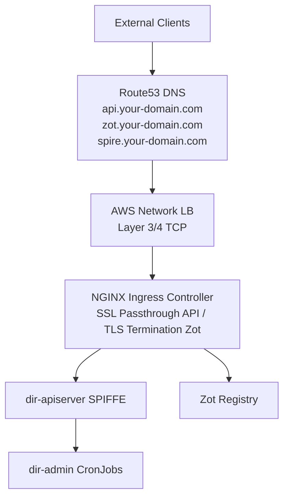

# Production Deployment

This guide documents production deployment of Directory on AWS EKS. For local development and testing with Kind, see [Getting Started](getting-started.md). For connecting to the public Directory network or federating your instance, see [Connect to the Public Directory](federation.md).

!!! important "Trust Domain Selection"
    Choose your **trust domain** carefully before deployment—it cannot be changed later. A trust domain is a permanent identifier for your SPIRE deployment (e.g., `acme.com`, `engineering.acme.com`).

    **Requirements:**
    - Must be globally unique
    - Cannot be changed after deployment
    - Does not need to be a real DNS domain (but can be)
    - Will be visible to federation partners

## Overview

Production deployment uses:

- **Platform:** AWS EKS (Elastic Kubernetes Service)
- **Ingress:** NGINX Ingress Controller with SSL passthrough
- **Identity:** SPIFFE/SPIRE for zero-trust authentication
- **Storage:** Zot OCI Registry with persistent volumes
- **GitOps:** ArgoCD for deployment management

## Architecture



## Prerequisites

### Infrastructure

- **AWS EKS Cluster** – Kubernetes 1.31+
- **NGINX Ingress Controller** with `--enable-ssl-passthrough=true`
- **SPIRE** – SPIFFE Runtime Environment
- **ExternalDNS** – Automatic DNS management (Route53)
- **cert-manager** – TLS certificate management
- **External Secrets Operator** – Vault integration
- **ArgoCD** – GitOps deployment

### Network

- **Route53 Hosted Zone** – For your domains (e.g., `*.your-domain.com`)
- **AWS Network Load Balancer** – Layer 3/4 TCP passthrough
- **Security Groups** – Allow cluster NAT Gateway IP for ingress

### Storage

- **EBS CSI Driver** – For persistent volumes
- **Storage Class** – `ebs-sc-encrypted` for production
- **Vault** – For credential storage

## Local vs Production

| Feature | Local (Kind) | Production (EKS) |
|---------|--------------|------------------|
| **Cluster** | Kind | AWS EKS |
| **SPIFFE CSI Driver** | ✅ Enabled | ✅ Enabled |
| **Storage** | emptyDir (ephemeral) | PVCs (persistent) |
| **Credentials** | Hardcoded in values | ExternalSecrets + Vault |
| **Resources** | 250m/512Mi | 500m–2000m / 1–4Gi |
| **Ingress** | NodePort, port-forward | Ingress + TLS |
| **Rate Limits** | 50 RPS | 500+ RPS |
| **Trust Domain** | example.org (local only) | your-domain.com |

## Key Production Features

### SPIFFE CSI Driver

Enabled via `spire.useCSIDriver: true` (v1.0.0-rc.4+):

- Synchronous workload identity injection before pod start
- Eliminates "certificate contains no URI SAN" errors
- Required for CronJobs and short-lived workloads

### Persistent Storage

- Enable PVCs for routing datastore and database
- Use `strategy.type: Recreate` to prevent database lock conflicts
- Production example: 20Gi routing, 5Gi database, 100Gi Zot

### Secure Credential Management

- Use External Secrets Operator with Vault
- See [External Secrets Operator documentation](https://external-secrets.io/latest/)

### SSL Passthrough for DIR API

The Directory API uses SPIFFE mTLS. Ingress must:

1. **Not** terminate TLS
2. Pass encrypted traffic to the backend
3. Route based on SNI

**Ingress configuration:**

```yaml
annotations:
  nginx.ingress.kubernetes.io/ssl-passthrough: "true"
  nginx.ingress.kubernetes.io/backend-protocol: "GRPCS"
  nginx.ingress.kubernetes.io/force-ssl-redirect: "true"

tls:
  - hosts:
      - api.your-domain.com
    # NO secretName - required for SSL passthrough!
```

**NGINX Ingress Controller** must have `--enable-ssl-passthrough=true`.

## DNS Hostnames

Create DNS records for your domain. Example with `your-domain.com`:

| Service | Hostname |
|---------|----------|
| **Directory API** | api.your-domain.com |
| **Zot Registry** | zot.your-domain.com |
| **SPIRE Federation** | spire.your-domain.com |
| **SPIRE OIDC** | oidc-discovery.spire.your-domain.com |

## Verification

### SSL Passthrough

```bash
# Should show SPIFFE certificate, not "ingress.local"
echo | openssl s_client -connect api.your-domain.com:443 \
  -servername api.your-domain.com 2>/dev/null | \
  openssl x509 -noout -subject

# Expected: C=US, O=SPIRE, CN=api.your-domain.com (or your trust domain)
```

### SPIFFE Authentication

```bash
kubectl logs -n <your-dir-namespace> -l app.kubernetes.io/name=apiserver | \
  grep "Successfully obtained valid X509-SVID"
```

### CronJobs

```bash
kubectl get pods -n <your-dir-admin-namespace> --sort-by=.metadata.creationTimestamp | tail -10
```

## Troubleshooting

### "certificate contains no URI SAN"

- Verify SSL passthrough is working (certificate test above)
- Ensure `useCSIDriver: true` in values
- Check SPIRE entry has synced

### "certificate is valid for ingress.local"

- DNS may point to wrong LoadBalancer
- Ensure Ingress TLS section has `hosts` but **no** `secretName`
- Verify NGINX has `--enable-ssl-passthrough=true`

### ConfigMap Changes Not Taking Effect

ConfigMaps are mounted at pod creation. Restart the deployment:

```bash
kubectl rollout restart deployment/<your-apiserver-deployment> -n <your-dir-namespace>
```

## Reference

- **[dir-staging](https://github.com/agntcy/dir-staging)** – Example deployment with ArgoCD and SPIRE (uses `prod.*.ads.outshift.io` for the public Directory)
- **[Connect to the Public Directory](federation.md)** – Federation setup for connecting to the public network
- **[Federation Profiles](federation-profiles.md)** – Profile comparison and configuration
