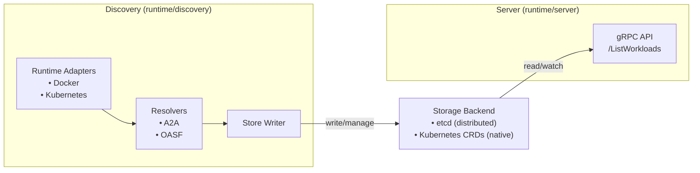
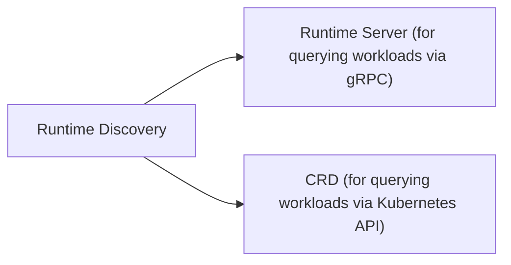

# Runtime Discovery

Runtime Discovery is a service that watches container runtimes (Docker, Kubernetes) for workloads and provides a gRPC API for querying them.
In addition, it also resolves workloads using various resolvers (A2A, OASF) to extract and provide details about the workload's capabilities.

## Architecture

The system is split into two independent components:



## Components

### Discovery (`runtime/discovery/`)

The discovery component is responsible for:

- Watching runtimes for workloads with the `org.agntcy/discover=true` label. Supported runtimes:

    - Docker: Watches Docker daemon for labeled containers.
    - Kubernetes: Watches Kubernetes API for labeled pods/services.
    - Extensible architecture allows adding more runtimes in the future.

- Resolving workload metadata using configurable resolvers:

    - A2A resolver: Extracts A2A agent card from workloads with `org.agntcy/agent-type=a2a` label.
    - OASF resolver: Resolves OASF records from Directory for workloads with `org.agntcy/agent-record=<fqdn>` label.
    - Extensible architecture allows adding more resolvers in the future.

- Writing workloads to the storage backend (etcd or CRDs).

The storage backend can be used to expose discovered workloads to other components (e.g., clients/servers) without coupling them directly and to reduce attack surface.

In non-Kubernetes environments, [etcd](https://etcd.io/) is recommended as the storage backend for better portability.
In Kubernetes environments, CRDs can be used for a more native experience to ensure clients can access workloads via the Kubernetes API.



### Server (`runtime/server/`)

The server component provides a gRPC API for querying discovered workloads.

## Example Setup

### Build Container Images

```bash
IMAGE_TAG=latest task build
```

### Docker Compose

```bash
# Deploy the stack
docker compose -f runtime/install/docker/docker-compose.yml up -d

# Deploy example workloads
docker compose -f runtime/install/examples/docker-compose.yml up -d

# Add discovery to all networks (required for resolvers to work)
docker network connect examples_team-a runtime-discovery
docker network connect examples_team-b runtime-discovery
docker restart runtime-discovery

# Query the API
grpcurl -plaintext localhost:8080 agntcy.dir.runtime.v1.DiscoveryService/ListWorkloads

# Cleanup
docker compose -f runtime/install/docker/docker-compose.yml down
docker compose -f runtime/install/examples/docker-compose.yml down
```

### Kubernetes

The Helm chart supports both CRD and etcd storage backends.

#### Setup KIND Cluster

```bash
# Create cluster
kind create cluster --name runtime

# Load images into KIND
kind load docker-image ghcr.io/agntcy/dir-runtime-discovery:latest --name runtime
kind load docker-image ghcr.io/agntcy/dir-runtime-server:latest --name runtime
```

#### Deploy Example Workloads

```bash
kubectl apply -f runtime/install/examples/k8s.workloads.yaml
```

#### Deploy with CRD Storage

```bash
# Install the chart with CRD storage (default)
helm install runtime runtime/install/chart/

# Wait for pods
kubectl wait --for=condition=ready pod -l app.kubernetes.io/component=discovery --timeout=60s
kubectl wait --for=condition=ready pod -l app.kubernetes.io/component=server --timeout=60s

# Query the gRPC API
kubectl port-forward svc/runtime-server 8080:8080 &
grpcurl -plaintext localhost:8080 agntcy.dir.runtime.v1.DiscoveryService/ListWorkloads

# Query the Kubernetes API to see discovered workloads
kubectl get dw
```

#### Deploy with etcd Storage

```bash
# Install the chart with etcd storage
helm install runtime runtime/install/chart/ \
  --set etcd.enabled=true \
  --set discovery.config.store.type=etcd \
  --set server.config.store.type=etcd

# Wait for pods
kubectl wait --for=condition=ready pod -l app.kubernetes.io/component=etcd --timeout=60s
kubectl wait --for=condition=ready pod -l app.kubernetes.io/component=discovery --timeout=60s
kubectl wait --for=condition=ready pod -l app.kubernetes.io/component=server --timeout=60s

# Query the gRPC API
kubectl port-forward svc/runtime-server 8080:8080 &
grpcurl -plaintext localhost:8080 agntcy.dir.runtime.v1.DiscoveryService/ListWorkloads
```

#### Cleanup

```bash
kind delete cluster --name runtime
```

## Workload Labels

Workloads are discovered based on labels. The discovery component watches for workloads with specific labels and processes their metadata.

### Discovery Labels

| Label | Runtime | Description |
|-------|---------|-------------|
| `org.agntcy/discover=true` | Kubernetes | Marks a pod/service for discovery |
| `org.agntcy/discover=true` | Docker | Marks a container for discovery |

### Resolver Labels

Resolvers extract metadata from discovered workloads based on their labels.
They provide additional information about the workload's capabilities.

| Label/Annotation | Description |
|------------------|-------------|
| `org.agntcy/agent-type=a2a` | Enables A2A resolver - fetches A2A agent card from workload |
| `org.agntcy/agent-record=<fqdn>` | Enables OASF resolver - resolves record from Directory (e.g., `my-agent:v1.0.0`) |

To configure OASF resolver, the Directory client must be set up using environment variables (e.g., `DIRECTORY_CLIENT_SERVER_ADDRESS`, `DIRECTORY_CLIENT_AUTH_MODE`).

### Workload Services

Discovered workloads have a `services` field that holds metadata extracted by resolvers:

```json
{
  "id": "4467371c-84fd-4683-ab30-93895d78bab7",
  "name": "service-a2a",
  "hostname": "service-a2a",
  "runtime": "kubernetes",
  "type": "pod",
  "labels": {
    "app": "service-a2a",
    "org.agntcy/discover": "true",
    "org.agntcy/agent-type": "a2a",
    "org.agntcy/agent-record": "my-agent:1.0.0"
  },
  "addresses": [
    "10-244-0-9.team-a.pod"
  ],
  "ports": [
    "8080",
    "9999"
  ],
  "isolationGroups": [
    "team-a"
  ],
  "services": {
    "a2a": {
      "name": "My Agent",
      "description": "...",
      "capabilities": [...]
    },
    "oasf": {
      "cid": "baf123",
      "name": "my-agent:1.0.0",
      "record": {
        "name": "my-agent",
        "version": "1.0.0",
        "skills": [...]
      }
    }
  }
}
```

## Configuration

### Discovery Component

| Environment Variable | Description | Default |
|---------------------|-------------|---------|
| `DISCOVERY_WORKERS` | Number of resolver workers | `16` |
| `DISCOVERY_STORE_TYPE` | Storage type (`etcd`, `crd`) | `etcd` |
| `DISCOVERY_STORE_ETCD_HOST` | etcd server hostname | `localhost` |
| `DISCOVERY_STORE_ETCD_PORT` | etcd server port | `2379` |
| `DISCOVERY_STORE_ETCD_USERNAME` | etcd username for authentication | `` |
| `DISCOVERY_STORE_ETCD_PASSWORD` | etcd password for authentication | `` |
| `DISCOVERY_STORE_ETCD_DIAL_TIMEOUT` | Timeout for connecting to etcd | `5s` |
| `DISCOVERY_STORE_ETCD_WORKLOADS_PREFIX` | etcd key prefix for workloads | `/discovery/workloads/` |
| `DISCOVERY_STORE_CRD_NAMESPACE` | Namespace to store workloads in | `default` |
| `DISCOVERY_STORE_CRD_KUBECONFIG` | Path to kubeconfig file (empty for in-cluster) | `` |
| `DISCOVERY_STORE_CRD_RESYNC_PERIOD` | How often to resync the cache from the API server | `30s` |
| `DISCOVERY_RUNTIME_TYPE` | Runtime type (`docker`, `kubernetes`) | `docker` |
| `DISCOVERY_RUNTIME_DOCKER_HOST` | Docker daemon socket path | `unix:///var/run/docker.sock` |
| `DISCOVERY_RUNTIME_DOCKER_LABEL_KEY` | Label key to filter containers | `org.agntcy/discover` |
| `DISCOVERY_RUNTIME_DOCKER_LABEL_VALUE` | Label value to filter containers | `true` |
| `DISCOVERY_RUNTIME_KUBERNETES_KUBECONFIG` | Path to kubeconfig file (empty for in-cluster) | `` |
| `DISCOVERY_RUNTIME_KUBERNETES_NAMESPACE` | Namespace to watch (empty for all namespaces) | `` |
| `DISCOVERY_RUNTIME_KUBERNETES_LABEL_KEY` | Label key to filter pods | `org.agntcy/discover` |
| `DISCOVERY_RUNTIME_KUBERNETES_LABEL_VALUE` | Label value to filter pods | `true` |
| `DISCOVERY_RESOLVER_A2A_ENABLED` | Enable A2A resolver | `true` |
| `DISCOVERY_RESOLVER_A2A_TIMEOUT` | Timeout for A2A discovery | `5s` |
| `DISCOVERY_RESOLVER_A2A_PATHS` | Comma-separated list of paths to probe for A2A discovery | `/.well-known/agent-card.json,/.well-known/card.json` |
| `DISCOVERY_RESOLVER_A2A_LABEL_KEY` | Label key to identify A2A workloads | `org.agntcy/agent-type` |
| `DISCOVERY_RESOLVER_A2A_LABEL_VALUE` | Label value to identify A2A workloads | `a2a` |
| `DISCOVERY_RESOLVER_OASF_ENABLED` | Enable OASF resolver | `true` |
| `DISCOVERY_RESOLVER_OASF_TIMEOUT` | Timeout for OASF resolution | `5s` |
| `DISCOVERY_RESOLVER_OASF_LABEL_KEY` | Label key to identify OASF workloads | `org.agntcy/agent-record` |

#### Discovery OASF Resolver

The OASF resolver requires Directory client configuration via environment variables.
These are the same as those used by the Directory client library, e.g. `DIRECTORY_CLIENT_SERVER_ADDRESS`.
Refer to the [Directory Go SDK](./directory-sdk.md#go-sdk) for all available options.

When a workload has the configured OASF resolver label, the resolver attempts to fetch the corresponding record from Directory and validate its signature before attaching it to the workload.

### Server Component

| Environment Variable | Description | Default |
|---------------------|-------------|---------|
| `SERVER_HOST` | Server bind address | `0.0.0.0` |
| `SERVER_PORT` | Server listen port | `8080` |
| `SERVER_STORE_TYPE` | Storage type (`etcd`, `crd`) | `etcd` |
| `SERVER_STORE_ETCD_HOST` | etcd server hostname | `localhost` |
| `SERVER_STORE_ETCD_PORT` | etcd server port | `2379` |
| `SERVER_STORE_ETCD_USERNAME` | etcd username for authentication | `` |
| `SERVER_STORE_ETCD_PASSWORD` | etcd password for authentication | `` |
| `SERVER_STORE_ETCD_DIAL_TIMEOUT` | Timeout for connecting to etcd | `5s` |
| `SERVER_STORE_ETCD_WORKLOADS_PREFIX` | etcd key prefix for workloads | `/discovery/workloads/` |
| `SERVER_STORE_CRD_NAMESPACE` | Namespace to read workloads from | `default` |
| `SERVER_STORE_CRD_KUBECONFIG` | Path to kubeconfig file (empty for in-cluster) | `` |
| `SERVER_STORE_CRD_RESYNC_PERIOD` | How often to resync the cache from the API server | `30s` |


## gRPC API

The server exposes a gRPC API defined in `proto/agntcy/dir/runtime/v1/discovery_service.proto`.

### GetWorkload

Get a specific workload by ID, name, or hostname.

```bash
grpcurl -plaintext -d '{"id": "my-service"}' \
  localhost:8080 agntcy.dir.runtime.v1.DiscoveryService/GetWorkload
```

### ListWorkloads

Stream all workloads with optional label filters. Labels support regex patterns.

```bash
# List all workloads
grpcurl -plaintext -d '{}' \
  localhost:8080 agntcy.dir.runtime.v1.DiscoveryService/ListWorkloads

# Filter by labels (supports regex)
grpcurl -plaintext -d '{"labels": {"org.agntcy/agent-type": "a2a"}}' \
  localhost:8080 agntcy.dir.runtime.v1.DiscoveryService/ListWorkloads
```
