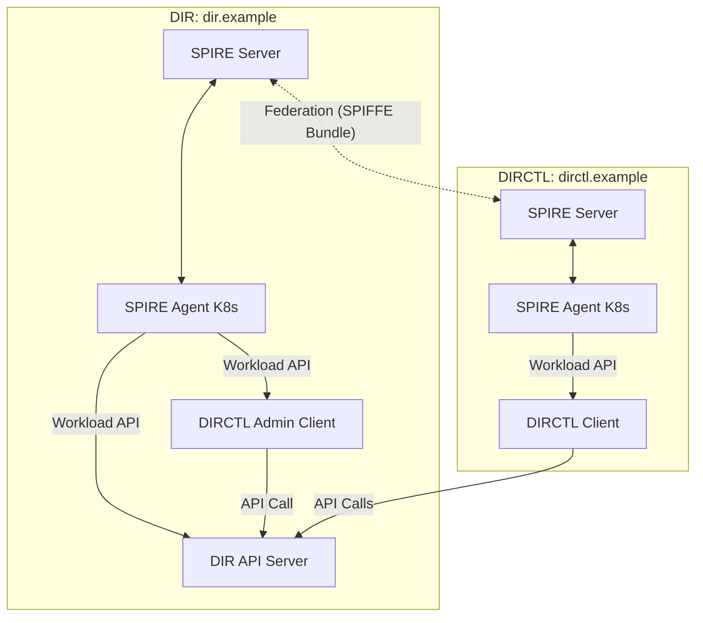

# Directory Security Trust Schema

## Overview

Directory is a system designed to provide secure, authenticated, and authorized access to services and resources across multiple environments and organizations. It leverages [SPIRE](https://spiffe.io/) (SPIFFE Runtime Environment) to manage workload identities and enable zero-trust security principles.

SPIRE is an open-source system that provides automated, cryptographically secure identities to workloads in modern infrastructure. It implements the SPIFFE (Secure Production Identity Framework For Everyone) standard, enabling zero-trust security by assigning each workload a unique, verifiable identity (SVID).

In the Directory project, SPIRE is used to:

- Securely identify and authenticate workloads (services, applications, etc.)
- Enable mutual TLS (mTLS) between services
- Support dynamic, scalable, and multi-environment deployments
- Enable interconnectivity between different organizations
- Provide primitives for authorization logic

## Authentication and Authorization

### Authentication

SPIRE provides strong, cryptographically verifiable identities (SPIFFE IDs) to every
workload. These identities are used for:

- **Workload Authentication:** Every service, whether running in Kubernetes, on a VM, or on bare metal, receives a unique SPIFFE ID (e.g., `spiffe://dir.example/ns/default/sa/my-service`).
- **Cross-Organization Authentication:** Through federation, workloads from different organizations or clusters can mutually authenticate using their SPIFFE IDs, without the need to implement custom cross-org authentication logic.
- **Mutual TLS (mTLS):** SPIRE issues SVIDs (X.509 certificates) that are used to establish mTLS connections, ensuring both parties are authenticated and communication is encrypted.

**What problem does SPIRE solve?**

- Eliminates the need to build and maintain custom authentication systems for each environment or organization.
- Provides a standard, interoperable identity for every workload, regardless of where it runs.
- Enables secure, automated trust establishment between independent organizations or clusters.

#### How Directory uses SPIRE for Authentication

- **Workload Identity:** Each Directory component (API server, clients, etc.) is assigned a SPIFFE ID based on its SPIRE Agent configuration.
- **Cross-Organization Authentication:** Directory can authenticate workloads from other organizations or clusters using their SPIFFE IDs, enabling secure communication without custom integration.
- **Secure Communication:** Directory can establish mTLS connections between components using the SVIDs issued by SPIRE, ensuring secure and authenticated communication.

### Authorization

SPIRE itself does not enforce authorization, but it enables fine-grained authorization by providing strong workload identities:

- **Policy-Based Access Control:** Applications and infrastructure can use SPIFFE IDs to define and enforce access policies (e.g., only workloads with a specific SPIFFE ID can access a sensitive API).
- **Attribute-Based Authorization:** SPIFFE IDs can encode attributes (namespace, service account, environment) that can be used in authorization decisions.
- **Cross-Domain Authorization:** Because SPIRE federates trust domains, authorization policies can include or exclude identities from other organizations or clusters, enabling secure collaboration without manual certificate management.

**What problem does SPIRE solve?**

- Enables authorization decisions based on workload identity, not just network location or static credentials.
- Simplifies policy management by using a standard identity format (SPIFFE ID) across all environments.
- Makes it possible to securely authorize workloads from federated domains (e.g., partner organizations, multi-cloud, hybrid setups) without custom integration.

#### How Directory uses SPIRE for Authorization

- **Policy Enforcement:** Directory components can enforce access control policies based on the SPIFFE IDs of incoming requests, ensuring that only authorized workloads can access specific services or APIs.
- **Access Control:** Directory can leverage attributes encoded in SPIFFE IDs to implement fine-grained access control policies.
- **Federated Authorization:** Directory can use SPIFFE IDs to authorize workloads from other organizations or clusters, enabling secure collaboration without custom integration.

Currently, Directory implements static authorization policies based on SPIFFE IDs, with plans to enhance this with dynamic, attribute-based policies in future releases. The Authorization policies are enforced based on external trust domains in the following manner:

| API Method                        | Authorized Trust Domains                    |
| --------------------------------- | ------------------------------------------- |
| `*`                               | Your own trust domain (e.g., `dir.example`) |
| `Store.Pull`                      | External Trust domain                       |
| `Store.Lookup`                    | External Trust domain                       |
| `Store.PullReferrer`              | External Trust domain                       |
| `Sync.RequestRegistryCredentials` | External Trust domain                       |

## Topology

The Directory's security trust schema supports both single and federated trust domain topology setup, with SPIRE deployed across various environments:

### Single Trust Domain

- **SPIRE Server**: Central authority for the trust domain
- **SPIRE Agents**: Deployed in different environments, connect to the SPIRE Server

    - Kubernetes clusters (as DaemonSets or sidecars)
    - VMs (as systemd services or processes)
    - Bare metal

- **Workloads**: Obtain identities from local SPIRE Agent via the Workload API


### Federated Trust Domains

- Each environment (e.g., cluster, organization) runs its own SPIRE Server and agents
- SPIRE Servers exchange bundles to establish federation
- Enables secure, authenticated communication between workloads in different domains


## Deployment

### SPIRE Server

- Deployed as a Kubernetes service or as a standalone service.
- Configured with a unique trust domain name (e.g., `dir.example`).
- Federation enabled to allow cross-domain trust.
- Exposes a bundle endpoint for federation.

```bash
export TRUST_DOMAIN="my-service.local"

helm repo add spiffe https://spiffe.github.io/helm-charts-hardened

helm upgrade spire-crds spire-crds \
    --repo https://spiffe.github.io/helm-charts-hardened/ \
    --create-namespace -n spire-crds \
    --install \
    --wait \
    --wait-for-jobs \
    --timeout "15m"

helm upgrade spire spire \
    --repo https://spiffe.github.io/helm-charts-hardened/ \
    --set global.spire.trustDomain="$TRUST_DOMAIN" \
    --set spire-server.federation.enabled="true" \
    --set spire-server.controllerManager.watchClassless="true" \
    --namespace spire \
    --create-namespace \
    --install \
    --wait \
    --wait-for-jobs \
    --timeout "15m"
```

### SPIRE Agent

- Deployed as DaemonSets in Kubernetes or as services on VMs/bare metal.
- Connect to the SPIRE Server to obtain workload identities.
- Attest workloads and provide SVIDs via the Workload API.

### Directory

Directory components can be deployed in the trust domain and configured to use SPIRE with or without federation:

```yaml
# Example Directory Server configuration to use SPIRE
dir:
  apiserver:
    spire:
      enabled: true
      trustDomain: ${SERVER_TRUST_DOMAIN}
      federation:
        - trustDomain: ${CLIENT_TRUST_DOMAIN}
          bundleEndpointURL: https://${CLIENT_BUNDLE_ADDRESS}
          bundleEndpointProfile:
            type: https_spiffe
            endpointSPIFFEID: spiffe://${CLIENT_TRUST_DOMAIN}/spire/server
          trustDomainBundle: |
            ${CLIENT_BUNDLE_CONTENT}

# Example Directory Client configuration to use SPIRE
dirctl:
  spire:
    enabled: true
    trustDomain: ${CLIENT_TRUST_DOMAIN}
```

## Test Example

A test setup can be created using [Kubernetes Kind](https://kind.sigs.k8s.io/) clusters to simulate Federation setup with Authentication and Authorization:

- Two Kubernetes Kind clusters (one for each trust domain).
- SPIRE Servers and Agents deployed in each cluster.
- Federation is established between the clusters.
- Directory services are deployed and communicate securely using SPIFFE identities.



**Deployment Tasks:**

```bash
sudo task test:spire      # Deploys the full federation setup
task test:spire:cleanup   # Cleans up the test environment
```

---

For more details, see the [SPIRE Documentation](https://spiffe.io/docs/latest/spiffe-about/overview/) and [SPIRE Federation Guide](https://spiffe.io/docs/latest/spire-helm-charts-hardened-advanced/federation/).
