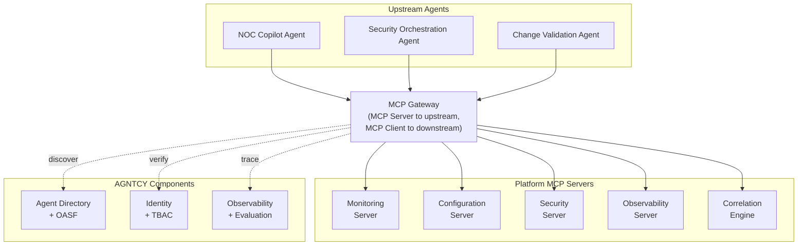
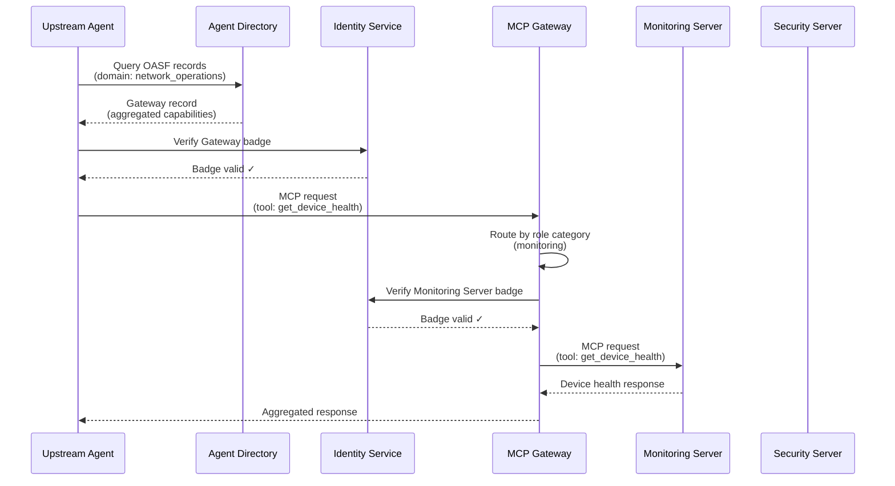
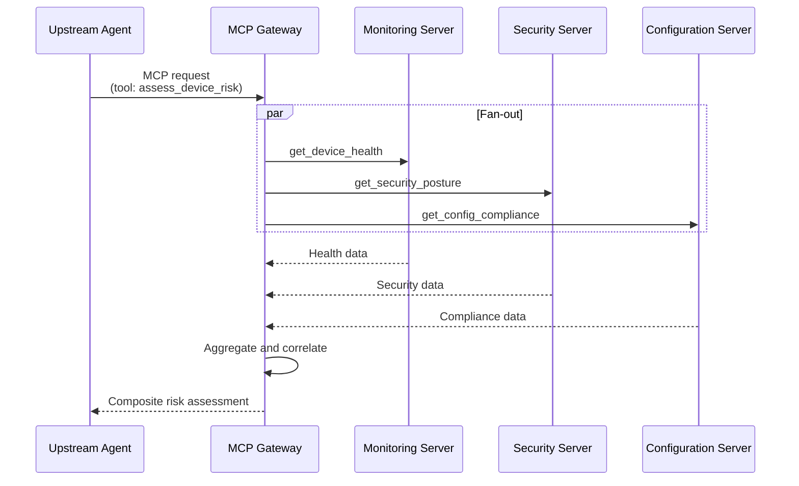
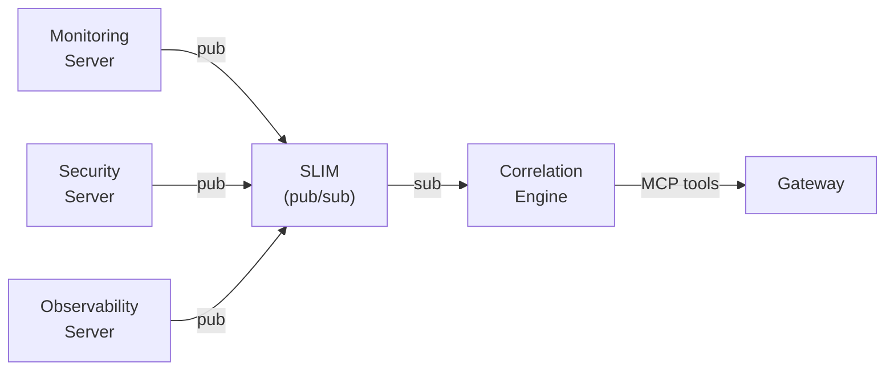
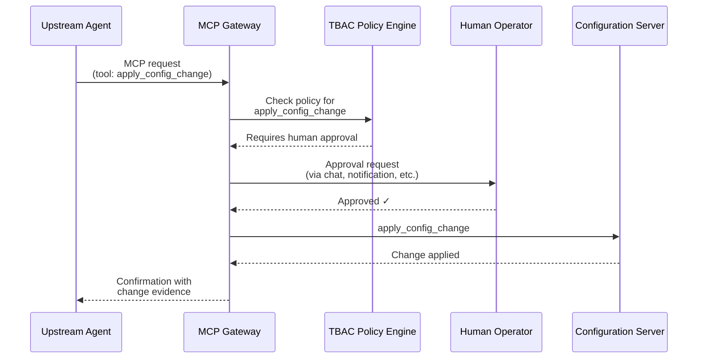
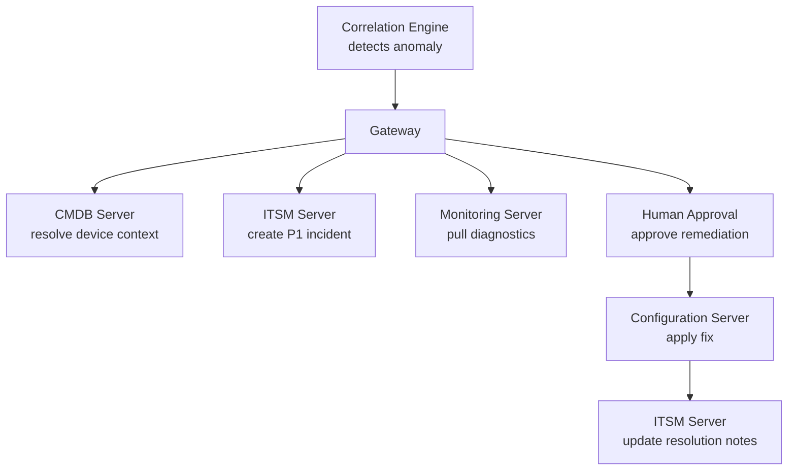
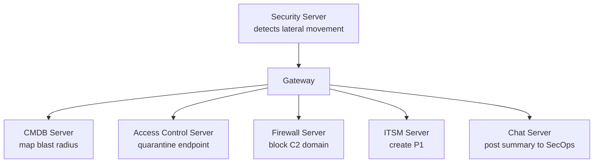
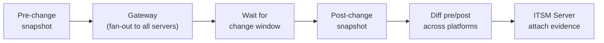

# Gateway Pattern for Multi-Platform MCP Aggregation

## Overview

The Gateway Pattern describes an architectural approach for aggregating multiple
MCP servers behind a single entry point, enabling upstream agents to interact
with heterogeneous platforms through a unified discovery and routing layer. The
gateway acts as an MCP server to upstream consumers and an MCP client to each
downstream platform server, providing capability-based routing, cross-platform
correlation, and human-in-the-loop approval workflows.

This pattern addresses a gap in current MCP deployments: while individual MCP
servers expose tools for single platforms, enterprise environments typically
operate dozens of platforms that must be queried, correlated, and acted upon
together. The Gateway Pattern composes AGNTCY's core components - Agent
Directory, OASF, Identity, SLIM, and Observability - to solve this at scale.

[MIGA MCP Gateway](https://github.com/keewillidevnet/miga-mcp-gateway) is a
reference implementation of this pattern, aggregating 15 Cisco infrastructure
platforms behind a single MCP gateway with a correlation engine and
conversational interface.

## Architecture

The gateway sits between upstream agents and downstream platform MCP servers.
Each platform gets its own dedicated MCP server process with independent
credentials, failure domains, and OASF records. The gateway discovers all
registered servers via the Agent Directory and routes requests by role category.



### Key Properties

The gateway pattern has the following characteristics:

- **Fan-out**: A single upstream request may invoke tools on multiple downstream
  servers. The gateway handles parallel dispatch and response aggregation.
- **Role-based routing**: Each downstream server registers with role categories
  (monitoring, configuration, security, observability, automation, compliance).
  The gateway routes based on role rather than server name, enabling
  substitution and extension without upstream changes.
- **Independent failure domains**: Each platform server is a separate process.
  A single server failure degrades capability without taking down the gateway.
  The gateway reports degraded status through the Observability stack.
- **Independent credentials**: Each server holds its own platform API
  credentials and its own Agent Badge. No shared secrets across servers.

## AGNTCY Component Mapping

The Gateway Pattern builds on existing AGNTCY components rather than introducing
new protocols. The table below shows how each gateway capability maps to an
AGNTCY component.

| Gateway Capability | AGNTCY Component | How It Is Used |
|---|---|---|
| Server discovery | Agent Directory + OASF | Each platform server registers an OASF record with role categories and tool lists. The gateway queries the Directory at startup and on schedule to discover available servers. |
| Identity verification | Identity + Verifiable Credentials | Each server holds an MCP Server Badge (W3C VC) with a DataIntegrityProof signed by the operating organization. The gateway verifies badges before routing requests. |
| Access control | TBAC | Policies define which upstream agents can invoke which tools on which downstream servers. Read-only agents cannot call configuration endpoints. |
| Cross-server messaging | SLIM | Platform servers publish telemetry events over SLIM (pub/sub). The correlation engine subscribes to all streams and fuses events across platforms. |
| Observability | Observability + Evaluation | Gateway and all platform servers export OpenTelemetry traces. Cross-platform request chains are correlated via trace context propagation through the gateway. |
| Agent descriptions | OASF | The gateway itself registers an OASF record that aggregates the capabilities of all downstream servers, presenting a unified skill and domain set to upstream consumers. |

## OASF Records

Each component in the gateway pattern registers an OASF record. Below are
example records showing how the gateway and a platform server describe
themselves.

### Platform Server Record

A platform server record describes a single-platform MCP server with its
specific role categories and tools.

```json
{
  "name": "Monitoring Platform MCP Server",
  "description": "MCP server providing device health, interface statistics, and alert retrieval for a network monitoring platform.",
  "version": "1.0.0",
  "schema_version": "1.0.0",
  "authors": ["Network Operations <netops@example.com>"],
  "created_at": "2025-08-01T00:00:00Z",
  "domains": [
    {"name": "technology/network_operations", "id": 1510}
  ],
  "skills": [
    {"name": "data_retrieval/api_querying", "id": 601},
    {"name": "data_retrieval/data_aggregation", "id": 602}
  ],
  "modules": [],
  "locators": [
    {"type": "source_code", "urls": ["https://github.com/example/monitoring-mcp-server"]}
  ]
}
```

### Gateway Record

The gateway record aggregates the domains and skills of all downstream servers,
giving upstream agents a single point of discovery.

```json
{
  "name": "Multi-Platform MCP Gateway",
  "description": "MCP gateway aggregating monitoring, configuration, security, and observability platform servers with capability-based routing and cross-platform correlation.",
  "version": "1.0.0",
  "schema_version": "1.0.0",
  "authors": ["Network Operations <netops@example.com>"],
  "created_at": "2025-08-01T00:00:00Z",
  "domains": [
    {"name": "technology/network_operations", "id": 1510},
    {"name": "technology/cybersecurity", "id": 1505}
  ],
  "skills": [
    {"name": "agent_orchestration/task_decomposition", "id": 1001},
    {"name": "agent_orchestration/agent_coordination", "id": 1004},
    {"name": "data_retrieval/data_aggregation", "id": 602}
  ],
  "modules": [],
  "locators": [
    {"type": "source_code", "urls": ["https://github.com/example/mcp-gateway"]}
  ]
}
```

!!! note
    The gateway record's domains and skills should reflect the union of
    capabilities across all registered downstream servers. When a new platform
    server is added, the gateway record should be updated accordingly.

## Discovery and Routing Flow

The sequence below shows how an upstream agent discovers the gateway, verifies
identity, and routes a request through to downstream platform servers.



For cross-platform queries, the gateway fans out to multiple servers in
parallel:



## Telemetry Fusion with SLIM

Platform servers generate continuous telemetry (health scores, alerts, security
events) that cannot be efficiently delivered through synchronous MCP
request/response. The Gateway Pattern uses SLIM for asynchronous telemetry
delivery to a correlation engine.



The correlation engine subscribes to all platform telemetry streams over SLIM,
performs cross-platform event correlation (entity overlap, time-window matching,
pattern recognition), and exposes its findings as MCP tools that the gateway can
call synchronously.

This dual-path architecture means the correlation engine has two input channels:

- **Asynchronous (SLIM pub/sub)**: Continuous telemetry feed from all platform
  servers, enabling real-time correlation without polling.
- **Synchronous (MCP)**: On-demand queries from the gateway when an upstream
  agent requests correlation analysis.

!!! info
    The correlation engine does not require a large language model. Rule-based
    correlation (entity overlap + time windows), statistical anomaly detection,
    and expert-curated templates can provide deterministic, explainable results
    without model inference overhead.

## Human-in-the-Loop Approval

State-changing operations across multiple platforms require human approval. The
Gateway Pattern uses AGNTCY's TBAC policies to enforce approval gates at the
tool level.



TBAC policies can be configured at multiple granularity levels:

- **Per-tool**: `apply_config_change` always requires approval.
- **Per-server**: All write operations on the Configuration Server require
  approval.
- **Per-agent**: The Compliance Auditor agent has read-only access to all
  servers regardless of tool.
- **Conditional**: Approval required only when blast radius exceeds a threshold.

## Agent Workflow Examples

The Gateway Pattern enables autonomous agents to compose multi-platform
workflows. The following examples demonstrate how upstream agents leverage the
gateway to accomplish tasks that span multiple platforms.

### Closed-Loop Incident Management

An incident management agent detects a correlated event, creates a ticket,
diagnoses the root cause across platforms, and resolves the issue - all through
the gateway.



### Security Orchestration

A security agent correlates lateral movement across platforms, calculates blast
radius, and executes containment - with human approval for destructive actions.



### Change Validation

A change validation agent captures pre-change baselines across every platform,
waits for a maintenance window, then validates post-change state and flags
regressions.



## Building a Gateway with AGNTCY

To implement the Gateway Pattern using AGNTCY components:

1. **Create an MCP server per platform.** Each server wraps a single platform's
   API and exposes its capabilities as MCP tools. Each server runs as an
   independent process with its own credentials.

2. **Register OASF records.** Each platform server and the gateway itself
   register OASF records in the Agent Directory with appropriate domains, skills,
   and role metadata.

3. **Issue Identity Badges.** Each server receives an MCP Server Badge (W3C VC)
   from the operating organization. The gateway verifies badges during discovery
   before routing any requests.

4. **Define TBAC policies.** Create policies that specify which upstream agents
   can invoke which tools. Enforce human-in-the-loop approval for state-changing
   operations.

5. **Connect telemetry via SLIM.** Platform servers publish telemetry events
   over SLIM pub/sub. The correlation engine subscribes to all streams and
   exposes its findings as MCP tools.

6. **Instrument with OpenTelemetry.** Use the AGNTCY Observe SDK to export
   traces from the gateway and all platform servers. Propagate trace context
   through the gateway to enable cross-platform request correlation.

7. **Register the gateway in the Directory.** The gateway's OASF record
   advertises the aggregated capabilities of all downstream servers. Upstream
   agents discover the gateway through the Directory like any other service.

## Reference Implementation

[MIGA MCP Gateway](https://github.com/keewillidevnet/miga-mcp-gateway)
implements this pattern for Cisco infrastructure, aggregating 15 platform MCP
servers (Catalyst Center, Meraki, ThousandEyes, XDR, ISE, Security Cloud
Control, Duo, Nexus Dashboard, SD-WAN, AppDynamics, Splunk, Hypershield,
ServiceNow, NetBox) behind a single gateway with a correlation engine (INFER)
and a WebEx conversational interface.

MIGA is available on the
[Cisco Code Exchange](https://developer.cisco.com/codeexchange/) and
demonstrates the full Gateway Pattern lifecycle: discovery, identity
verification, role-based routing, cross-platform telemetry fusion, and
human-in-the-loop approval workflows.
