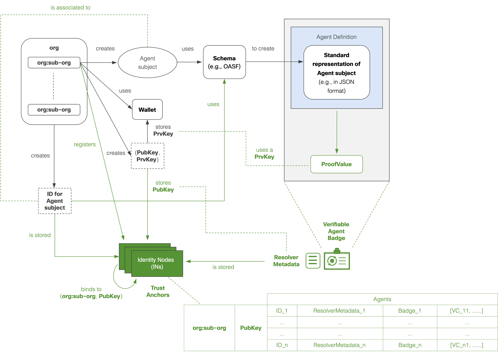
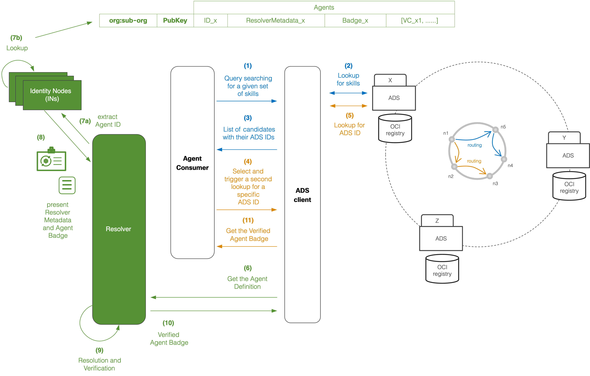

# Architecture Diagrams

## Generating Agent Badges

The above diagram depicts the process for generating and storing a verifiable Agent Badge along with a `ResolverMetadata` object associated to an agent subject. A similar process can be followed to generate a verifiable MCP Server Badge or a verifiable MAS Badge.

- The top left of the image shows that an organization may have several sub-organizations, each of which may create its own Agent subjects.
- As described in the [examples](./identifier_examples.md), each agent subject will be associated to an agent ID. More specifically, AGNTCY enables organizations to bring their own identities for their agents (for example, identities created via Okta, Duo, or A2A) as well as the capacity to generate an identity through AGNTCY, for example, using DIDs.
- Each agent subject is required to use a schema to create an Agent definition (e.g., using an [OASF schema](../oasf/open-agentic-schema-framework.md) or an A2A [Agent Card](https://google.github.io/A2A/specification/agent-card/)). The agent ID must be included in the Agent Definition (see examples of agent IDs [here](./identifier_examples.md)).
- Each organization or sub-organization may create public and private key pairs, and store the private keys (PrivKeys) on their wallet or vault of choice, or other means enabling secure access to the PrivKeys.
- A PrivKey owned and managed by an organization or sub-organization is required to create a ProofValue of the agent definition. As described in detail in the [Agent Badge Examples](./identifier_examples.md), the Agent Definition, the ProofValue, and additional metadata are used to create a Verifiable Credential in the form of a verifiable Agent Badge. Also note that, specific metadata, such as a verification method, an assertion method, and a service endpoint are used to create a `ResolverMetadata` object that is associated to the ID and the verifiable Agent Badge.

    !!! note
        Embedding the PubKey in the `ResolverMetadata` object itself is optional, since the metadata supplied allows for automated access and verification of the PubKey (e.g., using a JWK as part of a JWT header).

- The `ResolverMetadata` along with the verifiable Agent Badge can be stored in Identity Nodes (INs) that can operate as trust anchors. In subsequent updates to this documentation, AGNTCY shall provide more detailed recommendations about the INs, and their role and capacity to operate as decentralized trust anchors, especially, to:

    - Build trust during MAS composition involving third-party Agents and MCP Servers.
    - Link and automate the dynamic and trustworthy discovery of running Agents and MCP Servers to their corresponding AuthN and delegated AuthZ methods, including MFA in a MAS.

- AGNTCY considers the possibility that organizations and their sub-organizations may register with the INs (e.g., to brand and ensure the origin of their agents). This may include means to store and bind an organization/sub-organization to a PubKey, the IDs for the various subjects that they might register (e.g., Agents and MCP Servers), their corresponding `ResolverMetadata` objects and Agent Badges, as well as additional sets of VCs for each of them.

AGNTCY plans to contribute open-source code to automate the process of creating and storing `ResolverMetadata` objects, Agent Badges, and MCP Server Badges.

## Verifying Agent Badges

The above diagram depicts an example process enabling the lookup, identification and use of `ResolverMetadata` as well as verifying an Agent Badge associated to an Agent subject. The example process uses AGNTCY's [Agent Discovery Service](../dir/overview.md) as the means to discover an Agent with specific skills, and automatically identify and resolve the associated Agent Badge, irrespective of the type of identity used by the owner of the Agent (e.g., an Okta, Duo, AD, DID, or A2A ID).

A similar process can be followed in the case of MCP Servers or A2A Agents, but in those cases the discovery service may rely on the use of well-known addresses (URLs), or other hubs, external directories, or discovery services.

The following steps summarize the process:

1. An Agent Consumer may search for an Agent with given skills, e.g., using an ADS client, such as a CLI, a UI, or a headless interface in case the consumer is an agent itself.
2. A lookup is performed using the ADS.
3. A list of potential candidates are presented to the Agent Consumer.
4. The Agent Consumer selects the desired Agent.
5. This now triggers the lookup of the selected Agent's definition (e.g., a definition based on an OASF schema), which contains the Agent ID (e.g., an Okta, Duo, AD, DID, or A2A ID).
6. The Agent definition is obtained and passed to the Resolver, which is one of the key elements of the AGNTCY's identity service.
7. The Resolver extracts the Agent ID from the Agent definition in step (7a), and performs a lookup process in an AGNTCY's Identity Node (IN) using the Agent ID as a key (see step (7b) in the diagram above).
8. The corresponding Agent Badge and ResolverMetadata object are now passed to the Resolver.
9. The Resolver provides trustworthy and automated means to resolve and verify the Agent subject. To this end, the Resolver proceeds as follows:

    - It uses the ResolverMetadata object to obtain the crypto method and PubKey to decrypt the ProofValue in the Agent Badge.
    - It decrypts the ProofValue and verifies the Agent Badge integrity, since, as shown in the examples [here](../../vc/agent-badge.md), the proof type is a `"DataIntegrityProof"`. This may include the computation of a digest, and comparison with a digest obtained after decryption.
    - It outputs the verification result and logs it.

10. The Verified Agent Badge is returned to the ADS client.
11. This is forwarded to the Agent Consumer.

AGNTCY plans to contribute open-source code to automate the process of resolving and verifying Agent Badges and MCP Server Badges, leveraging `ResolverMetadata` objects.