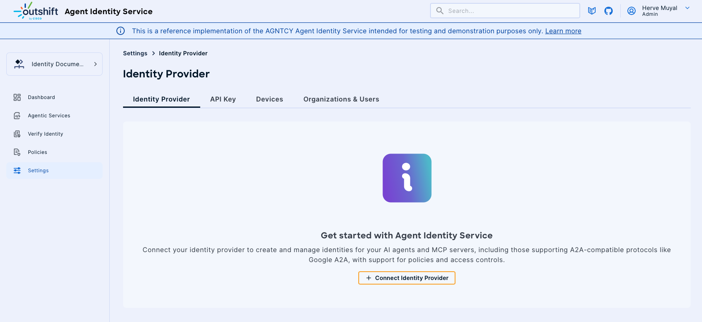
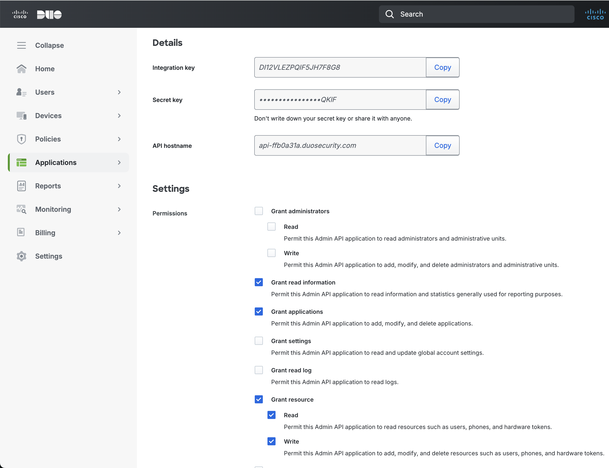
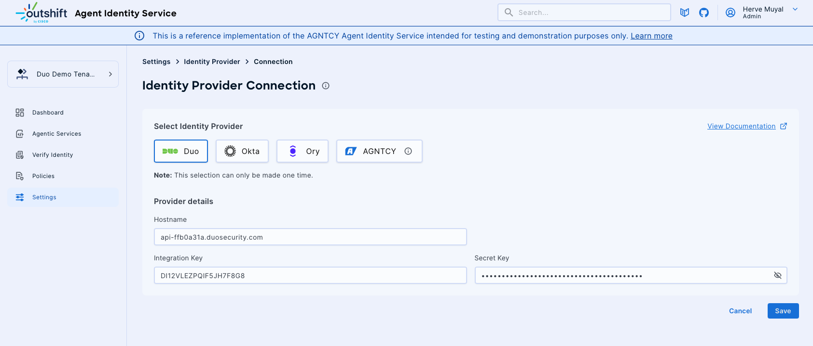
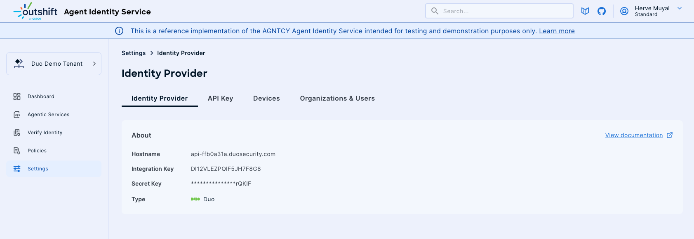
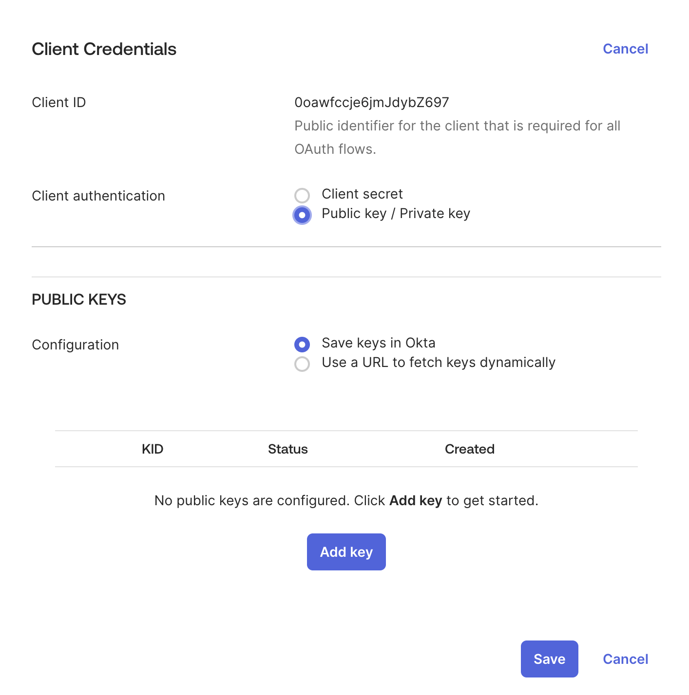
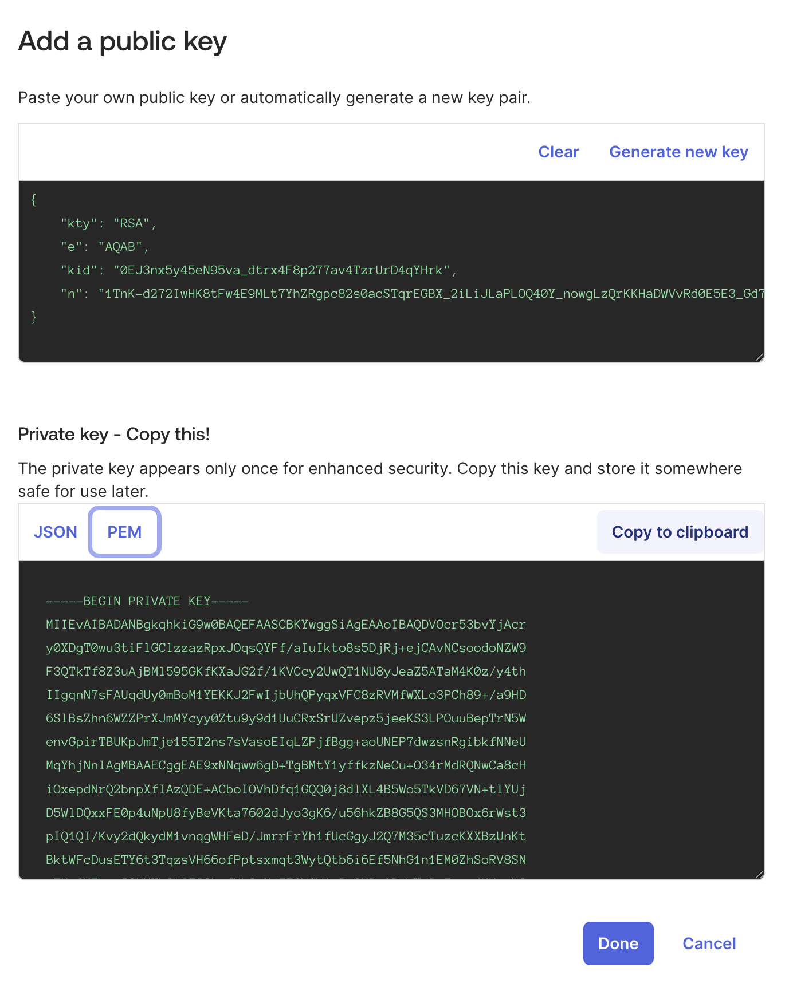
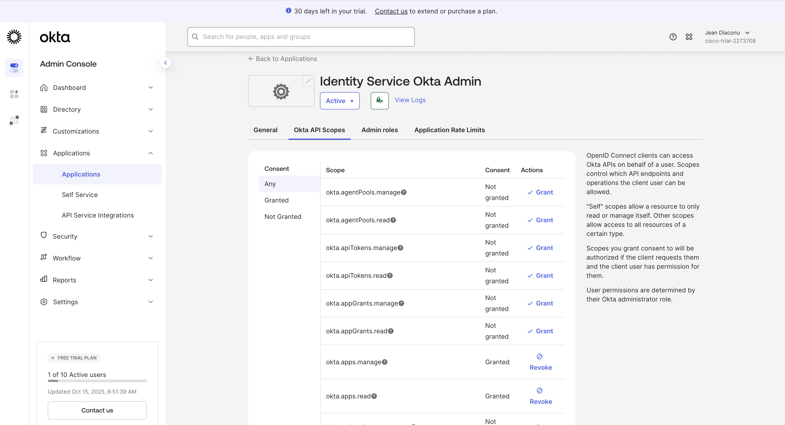
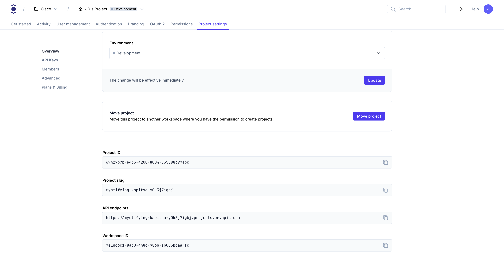

# Connecting an Identity Provider

This document provides a comprehensive guide on how to register a new issuer by connecting an Identity Provider (IdP) within the **AGNTCY Identity Service**.
Connecting an IdP is a crucial step for integrating external authentication and authorization services, such as Client Credentials, with your AGNTCY Identity Service environment.
This guide specifically details the process for configuring different Identity Providers, including Duo and Ory.

To access the Identity Provider creation page within the **AGNTCY Identity Service**:

1. From the main dashboard, locate and click on **Settings** in the left-hand navigation menu.
2. Within the Settings section, select **Identity Provider**.
3. On the Identity Provider management page, click the **Connect** button to initiate the creation wizard.

This will direct you to the "Identity Provider Connection" page, where you can begin configuring your new IdP.

Now proceed to the next section for detailed instructions for each supported Identity Provider.

## Connecting Duo as an Identity Provider

This guide specifically details the process for configuring Duo as an Identity Provider.

### Prerequisites

Before you begin the Identity Provider connection process, ensure you have the following:

- **Access to AGNTCY Identity Service:** You must have an administrator role or sufficient permissions within the AGNTCY Identity Service application to access the Settings and connect Identity Providers.
- **Duo Security Account:** An active Duo Security account is required.
- **Duo Application Details:** You must have an existing Duo application configured within your Duo Admin Panel. From this application, you will need to retrieve:
  - Your Duo **API Hostname**
  - The **Integration Key** for your Duo application
  - The **Secret Key** for your Duo application

!!! note
    You can follow the [Duo Admin API documentation](https://duo.com/docs/adminapi) for detailed instructions on how to create and manage applications within Duo Security.

    Below you can find a screenshot of the Duo Admin API interface, with all the necessary permissions and the necessary fields for your integration.

### Identity Provider Connection Steps

Follow these steps to configure and register your Identity Provider:

1. **Select Identity Provider:**

   - On the "Identity Provider Connection" page, you will be presented with a selection of supported Identity Providers.
   - Carefully choose the provider you intend to integrate:
     - **Duo** (as shown in the example, for Duo Security integration)
   - **Critical Note:** The selection of an Identity Provider is a **one-time** action. Once saved, this choice cannot be modified later. Ensure you select the correct provider before proceeding.

2. **Enter Provider Details:**

   - After selecting your desired Identity Provider (e.g., Duo), the "Provider details" section will become active, prompting you for specific configuration parameters.
   - **Hostname:** Enter the API hostname for your Duo Security account. This is your unique Duo API endpoint.
     - _Example:_ `api-ffb0a31a.duosecurity.com`
   - **Integration Key:** Input the Integration Key. This key uniquely identifies your application within Duo Security and is obtained from your Duo Admin Panel when you create or configure an application.
     - _Example:_ `DI12VLEZPQIF5JH7F8G8`
   - **Secret Key:** Provide the Secret Key. This is a sensitive credential used for cryptographic signing of requests to the Duo API, ensuring the authenticity and integrity of communications. It is also obtained from your Duo Admin Panel.
     For security purposes, the input in this field will be masked (displayed as asterisks).

   

3. **Save Configuration:**
   - Once all required details (Hostname, Integration Key, and Secret Key) have been accurately entered, click the **Save** button.
   - Upon successful saving, your chosen Identity Provider will be registered and configured within AGNTCY Identity Service.
   - If you need to discard the entered information and cancel the creation process, click the **Cancel** button.

## Connecting Okta as an Identity Provider

This guide specifically details the process for configuring Okta as an Identity Provider.

### Prerequisites

Before you begin the Identity Provider connection process, ensure you have the following:

- **Access to AGNTCY Identity Service:** You must have an administrator role or sufficient permissions within the AGNTCY Identity Service application to access the Settings and connect Identity Providers.
- **Okta Platform Account:** An active Okta Platform account is required.
- **Okta Admin Management API access:** You must setup an Okta application configured within your Okta Admin Panel. From this application, you will need to retrieve:
  - Your Okta **Organization URL**
  - The **Client ID** for your Okta application
  - The **Private Key in PEM format (base64 value)** for your Okta application

!!! note
    You can follow the [OAuth guide for Okta](https://developer.okta.com/docs/guides/implement-oauth-for-okta/main/) for detailed instructions on how to create and setup the application within Okta Platform.

    Below you can find a screenshot of the Okta Admin Panel interface, with all the necessary permissions and the necessary fields for your integration.

### Identity Provider Connection Steps

Follow these steps to configure and register your Identity Provider:

1. **Select Identity Provider:**

   - On the "Identity Provider Connection" page, you will be presented with a selection of supported Identity Providers.
   - Carefully choose the provider you intend to integrate:
     - **Okta** (as shown in the example, for Okta integration)
   - **Critical Note:** The selection of an Identity Provider is a **one-time** action. Once saved, this choice cannot be modified later. Ensure you select the correct provider before proceeding.

2. **Enter Provider Details:**

   - After selecting your desired Identity Provider (e.g., Okta), the "Provider details" section will become active, prompting you for specific configuration parameters.
   - **Organization URL:** Enter the Organization URL for your Okta account. This is your unique Okta API endpoint.
     - _Example:_ `https://trial-2273708.okta.com/`
   - **Client ID:** Input the Client ID. This key uniquely identifies your application within Okta and is obtained from your Okta Admin Panel when you create or configure an application.
     - _Example:_ `0oawfccje6jmJdybZ697`
   - **Private Key:** Provide the Private Key in PEM format (base64 value). This is a sensitive credential used for cryptographic signing of requests to the Okta API, ensuring the authenticity and integrity of communications. It is also obtained from your Okta Admin Panel.
     For security purposes, the input in this field will be masked (displayed as asterisks). - _Example:_ `MIIEvQIBADANBgkqhkiG9w0BAQEFAASCBKcwggSjAgEAAoIBAQD...`

   

3. **Save Configuration:**
   - Once all required details (Organization URL, Client ID, Private Key) have been accurately entered, click the **Save** button.
   - Upon successful saving, your chosen Identity Provider will be registered and configured within AGNTCY Identity Service.
   - If you need to discard the entered information and cancel the creation process, click the **Cancel** button.

## Connecting Ory as an Identity Provider

This guide specifically details the process for configuring [Ory](https://console.ory.sh/) as an Identity Provider.

### Prerequisites

Before you begin the Identity Provider connection process, ensure you have the following:

- **Access to AGNTCY Identity Service:** You must have an administrator role or sufficient permissions within the AGNTCY Identity Service application to access the Settings and connect Identity Providers.
- **Ory Account:** An active [Ory](https://console.ory.sh/) account is required.
- **Ory API Project Slug:** Navigate to your Ory Console and select project settings to find your project slug.
- **Ory API Key:** Create a new API key in your Ory Console. This key will be used to authenticate requests from AGNTCY Identity Service to Ory.

!!! note
    Ory accounts are free to create, and you can use them to manage your identity providers.

    You can follow the [Ory documentation](https://www.ory.sh/docs/category/operations-reference) for detailed instructions on how to create and manage projects and API keys within Ory.

    Below you can find screenshots of the Ory Console interface, showing where to find your project slug and how to create an API key.

### Identity Provider Connection Steps

Follow these steps to configure and register your Identity Provider:

1. **Select Identity Provider:**

   - On the "Identity Provider Connection" page, you will be presented with a selection of supported Identity Providers.
   - Carefully choose the provider you intend to integrate:
     - **Ory** (as shown in the example, for Ory integration)
   - **Critical Note:** The selection of an Identity Provider is a **one-time** action. Once saved, this choice cannot be modified later. Ensure you select the correct provider before proceeding.

2. **Enter Provider Details:**

   - After selecting your desired Identity Provider (e.g., Ory), the "Provider details" section will become active, prompting you for specific configuration parameters.
   - **Project Slug:** Enter the Ory project slug. This is a unique identifier for your Ory project and can be found in your Ory Console under project settings.
     - _Example:_ `mystifying-kapitsa-y0k3j7igbj`
   - **API Key:** Provide the API Key. This key is used to authenticate requests from AGNTCY Identity Service to Ory and is generated in your Ory Console.

   

3. **Save Configuration:**
   - Once all required details (Hostname, Integration Key, and Secret Key) have been accurately entered, click the **Save** button.
   - Upon successful saving, your chosen Identity Provider will be registered and configured within AGNTCY Identity Service.
   - If you need to discard the entered information and cancel the creation process, click the **Cancel** button.

