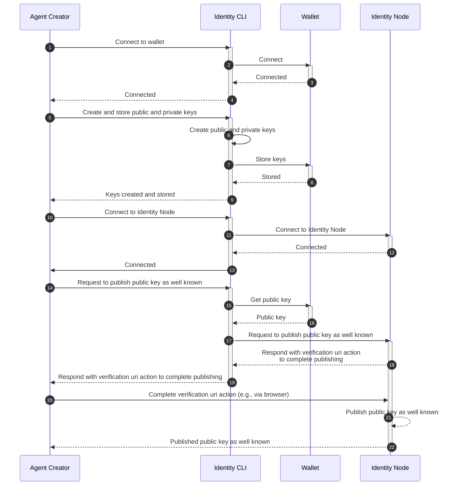
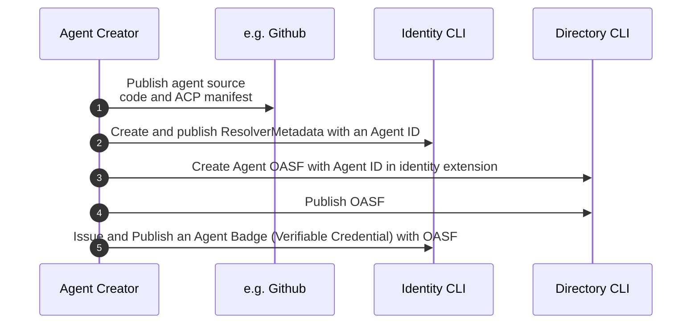
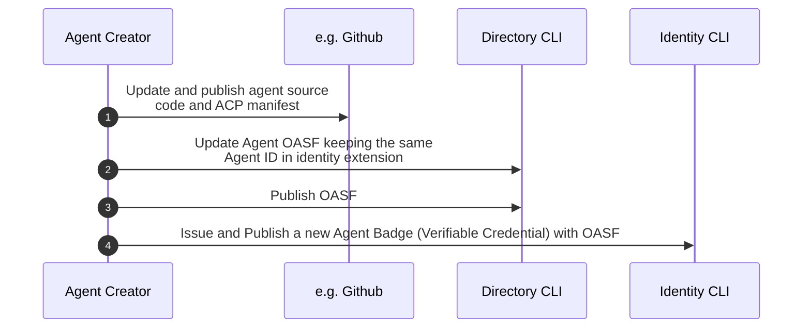
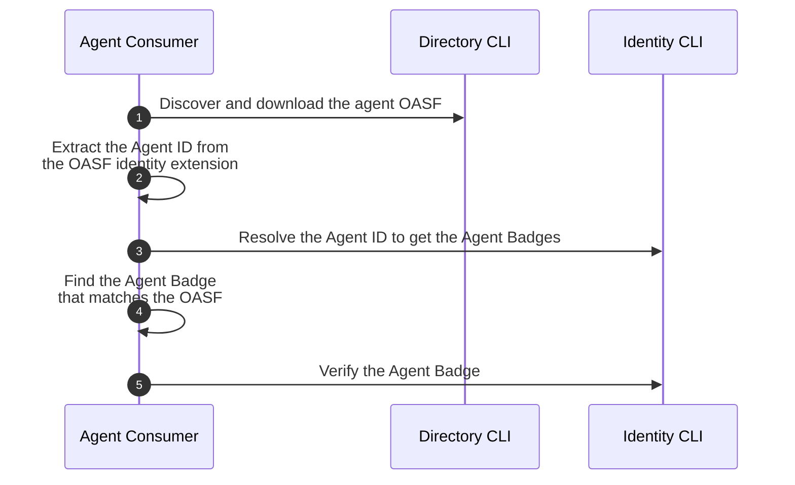
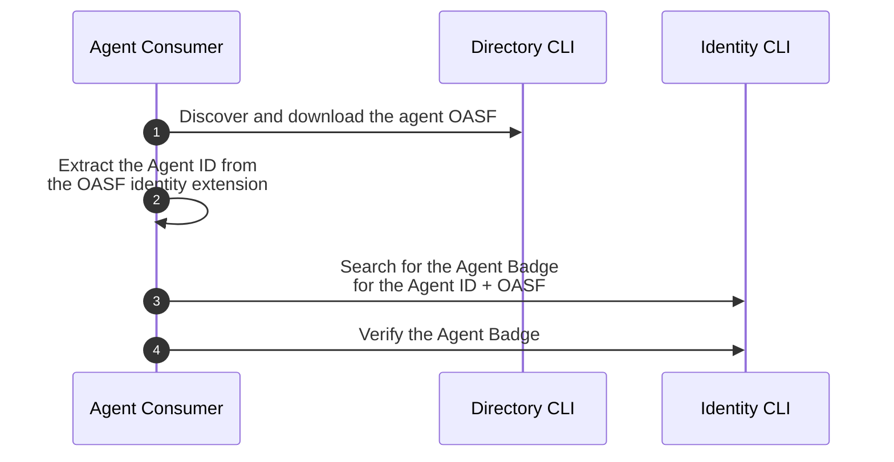
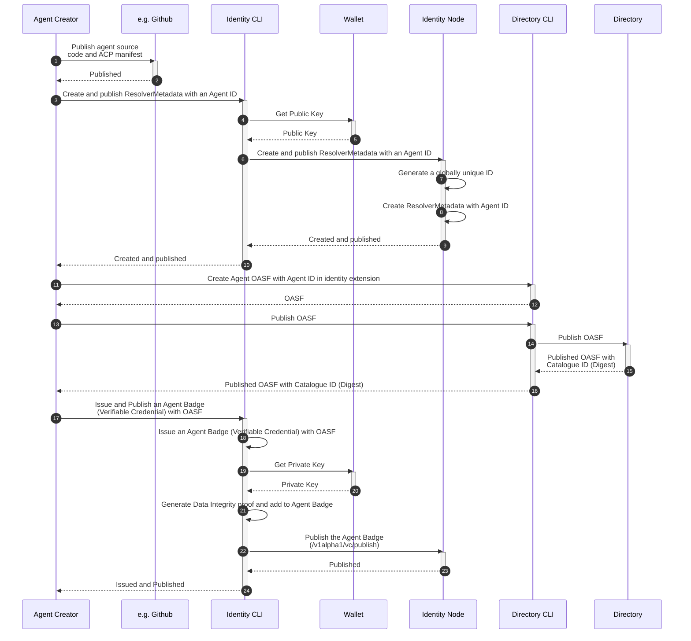
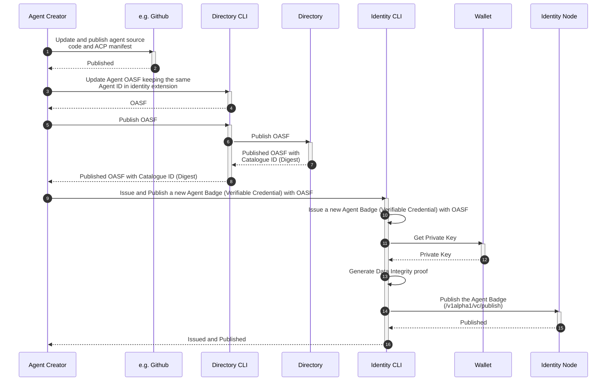
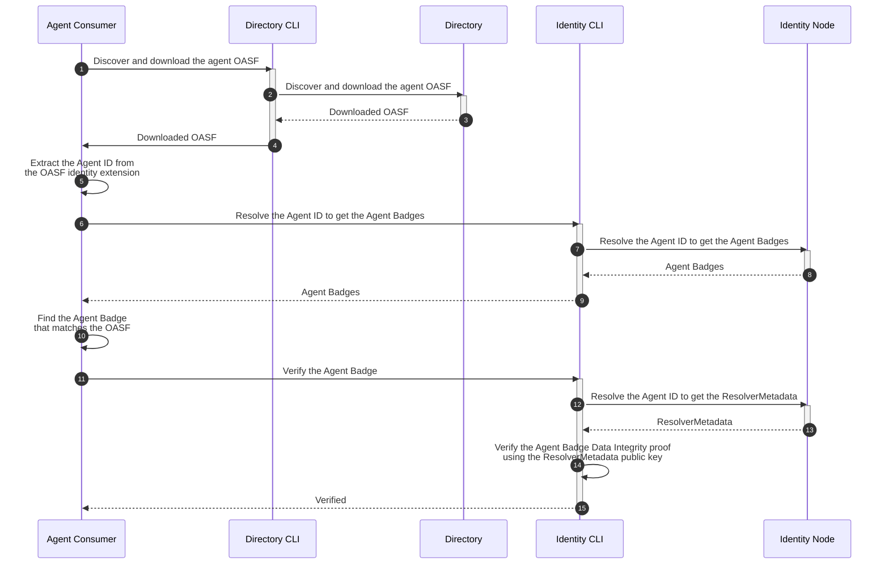
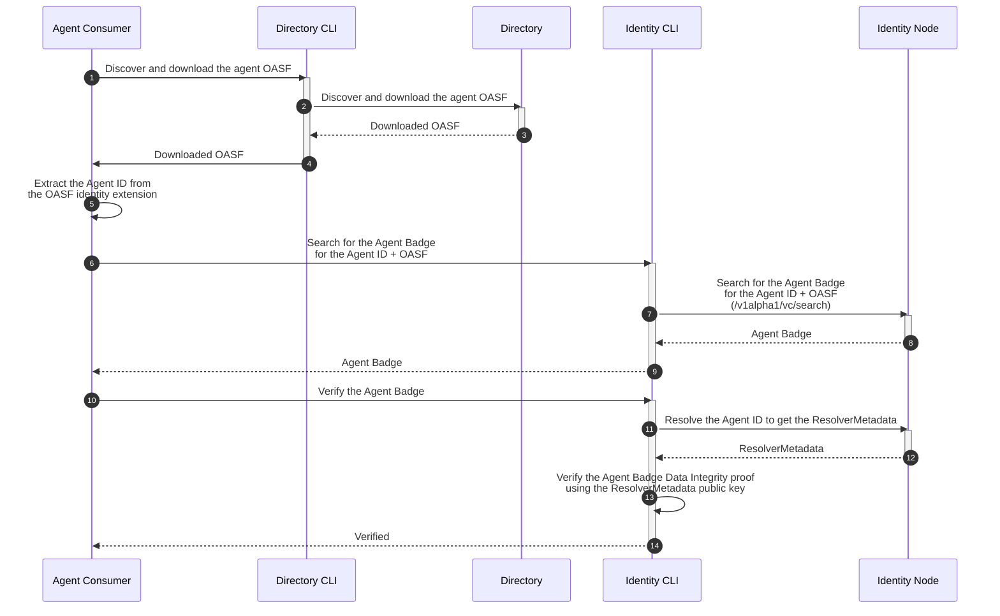

# Sequence Flows

## Identity Flows

### Initial Identity Setup

## User Flows

### Create a New Agent

This sequence diagram illustrates the process of creating, publishing, and registering an Agent's metadata and identity information within the Agntcy ecosystem.

### Update an Agent

This sequence diagram illustrates the process of updating an existing Agent along with its associated metadata and identity information within the Agntcy ecosystem.

### Verify an Agent Locally

This sequence diagram illustrates the local verification process of an Agent's authenticity, including its associated identity credentials, within the Agntcy ecosystem.

### Verify an Agent Using Search Endpoint

This sequence diagram illustrates the process of verifying an Agent's authenticity using a search endpoint within the Agntcy ecosystem. This approach allows the Agent Verifier to locate and validate the correct Agent Badge by querying directly with both the Agent ID and OASF.

## Detailed Flows

### Create a New Agent

### Update an Agent

### Verify an Agent Locally

### Verify an Agent Using Search Endpoint

