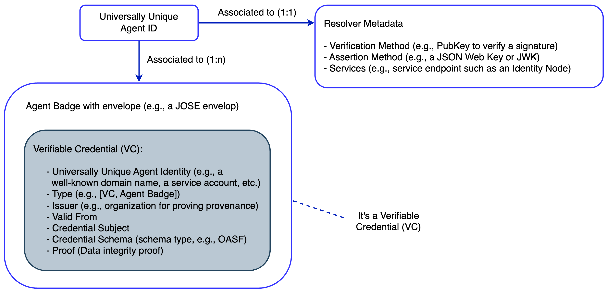

# Identity

Secure and reliable communication between software agents is a cornerstone of the Internet of Agents (IoA) vision. Just as humans rely on official identification (for example, driver's licenses) for trusted real-world interactions, agents in a digital ecosystem require verifiable credentials to authenticate their identity.

Without proper identity management, malicious or unverified agents can infiltrate Multi-Agent Systems (MASs), leading to misinformation, fraud, or security breaches. To mitigate these risks, AGNTCY provides a standardized and consistent framework for authenticating agents and validating associated metadata.

This framework applies equally to:

- Agents
- Model Context Protocol (MCP) Servers
- MAS

Each plays a critical role in the architecture and operation of an IoA and must comply with shared identity and authentication principles.

## Requirements

AGNTCY defines identity assignment with the following core properties:

- **Open:** No centralized authority is required for assigning identities.
- **Collision-free:** Each entity (Agent, MCP Server, or MAS) has a universally unique identifier.
- **Verifiable:** Each entity is backed by a Verifiable Credential (VC) that can be used to authenticate its ID and provenance.

## Assignment Approaches

- AGNTCY supports both conventions and standards for identity assignment.
- This approach promotes interoperability across varied systems and ecosystems.
- This also allows for flexible integration while ensuring consistent methods for assigning and verifying identifiers.

### Conventions

AGNTCY currently supports the following two types of conventions for identity assignment.

#### Identity Provider Accounts

The use of **User Accounts** or **Service Accounts** provided by an Identity Provider (IdP). In the context of AGNTCY, the following identity providers can be used to assign universally unique identifiers:

- Okta
- Microsoft AD
- Entra ID
- Duo
- Ping Identity
- Auth0
- Google ID

#### Well-Known Identifiers

The use of **well-known identifiers**, that is, following the convention proposed by Google's Agent2Agent (A2A) protocol. This convention enables both open identity assignment as well as the use of universally unique identifiers for Agent Cards, which capture the metadata and characteristics that define, allow to discover, and identify an Agent within the A2A ecosystem.

More specifically, in the A2A protocol, the Agent Card standardizes the format of the data shared during discovery processes, which may be facilitated by hosting the Agent Card at a well-known path or identifier, such as: `https://YOUR-DOMAIN/.well-known/agent.json`. In this case, the Agent Card includes details such as the Agent's capabilities, authentication requirements, and endpoint information.

### Standards

AGNTCY supports the use of W3C [Decentralized Identifiers (DIDs)](https://www.w3.org/TR/did-1.1/) and associated standards, including:

- DID Documents for managing identifier metadata.
- [Verifiable Credentials (VCs)](https://www.w3.org/TR/vc-data-model-2.0/) for cryptographic validation.
- Decentralized networks for publishing and resolving identities

This approach enables:

- Decentralized identity management.
- Multi-factor Authentication and Authorization processes across these entities as well as between them and humans.
- Verifiable attributes (skills, versions, roles, etc.).

!!! note
    Independently of whether the identity is assigned following a convention or a standardized framework, at this stage the main focus of the AGNTCY project is to provide a common and trustworthy mechanism to present identifiers and to verify them. More specifically, AGNTCY not only supports various (and heterogeneous) identifiers that are universally unique but also proposes a standard way of presenting and verifying such identifiers, thereby enabling freedom in the selection of interoperable identities in an IoA.

## Agent Identity Structure

The figure above depicts the main elements of an Agent's subject identifier:

- Each Agent subject has a universally unique identifier named [ID](./identifiers.md).
- Each ID is associated 1:1 to a [`ResolverMetadata`](./identifiers.md) object, enabling automated resolution and trustworthy verification of Agent IDs.
- Each `ID` is also associated 1:n to an [Agent Badge](./vc_agent_badge.md).

For more information, see the [Examples](./identifier_examples.md).

In AGNTCY, an Agent subject is tied to a unique identifier linked to one or more Verifiable Credentials (VCs), which contain information about the Agent, such as its ID, a schema definition (for example, an [OASF schema](../oasf/open-agentic-schema-framework.md)), and other metadata used for defining locators, authentication, MFA, and so on. Agents can use this Badge for secure presentation, verification, and enabling trust across multi-agent systems.

!!! note
    This same structure applies to MCP Servers and MASs, ensuring consistency across all identity-bearing entities in the IoA.
