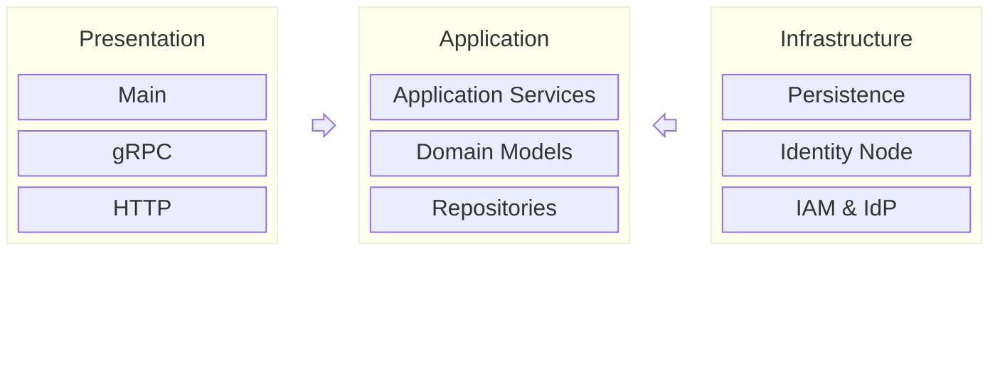

# Contributing Guide

This guide provides an overview of the contributing process for the Agent Identity Service backend.

# Agent Identity Service Backend Architecture

The overall Agent Identity Service backend architecture is shown in this diagram:



**Note:** The arrows indicate the dependency direction between the layers.

The purpose of each layer is described as below:

- **Presentation Layer:** Responsible for bootstrapping the system, implementing the gRPC services, delegating requests to the Application layer and sending responses back to clients. The main packages of this layer:
  - [`cmd/bff`](https://github.com/agntcy/identity-service/tree/main/backend/cmd/bff)
  - [`internal/bff/grpc`](https://github.com/agntcy/identity-service/tree/main/backend/internal/bff/grpc).
- **Application Layer:** Orchestrates and implements the core business logic of the system. Application Services within this layer are responsible for enforcing business rules, processing validations, and coordinating workflows involving domain models, persistence and external systems.
The main packages of this layer:
  - [`internal/bff`](https://github.com/agntcy/identity-service/tree/main/backend/internal/bff): Implements the Application Services.
  - [`internal/core`](https://github.com/agntcy/identity-service/tree/main/backend/internal/core): Implements the domain models and rest of the layer.
- **Infrasturcture Layer:** Responsible for managing technical concerns such as data persistence (repository implementation) and integration with external systems (Identity Node, IAM, IdPs, etc.). The main packages of this layer:
  - [`internal/core`](https://github.com/agntcy/identity-service/tree/main/backend/internal/core): each domain contains the concrete implementation of the repositories and/or the adapters for the external systems.
  - [`internal/pkg`](https://github.com/agntcy/identity-service/tree/main/backend/internal/pkg): part of this package contains adapters for external systems that are not associated with a specific domain, such as [`internal/pkg/vault`](https://github.com/agntcy/identity-service/tree/main/backend/internal/pkg/vault).

## Bootstrapping

The [`main()`](https://github.com/agntcy/identity-service/blob/main/backend/cmd/bff/main.go) function is responsible for initializing and running all components required by the backend. Its primary tasks include:

1. Loading configuration
2. Establishing a database connection
3. Running database migrations
4. Initializing Application Services and injecting their dependencies
5. Starting the gRPC and HTTP servers

### Configuration

The backend is configured using environment variables. Additionally, any values specified in the `.env` file are automatically loaded as environment variables at startup (a sample can be found here [`cmd/bff/.env.sample`](https://github.com/agntcy/identity-service/blob/main/backend/cmd/bff/.env.sample)).
All configuration options for the system are defined in the `Configuration` struct located in [`cmd/bff/configuration.go`](https://github.com/agntcy/identity-service/blob/main/backend/cmd/bff/configuration.go).

### Dependency injection

In Agent Identity Service backend, the dependency injection is performed manually using [constructors](https://go.dev/doc/effective_go#composite_literals). Components depend on each other using interfaces rather than concrete implementation structs.

```golang
type ServiceA interface {}
type ServiceB interface {}

type serviceAImpl struct{}
func NewServiceA() ServiceA {
  return &serviceAImpl{}
}

type serviceBImpl struct{
  srvA ServiceA
}
func NewServiceB(srvA ServiceA) ServiceB {
  return &serviceBImpl{srvA}
}

sA := NewServiceA()
sB := NewServiceB(sA)
```

## Dependency management

[Go modules](https://pkg.go.dev/cmd/go#hdr-Modules__module_versions__and_more) are used to manage dependencies on external packages.

Adding a new dependency or updating an existing one is done with the `go get` command.

After importing the dependency in the code, tidy up the `go.mod` and `go.sum` files using the `go mod tidy` command.

> [!IMPORTANT]
> Avoid using unmaintained libraries as dependencies.

# Services

This document provides guidance on working with domain models, application services, and gRPC services.

## Domain packages

The Agent Identity Service is organized into multiple domains, with each domain defined as a separate package within [`internal/core`](https://github.com/agntcy/identity-service/tree/main/backend/internal/core).

### Structure

A typical domain package is structured in the following way:

```text
domain/
├── mocks/
├── postgres/
│   ├── models.go
│   └── repository.go
├── types/
│   └── types.go
├── repository.go
└── <domain_services>.go
```

### Domain models

Domain models are conceptual representations of the key entities, behaviors, and rules within a specific domain. They serve as the core components and building blocks of the Agent Identity Service.

Most domains include one or more of these models, which are defined in a `types` package within each domain.

#### Enums

Enums in the project are defined using a custom `int` type along with a set of constants.

For example:

```go
type AppType int

const (
  APP_TYPE_UNSPECIFIED AppType = iota
  APP_TYPE_AGENT_A2A
  APP_TYPE_AGENT_OASF
  APP_TYPE_MCP_SERVER
)
```

A string representation for each enum value should also be generated using the [stringer](https://pkg.go.dev/golang.org/x/tools/cmd/stringer) tool. To do this, add a `//go:generate stringer` directive at the top of the file containing the enums, and run the generation with the `go generate` command.

For example:

```go
// Copyright 2025 AGNTCY Contributors (https://github.com/agntcy)
// SPDX-License-Identifier: Apache-2.0

//go:generate stringer -type=AppType
//go:generate stringer -type=AppStats

package types

...
```

#### Protobuf messages

When domain models are defined in `types/types.go`, running `make generate_proto` will generate corresponding protobuf messages for these models.

The generated protobuf messages serve as input and output objects for the presentation layer.

The generation process is handled by the script [`scripts/proto/docker/run.sh`](https://github.com/agntcy/identity-service/blob/main/scripts/proto/docker/run.sh).
It utilizes Kubernetes' [`go-to-protobuf`](https://github.com/kubernetes/code-generator/tree/master/cmd/go-to-protobuf) to convert Go structs to protobuf messages
and a custom tool [`proto-enum-generator`](https://github.com/agntcy/identity-service/tree/main/scripts/proto/proto-enum-generator) to convert Go enums to protobuf enums.

## Application services

The entrypoint to the Application layer is the [application services](https://github.com/agntcy/identity-service/tree/main/backend/internal/bff). They are responsible for enforcing business rules, processing validations, and coordinating workflows involving domain models, persistence and external systems.

Application services are defined as interfaces and implemented by structs. These services do not interact or reference each other directly, with the exception of the `NotificationService`. Each service can leverage multiple domain models to accomplish its tasks.

Business logic that is shared across different application services should be encapsulated and exposed through domain models or domain services.

## gRPC services

gRPC services are defined as protobuf services in [`backend/api/spec/proto/agntcy/identity/service/v1alpha1`](https://github.com/agntcy/identity-service/tree/main/backend/api/spec/proto/agntcy/identity/service/v1alpha1).
These protobuf service definitions establish the API contract for the Agent Identity Service, supporting both gRPC and HTTP interfaces.

Running `make generate_proto` generates both the server code and the Go interfaces for these protobuf services. The implementations of these interfaces are located in [`internal/bff/grpc`](https://github.com/agntcy/identity-service/tree/main/backend/internal/bff/grpc).

### Registering gRPC services

After implementing a gRPC service, it must be registered as a handler with both the gRPC server and the HTTP server.
This is achieved by providing an instance of the concrete implementation of the gRPC interface to the `identity_service_api.GrpcServiceRegister` struct in the `initializeServices()` function within [`main.go`](https://github.com/agntcy/identity-service/blob/main/backend/cmd/bff/main.go).

For example:

```go
...
register := identity_service_api.GrpcServiceRegister{
  AppServiceServer:      bffgrpc.NewAppService(appSrv, badgeSrv),
  SettingsServiceServer: bffgrpc.NewSettingsService(settingsSrv),
  ...
  MyNewService: bffgrpc.NewMyNewService(),
}
...
```

# Errors

The Agent Identity Service deals with two types of errors:

- **Domain errors:** arise when a business rule, validation or use case is violated.
These errors are represented by the custom type [`DomainError`](https://github.com/agntcy/identity-service/blob/main/backend/internal/pkg/errutil/error.go), which extends Go's `error` interface to provide additional context about the violation.
The resulting error messages are also designed to be displayed on the frontend.
- **Technical errors**: occur due to issues outside the domain logic, such as database failures or system malfunctions, that affect the system's ability to function.
These errors are returned as standard Go errors created using the functions from Go's [errors](https://pkg.go.dev/errors) or [fmt](https://pkg.go.dev/fmt) packages (e.g., `fmt.Errorf(...)`, `errors.New(...)`).

## Domain errors

Domain errors are returned from Application Services and Domain Services only if a business logic is violated.
The [`internal/pkg/errutil`](https://github.com/agntcy/identity-service/blob/main/backend/internal/pkg/errutil/error.go) package provides helper functions for creating `DomainError` instances based on specific reasons, for example:

- `errutil.NotFound(id, format string, args ...any)`
- `errutil.ValidationFailed(id, format string, args ...any)`
- `errutil.InvalidRequest(id, format string, args ...any)`
- `errutil.Unauthorized(id, format string, args ...any)`

The `id` provides a way to identify the error without relying on the message, and also enables custom error messages to be displayed on the frontend.
Throughout the codebase, the `id` is constructed as `<domain>.<errId>`, where the `<domain>` corresponds to either the Application Service name or the directory name of the domain.

> For more information about the Application layer and its packages, see the [architecture](./identity_service_contributing.md#agent-identity-service-backend-architecture) section.

In case a technical error must be returned, it should be wrapped to provide additional context and traceability:

```go
return fmt.Errorf("...: %w", ..., err)
```

> For more information about error wrapping, see Go's [`errors`](https://pkg.go.dev/errors#pkg-overview) package.

## Error handling in gRPC services

Since only two types of errors are returned from the Application layer, error handling in the gRPC services is handled as follows:

- If the error is a *domain error*, a [`status.Status`](https://pkg.go.dev/google.golang.org/grpc/status#Status) is returned with a code corresponding to the `DomainError.Reason` field.
- If the error is a *technical error*, it is forwarded as-is.
Later, a custom gRPC interceptor `ErrorInterceptor` logs the error and returns a [`status.Status`](https://pkg.go.dev/google.golang.org/grpc/status#Status) with an `Internal` code as a response.

The helper function [`grpcutil.Error()`](https://github.com/agntcy/identity-service/blob/main/backend/internal/pkg/grpcutil/errors.go) encapsulates the error handling process described above and can be called from gRPC services, as shown in the following example:

```go
func (s *appGrpcService) CreateApp(
  ctx context.Context,
  req *identity_service_sdk_go.CreateAppRequest,
) (*identity_service_sdk_go.App, error) {
  createdApp, err := s.appSrv.CreateApp(ctx, ...)
  if err != nil {
    return nil, grpcutil.Error(err)
  }

  return converters.FromApp(createdApp), nil
}
```

# Logging

Logging in the Agent Identity Service is done using [logrus](https://github.com/sirupsen/logrus).
Logs are forwarded to `stdout` or `stderr` depending on their log level. Logs are structured, they can have key-value pairs which makes querying and processing logs easier and reliable.

## Usage

Import the [`pkg/log`](https://github.com/agntcy/identity-service/blob/main/backend/pkg/log/log.go) package to use one of the following functions to write logs:

```go
func Debug(args ...any)
func Info(args ...any)
func Warn(args ...any)
func Error(args ...any)
```

For example:

```go
log.Info("Sharing some information")

log.Error("Oh no! ", err)
```

It is encouraged to exploit structured logging as much as possible, to add fields into the log simply use the `WithFields` function found in the same pacakge:

```go
log.WithFields(logrus.Fields{
  "key1": "value",
  "key2": 123,
}).Info("Howdy, folks!")

log.WithFields(logrus.Fields{"err": err}).Error("Oh no!")
```

Adding an error as a field can be done using the `WithError` function instead:

```go
log.WithError(err).Error("Oh no!")
```

## Contextual logging

For better and rich logs, it is highly recommanded to use a contextual logger which enriches the log with additional key-value pairs attached to `context.Context` (e.g, `tenantID`, `appID`, `requestID`, http & gRPC requests).

For example:

```go
log.FromContext(ctx).Info("This log logs the context as well!")
```

## Log levels

What log level to use?

- **`log.Debug`:** Useful for times where verbosity is needed and for logs of high frequency, such as the ones used for debugging.
- **`log.Info`:** Useful for giving a steady state information about the service and important log messages.
- **`log.Warn`:** Logs that indicate a potential issue or a weird state but doesn't prevent the system from functioning. If used, it may require attention.
- **`log.Error`:** Error logs indicating unexpected behaviours occured somewhere in the code, most of these errors are not handled.

## Error logging

In case an unexpected error happened and the execution flow needs to be stopped, **do not** log the error, there is a global gRPC interceptor `ErrorInterceptor` that catches these errors and logs them.
This prevents errors from being logged more than once, which facilitates tracing.

## Formats

The Agent Identity Service supports two logging formats based on the runtime environment: **Text logging format** and **JSON logging format**.

### Text logging format

> **Enabled for development environment (`GO_ENV=development`)**

Each log is written in text format, can take multiple lines, and human-readable.

Example:

```text
INFO[2025-10-06T11:01:49+02:00] Starting in env:development
```

```text
DEBUG[2025-10-06T10:45:13+02:00] Creating badge with claims full_method=/agntcy.identity.service.v1alpha1.BadgeService/IssueBadge organization_id=6064781c-9522-401f-8edc-22ccba81a623 request=map[...] request_id=9c216d4f-f0f7-4648-9367-957dc332ed7e tenant_id=0d29df10-801e-4296-a521-8a6e5bcb10e5
```

### JSON logging format

> **Enabled for non development environment, such as production (`GO_ENV=production`)**

Each log is written in a JSON format, which is more effecient for parsing and to be fed to observability platforms such as Grafana.

Example:

```json
{"level":"info","msg":"Starting in env:production","time":"2025-10-06T10:54:13+02:00"}
```

```json
{"full_method":"/agntcy.identity.service.v1alpha1.BadgeService/IssueBadge","level":"debug","msg":"Creating badge with claims: ...}","organization_id":"6064781c-9522-401f-8edc-22ccba81a623","request":{},"request_id":"2b35e522-47cc-4d8f-a50f-03b07f7070e8","tenant_id":"0d29df10-801e-4296-a521-8a6e5bcb10e5","time":"2025-10-06T10:58:00+02:00"}

```

# Identity Context

One of the most useful features of Go is the `Context` type, it provides a mechanism to control the lifecycle, cancellation, and propagation of request-scoped metadata across the different components of an application.

In the Agent Identity Service, the `Context` is used to carry user and tenant information related to each gRPC request, such as `TenantID`, `AppID` and `UserID`.
The [`internal/pkg/context`](https://github.com/agntcy/identity-service/tree/main/backend/internal/pkg/context) package provides functions to set and get this information from the context.

The context is propagated to the application and domain services, as well as to the repositories and any other components that rely on user and tenant metadata.
For example, repositories use the tenant ID from the context to filter data using the custom GORM scope [`BelongsToTenant`](https://github.com/agntcy/identity-service/blob/main/backend/internal/pkg/gormutil/scopes.go),
while HTTP clients can use the context to cancel requests if the user closes the connection to the server.

The population of the `Context` with user and tenant metadata is managed by the `AuthInterceptor` gRPC interceptor.

# Database

The Agent Identity Service uses a database to persist all core entities, such as apps, issued badges, issuer settings, etc.

The following technologies are used in the persistence layer:

- [PostgreSQL](https://www.postgresql.org/) is used as the database engine.
- [GORM](https://gorm.io/) is used as an ORM library to simplify database interactions by mapping Go structs to database tables. For more information about GORM, refer to the [documentation](https://gorm.io/docs/index.html).

The use of GORM or any database technology APIs is confined to the implementation of repositories. Domain and Application services interact with the persistence layer exclusively through repository interfaces.

Each domain within [`internal/core`](https://github.com/agntcy/identity-service/tree/main/backend/internal/core) that requires persistence includes its implementation in a package named after the database engine, `postgres` in our case.

## Declaring models

Database models are defined as structs, with each model typically mapped to a single table. However, a model can be represented by multiple structs depending on the case.

Most models include an ID field of type `uuid.UUID` and a `TenantID` field of type `string`, with `TenantID` being indexed in the database. Additionally, metadata fields such as `CreatedAt`, `UpdatedAt` and `DeletedAt` are included in these models.

Database models are created using factory functions that construct an instance from a domain model. Each database model also provides a method to convert its instance back into the corresponding domain model.

## Migrations

Mapping database models to tables is managed through migrations. In Agent Identity Service, auto-migrations are enabled.

To add a new database model to the migrations, update `cmd/bff/main.go` by passing an empty instance of the model to the `dbContext.AutoMigrate()` method call.

# Testing

At this stage, the Agent Identity Service includes only unit tests.

Only pull requests with passing unit tests are merged.

## Unit tests

- Required for every file where unit testing is practical.
- Place the test file next to the file being tested.
  - If no private functions/methods are being tested, add the suffix `_test` to the package name for the test (e.g., `auth_test`).
  - Otherwise, use the same package name as the file under test.
- Avoid introducing infrastructure dependencies.
- One test function per function/method.
  - Prefer [table-driven tests](https://go.dev/wiki/TableDrivenTests) for multiple inputs or scenarios.
  - If table-driven tests aren't suitable:
    - Create one test function per test case, or
    - Use [`T.Run()`](https://pkg.go.dev/testing#T.Run) to create subtests within the same function.
- Arrange the body of the test using the "*Arrage -> Act -> Assert*" pattern:
  - **Arrange** your objects, data, and set them up as necessary.
  - **Act** on the code under test by executing it.
  - **Assert** the result based on what is expected.

  ```go
  func TestAppService_CreateApp_should_succeed(t *testing.T) {
    t.Parallel()

    // Arrange
    var (
      app apptypes.App
      req identity_service_sdk_go.CreateAppRequest
    )

    _ = gofakeit.Struct(&app)
    _ = gofakeit.Struct(&req)

    appSrv := bffmocks.NewAppService(t)
    appSrv.EXPECT().CreateApp(t.Context(), mock.Anything).Return(&app, nil)

    sut := grpc.NewAppService(appSrv, nil) // sut: system under test

    // Act
    actual, err := sut.CreateApp(t.Context(), &req)

    // Assert
    assert.NoError(t, err)
    assert.NotNil(t, actual)
  }
  ```

- Append `t.Parallel()` to the test when tests can safely run concurrently.

### Naming convention

#### Test functions with a single scenario

When a test function covers a single scenario, its name should be composed of four parts:

1. **Struct name** - *(incude only if testing a struct method; omit for standalone functions)*.
2. **Function/method name** - The specific function or method being tested.
3. **Expected behavior** - The outcome expected when the scenario is invoked, prefer the use of the verb `should`.
4. **Test scenario** - The specific condition or context in which the function/method is being tested.

For example:

```go
// Testing a method
func TestAppService_CreateApp_should_return_err_when_idp_type_is_invalid(t *testing.T)   

// Testing a function
func TestVerify_should_pass_when_jwt_has_invalid_signature(t *testing.T)
```

#### Test functions with subtests

When a test function contains multiple subtests, the function name should include only:

1. **Struct name + method name** (if testing a method), or
2. **Function name** (if testing a standalone function).

For example:

```go
// Testing a method
func TestSettingsService_SetApiKey(t *testing.T)

// Testing a function
func TestIsDomainError(t *testing.T)
```

#### Subtest naming

Subtest names should be written as a clear, descriptive sentence that explains both the scenario being tested and the expected behavior.

For example:

```go
func TestSettingsService_SetApiKey(t *testing.T) {
  t.Run("should set a API key for a tenant when it doesn't have one yet", func(t *testing.T) {
    // ...
  })

  t.Run("should revoke an existing API key for the tenant before creating a new one", func(t *testing.T) {
    // ...
  })
}
```

### Assertion

All test assertions are done using the `testify` library. For more information, see the official [documentation](https://github.com/stretchr/testify).

### Mocks

[Mocks](https://en.wikipedia.org/wiki/Mock_object) are generated using the [`mockery`](https://vektra.github.io/mockery/latest/) tool.
To specify which interfaces should be mocked, list them explicitly in the [`.mockery.yaml`](https://github.com/agntcy/identity-service/blob/main/backend/.mockery.yaml) configuration file.

Running `make generate_mocks` will generate all the mocks for the configured interfaces.
By default, each mock object is placed in a `mocks` package within the package of its corresponding interface.

Under the hood, the mocks generated by `mockery` utilize the `mock` package of `github.com/stretchr/testify`.

Usage example:

```go
import (
  policymocks "github.com/agntcy/identity-service/internal/core/policy/mocks"
  // ...
)

func TestSomeTest(t *testing.T) {
  // ...

  policyRepo := policymocks.NewPolicyRepository(t)
  policyRepo.EXPECT().GetByID(ctx, policy.ID).Return(policy, nil)

  // ..
}
```

### Run all unit tests

You can run the tests with `go test`.

```sh
cd backend

# Run all unit tests
go test ./...
```

Since the tests may run concurrently, run the tests multiple times to make sure no race condition is affecting the results:

```sh
# Run each test 5 times
go test ./... -count 5
```

### Test coverage

You can run coverage analysis using the `-cover` argument:

```sh
go test ./... -cover
```