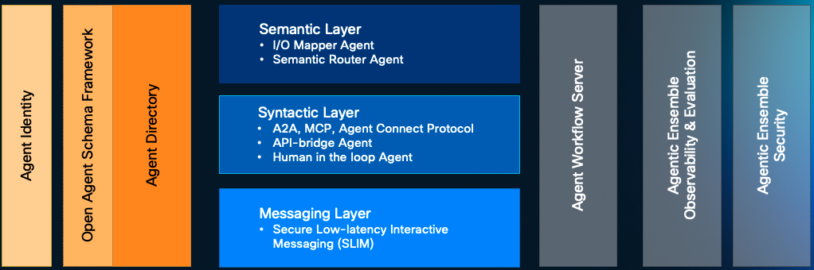

# AGNTCY Origins

AGNTCY began with Outshift by Cisco's vision of an [Internet of Agents](https://outshift.cisco.com/the-internet-of-agents)—recognizing that AI agents were being built in isolated silos, unable to collaborate across organizational boundaries. Their foundational white paper identified the critical infrastructure gap preventing agents from working together at scale.

What started as a concept became reality in March 2025 when Outshift launched AGNTCY on GitHub with complete code, specifications, and services, alongside Galileo and LangChain as core maintainers. They built the discovery, identity, messaging, and observability components that agents need to find each other, verify their capabilities, and collaborate securely.

By July 2025, over 75 companies had joined the effort, leading to AGNTCY's donation to the Linux Foundation with Cisco, Dell Technologies, Google Cloud, Oracle, and Red Hat as formative members. What began as one company's vision became the community-owned infrastructure for the Internet of Agents.

## Vision

Agentic AI will accelerate all of human work. Enterprises need to create agentic workflows and applications combining internal and third-party agents to fully leverage the power of AI, accelerate their business, and achieve significant productivity gains.
We believe that an open, interoperable Internet of Agents is the key to enabling the best possible path forward to accelerate innovation and create the most value for all participants, from builders to operators, developers to consumers across all industries and businesses.

## Mission

We are an open source collective committed to build the Internet of Agents to be accessible to all. Our mission is to build a diverse, collaborative space to innovate, develop, and maintain software components and services that solve key problems in the domain of agentic workflows and multi-agent applications.

## Capabilities

Based on advanced protocols, frameworks, and components, the goal of IoA software infrastructure is to enable and simplify the creation of multi-agent applications through the following steps:

1. **DISCOVER**: Find and evaluate the best agents for the job.
1. **COMPOSE**: Connect agents into effective workflows across any framework or vendor.
1. **DEPLOY**: Run multi-agent systems at scale, securely.
1. **EVALUATE**: Monitor performance and improve efficiency and efficacy over time.

## Technical Objectives

1. **Interoperability**: Establish a common protocol that enables AI agents from different vendors and platforms to communicate and work together efficiently.
2. **Security**: Ensure secure interactions between agents through robust authentication, authorization, and encryption mechanisms.
3. **Scalability**: Design a scalable architecture that leverages the cloud-native stack optimally, supporting a growing number of agents and interactions without compromising performance.
4. **Standardization**: Develop standardized data models and schemas to ensure consistent data representation and validation across the ecosystem.

## Core Components

The initial set of IoA components and architecture is outlined below. This is a starting point - as new members join and bring their contributions, the collective will continue to evolve and expand the IoA architecture, components, and interfaces.

1. **[Open Agent Schema Framework (OASF)](./oasf/open-agentic-schema-framework.md)**: An OCI based extensible data model allowing to describe agents' attributes and ensuring unique identification of agents. OASF supports the description of A2A agents, MCP servers and can be extended to support other popular formats, such as Copilot agent manifests and many more. Current OASF repo can be found [here](https://github.com/agntcy/oasf), OASF schema documentation can be found [here](https://schema.oasf.outshift.com).
1. **[Agent Directory](./dir/overview.md)**: Allows announcing and discover agents or multi-agent applications which are described using OASF. Any organization can run its directory and keep it in sync with others, forming the Internet of Agents inventory. Agent Directory supports A2A agent cards, ACP agent manifests, and MCP server descriptions among other data models.
1. **[Messaging SDK](./messaging/slim-core.md)**:
      * **SLIM** (Secure Low-latency Interactive Messaging): A protocol that defines the standards and guidelines for secure and efficient network-level communication between AI agents. SLIM ensures interoperability and seamless data exchange by specifying message formats, transport mechanisms, and interaction patterns.
      * **SLIM Nodes and SDK**: Offers handy secure (MLS and quantum safe) network-level communication services to a group of agents (typically those of a given multi-agent application) through SDK/Libraries. It extends gRPC to support pub/sub interactions in addition to request/reply, streaming, fire & forget and more.
1. **[Identity](./identity/identity.md)**: A system that leverages decentralized technologies to manage and verify the identities of Agents or Tools issued by any organization, ensuring secure and trustworthy interactions.
1. **[Observability and Evaluation](./obs-and-eval/observe-and-eval.md)**: Telemetry collectors, tools and services to enable multi-agent application observability and evaluation.
1. **Security**: Tools and services to trust and  protect multi-agent applications.

[CoffeeAGNTCY](./coffee-agntcy/get-started.md) is a reference implementation demopnsttrating the core components that can be used to build multi-agent applications.

The following diagram shows a simplified architecture of the core components described above.

## Benefits

* **Enhanced Collaboration**: By enabling seamless communication and data exchange, IoA fosters collaboration between AI agents, leading to more sophisticated and integrated solutions.
* **Improved Efficiency**: Standardized protocols and frameworks reduce the complexity of integrating diverse AI agents, resulting in faster development and deployment of AI-driven applications.
* **Increased Security**: Robust security mechanisms ensure that interactions between agents are secure, protecting sensitive data, and preventing unauthorized access.
* **Future-Proof Architecture**: The scalable and flexible design of IoA ensures that the ecosystem can grow and adapt to future advancements in AI technology.
