# SLIM Controller

The [SLIM](slim-core.md) Controller is a central management component that
orchestrates and manages SLIM nodes in a distributed messaging system. It
provides a unified interface for configuring routes, managing node registration,
and coordinating communication between nodes.

The Controller serves as the central coordination point for SLIM infrastructure,
offering both northbound and southbound interfaces. The northbound interface
allows external systems and administrators to configure and manage the SLIM
network. The southbound interface enables SLIM nodes to register and receive
configuration updates.

## Key Features

- **Centralized Node Management**: Register and manage multiple SLIM nodes from a single control point.
- **Route Configuration**: Set up message routing between nodes through the Controller.
- **Bidirectional Communication**: Supports both northbound and southbound gRPC interfaces.
- **Connection Orchestration**: Manages connections and subscriptions between SLIM nodes.

## Architecture

The Controller implements northbound and southbound gRPC interfaces.

The northbound interface provides management capabilities for external systems
and administrators, such as [slimctl](#slimctl). It includes:

- **Route Management**: Create, list, and manage message routes between nodes.
- **Connection Management**: Set up and monitor connections between SLIM nodes.
- **Node Discovery**: List registered nodes and their status.

The southbound interface allows SLIM nodes to register with the Controller and
receive configuration updates. It includes:

- **Node Registration**: Nodes can register themselves with the Controller.
- **Node De-registration**: Nodes can unregister when shutting down.
- **Configuration Distribution**: The Controller can push configuration updates to registered nodes.
- **Bidirectional Communication**: Supports real-time communication between the Controller and nodes.

### Control Plane Architecture

```mermaid
graph TB
    %% User and CLI
    User[👤 User/Administrator]
    CLI[slimctl CLI Tool]

    %% Control Plane Components
    subgraph "Control Plane"
        Controller[SLIM Controller<br/>- Northbound API<br/>- Southbound API<br/>- Node Registry]
        Config[Configuration<br/>Store]
    end

    %% Data Plane Nodes
    subgraph "Data Plane"
        Node1[SLIM Node 1<br/>- Message Routing<br/>- Client Connections]
        Node2[SLIM Node 2<br/>- Message Routing<br/>- Client Connections]
        Node3[SLIM Node 3<br/>- Message Routing<br/>- Client Connections]
    end

    %% Client Applications
    subgraph "Applications"
        App1[Client App 1]
        App2[Client App 2]
        App3[Client App 3]
    end

    %% User interactions
    User -->|Commands| CLI
    CLI -->|gRPC Northbound<br/>Port 50051| Controller

    %% Control plane interactions
    Controller <-->|Store/Retrieve<br/>Configuration| Config

    %% Southbound connections
    Controller <-->|gRPC Southbound<br/>Port 50052<br/>Registration & Config| Node1
    Controller <-->|gRPC Southbound<br/>Port 50052<br/>Registration & Config| Node2
    Controller <-->|gRPC Southbound<br/>Port 50052<br/>Registration & Config| Node3

    %% Inter-node communication
    Node1 <-->|Message Routing| Node2
    Node2 <-->|Message Routing| Node3
    Node1 <-->|Message Routing| Node3

    %% Application connections
    App1 -->|SLIM Protocol| Node1
    App2 -->|SLIM Protocol| Node2
    App3 -->|SLIM Protocol| Node3

    %% Styling for light/dark mode compatibility
    classDef user fill:#4A90E2,stroke:#2E5D8A,stroke-width:2px,color:#FFFFFF
    classDef control fill:#9B59B6,stroke:#6A3A7C,stroke-width:2px,color:#FFFFFF
    classDef data fill:#27AE60,stroke:#1E8449,stroke-width:2px,color:#FFFFFF
    classDef app fill:#F39C12,stroke:#D68910,stroke-width:2px,color:#FFFFFF

    class User,CLI user
    class Controller,Config control
    class Node1,Node2,Node3 data
    class App1,App2,App3 app
```



### Control Flow Sequence


### Configuring the SLIM Controller

The Controller can be configured through the `config.yaml` file. An example configuration:

```yaml
northbound:
  httpHost: localhost
  httpPort: 50051
  logging:
    level: DEBUG

southbound:
  httpHost: localhost
  httpPort: 50052
  logging:
    level: DEBUG
```

## Usage

## Prerequisites

Go 1.24 or later is required for running the SLIM Controller.

Task runner is recommended for Taskfile commands.

### Building the Controller

The Controller can be built by running the following task:

```
# Build all Controller components
task control-plane:build

# Or build just the Controller binary
task control-plane:control-plane:build
```

### Starting the Controller

The Controller can be started by running the following task:

```bash
# Start the Controller service
task control-plane:control-plane:run
```

Alternatively, start the Controller with the Docker image:

```
docker run ghcr.io/agntcy/slim/control-plane:0.0.1
```

Or use the following to also add a configuration file:

```
docker run -v ./config.yaml:/config.yaml  ghcr.io/agntcy/slim/control-plane:0.0.1 -c /config.yaml
```

### Managing Nodes

Nodes can register themselves with the Controller upon startup. Once registered, the controller can communicate with nodes using the same connection.

To enable self-registration, configure the nodes with the Controller address:

```yaml
  tracing:
    log_level: info
    display_thread_names: true
    display_thread_ids: true

  runtime:
    n_cores: 0
    thread_name: "slim-data-plane"
    drain_timeout: 10s

  services:
    slim/1:
      pubsub:
        servers: []
        clients: []
      controller:
        servers: []
        clients:
          - endpoint: "http://<controller-address>:50052"
            tls:
              insecure: true
```

Nodes can be managed through slimctl. For more information, see the [slimctl](#slimctl).

## slimctl

`slimctl` is the command-line interface for the SLIM controller.

### Configuring slimctl

`slimctl` supports configuration through a configuration file, environment variables, or command-line flags.

By default, `slimctl` looks for a configuration file at `$HOME/.slimctl/config.yaml` or in the current working directory.

An example `config.yaml`:

```yaml
server: "127.0.0.1:50001"
timeout: "10s"
tls:
  insecure: false
  ca_file: "/path/to/ca.pem"
  cert_file: "/path/to/client.pem"
  key_file: "/path/to/client.key"
```

The `server` endpoint should point to a [SLIM Control](https://github.com/agntcy/slim/tree/main/control-plane/control-plane) endpoint which is a central service managing SLIM node configurations.

### Commands

List connection on a SLIM instance:

`slimctl connection list --node-id=<slim_node_id>`

List routes on a SLIM instance:

`slimctl route list --node-id=<slim_node_id>`

Add a route to the SLIM instance:

`slimctl route add <organization/namespace/agentName/agentId> via <config_file> --node-id=<slim_node_id>`

Delete a route from the SLIM instance:

`slimctl route del <organization/namespace/agentName/agentId> via <host:port> --node-id=<slim_node_id>`

Print version information:

`slimctl version`

Run `slimctl <command> --help` for more details on flags and usage.

### Example: Create, Delete Route

```bash
# Add a new route
cat > connection_config.json <<EOF
{
"endpoint": "http://127.0.0.1:46357"
}
EOF
slimctl route add org/default/alice/0 via connection_config.json


# Delete an existing route
slimctl route del org/default/alice/0 via http://localhost:46367
```

For full reference of connection_config.json, see the [client-config-schema.json](https://github.com/agntcy/slim/blob/main/data-plane/core/config/src/grpc/schema/client-config.schema.json).

### Managing SLIM Nodes Directly

SLIM nodes can be configured to expose a Controller endpoint of a SLIM instance, slimctl can connect to this endpoint to manage the SLIM instance directly by using slimctl `node-connect` sub-command. In this case, in the configuration file, the server should point to the SLIM instance endpoint.

To enable this, configure the node to host a server allowing the client to connect:

```yaml
  tracing:
    log_level: info
    display_thread_names: true
    display_thread_ids: true

  runtime:
    n_cores: 0
    thread_name: "slim-data-plane"
    drain_timeout: 10s

  services:
    slim/1:
      pubsub:
        servers: []
        clients: []
      controller:
        servers:
            - endpoint: "0.0.0.0:46358"
              tls:
                insecure: true # Or specify tls cert and key
        clients: []
```

List connection on a SLIM instance:
`slimctl node-connect connection list --server=<node_control_endpoint>`

List routes on a SLIM instance:
`slimctl node-connect route list --server=<node_control_endpoint>`

Add a route to the SLIM instance:
`slimctl node-connect route add <organization/namespace/agentName/agentId> via <config_file> --server=<node_control_endpoint>`

Delete a route from the SLIM instance:
`slimctl node-connect route del <organization/namespace/agentName/agentId> via <host:port> --server=<node_control_endpoint>`