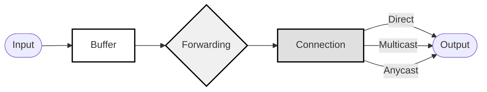

# Data Plane

The [SLIM](slim-core.md) Data Plane implements an efficient message routing and delivery system between applications.

## Endpoints and Channel Naming 

In SLIM, all endpoints are identified by a routable name. To send a message to a specific endpoint, an application
sends the message to its unique name. Client names follow this pattern:
```
org/namespace(org)/service/key(client)
```

- Organization: The first component identifies the organization that deploys the application.
- Namespace: This can be used to segment endpoint deployments. For example, in a multi-region deployment, the namespace might indicate the application's location. It can be adapted to fit other user requirements as well.
- Service: This component specifies the service exposed by the client. When multiple instances of the same client are deployed (such as several pods in a Kubernetes cluster), the organization, namespace, and service components remain the same for all instances.
- Key (Client): The final component is generated by SLIM and is a hash of the client's identity (e.g., a hash of the public key). This uniquely identifies each specific client instance.

This naming structure supports both Anycast and Unicast message delivery:

- Anycast: By specifying only the first three components, a message can be sent to any one of the running clients sharing that name.
- Unicast: By including the fourth component, the message is delivered directly to the specified client instance.

This approach enables efficient client discovery. More details are provided in the next section.

In addition to client endpoints, SLIM allows messages to be sent to Channels. A Channel acts as a message group, allowing multiple clients to connect and receive all messages exchanged on that channel. The channel name follows the same structure as client names, but the last component is left empty, as it is shared among all connected clients.

For further details, please refer to the [SLIM Specification](https://spec.slim.agntcy.org/379-internet-draft-version-0-which-covers-all-main-components/draft-agntcy-slim.html)

## SLIM Sessions Layer

The SLIM platform includes a session layer that connects application frameworks to the underlying SLIM messaging infrastructure. This layer provides a simple interface that abstracts the complexity of secure messaging and message distribution from the application. 

The session layer offers several functionalities:

- Security: All messages in SLIM are encrypted by default using the MLS protocol [MLS protocol](https://www.rfc-editor.org/rfc/rfc9420.html), which guarantees end-to-end encryption even when messages traverse intermediate nodes where TLS connections are terminated. The session layer is responsible for MLS group creation and updates, as well as message encryption and decryption.
- Channel Menagment: The session layer enables clients to be invited to or removed from a channel as needed.
- Message Delivery: The session layer abstracts message passing between applications and the SLIM message distribution network. It handles message formatting, routing, and delivery confirmation, while providing simple send and receive primitives to applications.

The session layer provides two main APIs: a 1:1 session, where two clients communicate directly, and a group session (N:N), where multiple clients exchange messages on a shared channel.

### 1:1 Session
A one-to-one (1:1) session is used when an application needs to communicate with a single endpoint. It supports several modes:

- Reliable or Unreliable: Applications can choose whether the session layer implements retransmission mechanisms for reliable communication or disables them for lower overhead.
- Fire-and-Foreget or Requet/Reply: In fire-and-forget mode, the application sends a message to the other endpoint without waiting for a reply. For reliable sessions, retransmissions are handled transparently by the session layer. In request/reply mode, the session layer sets up a timeout for the request, which is cancelled when the other endpoint replies.
- Anycast or Sticky: In anycast mode, each message can be forwarded to a different client exposing the same service name, which is useful for stateless applications. In sticky mode, the first message is sent using anycast to discover an available client; subsequent messages are sent to the same endpoint.

By default, all sessions are secure using MLS. In a 1:1 session, the group consists of only two clients, which must maintain some state for the MLS protocol. When MLS is enabled, the session is automatically forced to use sticky mode.

### N:N Session

In an N:N (group) session, multiple clients can exchange messages on the same channel. There are two types of clients in this session: a standard participant that can only be invited to the channel and participate in messaging, and a moderator. The moderator is a special client that has the has two main functionalities:

- Invite/Remove clients: The moderator is the only client that can create a channel and can modify the list of client partecipating to the group communincation 
- MLS state management: A channel as also an associated MLS group to guaranty security. The moderator performs the functionalities of the MLS delivery service, that routes MLS messages amoung the group participatns in order to keep the state always updated.

As for the naming more information on the session layer are availbe in the [SLIM Specifications](https://spec.slim.agntcy.org/379-internet-draft-version-0-which-covers-all-main-components/draft-agntcy-slim.html) 

## Example: Group Communication 

Tutorial using https://github.com/agntcy/slim/blob/main/data-plane/python-bindings/examples/src/slim_bindings_examples/pubsub.py

------

In SLIM all endpoint have a name messages use a channel-based addressing scheme for content routing:

```protobuf
message SLIMMessage {
    string channel_id = 1;
    string message_id = 2;
    bytes payload = 3;
    MessageMetadata metadata = 4;
}
```

## Connection Table

The connection table maintains agent connectivity information by mapping channel IDs to connected agents and tracking connection state and capabilities.

## Forwarding Table

The forwarding table implements intelligent message routing by providing the following:

- Maps message patterns to delivery strategies.
- Supports content-based routing.
- Maintains routing metrics and preferences.
- Handles multicast and anycast delivery.

## Message Buffer

The message buffer provides temporary storage by implementing the following:

- Caches messages for reliable delivery.
- Implements store-and-forward when needed.
- Supports message deduplication.
- Handles out-of-order delivery.

## Data Plane Flow



The diagram shows the message flow through the SLIM data plane components:

1. Messages enter the system and are processed by the Message Buffer.
2. The Message Buffer handles deduplication and store-and-forward.
3. The Forwarding Table determines routing strategy.
4. The Connection Table manages delivery to connected agents.
5. Messages are delivered through direct, multicast, or anycast methods.

## Group Management and Encryption

Agents can be grouped together to form a group. To create a group, create a session as moderator.

The following needs to be defined:

- `remote_organization`
- `remote_namespace`
- `broadcast_topic`

Encryption can be enabled through a JSON Web Token (JWT) in the session creation request by setting `mls_enable` to `true`.

To enable group encryption:

1. Define 'jwt_identity'
2. Define shared secret
3. Set `mls_enable` to `true`

The group is created by sending a message to the broadcast topic.

## Authentication

Authentication can be configured when running `create_pyservice`. The following needs to be defined through `shared_secret_identity`:

- `PyIdentityProvider`
- `PyIdentityVerifier`

The provider is JWT and the verifier is a public key.
