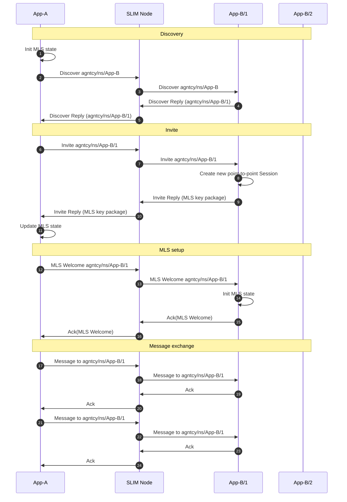
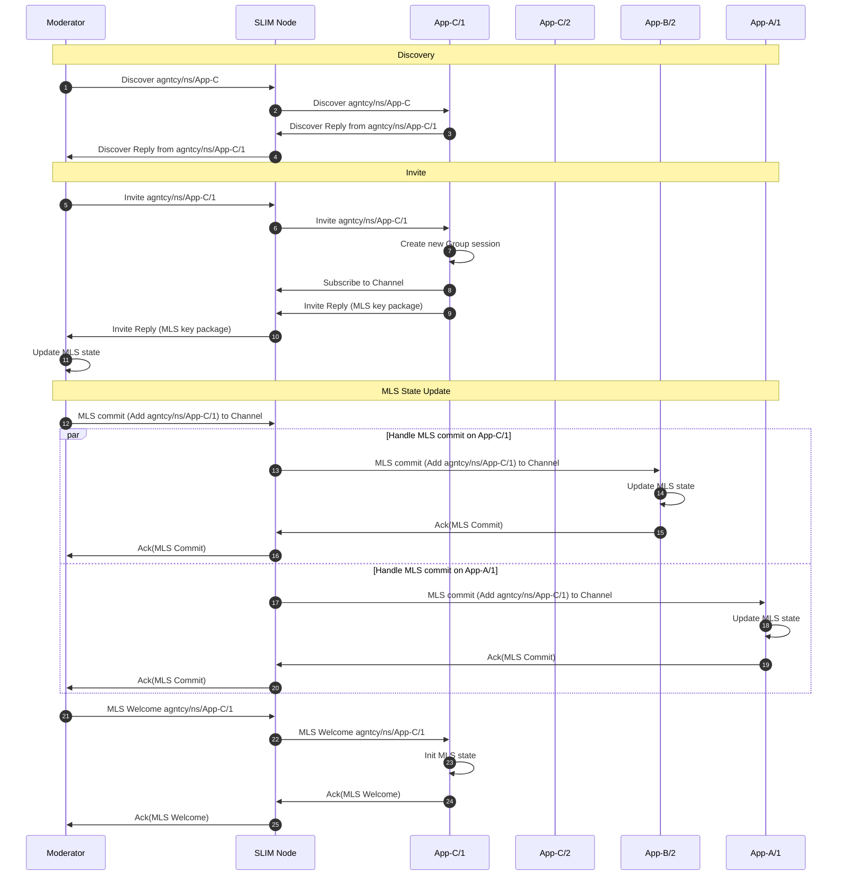
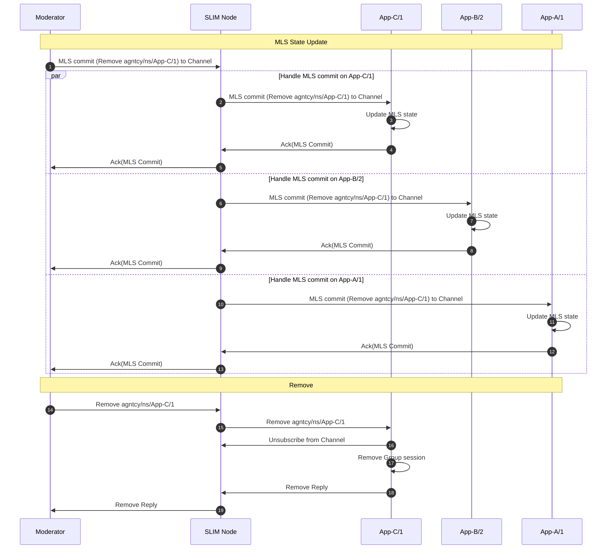

# SLIM Sessions

This document explains the SLIM session layer and the two supported session
types. It helps you understand the two session interfaces, reliability, and security trade‑offs.

The SLIM repository ships with practical, runnable [examples](https://github.com/agntcy/slim/tree/main/data-plane/python/bindings/examples) that demonstrate how to create sessions and exchange messages between applications using the Python bindings.

## Point-to-Point Session

The point-to-point session enables point-to-point communication with a specific
instance. This session
performs a discovery phase to bind to one instance and all subsequent traffic in
the session targets that same endpoint. With reliability enabled, each message in
the session must be acked.

If MLS is enabled, the point-to-point session establishes a two‑member MLS group after
discovery. This mirrors the Group flow but with only two participants
(see [Group Session](#group-session)).

The diagram below illustrates a point-to-point session from App-A to agntcy/ns/App-B.
App-A first discovers an available instance (App-B/1), then performs the MLS
setup, and finally sends multiple messages to that same instance, each followed
by an Ack. If MLS is not enabled, the MLS setup is skipped.



### Create a Point-to-Point Session

Using the SLIM Python bindings, you can create a point-to-point session as follows:

```python
# Assume local_app is an initialized application instance
session = await local_app.create_session(
    slim_bindings.PySessionConfiguration.PointToPoint(
        peer_name=remote_name,
        max_retries=5,
        timeout=datetime.timedelta(seconds=5),
        mls_enabled=True,  # Enable MLS for end-to-end security
    )
)
```

Parameters:

* `peer_name` (required, PyName): Identifier of the remote participant
    instance.
* `max_retries` (optional, int): Retry attempts per message if Ack missing.
* `timeout` (optional, timedelta): Wait per attempt for an Ack before retry.
    If `timeout` is not set, the session is best‑effort.
* `mls_enabled` (optional, bool): Enable end‑to‑end encryption (MLS).

### Sending and Replying in a Point-to-Point Session

As the point-to-point session is bound to a single remote instance after discovery,
outbound messages use the implicit destination. Use `publish` for normal sends
and `publish_to` to reply using a previously received message context.

This example shows how to send and reply in a point-to-point session:

```python
# Send a message using publish it will reach the endpoint
# specified and the session creation
await session.publish(b"hello")

# Await reply from remote (pattern depends on your control loop)
msg_ctx, payload = await session.get_message()
print(payload.decode())

# Send a correlated response back (echo style)
# The message will be sent according to the info in msg_ctx
await session.publish_to(msg_ctx, payload)
```

### Point-to-Point Example

This [example](https://github.com/agntcy/slim/blob/main/data-plane/python/bindings/examples/src/slim_bindings_examples/point_to_point.py) walks through the creation of a point-to-point session. When running the point-to-point example multiple times, the session binds to different running instances, while the message stream always sticks to the same endpoint.

The example demonstrates how to publish messages, enable reliability, and enable MLS for end‑to‑end security. The associated [README](https://github.com/agntcy/slim/blob/main/data-plane/python/bindings/examples/src/slim_bindings_examples/README_point_to_point.md) shows more information and how to run the example using the Taskfile provided in the repository.

## Group Session

The Group session allows many-to-many communication on a named channel. Each
message is delivered to all participants connected to the same session.

The creator of the channel can act as a moderator, meaning that it can add or
remove participants from the session. Moderation can be built into your application
or delegated to a separate control service or the SLIM control plane.

Below are examples using the latest Python bindings, along with explanations of
what happens inside the session layer when a participant is added or removed
from the channel (see [Group management](./slim-group.md)).

### Create a Group Session

To create a group session, you need to configure the session with a topic
name and specify reliability and security settings. Here is an
example:

```python
# Assume local_app is an initialized application instance
session = await local_app.create_session(
    slim_bindings.PySessionConfiguration.Group(
        channel_name=chat_topic,
        max_retries=5,
        timeout=datetime.timedelta(seconds=5),
        mls_enabled=True,
    )
)
```

Parameters:

* `topic` (required, PyName): Channel/Topic name where all the messages are
    delivered.
* `max_retries` (optional, int): Retry attempts for missing Acks.
* `timeout` (optional, timedelta): Wait per attempt for Ack before retry.
    If `timeout` is not set the session is best‑effort.
* `mls_enabled` (optional, bool): Enable secure group MLS messaging.

### Sending and Replying in a Group Session

In a Group, the session targets a channel: all sends are delivered to all the current
participants. Use `publish` to send a message to all the participants in the group.

```python
# Broadcast to the channel
await session.publish(b"hello")

# Handle inbound messages
msg_ctx, data = await session.get_message()
print("channel received:", data.decode())
```

### Invite a New Participant

The creator of the session can invite a new participant to the channel using the `invite`
method after creating the session.

```python
# After creating the session:
invite_name = slim_bindings.PyName("agntcy", "ns", "participant")
await local_app.set_route(invite_name)
await session.invite(invite_name)
```

Parameters:

* `invite_name` (PyName): Identifier of the participant to add.

Notice the `await local_app.set_route(invite_name)` command before the invite.
This instructs SLIM on how to forward a message with the specified name.
This has to be done by the application for every invite.

When a moderator wants to add a new participant (e.g., an instance of App-C) to
a group session, the following steps occur. All the steps are visualized in
the diagram below:

1. **Discovery Phase:** The moderator initiates a discovery request to find a
    running instance of the desired application (App-C). This request is sent to
    the SLIM Node, which forwards it via anycast to one of the App-C instances.
    In the example, the message is forwarded to App-C/1 that replies with its
    full identifier. The SLIM Node relays this reply back to the moderator.

2. **Invitation:** The moderator sends an invite message for the discovered
    instance (App-C/1) to the SLIM Node, which forwards it to App-C/1. Upon
    receiving the invite, App-C/1 creates a new group session, subscribes to
    the channel, and replies with its MLS (Messaging Layer Security) key
    package. This reply is routed back to the moderator.

3. **MLS State Update:** The moderator initiates an MLS commit to add App-C/1
    to the secure group. The message is sent using the channel name and so the
    SLIM Node distributes this commit to all current participants (App-B/2 and
    App-A/1), who update their MLS state and acknowledge the commit. The
    moderator collects all acknowledgments. Once all acknowledgments are
    received, the moderator sends an MLS Welcome message to App-C/1. App-C/1
    initializes its MLS state and acknowledges receipt. At the end of this
    process, all participants (including the new one) share a secure group state
    and can exchange encrypted messages on the group channel. If MLS is
    disabled, the MLS state update and welcome step are skipped.



### Remove a Participant

A moderator can remove a participant from the channel using the `remove`
method after creating the session.

This example shows how to remove a participant from a group session:

```python
# To remove a participant from the session:
remove_name = slim_bindings.PyName("agntcy", "ns", "participant")
await session.remove(remove_name)
```

Parameter:

* `remove_name` (PyName): Identifier of the participant to remove.

When a moderator wants to remove a participant (e.g., App-C/1) from a group
session, the following steps occur. All the steps are visualized in the diagram
below:

1. **MLS State Update:** The moderator creates an MLS commit to remove App-C/1
    from the secure group. This commit is sent to the group channel and the
    SLIM Node distributes it to all current participants (App-C/1, App-B/2, and
    App-A/1). Each participant updates its MLS state and acknowledges the
    commit. The moderator collects all acknowledgments. In case the MLS is
    disabled, this step is not executed.

2. **Removal:** After the MLS state is updated, the moderator sends a remove
    message to App-C/1. Upon receiving the remove message, App-C/1 unsubscribes
    from the channel, deletes its group session, and replies with a
    confirmation. The SLIM Node relays this confirmation back to the moderator.
    At the end of this process, App-C/1 is no longer a member of the group
    and cannot send or receive messages on the channel.



### Group Example

This [example](https://github.com/agntcy/slim/blob/main/data-plane/python/bindings/examples/src/slim_bindings_examples/group.py) demonstrates how to create a group session, invite participants, and (if enabled) establish an MLS group for end-to-end encryption. It also shows how to broadcast messages to all current members and handle inbound group messages. The associated [README](https://github.com/agntcy/slim/blob/main/data-plane/python/bindings/examples/src/slim_bindings_examples/README_group.md) shows more information and how to run the example using the Taskfile.
