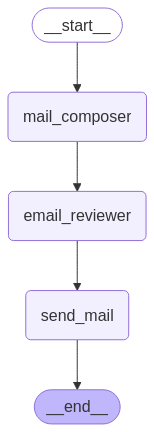

# Sample Multi Agent Software - Step by Step Tutorial

This guide will help you transform a simple [LangGraph application](https://langchain-ai.github.io/langgraph/tutorials/introduction/#part-1-build-a-basic-chatbot) into a robust multi-agent software, which uses the [Agent Connect Protocol (ACP)](https://docs.agntcy.org/pages/syntactic_sdk/connect.html) to allow communication between distributed agents. These agents run on a [Workflow Server](https://docs.agntcy.org/pages/agws/workflow_server.html), where they are deployed and executed remotely. To make the explanation clearer, we provide a [marketing campaign manager example](https://github.com/agntcy/acp-sdk/tree/main/examples/marketing-campaign) that demonstrates how to integrate the capabilities of different agents into a unified application.


## Overview

In this tutorial, we assume you **already know the agents you wish to integrate into your system**. For our example, these are the [Mail Composer](https://github.com/agntcy/acp-sdk/tree/main/examples/mailcomposer) and [Email Reviewer](https://github.com/agntcy/acp-sdk/tree/main/examples/email_reviewer) agents. You should have **access to their manifests**, which are fundamental for **generating** the necessary **data types** and structures for integration.

This tutorial is structured to guide you through the following key steps:

1. [Create a Basic LangGraph Skeleton Application](#step-1-create-a-basic-langgraph-skeleton-application): Set up a LangGraph application structure to serve as the base of your multi-agent software.

2. [Generate Models from Agent Manifests](#step-2-generate-models-from-agent-manifests): Use agent manifests to generate models defining data structures and interfaces.

3. [State Definition](#step-3-state-definition): Create states to manage the flow of your multi-agent software (MAS).

4. [Multi-Agent Application Development](#step-4-multi-agent-application-development): Use ACP SDK to integrate ACP nodes into your LangGraph application.

5. [API Bridge Integration](#step-5-api-bridge-integration): Connect natural language outputs to structured API requests.

6. [I/O Mapper Integration](#step-6-io-mapper-integration): Adjust inputs and outputs between different agents such that they match in format and meaning.

### Final Thoughts

- [Resulting Graph and Conclusion](#resulting-graph-and-conclusion): Review the complete graph and summarize the key takeaways from this tutorial.


## Prerequisites

- A working installation of [Python](https://www.python.org/) 3.9 or higher
- [Poetry](https://pypi.org/project/poetry/) v2 or greater
- [ACP SDK](https://github.com/agntcy/acp-sdk): Includes a CLI for generating models, OpenAPI specifications, and validating agent manifests
- [Curl](https://curl.se/)


## Step 1: Create a Basic LangGraph Skeleton Application

Let's start by setting up our project environment. You can either use pip to install the required packages or Poetry for dependency management.

### Setting up the project

First, create a new directory for your project:

```bash
mkdir marketing-campaign-mas
cd marketing-campaign-mas
```

Create a `pyproject.toml` file with the following dependencies:

```
[tool.poetry]
name = "marketing-campaign-mas"
version = "0.1.0"
description = "Multi-agent software for marketing campaigns"
authors = ["Your Name <your.email@example.com>"]

[tool.poetry.dependencies]
python = "^3.9"
python-dotenv = "^1.0.1"
langgraph = "^0.3.5"
langchain-openai = "^0.3.8"
langchain = "^0.3.20"
agntcy-acp = "1.1.2"

[build-system]
requires = ["poetry-core>=2.0.0,<3.0.0"]
build-backend = "poetry.core.masonry.api"
```

Install the dependencies:

```bash
# Create virtual environment in .venv inside project directory
export POETRY_VIRTUALENVS_IN_PROJECT=true
# Install all dependencies
poetry install --no-root
```


### Building a Simple LangGraph Skeleton

Now let's begin by setting up a **simple LangGraph** skeleton application with the following nodes:

*Start, Mail Composer, Email Reviewer, Send Mail, and End*




This setup is a basic framework with **placeholders for each task** in the workflow. It sets the stage for **transforming** these nodes into remote **ACP nodes**, allowing the interaction with **real remote agents**.

The ultimate goal of this application is to compose and review emails that will be sent to a mail recipient. Each node represents a task to be performed in this process, from composing the email to reviewing it, and finally sending it.


### Skeleton Code Example

To create the initial structure of our application (skeleton), we need to create a Python file that defines our LangGraph application with placeholder nodes. This serves as the foundation that we'll enhance later with ACP integration.

Let's create a file named `marketing_campaign.py` with the following content:

```python
# marketing_campaign.py

from langgraph.graph import StateGraph, START, END
from langgraph.graph.state import CompiledStateGraph
from langchain_core.runnables.graph import MermaidDrawMethod
from pydantic import BaseModel, Field
from typing import Optional, List

# Define the overall state with placeholders for future use
class OverallState(BaseModel):
    messages: List[str] = Field([], description="Chat messages")
    has_composer_completed: Optional[bool] = Field(None, description="Flag indicating if the mail composer has successfully completed its task")
    mailcomposer_output: Optional[str] = Field(None, description="Output from Mail Composer")
    email_reviewer_output: Optional[str] = Field(None, description="Output from Email Reviewer")
    sendgrid_result: Optional[str] = Field(None, description="Result from SendGrid API call")

def mail_composer(state: OverallState) -> OverallState:
    # Placeholder logic for composing mail
    print("Composing mail...")
    state.mailcomposer_output = "Draft email content"
    state.has_composer_completed = True
    return state

def email_reviewer(state: OverallState) -> OverallState:
    # Placeholder logic for reviewing email
    print("Reviewing email...")
    state.email_reviewer_output = "Reviewed email content"
    return state

def send_mail(state: OverallState) -> OverallState:
    # Placeholder logic for sending email
    print("Sending email...")
    state.sendgrid_result = "Email sent successfully"
    return state

# Build the state graph with placeholder nodes
def build_app_graph() -> CompiledStateGraph:
    sg = StateGraph(OverallState)

    # Add placeholder nodes
    sg.add_node(mail_composer)
    sg.add_node(email_reviewer)
    sg.add_node(send_mail)

    # Define the flow of the graph
    sg.add_edge(START, mail_composer.__name__)
    sg.add_edge(mail_composer.__name__, email_reviewer.__name__)
    sg.add_edge(email_reviewer.__name__, send_mail.__name__)
    sg.add_edge(send_mail.__name__, END)

    graph = sg.compile()
    graph.name = "Marketing Campaign Manager"
    with open("marketing_campaign_skeleton.png", "wb") as f:
        f.write(graph.get_graph().draw_mermaid_png(
            draw_method=MermaidDrawMethod.API,
        ))
    return graph

# Compile and skeleton graph
if __name__ == "__main__":
    graph = build_app_graph()
    print("Skeleton graph compiled successfully.")
```

Let's run our code to make sure everything works as expected:

```bash
poetry run python marketing_campaign.py
```

You should see the output:
```
"Skeleton graph compiled successfully."
```

And a file named "marketing_campaign_skeleton.png" should be created in your directory, showing a visualization of your LangGraph with the nodes we've defined.


## Step 2: Generate Models from Agent Manifests

In this step, you will **generate** models based on the agent manifests to define the **input, output and config schemas** for each agent involved in MAS. The models are created using the `acp generate-agent-models` cli command, which reads the agent manifest files and produces Python files that encapsulate the agent's data structures and interfaces necessary for integration.

> **What is an Agent Manifest?**
> An Agent Manifest is a detailed document outlining an agent's capabilities, deployment methods, data structure specifications and dependencies on other agents. It provides** essential information** for ensuring agents can communicate and work together within the **Agent Connect Protocol** and **Workflow Server ecosystem**. [Learn more](https://docs.agntcy.org/pages/agws/manifest.html)

### Schema and Type Generation

We will use two agents whose manifests

* ([Mail Composer Manifest](https://github.com/agntcy/acp-sdk/blob/main/examples/mailcomposer/deploy/mailcomposer.json)
* [Email Reviewer Manifest](https://github.com/agntcy/acp-sdk/blob/main/examples/email_reviewer/deploy/email_reviewer.json))

are provided within the [ACP SDK](https://github.com/agntcy/acp-sdk) repository. To proceed, let's download the manifest files:

```bash
# Create a manifests directory to store the agent manifests
mkdir -p manifests

# Download Mail Composer Manifest
curl -o manifests/mailcomposer.json https://raw.githubusercontent.com/agntcy/acp-sdk/main/examples/mailcomposer/deploy/mailcomposer.json

# Download Email Reviewer Manifest
curl -o manifests/email_reviewer.json https://raw.githubusercontent.com/agntcy/acp-sdk/main/examples/email_reviewer/deploy/email_reviewer.json
```

Now, we can generate the models using the `acp` command-line tool that was installed as part of our dependencies:

```bash
# Activate the virtual environment (use 'poetry shell' if you have installed: poetry self add poetry-plugin-shell)
source .venv/bin/activate  # Or 'poetry shell'

# Generate models for Mail Composer
acp generate-agent-models manifests/mailcomposer.json --output-dir ./models --model-file-name mailcomposer.py

# Generate models for Email Reviewer
acp generate-agent-models manifests/email_reviewer.json --output-dir ./models --model-file-name email_reviewer.py
```

These commands create the necessary Python files containing the Pydantic models for interacting with these agents.

> **Model File Structure:**
> - **Pydantic Models**: Each file includes Pydantic models that represent the **configuration**, **input**, and **output** schemas, enforcing type validation.
> - **Input, Output and Config Schemas**: These schemas handle incoming and outgoing data and the configuration of the agent.


## Step 3: State Definition

State management is fundamental to **track progress and outcomes** so that each agent can interact effectively with others following the right workflow. In this step, we will define the states necessary to manage the flow of your multi-agent software.

### Understanding State in Multi-Agent Systems

State in multi-agent systems refers to the structured data that represents the **current status of the application**. It includes information about the inputs, outputs, and **intermediate results** of each agent's operations. Effective state management allows for the **coordination and synchronization of agent activities**.

### State Definition in the Marketing Campaign Example

Create a file named `state.py` in the project directory that will hold state definitions for the MAS:

```python
# state.py

from pydantic import BaseModel, Field
from typing import Optional, List
from models.mailcomposer import Message, InputSchema as MailComposerInputSchema, OutputSchema as MailComposerOutputSchema
from models.email_reviewer import InputSchema as EmailReviewerInputSchema, OutputSchema as EmailReviewerOutputSchema, TargetAudience

class MailComposerState(BaseModel):
    input: Optional[MailComposerInputSchema] = None
    output: Optional[MailComposerOutputSchema] = None

class MailReviewerState(BaseModel):
    input: Optional[EmailReviewerInputSchema] = None
    output: Optional[EmailReviewerOutputSchema] = None

class OverallState(BaseModel):
    messages: List[Message] = Field([], description="Chat messages")
    operation_logs: List[str] = Field([],
                                    description="An array containing all the operations performed and their result. Each operation is appended to this array with a timestamp.",
                                    examples=[["Day DD HH:MM:SS Operation performed: email sent Result: OK",
                                              "Day DD HH:MM:SS Operation X failed"]])
    has_composer_completed: Optional[bool] = Field(None, description="Flag indicating if the mail composer has successfully completed its task")
    has_reviewer_completed: Optional[bool] = None
    has_sender_completed: Optional[bool] = None
    mailcomposer_state: Optional[MailComposerState] = None
    email_reviewer_state: Optional[MailReviewerState] = None
    target_audience: Optional[TargetAudience] = None
```

After creating the state file, update your `marketing_campaign.py` file to use this state definition:

```python
# Update imports in marketing_campaign.py
from langgraph.graph import StateGraph, START, END
from langgraph.graph.state import CompiledStateGraph
from langchain_core.runnables.graph import MermaidDrawMethod
# Import the state from our new file
from state import OverallState, MailComposerState

# IMPORTANT: Remove the
# class OverallState(BaseModel):
# definition. Rest of your code remains the same
# ...
```

> **Important**: When updating your application, make sure to remove the placeholder `OverallState` class defined in [Step 1](#step-1-create-a-basic-langgraph-skeleton-application) and import the state classes from your new `state.py` file. This ensures your application uses the proper state definitions that incorporate the agent models generated from the manifests in [Step 2](#step-2-generate-models-from-agent-manifests).

With this state definition in place, your application now has a structured approach for managing the flow of data between agents:

* The `OverallState` class captures the complete state of the application
* The individual component states (`MailComposerState`, `MailReviewerState`) handle the specific data requirements for each agent.

The next step involves transforming our placeholder nodes into actual ACP nodes for remote agent integration.

## Step 4: Multi-Agent Application Development

Now, let's enhance the skeleton setup by **transforming** LangGraph nodes **into ACP nodes** using `agntcy_acp` **sdk**. ACP nodes allow network communication between agents by using the **Agent Connect Protocol (ACP)**.
This enables remote invocation, configuration, and output retrieval with the goal of allowing heterogeneous and distributed agents to interoperate.


> **Why Use ACP?**
> 1. **Remote Execution**: ACP nodes run on a Workflow Server, making it possible to execute tasks remotely.
> 2. **Technology Independence**: ACP allows agents to be implemented in various technologies, such as LangGraph, LlamaIndex, etc., without compatibility issues.
> 3. **Interoperability**: ACP ensures that agents can communicate and work together, regardless of the underlying technology, by adhering to a standardized protocol.
> [Learn more about ACP](https://docs.agntcy.org/pages/syntactic_sdk/connect.html)


### Add Mail Composer and Email Reviewer ACP Nodes

To integrate the Mail Composer and Email Reviewer as ACP nodes, update the `marketing_campaign.py` file by adding the following imports and configuration at the top of the file:

```python
import os
from models import mailcomposer, email_reviewer
from agntcy_acp import ApiClientConfiguration
from agntcy_acp.langgraph.acp_node import ACPNode

# Fill in client configuration for the remote agents
MAILCOMPOSER_AGENT_ID = os.environ.get("MAILCOMPOSER_ID", "")
EMAIL_REVIEWER_AGENT_ID = os.environ.get("EMAIL_REVIEWER_ID", "")
mailcomposer_client_config = ApiClientConfiguration.fromEnvPrefix("MAILCOMPOSER_")
email_reviewer_client_config = ApiClientConfiguration.fromEnvPrefix("EMAIL_REVIEWER_")
```

> **Understanding fromEnvPrefix Method:**
> The `ApiClientConfiguration.fromEnvPrefix()` method simplifies configuration by automatically finding and using environment variables with a specific prefix. For example, with prefix "MAILCOMPOSER_", it will look for:
> - `MAILCOMPOSER_API_KEY`: Authentication key for the agent
> - `MAILCOMPOSER_HOST`: Base URL endpoint for the agent

Next, define the ACP nodes to **replace** our placeholder functions:

* Mail Composer ACP Node

    ```python
    acp_mailcomposer = ACPNode(
        name="mailcomposer",
        agent_id=MAILCOMPOSER_AGENT_ID,
        client_config=mailcomposer_client_config,
        input_path="mailcomposer_state.input",
        input_type=mailcomposer.InputSchema,
        output_path="mailcomposer_state.output",
        output_type=mailcomposer.OutputSchema,
    )
    ```

* Email Reviewer ACP Node

    ```python
    acp_email_reviewer = ACPNode(
        name="email_reviewer",
        agent_id=EMAIL_REVIEWER_AGENT_ID,
        client_config=email_reviewer_client_config,
        input_path="email_reviewer_state.input",
        input_type=email_reviewer.InputSchema,
        output_path="email_reviewer_state.output",
        output_type=email_reviewer.OutputSchema,
    )
    ```

> **Note**: The `_ path` fields indicate where to find the input and output in the `OverallState`, while the `_type` fields specify the type of the input and output schemas.

Finally, update the `build_app_graph` function to use these ACP nodes instead of the placeholder functions:

```python
def build_app_graph() -> CompiledStateGraph:
    sg = StateGraph(OverallState)

    # Replace placeholder nodes with ACP nodes
    sg.add_node(acp_mailcomposer)
    sg.add_node(acp_email_reviewer)
    sg.add_node(send_mail)  # We'll replace this with an API Bridge Agent node in Step 5

    # Define the flow of the graph
    sg.add_edge(START, acp_mailcomposer.name)
    sg.add_edge(acp_mailcomposer.name, acp_email_reviewer.name)
    sg.add_edge(acp_email_reviewer.name, send_mail.__name__)
    sg.add_edge(send_mail.__name__, END)

    graph = sg.compile()
    graph.name = "Marketing Campaign Manager"
    with open("marketing_campaign_acp.png", "wb") as f:
        f.write(graph.get_graph().draw_mermaid_png(
            draw_method=MermaidDrawMethod.API,
        ))
    return graph
```


## Step 5: API Bridge Integration

The API Bridge **converts natural language outputs into structured API requests**. The input to the API Bridge is in natural language, but APIs like [SendGrid APIs](https://github.com/twilio/sendgrid-oai/blob/main/spec/json/tsg_mail_v3.json) require specifically structured formats. The API Bridge ensures that the **correct endpoint and request format** are used.

For more detailed information about the API Bridge Agent implementation and configuration, please refer to the [API Bridge documentation](https://docs.agntcy.org/pages/syntactic_sdk/api_bridge_agent.html).

### Add SendGrid API Bridge Node

To integrate the SendGrid API Bridge into our `marketing_campaign.py` file, add the following imports at the top of your file (along with the previous imports):

```python
from agntcy_acp.langgraph.api_bridge import APIBridgeAgentNode
```

Then add the SendGrid configuration below the existing agent configurations:

```python
# Instantiate APIBridge Agent Node
SENDGRID_HOST = os.environ.get("SENDGRID_HOST", "http://localhost:8080")
sendgrid_api_key = os.environ.get("SENDGRID_API_KEY", None)
if sendgrid_api_key is None:
    raise ValueError("SENDGRID_API_KEY environment variable is not set")

send_email = APIBridgeAgentNode(
    name="sendgrid",
    input_path="sendgrid_state.input",
    output_path="sendgrid_state.output",
    service_api_key=sendgrid_api_key,
    hostname=SENDGRID_HOST,
    service_name="sendgrid/v3/mail/send"
)
```
> **Explanation**:
> - The `_path` fields indicate where to find the input and output in the `OverallState`, as explained in [Step 4](#step-4-multi-agent-application-development).
> - The `service_name` field specifies the endpoint manually (`sendgrid/v3/mail/send`). However, the API Bridge can **automatically determine** the correct endpoint based on the natural language request if this field is not provided. [Learn more](https://docs.agntcy.org/pages/syntactic_sdk/api_bridge_agent.html)


Finally, update your `build_app_graph` function to **replace** the placeholder `send_mail` function defined in [Step 1](#step-1-create-a-basic-langgraph-skeleton-application) with the new `send_email` API Bridge node:

```python
def build_app_graph() -> CompiledStateGraph:
    sg = StateGraph(OverallState)

    # Replace placeholder nodes with ACP nodes
    sg.add_node(acp_mailcomposer)
    sg.add_node(acp_email_reviewer)
    sg.add_node(send_email)  # Replace the placeholder send_mail with the API Bridge

    # Define the flow of the graph
    sg.add_edge(START, acp_mailcomposer.name)
    sg.add_edge(acp_mailcomposer.name, acp_email_reviewer.name)
    sg.add_edge(acp_email_reviewer.name, send_email.name)
    sg.add_edge(send_email.name, END)

    graph = sg.compile()
    graph.name = "Marketing Campaign Manager"
    with open("marketing_campaign_acp.png", "wb") as f:
        f.write(graph.get_graph().draw_mermaid_png(
            draw_method=MermaidDrawMethod.API,
        ))
    return graph
```

For a complete setup guide including Tyk gateway configuration and SendGrid API details, see the [SendGrid API Bridge example in the ACP SDK documentation](https://docs.agntcy.org/pages/syntactic_sdk/api_bridge_agent.html#an-example-with-sendgrid-api).


## Step 6: Input and Output Processing and I/O Mapper Integration

In this section, we will explore how to handle inputs and outputs effectively within the workflow. Managing the flow of data between agents allows to maintain the integrity of the process.

To achieve this, we not only added the **I/O Mapper**, a powerful tool that automatically transforms outputs from one node to match the input requirements of the next using an LLM, but also **introduced additional nodes** to demonstrate how to perform **manual mapping**. This combination showcases both automated and manual approaches handle the state within the application.

### Why Use I/O Mapper?

> **What is I/O Mapper?**  
> I/O Mapper is a component that ensures compatibility between agents by **transforming outputs to meet the input requirements** of subsequent agents. It addresses both **format-level** and **semantic-level** compatibility by leveraging an LLM to perform tasks such as:
> 
> - **JSON Structure Transcoding**: Remapping JSON dictionaries.
> - **Text Summarization**: Reducing or refining text content.
> - **Text Translation**: Translating text between languages.
> - **Text Manipulation**: Reformulating or extracting specific information.
>
> For more details on I/O Mapper functionality and implementation, see the [official I/O Mapper documentation](https://docs.agntcy.org/pages/semantic_sdk/io_mapper.html).


### I/O Processing Overview

Among the three nodes added so far, some additional nodes are required to handle input and output transformations effectively. Specifically, as shown in [Marketing Campaign MAS](https://github.com/agntcy/acp-sdk/blob/main/examples/marketing-campaign/src/marketing_campaign/app.py), the following nodes were added:

- **`process_inputs`**: Processes the user's input, updates the `OverallState`, and initializes the `mailcomposer_state` with messages to ensure they are correctly interpreted by the `mailcomposer`. It also checks if the user has completed their interaction (e.g., input is "OK"), which means the user is satisfied about the composed email.

- **`prepare_sendgrid_input`**: This node prepares the input for the SendGrid API. It constructs a query in natural language to send an email, using the corrected email content from the `email_reviewer` and configuration details like the recipient and sender email addresses.

- **`prepare_output`**: This node consolidates the outputs of the application. It updates the `OverallState` with the final email content and logs the result of the email send operation.

To make this tutorial code fully functional, we need to add implementations for the processing nodes mentioned above:

1. First, update the `state.py` file to include a SendGridState definition:
    ```python
    # state.py
    from agntcy_acp.langgraph.api_bridge import APIBridgeOutput, APIBridgeInput
    from pydantic import BaseModel, Field
    from typing import List, Optional
    from langchain_core.messages import  AIMessage, HumanMessage
    from marketing_campaign import mailcomposer
    from marketing_campaign import email_reviewer

    class ConfigModel(BaseModel):
        recipient_email_address: str = Field(..., description="Email address of the email recipient")
        sender_email_address: str = Field(..., description="Email address of the email sender")
        target_audience: email_reviewer.TargetAudience = Field(..., description="Target audience for the marketing campaign")

    class MailComposerState(BaseModel):
        input: Optional[mailcomposer.InputSchema] = None
        output: Optional[mailcomposer.OutputSchema] = None

    class MailReviewerState(BaseModel):
        input: Optional[email_reviewer.InputSchema] = None
        output: Optional[email_reviewer.OutputSchema] = None

    class SendGridState(BaseModel):
        input: Optional[APIBridgeInput] = None
        output: Optional[APIBridgeOutput]= None

    class OverallState(BaseModel):
        messages: List[mailcomposer.Message] = Field([], description="Chat messages")
        operation_logs: List[str] = Field([],
                                        description="An array containing all the operations performed and their result. Each operation is appended to this array with a timestamp.",
                                        examples=[["Mar 15 18:10:39 Operation performed: email sent Result: OK",
                                                    "Mar 19 18:13:39 Operation X failed"]])

        has_composer_completed: Optional[bool] = Field(None, description="Flag indicating if the mail composer has succesfully completed its task")
        has_reviewer_completed: Optional[bool] = None
        has_sender_completed: Optional[bool] = None
        mailcomposer_state: Optional[MailComposerState] = None
        email_reviewer_state: Optional[MailReviewerState] = None
        target_audience: Optional[email_reviewer.TargetAudience] = None
        sendgrid_state: Optional[SendGridState] = None
    ```


2. Then, update imports at the top of your `marketing_campaign.py` file:

    ```python
    import copy
    from state import OverallState, MailComposerState, SendGridState
    from agntcy_acp.langgraph.api_bridge import APIBridgeAgentNode, APIBridgeInput
    from langchain_core.runnables import RunnableConfig
    ```


3. Finally, implement the processing nodes in `marketing_campaign.py`:
    ```python
    def process_inputs(state: OverallState, config: RunnableConfig) -> OverallState:
        cfg = config.get('configurable', {})

        user_message = state.messages[-1].content

        if user_message.upper() == "OK":
            state.has_composer_completed = True

        else:
            state.has_composer_completed = False

        state.target_audience = email_reviewer.TargetAudience(cfg["target_audience"])

        state.mailcomposer_state = MailComposerState(
            input=mailcomposer.InputSchema(
                messages=copy.deepcopy(state.messages),
                is_completed=state.has_composer_completed
            )

        )
        return state

    def prepare_sendgrid_input(state: OverallState, config: RunnableConfig) -> OverallState:
        cfg = config.get('configurable', {})
        state.sendgrid_state = SendGridState(
            input=APIBridgeInput(
                query=f""
                    f"Please send an email to {cfg['recipient_email_address']} from {cfg['sender_email_address']}.\n"
                    f"Content of the email should be the following:\n"
                    f"{state.email_reviewer_state.output.corrected_email if (state.email_reviewer_state
                        and state.email_reviewer_state.output
                        and hasattr(state.email_reviewer_state.output, 'corrected_email')
                        ) else ''}"
            )
        )
        return state

    def prepare_output(state: OverallState, config:RunnableConfig) -> OverallState:
        state.messages = copy.deepcopy(
            state.mailcomposer_state.output.messages if (state.mailcomposer_state
                and state.mailcomposer_state.output
                and state.mailcomposer_state.output.messages
            ) else []
        )
        if state.sendgrid_state and state.sendgrid_state.output and state.sendgrid_state.output.result:
            state.operation_logs.append(f"Email Send Operation: {state.sendgrid_state.output.result}")

        return state
    ```

### Conditional Edge with I/O Mapper

The edge between the `mailcomposer` and subsequent nodes is a **conditional edge**. This edge uses the `check_final_email` **function to determine the next step** to be executed. The condition works as follows:

- If the user input is **not "OK"**, the graph transitions to the `prepare_output` node, allowing the user to interact with the `mailcomposer` again.
- If the user input is **"OK"**, the graph transitions to the `email_reviewer` node and continues through the workflow.

The conditional edge is implemented with the I/O Mapper, which ensures that the outputs of one node are transformed to match the input requirements of the next node. Here's the code of `marketing_campaign.py` for implementing the conditional edge:

1. Add LLM client for the I/O Mapper, in this example `AzureChatOpenAI`, but you can use any LLM client supported by LangChain
    ```python
    from langchain_openai.chat_models.azure import AzureChatOpenAI

    llm = AzureChatOpenAI(
        model="gpt-4o-mini",
        api_version="2024-07-01-preview",
        seed=42,
        temperature=0,
    )
    ```

2. Define the conditional edge function
    ```python
    def check_final_email(state: state.OverallState):
        return "done" if (state.mailcomposer_state
                        and state.mailcomposer_state.output
                        and state.mailcomposer_state.output.final_email
                        ) else "user"
    ```

3. Next, update the `build_app_graph` function to include our new nodes and the `add_io_mapped_conditional_edge` edge:

    ```python
    # Add nodes
    sg.add_node(process_inputs)
    sg.add_node(acp_mailcomposer)
    sg.add_node(acp_email_reviewer)
    sg.add_node(send_email)
    sg.add_node(prepare_sendgrid_input)
    sg.add_node(prepare_output)

    # Add edges
    sg.add_edge(START, "process_inputs")
    sg.add_edge("process_inputs", acp_mailcomposer.get_name())

    ## Add conditional edge between mailcomposer and either email_reviewer or END, adding io_mappers between them
    add_io_mapped_conditional_edge(
        sg,
        start=acp_mailcomposer,
        path=check_final_email,
        iomapper_config_map={
            "done": {
                "end": acp_email_reviewer,
                "metadata": {
                    "input_fields": ["mailcomposer_state.output.final_email", "target_audience"]
                }
            },
            "user": {
                "end": "prepare_output",
                "metadata": None
            }
        },
        llm=llm
    )

    sg.add_edge(acp_email_reviewer.get_name(), "prepare_sendgrid_input")
    sg.add_edge("prepare_sendgrid_input", send_email.get_name())
    sg.add_edge(send_email.get_name(), "prepare_output")
    sg.add_edge("prepare_output", END)
    ```

#### Explanation of Parameters and Workflow Behavior:

- **`start=acp_mailcomposer`**: Specifies the starting node for the conditional edge, which is the `mailcomposer`.
- **`path=check_final_email`**: This is the function that determines the condition for the edge. It returns either `"done"` or `"user"`.
  - `"done"` indicates that the user is satisfied with the composed email, so to go to the `email_reviewer`.
  - `"user"` indicates that the user is not satisfied, and move towards `prepare_output` to log the results and loops back to the user.

- **`"input_fields": ["mailcomposer_state.output.final_email", "target_audience"]`**: Specifies what to map:
  - `"mailcomposer_state.output.final_email"`: Automatically takes the `final_email` output from the `mailcomposer` and maps it to the input defined in the manifest of the `email_reviewer`
  - `"target_audience"`: is populated during `process_inputs` from the configuration, required by `email_reviewer`

> **Note**: All paths specified in the `input_fields` are rooted in the `OverallState`


### Resulting Graph and Conclusion

Below is the final graph that represents the **complete process** of composing, reviewing, and sending an email. This graph shows how agents are connected, how inputs and outputs are processed, and how the application adapts dynamically based on user interactions.


The MAS begins with the `process_inputs` node and transitions to the `mailcomposer` node, where the email draft is created. A **conditional edge** allows the user to interact with the `mailcomposer` until they are satisfied with the composed email. Once confirmed, the workflow proceeds through the following nodes in sequence:

1. **`email_reviewer`**: Reviews and refines the email content.
2. **`prepare_sendgrid_input`**: Prepares the input for the SendGrid API.
3. **`sendgrid`**: Sends the email using the SendGrid API.
4. **`prepare_output`**: Consolidates the final output and logs the result.

This graph highlights the **importance of input and output transformations**, the role of the **I/O Mapper** in ensuring compatibility between agents, and the flexibility provided by conditional edges to adapt the workflow dynamically. With this setup, the system achieves a robust and user-friendly process for managing email campaigns.

### Conclusion

In this tutorial, we demonstrated how to build a Multi-Agent System (MAS) using the ACP SDK. Starting from a basic LangGraph skeleton application, we progressively integrated agents, defined states, and implemented advanced features such as the I/O Mapper and API Bridge integration. These components allowed us to create a dynamic and flexible flow that ensures compatibility between agents and adapts to user interactions.

By following this approach, you can design and implement your own MAS tailored to specific use cases, leveraging the power of ACP to enable communication and collaboration between distributed agents. The tools and techniques presented here provide a solid foundation for building scalable, efficient, and user-friendly multi-agent software.