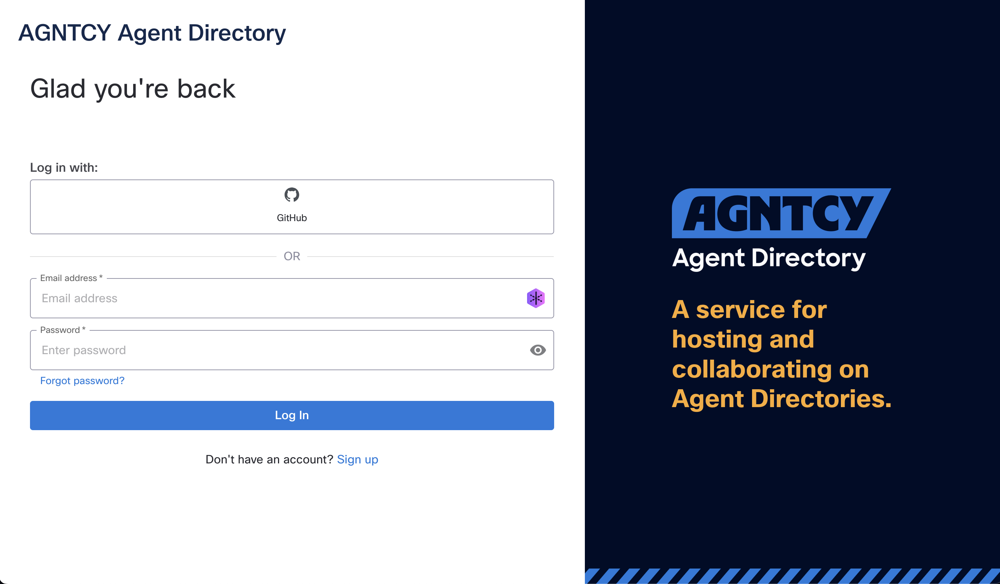
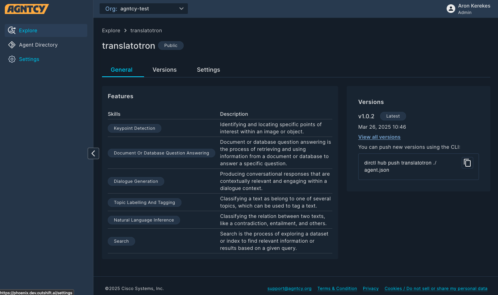
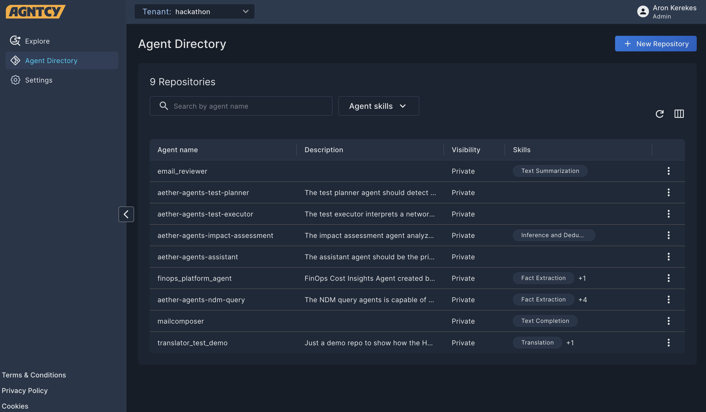

# Agent Hub

The Agent Hub is designed to provide a robust multi-tenant platform for hosting and managing agents. Its primary aim is to deliver a hub-like user experience, facilitating easy navigation and management for users. The Agent Hub acts as a centralized point for organizing and accessing agent repositories. This service is enhanced by a gRPC API that supports efficient service communication and integration, ensuring seamless interaction between components.

The Agent Hub serves as a centralized platform for hosting and managing various agent-related services. The main purpose is to provide a comprehensive solution for developers and IT admins to register, discover, and manage agents in an organized manner. By offering a secure environment for authentication and user management, it ensures that organizations can confidently manage their agent directories and related services.

## Features

The Agent Hub enables users to:

* View and search for public agents.
* Create repositories.
* Publish agent records.
* Access multiple separate tenants.

## Using the Agent Hub

### Signing up for the Agent Hub and Logging in

To get started with the Agent Hub, sign up at the [Agent Hub homepage](https://phoenix.dev.outshift.ai) for free. You can create a dedicated account with your email address, or use one of several SSO options. Once your account is created, you simply log in.

### The Explore Page

The Explore page offers an overview of the agents registered and enables the user to explore them.

You can refine the results using predefined filters and open search:

* Use the **Search** bar to search for a text string in an agent name. To clear the search, click the **×**.
* Use the drop-down **Filters** list to narrow the results by Agent Skill.
* Use the drop-down **Sort by** list to sort the displayed items by Most Recent or Oldest.

You can change tenants by clicking the Tenant drop-down list and selecting another tenant.

### Agent Details

Clicking on an agent opens the Agent Details page with further information on the agent.

The **General** tab lists the following information:

* A description of the agent.
* The creator of the agent.
* The skills associated with the agent.
* The version number and date of publishing.
* The CLI command to pull the agent's directory.

The **Versions** tab lists the published versions of the agent.

The **Settings** tab allows the owner to change the description and the visibility of the agent.

### The Agent Directory Page

The Agent Directory Page allows you to view, edit, and create agents in the Agent Hub. Here the agents are displayed in a table with customizable columns.

You can select which columns are displayed, and in which order, by clicking the **Arrange Columns** button (***▥***).

You can reload the listed items by clicking the **Reload** button (**⟳**).

You can refine the results using predefined filters and open search:

* Use the **Search** bar to search for a text string in an agent name. To clear the search, click the **×**.
* Use the drop-down **Filters** list to narrow the results by Agent Skill.
* Use the drop-down **Sort by** list to sort the displayed items by Most Recent or Oldest.

#### Agent Actions

Clicking the three dots (**⁝**) at the end of any record in the Agent Dikrectory table opens a drop-down list of actions you can perform on that agent.

* Click **Open Details** to view the agent.
* Click **Edit** to edit the agent.
* Click **Delete** to delete the agent.

#### Create

To list an agent in the Agent Hub:

1. Click the **+ New Repository** button.
1. Enter the repositort name and description.
1. Select the visibility for your agent.
    * Public agents appear in search results.
    * Private agents are only visible in your tenant.
1. Click **Publish**.
1. You can also publish the agent using the generated CLI command.
1. Click **Finish**.

Your agent is created in the Agent Hub.

### Settings

The settings page allows you to manage your tenants and users.

#### Tenants

The tenants available to you are listed under the **Tenants** tab.

Clicking the three dots (**⁝**) at the end of any record in opens a drop-down list of actions you can perform on that tenant.

* Click **Edit** to edit the tenant.
* Click **Delete** to delete the tenant.
* Click **Switch** to switch to the tenant.

You can reload the listed items by clicking the **Reload** button (**⟳**).

#### Users

The users in a tenant are listed under the **Users** tab.

Clicking the three dots (**⁝**) at the end of any record in opens a drop-down list of actions you can perform on that tenant.

* Click **Edit** to edit the user's role.
* Click **Delete** to delete the user.

You can reload the listed items by clicking the **Reload** button (**⟳**).
