# SLIM Controller

The [SLIM](overview.md) Controller is a central management component that
orchestrates and manages SLIM nodes in a distributed messaging system. It
provides a unified interface for configuring routes, managing node registration,
and coordinating communication between nodes.

The Controller serves as the central coordination point for SLIM infrastructure,
offering both northbound and southbound interfaces. The northbound interface
allows external systems and administrators to configure and manage the SLIM
network. The southbound interface enables SLIM nodes to register and receive
configuration updates.

## Key Features

- **Centralized Node Management**: Register and manage multiple SLIM nodes from a single control point.
- **Route Configuration**: Set up message routing between nodes through the Controller.
- **Bidirectional Communication**: Supports both northbound and southbound gRPC interfaces.
- **Connection Orchestration**: Manages connections and subscriptions between SLIM nodes.

## Architecture

The Controller implements northbound and southbound gRPC interfaces.

The northbound interface provides management capabilities for external systems
and administrators, such as [slimctl](#slimctl). It includes:

- **Route Management**: Create, list, and manage message routes between nodes.
- **Connection Management**: Set up and monitor connections between SLIM nodes.
- **Node Discovery**: List registered nodes and their status.

The southbound interface allows SLIM nodes to register with the Controller and
receive configuration updates. It includes:

- **Node Registration**: Nodes can register themselves with the Controller.
- **Node De-registration**: Nodes can unregister when shutting down.
- **Configuration Distribution**: The Controller can push configuration updates to registered nodes.
- **Bidirectional Communication**: Supports real-time communication between the Controller and nodes.

### Control Plane Architecture

```mermaid
graph TB
    %% User and CLI
    User[👤 User/Administrator]
    CLI[slimctl CLI Tool]

    %% Control Plane Components
    subgraph "Control Plane"
        Controller[SLIM Controller<br/>- Northbound API<br/>- Southbound API<br/>- Node Registry]
        Config[Configuration<br/>Store]
    end

    %% Data Plane Nodes
    subgraph "Data Plane"
        Node1[SLIM Node 1<br/>- Message Routing<br/>- Client Connections]
        Node2[SLIM Node 2<br/>- Message Routing<br/>- Client Connections]
        Node3[SLIM Node 3<br/>- Message Routing<br/>- Client Connections]
    end

    %% Client Applications
    subgraph "Applications"
        App1[Client App 1]
        App2[Client App 2]
        App3[Client App 3]
    end

    %% User interactions
    User -->|Commands| CLI
    CLI -->|gRPC Northbound<br/>Port 50051| Controller

    %% Control plane interactions
    Controller <-->|Store/Retrieve<br/>Configuration| Config

    %% Southbound connections
    Controller <-->|gRPC Southbound<br/>Port 50052<br/>Registration & Config| Node1
    Controller <-->|gRPC Southbound<br/>Port 50052<br/>Registration & Config| Node2
    Controller <-->|gRPC Southbound<br/>Port 50052<br/>Registration & Config| Node3

    %% Inter-node communication
    Node1 <-->|Message Routing| Node2
    Node2 <-->|Message Routing| Node3
    Node1 <-->|Message Routing| Node3

    %% Application connections
    App1 -->|SLIM Protocol| Node1
    App2 -->|SLIM Protocol| Node2
    App3 -->|SLIM Protocol| Node3

    %% Styling for light/dark mode compatibility
    classDef user fill:#4A90E2,stroke:#2E5D8A,stroke-width:2px,color:#FFFFFF
    classDef control fill:#9B59B6,stroke:#6A3A7C,stroke-width:2px,color:#FFFFFF
    classDef data fill:#27AE60,stroke:#1E8449,stroke-width:2px,color:#FFFFFF
    classDef app fill:#F39C12,stroke:#D68910,stroke-width:2px,color:#FFFFFF

    class User,CLI user
    class Controller,Config control
    class Node1,Node2,Node3 data
    class App1,App2,App3 app
```



### Control Flow Sequence


### Configuring the SLIM Controller

The Controller can be configured through the `config.yaml` file.

An example of a minimal configuration:

```yaml
northbound:
  httpHost: localhost
  httpPort: 50051
  logging:
    level: DEBUG

southbound:
  httpHost: localhost
  httpPort: 50052
  # number of node reconciler threads
  reconciler:
    threads: 3

logging:
  level: DEBUG
```

Example config to enable MTLS on Southbound endpoint using [Spire](https://spiffe.io/docs/latest/spire-about/spire-concepts/).

```yaml
  northbound:
    httpHost: 0.0.0.0
    httpPort: 50051

  southbound:
    httpHost: 0.0.0.0
    httpPort: 50052
      tls:
        useSpiffe: true
      spire:
        socketPath: "unix:///run/spire/agent-sockets/api.sock"

  logging:
    level: DEBUG

  reconciler:
    # Max number of times a failed reconcile will be retried
    maxRequeues: 15
    # Max number of reconciles that can be run in parallel for different nodes
    maxNumOfParallelReconciles: 1000

  # Specifies the SQLite database file path for storing control plane data
  database:
    filePath: controlplane.db

  spire:
    enabled: false
    # Slim Controller SVIDs will be federated with these trust domains
    trustedDomains: []
      # - cluster-a.example.org
      # - cluster-b.example.org
```

## Usage

## Prerequisites

Go 1.24 or later is required for running the SLIM Controller.

Task runner is recommended for Taskfile commands.

### Building the Controller

The Controller can be built by running the following task:

```task
# Build all Controller components
task control-plane:build

# Or build just the Controller binary
task control-plane:control-plane:build
```

### Starting the Controller

The Controller can be started by running the following task:

```bash
# Start the Controller service
task control-plane:control-plane:run
```

Alternatively, start the Controller with the Docker image:

```bash
docker run ghcr.io/agntcy/slim/control-plane:0.0.1
```

Or use the following to also add a configuration file:

```bash
docker run -v ./config.yaml:/config.yaml  ghcr.io/agntcy/slim/control-plane:0.0.1 -c /config.yaml
```

### Managing Nodes

Nodes can register themselves with the Controller upon startup. Once registered, the controller can communicate with nodes using the same connection.

To enable self-registration, configure the nodes with the Controller address:

```yaml
  tracing:
    log_level: info
    display_thread_names: true
    display_thread_ids: true

  runtime:
    n_cores: 0
    thread_name: "slim-data-plane"
    drain_timeout: 10s

  services:
    slim/1:
      dataplane:
        servers: []
        clients: []
      controller:
        servers: []
        clients:
          - endpoint: "http://<controller-address>:50052"
            tls:
              insecure: true
```

Routes between SLIM nodes are automatically created by Controller upon receiving new subscriptions from clients.

Nodes can be managed through slimctl. Although routes are automatically created for client subscription you can still add/remove routes manually.

For more information, see the [slimctl](#slimctl).

## slimctl

`slimctl` is a unified command-line interface for managing SLIM instances and the SLIM control plane. It provides commands for:

- **Local Development** - Run standalone SLIM instances for development and testing using production configurations
- **Route Management** - Configure message routing between services via the SLIM Control Plane
- **Connection Monitoring** - View and manage active connections on SLIM nodes
- **Direct Node Access** - Manage SLIM nodes directly without going through the Control Plane

### Command Groups

| Command | Purpose |
| ------- | ------- |
| `slim` | Start and manage local SLIM instances |
| `route` | Manage routes via Control Plane |
| `connection` | Monitor connections via Control Plane |
| `node` | Manage and view SLIM nodes via Control Plane |
| `node-connect` | Direct node management (bypass Control Plane) |
| `version` | Display version information |

### Installing slimctl

Slimctl is available for multiple operating systems and architectures.

#### Pre-built Binaries

Download from the [GitHub releases page](https://github.com/agntcy/slim/releases):

1. Download the binary for your OS and architecture
2. Extract the archive
3. Move `slimctl` to a directory in your `PATH`

#### Homebrew (macOS)

If you are using macOS, you can install slimctl via Homebrew:

```bash
brew tap agntcy/slim
brew install slimctl
```

#### Building from Source

**Prerequisites**: Go 1.20+, Task (taskfile.dev)

```bash
# From repository root
cd control-plane
task control-plane:slimctl:build

# Binary location: .dist/bin/slimctl
```

### Configuring slimctl

`slimctl` supports configuration through a configuration file, environment variables, or command-line flags.

slimctl looks for Control Plane configuration at:

- `$HOME/.slimctl/config.yaml`
- `./config.yaml` (current directory)
- Via `--config` flag

An example `config.yaml`:

```yaml
server: "127.0.0.1:46358"
timeout: "10s"
tls:
  insecure: false
  ca_file: "/path/to/ca.pem"
  cert_file: "/path/to/client.pem"
  key_file: "/path/to/client.key"
```

The `server` endpoint should point to a [SLIM Control](https://github.com/agntcy/slim/tree/slim-v1.0.0/control-plane/control-plane) endpoint which is a central service managing SLIM node configurations.

### Commands

#### `slim` - Local SLIM Instances

Run standalone SLIM instances for development and testing using production configurations.

**Start with a configuration file:**

```bash
# Start with base configuration (insecure)
slimctl slim start --config data-plane/config/base/server-config.yaml

# Start with TLS configuration
slimctl slim start --config data-plane/config/tls/server-config.yaml
```

**Override the server endpoint:**

```bash
slimctl slim start --config data-plane/config/base/server-config.yaml --endpoint 127.0.0.1:9090
```

**Control log level:**

```bash
RUST_LOG=debug slimctl slim start --config data-plane/config/base/server-config.yaml
```

**Available flags:**

- `--config` - Path to YAML configuration file (production SLIM format)
- `--endpoint` - Server endpoint (sets `SLIM_ENDPOINT` environment variable)

**Configuration files:** See example configs from [data-plane/config/](https://github.com/agntcy/slim/tree/slim-v1.0.0/data-plane/config):

- [base](https://github.com/agntcy/slim/blob/slim-v1.0.0/data-plane/config/base) - Basic insecure configuration
- [tls](https://github.com/agntcy/slim/tree/slim-v1.0.0/data-plane/config/tls) - TLS-enabled server
- [mtls](https://github.com/agntcy/slim/blob/slim-v1.0.0/data-plane/config/mtls) - Mutual TLS authentication
- [basic-auth](https://github.com/agntcy/slim/blob/slim-v1.0.0/data-plane/config/basic-auth) - HTTP Basic authentication
- `jwt-auth-*` - JWT authentication ([RSA](https://github.com/agntcy/slim/tree/slim-v1.0.0/data-plane/config/jwt-auth-rsa), 
    [ECDSA](https://github.com/agntcy/slim/tree/slim-v1.0.0/data-plane/config/jwt-auth-ecdsa), 
    [HMAC](https://github.com/agntcy/slim/tree/slim-v1.0.0/data-plane/config/jwt-auth-hmac))
- [spire](https://github.com/agntcy/slim/tree/slim-v1.0.0/data-plane/config/spire) - SPIFFE/SPIRE workload identity
- [proxy](https://github.com/agntcy/slim/tree/slim-v1.0.0/data-plane/config/proxy) - HTTP proxy configuration
- [telemetry](https://github.com/agntcy/slim/tree/slim-v1.0.0/data-plane/config/telemetry) - OpenTelemetry integration

#### `route` - Route Management

Manage message routes on SLIM nodes via the Control Plane.

**List routes:**

```bash
slimctl route list --node-id=my-node
```

**Add a route:**

```bash
# Create connection configuration
cat > connection_config.json <<EOF
{
  "endpoint": "http://127.0.0.1:46357"
}
EOF

# Add the route
slimctl route add org/namespace/service/0 via connection_config.json --node-id=my-node
```

**Delete a route:**

```bash
slimctl route del org/namespace/service/0 via http://localhost:46357 --node-id=my-node
```

#### `connection` - Connection Management

Monitor active connections on SLIM nodes via the Control Plane.

**List connections:**

```bash
slimctl connection list --node-id=my-node
```

#### `node` - Node Management

Manage and view SLIM nodes via the Control Plane.

**List registered nodes:**

```bash
slimctl node list
```

#### `node-connect` - Direct Node Management

Connect directly to a SLIM node's control endpoint, bypassing the central Control Plane.

**List routes directly on a node:**

```bash
slimctl node-connect route list --server=<node_control_endpoint>
```

**Add route directly to a node:**

```bash
slimctl node-connect route add org/namespace/service/0 via config.json --server=<node_control_endpoint>
```

#### `version` - Version Information

Display version and build information:

```bash
slimctl version
```

#### Getting Help

Get detailed help for any command:

```bash
slimctl --help
slimctl slim --help
slimctl slim start --help
slimctl route --help
```

### Example 1: Create, Delete Route using node-id

Add route for node `slim/a` to forward messages for `org/default/alice/0` to node `slim/b`.

```bash
# List available nodes
slimctl node list

Node ID: slim/b status: CONNECTED
  Connection details:
  - Endpoint: 127.0.0.1:46457
    MtlsRequired: false
    ExternalEndpoint: test-slim.default.svc.cluster.local:46457
Node ID: slim/a status: CONNECTED
  Connection details:
  - Endpoint: 127.0.0.1:46357
    MtlsRequired: false
    ExternalEndpoint: test-slim.default.svc.cluster.local:46357

# Add route to node slim/a
slimctl route add org/default/alice/0 via slim/b --node-id slim/a

# Delete an existing route
slimctl route del org/default/alice/0 via slim/b --node-id slim/a
```

### Example 2: Create, Delete Route Using `connection_config.json`

```bash
# Create connection configuration
cat > connection_config.json <<EOF
{
  "endpoint": "http://127.0.0.1:46357"
}
EOF

# Add a new route
slimctl route add org/default/alice/0 via connection_config.json --node-id=my-node

# Delete an existing route
slimctl route del org/default/alice/0 via http://localhost:46357 --node-id=my-node
```

For full reference of connection_config.json, see the [client-config-schema.json](https://github.com/agntcy/slim/blob/slim-v1.0.0/data-plane/core/config/src/grpc/schema/client-config.schema.json).

### Managing SLIM Nodes Directly

SLIM nodes can be configured to expose a Controller endpoint. slimctl can connect to this endpoint to manage the SLIM instance directly using the `node-connect` sub-command, bypassing the central Control Plane.

To enable this, configure the node to host a server allowing the client to connect:

```yaml
  tracing:
    log_level: info
    display_thread_names: true
    display_thread_ids: true

  runtime:
    n_cores: 0
    thread_name: "slim-data-plane"
    drain_timeout: 10s

  services:
    slim/1:
      dataplane:
        servers: []
        clients: []
      controller:
        servers:
            - endpoint: "0.0.0.0:46358"
              tls:
                insecure: true # Or specify tls cert and key
        clients: []
```

**List connections on a SLIM instance:**

```bash
slimctl node-connect connection list --server=<node_control_endpoint>
```

**List routes on a SLIM instance:**

```bash
slimctl node-connect route list --server=<node_control_endpoint>
```

**Add a route to the SLIM instance:**

```bash
slimctl node-connect route add <organization/namespace/agentName/agentId> via <config_file> --server=<node_control_endpoint>
```

**Delete a route from the SLIM instance:**

```bash
slimctl node-connect route del <organization/namespace/agentName/agentId> via <host:port> --server=<node_control_endpoint>
```
