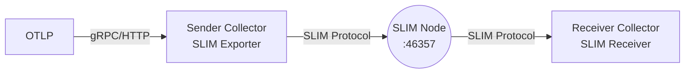

# OpenTelemetry Integration with SLIM

The SLIM OpenTelemetry [repository](https://github.com/agntcy/slim-otel) provides a custom receiver and exporter
that enable the standard OpenTelemetry Collector to send and receive observability
data over secure, low-latency SLIM channels. These components can be integrated
into any OpenTelemetry Collector pipeline alongside standard receivers, processors,
and exporters, enabling secure distribution of telemetry data (traces, metrics,
and logs) using SLIM's end-to-end encryption with Message Layer Security (MLS)
and flexible channel-based routing.

## How It Works

### SLIM Exporter

The [SLIM exporter](https://github.com/agntcy/slim-otel/tree/main/exporter/slimexporter) operates as follows:

1. Connects to a SLIM node using the configured endpoint.
2. Registers three applications with the SLIM node (one for each signal type)
   using the names specified in `exporter-names` configuration, making them
   discoverable to other SLIM participants.
3. Creates channels based on the configuration, with each channel handling one
   signal type (traces, metrics, or logs).
4. Invites participants to the created channels if configured
5. Publishes OpenTelemetry data (serialized as protobuf) to the appropriate SLIM
   channels based on signal type.
6. Listens for invitations from other participants to join additional channels.

The exporter can operate in multiple modes simultaneously: it can create and
manage its own channels while also accepting invitations to join channels created
by other participants.

### SLIM Receiver

The [SLIM receiver](https://github.com/agntcy/slim-otel/tree/main/receiver/slimreceiver) operates as follows:

1. Connects to a SLIM node using the configured endpoint.
2. Registers as an application with the configured `receiver-name`, making it
   discoverable to other SLIM participants.
3. Listens for incoming SLIM sessions from any participant that wants to send
   telemetry data.
4. Automatically detects the signal type (traces, metrics, or logs) by inspecting
   the received data.
5. Supports multiple concurrent sessions from different senders simultaneously.

## Getting Started

This tutorial demonstrates how to set up and run the SLIM OpenTelemetry
Collector with a test application to send and receive telemetry data.

### Prerequisites

- [Docker](https://docs.docker.com/get-started/get-docker/) for running the
  SLIM node.
- [Go](https://go.dev/doc/install) for building the collector and test
  applications.
- [Task](https://taskfile.dev/installation/) for executing build
  and run commands.

### Setting Up the SLIM Node

Since the collector and applications communicate using SLIM, first deploy a SLIM
node. Create a configuration file for the SLIM instance:

```bash
cat << EOF > slim-test-config.yaml
tracing:
  log_level: info
  display_thread_names: true
  display_thread_ids: true

runtime:
  n_cores: 0
  thread_name: "slim-data-plane"
  drain_timeout: 10s

services:
  slim/0:
    dataplane:
      servers:
        - endpoint: "0.0.0.0:46357"
          tls:
            insecure: true
      clients: []
EOF
```

Launch the SLIM node using Docker:

```bash
docker run -it \
    -v ./slim-test-config.yaml:/config.yaml -p 46357:46357 \
    ghcr.io/agntcy/slim:latest /slim --config /config.yaml
```

The SLIM instance will listen on port 46357 for incoming connections, serving as
the communication backbone for the collector and applications.

### Building the Collector

The repository provides all the components and configuration needed to build a
custom OpenTelemetry Collector that includes the SLIM exporter and receiver. To build it:

```bash
git clone https://github.com/agntcy/slim-otel.git
cd slim-otel
task collector:build
```

This command will:

1. Download the [OpenTelemetry Collector Builder (OCB)](https://github.com/open-telemetry/opentelemetry-collector/tree/main/cmd/builder) if not already present
2. Generate collector sources based on `builder-config.yaml`, which includes the
   SLIM components alongside standard OpenTelemetry components
3. Output the binary to `./slim-otelcol/slim-otelcol`

The `builder-config.yaml` file specifies which components to include in the custom
collector. Here's the configuration from the repository:

```yaml
dist:
  name: slim-otelcol
  description: Basic OTel Collector distribution for Developers
  output_path: ./slim-otelcol
  otelcol_version: 0.143.0

replaces:
  - github.com/agntcy/slim/otel => ..
  - github.com/agntcy/slim/otel/slimexporter => ../exporter/slimexporter
  - github.com/agntcy/slim/otel/slimreceiver => ../receiver/slimreceiver
  - github.com/agntcy/slim/otel/internal/sharedcomponent => ../internal/sharedcomponent

exporters:
  - gomod: github.com/agntcy/slim/otel/slimexporter v0.0.1
  - gomod: go.opentelemetry.io/collector/exporter/debugexporter v0.143.0
  - gomod: go.opentelemetry.io/collector/exporter/otlpexporter v0.143.0

processors:
  - gomod: go.opentelemetry.io/collector/processor/batchprocessor v0.143.0

receivers:
  - gomod: github.com/agntcy/slim/otel/slimreceiver v0.0.1
  - gomod: go.opentelemetry.io/collector/receiver/otlpreceiver v0.143.0

providers:
  - gomod: go.opentelemetry.io/collector/confmap/provider/envprovider v1.48.0
  - gomod: go.opentelemetry.io/collector/confmap/provider/fileprovider v1.48.0
  - gomod: go.opentelemetry.io/collector/confmap/provider/httpprovider v1.48.0
  - gomod: go.opentelemetry.io/collector/confmap/provider/httpsprovider v1.48.0
  - gomod: go.opentelemetry.io/collector/confmap/provider/yamlprovider v1.48.0
```

#### Using SLIM Components in Your Own Collector

The SLIM exporter and receiver can be integrated into any OpenTelemetry Collector
distribution. Add them to your own `builder-config.yaml` to create a custom
collector that includes SLIM support alongside your other required components.

For more information about the OpenTelemetry Collector Builder and standard
configurations, see the [OpenTelemetry Collector Builder documentation](https://opentelemetry.io/docs/collector/custom-collector/).

### Configuring the Collector

The collector uses a configuration file to define its behavior. You can configure
the SLIM exporter to send data over SLIM channels, the SLIM receiver to receive
data from SLIM channels, or both in the same collector instance.

In this tutorial, we'll set up two collectors. The sender collector uses the SLIM exporter to send telemetry data over SLIM channels. The receiver collector uses the SLIM receiver to accept telemetry data from SLIM channels.

The following diagram shows how these components interact:



The sender collector receives telemetry from applications (via OTLP). The 
receiver collector outputs data via the debug exporter (visible in logs) and can
optionally forward to your observability backend. The SLIM node provides the secure
messaging layer between them.

#### Configuring the Sender Collector

Create the configuration file for the sender collector with the SLIM exporter:

```bash
cat << EOF > sender-collector-config.yaml
receivers:
  otlp:
    protocols:
      grpc:
        endpoint: 0.0.0.0:4317
      http:
        endpoint: 0.0.0.0:4318

processors:
  batch:
    timeout: 1s
    send_batch_size: 1024

exporters:
  slim:
    endpoint: "http://127.0.0.1:46357"
    exporter-names:
      metrics: "agntcy/otel/exporter-metrics"
      traces: "agntcy/otel/exporter-traces"
      logs: "agntcy/otel/exporter-logs"
    shared-secret: "a-very-long-shared-secret-0123456789-abcdefg"
    channels: 
      - channel-name: "agntcy/otel/channel-traces"
        signal: traces
        participants:
          - "agntcy/otel/receiver"
        mls-enabled: true
      
      - channel-name: "agntcy/otel/channel-metrics"
        signal: metrics
        participants:
          - "agntcy/otel/receiver"
        mls-enabled: true
      
      - channel-name: "agntcy/otel/channel-logs"
        signal: logs
        participants:
          - "agntcy/otel/receiver"
        mls-enabled: true

service:
  telemetry:
    metrics:
      level: none
  
  pipelines:
    traces:
      receivers: [otlp]
      processors: [batch]
      exporters: [slim]
    
    metrics:
      receivers: [otlp]
      processors: [batch]
      exporters: [slim]
    
    logs:
      receivers: [otlp]
      processors: [batch]
      exporters: [slim]
EOF
```

To configure the SLIM exporter, there are required and optional settings.

Required Settings:

- `endpoint`: Address of the SLIM node (default: `http://127.0.0.1:46357`)
- `shared-secret`: Shared secret for MLS and identity provider authentication

Optional Settings:

- `exporter-names`: Names for each signal type exporter that identify this
  collector instance in SLIM channels.

    For each signal type, the following options can be set:

    - `metrics`: Name for the metrics exporter (default: `agntcy/otel/exporter-metrics`).
    - `traces`: Name for the traces exporter (default: `agntcy/otel/exporter-traces`).
    - `logs`: Name for the logs exporter (default: `agntcy/otel/exporter-logs`).

- `channels`: Array of channel configurations (default: `[]`). When empty, the
  exporter operates in passive mode, only listening for invitations.

Channels can also be configured. Each channel supports the following settings:

- `channel-name` (required): The name of the SLIM channel in the form
  `org/namespace/service`.
- `signal` (required): The signal type (`traces`, `metrics`, or `logs`).
- `participants` (required): Array of participant identifiers to invite.
- `mls-enabled` (default: `false`): Enable MLS encryption for the channel.

#### Configuring the Receiver Collector

Create the configuration file for the receiver collector that uses the SLIM receiver
to accept telemetry data:

```bash
cat << EOF > receiver-collector-config.yaml
receivers:
  slim:
    endpoint: "http://127.0.0.1:46357"
    receiver-name: "agntcy/otel/receiver"
    shared-secret: "a-very-long-shared-secret-0123456789-abcdefg"

processors:
  batch:
    timeout: 1s
    send_batch_size: 1024

exporters:
  debug:
    verbosity: detailed
    sampling_initial: 5
    sampling_thereafter: 200

service:
  telemetry:
    metrics:
      level: none
  
  pipelines:
    traces:
      receivers: [slim]
      processors: [batch]
      exporters: [debug]
    
    metrics:
      receivers: [slim]
      processors: [batch]
      exporters: [debug]
    
    logs:
      receivers: [slim]
      processors: [batch]
      exporters: [debug]
EOF
```

To configure the SLIM receiver, there are required and optional settings.

Required Settings:

- `endpoint`: Address of the SLIM node (default: `http://127.0.0.1:46357`).
- `shared-secret`: Shared secret for MLS and identity provider authentication.

Optional Settings:

- `receiver-name`: Name for the receiver to be used in SLIM channels (default:
  `agntcy/otel/receiver`). This is the identifier that other participants use to
  establish sessions with this receiver. All signal types (traces, metrics, logs)
  are handled by a single receiver instance.

### Running the Collectors

You can run each collector independently using the built binary and configuration files.

In one terminal, start the receiver collector:

```bash
./slim-otelcol/slim-otelcol --config receiver-collector-config.yaml
```

The receiver collector will:

1. Connect to the SLIM node.
2. Register with the configured receiver name.
3. Listen for incoming sessions from the sender collector.

In another terminal, start the sender collector:

```bash
./slim-otelcol/slim-otelcol --config sender-collector-config.yaml
```

The sender collector will:

1. Start listening for OTLP data on ports 4317 (gRPC) and 4318 (HTTP).
2. Connect to the SLIM node.
3. Create the configured channels and invite participants.

Once the sender collector starts, you'll see the receiver collector accept the incoming sessions, one for each signal.

```
2026-01-29T18:57:44.070+0100	INFO	slimreceiver@v0.0.1/receiver.go:97	New session received
2026-01-29T18:57:44.070+0100	INFO	slimreceiver@v0.0.1/receiver.go:211	Handling new session	{"sessionID": 1454232866, "sessionName": "agntcy/otel/channel-traces/ffffffffffffffff"}
2026-01-29T18:57:44.088+0100	INFO	slimreceiver@v0.0.1/receiver.go:97	New session received
2026-01-29T18:57:44.088+0100	INFO	slimreceiver@v0.0.1/receiver.go:211	Handling new session	{"sessionID": 873926759, "sessionName": "agntcy/otel/channel-logs/ffffffffffffffff"}
2026-01-29T18:57:44.105+0100	INFO	slimreceiver@v0.0.1/receiver.go:97	New session received
2026-01-29T18:57:44.105+0100	INFO	slimreceiver@v0.0.1/receiver.go:211	Handling new session	{"sessionID": 156147126, "sessionName": "agntcy/otel/channel-metrics/ffffffffffffffff"}
```

### Testing the Integration

Now let's test the complete setup by running both collectors and sending telemetry
data through them using [telemetrygen](https://github.com/open-telemetry/opentelemetry-collector-contrib/tree/main/cmd/telemetrygen).

Install [telemetrygen](https://github.com/open-telemetry/opentelemetry-collector-contrib/tree/main/cmd/telemetrygen) by running the following command:

```bash
go install github.com/open-telemetry/opentelemetry-collector-contrib/cmd/telemetrygen@latest
```

Make sure the Go bin directory is in your PATH:

```bash
export PATH=$PATH:$(go env GOPATH)/bin
```

Generate telemetry data and send it to the sender collector:

**Generate traces:**

```bash
telemetrygen traces --otlp-insecure --rate 10 --duration 30s
```

**Generate metrics:**

```bash
telemetrygen metrics --otlp-insecure --rate 10 --duration 30s
```

**Generate logs:**

```bash
telemetrygen logs --otlp-insecure --rate 10 --duration 30s
```

The telemetry data will flow through the architecture:

**telemetrygen → Sender Collector → SLIM Node → Receiver Collector**

You should see the telemetry data logged in the receiver collector's terminal output
via the debug exporter.

## Additional Resources

- [SLIM OpenTelemetry Collector Repository](https://github.com/agntcy/slim-otel)
- [SLIM Project](https://github.com/agntcy/slim)
- [SLIM Documentation](./overview.md)
- [OpenTelemetry Collector Documentation](https://opentelemetry.io/docs/collector/)
- [MLS RFC 9420](https://datatracker.ietf.org/doc/rfc9420/)
