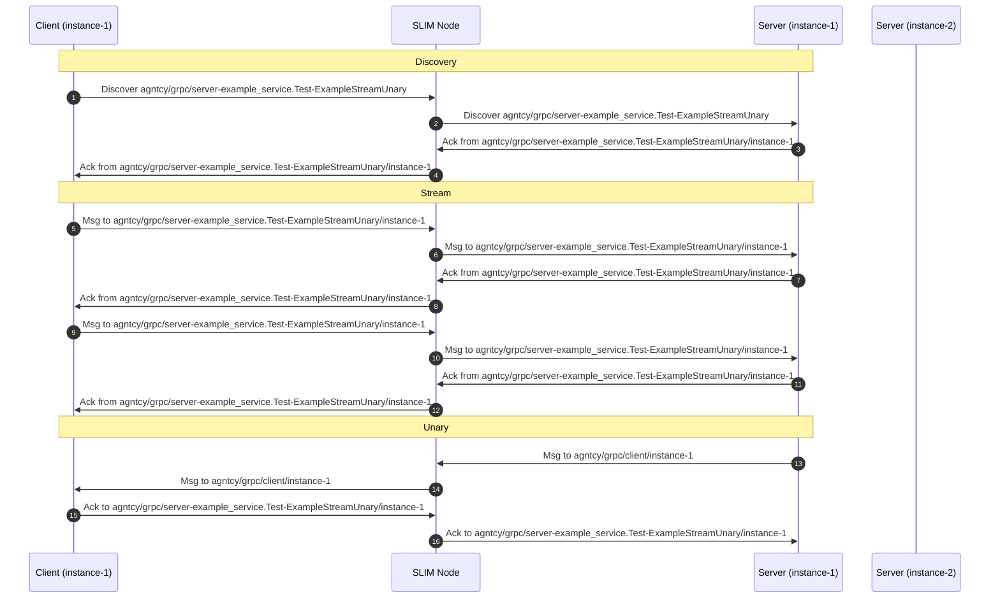

# SLIMRPC (SLIM Remote Procedure Call)

SLIMRPC, or SLIM Remote Procedure Call, is a mechanism designed to enable
Protocol Buffers (protobuf) RPC over SLIM (Secure Low-latency Inter-process
Messaging). This is analogous to gRPC, which leverages HTTP/2 as its underlying
transport layer for protobuf RPC.

A key advantage of SLIMRPC lies in its ability to seamlessly integrate SLIM as
the transport protocol for inter-application message exchange. This
significantly simplifies development: a protobuf file can be compiled to
generate code that utilizes SLIM for communication. Application developers can
then interact with the generated code much like they would with standard gRPC,
while benefiting from the inherent security features and efficiency provided by
the SLIM protocol.

This documentation explains how SLIMRPC works and
how you can implement it in your applications. For detailed instructions on
compiling a protobuf file to obtain the necessary SLIMRPC stub code, please
refer to the dedicated [SLIMRPC compiler
documentation](./slim-slimrpc-compiler.md).

## SLIM naming in SLIMRPC

In SLIMRPC, each service and its individual RPC handlers are assigned a SLIM
name, facilitating efficient message routing and processing. Consider the
[example
protobuf](https://github.com/agntcy/slim/blob/slim-bindings-v1.1.1/data-plane/bindings/python/examples/slimrpc/simple/example.proto)
definition, which defines four distinct services:

```proto
syntax = "proto3";

package example_service;

service Test {
  rpc ExampleUnaryUnary(ExampleRequest) returns (ExampleResponse);
  rpc ExampleUnaryStream(ExampleRequest) returns (stream ExampleResponse);
  rpc ExampleStreamUnary(stream ExampleRequest) returns (ExampleResponse);
  rpc ExampleStreamStream(stream ExampleRequest) returns (stream ExampleResponse);
}

message ExampleRequest {
  string example_string = 1;
  int64  example_integer = 2;
}

message ExampleResponse {
  string example_string = 1;
  int64  example_integer = 2;
}
```

This example showcases the four primary communication patterns supported by
gRPC:

- Unary-Unary
- Unary-Stream
- Stream-Unary
- Stream-Stream

For SLIMRPC, a specific SLIM name is generated for each handler within a
service. This naming convention allows an application exposing the service to
listen for its name and process messages intended for a particular RPC method. The format
for these names is:

```
{package-name}.{service-name}-{handler_name}
```

Based on the example_service.Test definition, the names for each handler would
be:

```
example_service.Test-ExampleUnaryUnary
example_service.Test-ExampleUnaryStream
example_service.Test-ExampleStreamUnary
example_service.Test-ExampleStreamStream
```

This handler name is appended to the second component of the SLIM name
associated with the running application. For instance, to receive messages for
`example_service.Test-ExampleUnaryUnary`, an application would subscribe to:

```
component[0]/component[1]/component[2]-example_service.Test-ExampleUnaryUnary/component[3]
```

The subscription process is entirely managed by the SLIMRPC package. Application
developers are not required to explicitly handle SLIM name subscriptions.
Instead, they only need to implement the specific functions that will be invoked
when a message arrives for a defined RPC method, exactly as they would with
standard gRPC.

## Example

This section provides a detailed walkthrough of a basic SLIMRPC client-server
interaction in python, leveraging the simple example provided in
[example](https://github.com/agntcy/slim/blob/slim-bindings-v1.1.1/data-plane/bindings/python/examples/slimrpc/simple)
folder.

### Generated Code

The foundation of this example is the `example.proto` file, which is a standard
Protocol Buffers definition file. This file is compiled using the [SLIMRPC
compiler](./slim-slimrpc-compiler.md) to generate the necessary Python stub
code. The generated code is available in two files:
[example_pb2.py](https://github.com/agntcy/slim/blob/slim-bindings-v1.1.1/data-plane/bindings/python/examples/slimrpc/simple/types/example_pb2.py)
and
[example_pb2_slimrpc.py](https://github.com/agntcy/slim/blob/slim-bindings-v1.1.1/data-plane/bindings/python/examples/slimrpc/simple/types/example_pb2_slimrpc.py).
Specifically, `example_pb2_slimrpc.py` contains the SLIMRPC-specific stubs for
both client and server implementations. Below are the key classes and functions
generated by the compiler:

_Client Stub (TestStub)_: The TestStub class represents the client-side
interface for interacting with the Test service. It provides methods for each
RPC defined in example.proto, allowing clients to initiate calls to the server.

```python
class TestStub:
    """Client stub for Test."""

    def __init__(self, channel):
        """Constructor.

        Args:
            channel: A slim_bindings.Channel.
        """
        self._channel = channel

    async def ExampleUnaryUnary(self, request: pb2.ExampleRequest, timeout: Optional[timedelta] = None, metadata: Optional[dict[str, str]] = None) -> pb2.ExampleResponse:
        """Call ExampleUnaryUnary method."""
        response_bytes = await self._channel.call_unary_async(
            "example_service.Test",
            "ExampleUnaryUnary",
            pb2.ExampleRequest.SerializeToString(request),
            timeout,
            metadata,
        )
        return pb2.ExampleResponse.FromString(response_bytes)

    async def ExampleUnaryStream(self, request: pb2.ExampleRequest, timeout: Optional[timedelta] = None, metadata: Optional[dict[str, str]] = None):
        """Call ExampleUnaryStream method."""
        response_stream = await self._channel.call_unary_stream_async(
            "example_service.Test",
            "ExampleUnaryStream",
            pb2.ExampleRequest.SerializeToString(request),
            timeout,
            metadata,
        )
        while True:
            stream_msg = await response_stream.next_async()
            if stream_msg.is_end():
                break
            if stream_msg.is_error():
                raise stream_msg[0]
            if stream_msg.is_data():
                yield pb2.ExampleResponse.FromString(stream_msg[0])

    async def ExampleStreamUnary(self, request_iterator, timeout: Optional[timedelta] = None, metadata: Optional[dict[str, str]] = None) -> pb2.ExampleResponse:
        """Call ExampleStreamUnary method."""
        request_stream = self._channel.call_stream_unary(
            "example_service.Test",
            "ExampleStreamUnary",
            timeout,
            metadata,
        )
        async for request in request_iterator:
            await request_stream.send_async(pb2.ExampleRequest.SerializeToString(request))
        response_bytes = await request_stream.finalize_async()
        return pb2.ExampleResponse.FromString(response_bytes)

    async def ExampleStreamStream(self, request_iterator, timeout: Optional[timedelta] = None, metadata: Optional[dict[str, str]] = None):
        """Call ExampleStreamStream method."""
        bidi_stream = self._channel.call_stream_stream(
            "example_service.Test",
            "ExampleStreamStream",
            timeout,
            metadata,
        )
        
        async def send_requests():
            async for request in request_iterator:
                await bidi_stream.send_async(pb2.ExampleRequest.SerializeToString(request))
            await bidi_stream.close_send_async()
        
        async def receive_responses():
            while True:
                stream_msg = await bidi_stream.recv_async()
                if stream_msg.is_end():
                    break
                if stream_msg.is_error():
                    raise stream_msg[0]
                if stream_msg.is_data():
                    yield pb2.ExampleResponse.FromString(stream_msg[0])
        
        # Start sending in background
        import asyncio
        send_task = asyncio.create_task(send_requests())
        
        try:
            async for response in receive_responses():
                yield response
        finally:
            await send_task
```

_Server Servicer (TestServicer)_: The TestServicer class defines the server-side
interface. Developers implement this class to provide the actual logic
for each RPC method.

```python
class TestServicer:
    """Server servicer for Test. Implement this class to provide your service logic."""

    def ExampleUnaryUnary(self, request, context):
        """Method for ExampleUnaryUnary. Implement your service logic here."""
        raise slim_bindings.RpcError.Rpc(
            code=slim_bindings.RpcCode.UNIMPLEMENTED,
            message="Method not implemented!",
            details=None
        )

    def ExampleUnaryStream(self, request, context):
        """Method for ExampleUnaryStream. Implement your service logic here."""
        raise slim_bindings.RpcError.Rpc(
            code=slim_bindings.RpcCode.UNIMPLEMENTED,
            message="Method not implemented!",
            details=None
        )

    def ExampleStreamUnary(self, request_iterator, context):
        """Method for ExampleStreamUnary. Implement your service logic here."""
        raise slim_bindings.RpcError.Rpc(
            code=slim_bindings.RpcCode.UNIMPLEMENTED,
            message="Method not implemented!",
            details=None
        )

    def ExampleStreamStream(self, request_iterator, context):
        """Method for ExampleStreamStream. Implement your service logic here."""
        raise slim_bindings.RpcError.Rpc(
            code=slim_bindings.RpcCode.UNIMPLEMENTED,
            message="Method not implemented!",
            details=None
        )
```

_Handler Classes_: The generated code includes internal handler classes that wrap
each servicer method. These handlers manage request deserialization, response
serialization, and error handling. Below is an example of the unary-unary handler:

```python
class _TestServicer_ExampleUnaryUnary_Handler:
    def __init__(self, servicer):
        self.servicer = servicer

    async def handle(self, request: bytes, context: slim_bindings.Context) -> bytes:
        try:
            request_msg = pb2.ExampleRequest.FromString(request)
            response = await self.servicer.ExampleUnaryUnary(request_msg, context)
            return pb2.ExampleResponse.SerializeToString(response)
        except slim_bindings.RpcError:
            raise
        except Exception as e:
            raise slim_bindings.RpcError.Rpc(
                code=slim_bindings.RpcCode.INTERNAL,
                message=str(e),
                details=None
            )
```

Similar handler classes are generated for unary-stream, stream-unary, and
stream-stream patterns, each implementing the appropriate async handling logic
for their respective communication patterns.

_Server Registration Function (add_TestServicer_to_server)_: This utility
function registers an implemented TestServicer instance with an SLIMRPC server.
It maps RPC method names to their corresponding handler instances.

```python
def add_TestServicer_to_server(servicer, server: slim_bindings.Server):
    server.register_unary_unary(
        service_name="example_service.Test",
        method_name="ExampleUnaryUnary",
        handler=_TestServicer_ExampleUnaryUnary_Handler(servicer),
    )
    server.register_unary_stream(
        service_name="example_service.Test",
        method_name="ExampleUnaryStream",
        handler=_TestServicer_ExampleUnaryStream_Handler(servicer),
    )
    server.register_stream_unary(
        service_name="example_service.Test",
        method_name="ExampleStreamUnary",
        handler=_TestServicer_ExampleStreamUnary_Handler(servicer),
    )
    server.register_stream_stream(
        service_name="example_service.Test",
        method_name="ExampleStreamStream",
        handler=_TestServicer_ExampleStreamStream_Handler(servicer),
    )
```

### Server implementation

The server-side logic is defined in
[server.py](https://github.com/agntcy/slim/blob/slim-bindings-v1.1.1/data-plane/bindings/python/examples/slimrpc/simple/server.py).
Similar to standard gRPC implementations, the core service functionality is
provided by the TestService class, which inherits from TestServicer (as
introduced in the previous section). This class contains the concrete
implementations for each of the defined RPC methods.

The SLIM-specific code and configuration is handled within the amain()
asynchronous function:

```python
async def amain() -> None:
    slim_bindings.uniffi_set_event_loop(asyncio.get_running_loop())

    # Initialize service
    tracing_config = slim_bindings.new_tracing_config()
    runtime_config = slim_bindings.new_runtime_config()
    service_config = slim_bindings.new_service_config()

    tracing_config.log_level = "info"

    slim_bindings.initialize_with_configs(
        tracing_config=tracing_config,
        runtime_config=runtime_config,
        service_config=[service_config],
    )

    service = slim_bindings.get_global_service()

    # Create local name
    local_name = slim_bindings.Name("agntcy", "grpc", "server")

    # Connect to SLIM
    client_config = slim_bindings.new_insecure_client_config("http://localhost:46357")
    conn_id = await service.connect_async(client_config)

    # Create app with shared secret
    local_app = service.create_app_with_secret(
        local_name, "my_shared_secret_for_testing_purposes_only"
    )

    # Subscribe to local name
    await local_app.subscribe_async(local_name, conn_id)

    # Create server
    server = slim_bindings.Server.new_with_connection(local_app, local_name, conn_id)

    # Add servicer
    add_TestServicer_to_server(TestService(), server)

    # Run server
    await server.serve_async()
```

The server setup begins by setting the event loop for the SLIM bindings with
`uniffi_set_event_loop()`, which is required for proper async operation. The
service is then initialized with tracing, runtime, and service configurations.
The log level is set to "info" for appropriate logging verbosity.

A local SLIM name is created using `slim_bindings.Name("agntcy", "grpc",
"server")`. This name is used to construct the full SLIMRPC names for each
method:

```
agntcy/grpc/server-example_service.Test-ExampleUnaryUnary
agntcy/grpc/server-example_service.Test-ExampleUnaryStream
agntcy/grpc/server-example_service.Test-ExampleStreamUnary
agntcy/grpc/server-example_service.Test-ExampleStreamStream
```

The server connects to a SLIM node running at `http://localhost:46357` using an
insecure client configuration (TLS disabled for simplicity in this example). A
local app is created with a shared secret for initializing the Message Layer
Security (MLS) protocol.

After subscribing to the local name on the connection, a SLIMRPC server is
created with `slim_bindings.Server.new_with_connection()`. The
`add_TestServicer_to_server()` function is then called to register the
implemented `TestService` with the server, making its RPC methods available:

```python
    # Add servicer
    add_TestServicer_to_server(TestService(), server)
```

Finally, the server starts serving requests with `await server.serve_async()`,
which runs indefinitely until interrupted.

### Client implementation

The client-side implementation, found in
[client.py](https://github.com/agntcy/slim/blob/slim-bindings-v1.1.1/data-plane/bindings/python/examples/slimrpc/simple/client.py),
largely mirrors the structure of a standard gRPC client. The client
initialization follows the same pattern as the server:

```python
async def amain() -> None:
    # Initialize service
    tracing_config = slim_bindings.new_tracing_config()
    runtime_config = slim_bindings.new_runtime_config()
    service_config = slim_bindings.new_service_config()

    tracing_config.log_level = "info"

    slim_bindings.initialize_with_configs(
        tracing_config=tracing_config,
        runtime_config=runtime_config,
        service_config=[service_config],
    )

    service = slim_bindings.get_global_service()

    # Create local and remote names
    local_name = slim_bindings.Name("agntcy", "grpc", "client")
    remote_name = slim_bindings.Name("agntcy", "grpc", "server")

    # Connect to SLIM
    client_config = slim_bindings.new_insecure_client_config("http://localhost:46357")
    conn_id = await service.connect_async(client_config)

    # Create app with shared secret
    local_app = service.create_app_with_secret(
        local_name, "my_shared_secret_for_testing_purposes_only"
    )

    # Subscribe to local name
    await local_app.subscribe_async(local_name, conn_id)

    # Create channel
    channel = slim_bindings.Channel.new_with_connection(local_app, remote_name, conn_id)

    # Create stubs
    stubs = TestStub(channel)
```

The client initialization is very similar to the server setup. After initializing
the service with configurations, the client creates both a local name
(`agntcy/grpc/client`) and a remote name (`agntcy/grpc/server`). The local name
identifies the client in the SLIM network and is used by the server to send back
responses.

Like the server, the client connects to the SLIM node at
`http://localhost:46357` using an insecure client configuration, creates an app
with a shared secret for MLS initialization, and subscribes to its local name.

The key distinction from the server is the channel creation. The client uses
`slim_bindings.Channel.new_with_connection()` with the remote name
(`agntcy/grpc/server`) to establish a channel to the target server. This channel
is then used to create the `TestStub`, which provides type-safe access to all
the RPC methods defined in the protobuf.

Once the stub is created, the client can invoke RPC methods using async/await
syntax:

```python
    # Unary-Unary call
    request = ExampleRequest(example_integer=1, example_string="hello")
    response = await stubs.ExampleUnaryUnary(request, timeout=timedelta(seconds=2))

    # Unary-Stream call
    async for resp in stubs.ExampleUnaryStream(request, timeout=timedelta(seconds=2)):
        logger.info(f"Stream Response: {resp}")

    # Stream-Unary call
    async def stream_requests() -> AsyncGenerator[ExampleRequest, None]:
        for i in range(10):
            yield ExampleRequest(example_integer=i, example_string=f"Request {i}")

    response = await stubs.ExampleStreamUnary(
        stream_requests(), timeout=timedelta(seconds=2)
    )

    # Stream-Stream call
    async for resp in stubs.ExampleStreamStream(
        stream_requests(), timeout=timedelta(seconds=2)
    ):
        logger.info(f"Stream Stream Response: {resp}")
```

All RPC calls support timeout parameters and use Python's async/await patterns.
Streaming requests are provided as async generators, and streaming responses are
consumed using `async for` loops.

## SLIMRPC under the Hood

SLIMRPC was introduced to simplify the integration of existing applications with
SLIM. From a developer's perspective, using SLIMRPC or gRPC is almost identical.
Application developers do not need to manage endpoint names or connectivity
details, as these aspects are handled automatically by SLIMRPC and SLIM.

All RPC services underneath utilize a point-to-point session. The SLIM
session creation is implemented in inside SLIMRPC in
[channel.py](https://github.com/agntcy/slim/blob/slim-bindings-v1.1.1/data-plane/bindings/rust/src/slimrpc/channel.rs#L657-L670):

```rust
let slim_config = slim_session::session_config::SessionConfig {
    session_type: ProtoSessionType::PointToPoint,
    mls_enabled: true,
    max_retries: Some(10),
    interval: Some(Duration::from_secs(1)),
    initiator: true,
    metadata: ctx.metadata(),
};

// Create session to the method-specific subscription name
let (session_ctx, completion) = app
    .create_session(slim_config, method_subscription_name.clone(), None)
    .await
    .map_err(|e| Status::unavailable(format!("Failed to create session: {}", e)))?;
```

This session used by SLIMRPC is also reliable. For each message, the sender
waits for an acknowledgment (ACK) packet for 1 second
(`timeout=datetime.timedelta(seconds=1)`). If no acknowledgment is received, the
message will be re-sent up to 10 times (`max_retries=10`) before notifying the
application of a communication error.

All messages in a streaming communication will be
forwarded to the same application instance. Let's illustrate this with an
example using the client and server applications described above.

Imagine two server instances running the same RPC service. In this example we will
focus on the Stream-Unary service, which is served by both server instances
under the general name
`agntcy/grpc/server-example_service.Test-ExampleStreamUnary`. In SLIM, each
application receives a unique ID. Thus, the full service name will include a
fourth component containing the server's ID. This ID is generated by SLIM itself
(see the [doc](./slim-data-plane.md) for more details). Here we will use
instance-1 and instance-2 for simplicity. So, the two full names for the
services will be:

- `agntcy/grpc/server-example_service.Test-ExampleStreamUnary/instance-1`
- `agntcy/grpc/server-example_service.Test-ExampleStreamUnary/instance-2`

Now, if a new client wants to use the Stream-Unary service it needs to knows
only the general name
`agntcy/grpc/server-example_service.Test-ExampleStreamUnary`. SLIMRPC will
leverage SLIM's capabilities to first discover one of the available services,
and then SLIMRPC will use its full, specific name to consistently communicate
with that same endpoint.

The client will register to SLIM with the name `agntcy/grpc/client`, and it will
get an unique ID assigned by SLIM, for example `instance-1`. So the full name of
the client will be `agntcy/grpc/client/instance-1`.



The initial messages in the sequence diagram are used for the discovery phase.
After this step, the client application knows the specific name of the service
running on instance-1. It's important to note that the first message in the
discovery phase is sent in anycast from the SLIM node, meaning it could be
forwarded to **either of the two running servers**. For instance, a subsequent
call of the same RPC from the same client might be served by the server
with id `instance-2`.

After the discovery, the client will always send messages to the same endpoint,
as demonstrated in the streaming session phase in the example.

Finally, the server is expected to send one message to the client to close the
service. The server learns the client's address (where to forward the message)
by examining the source field of the received messages.
