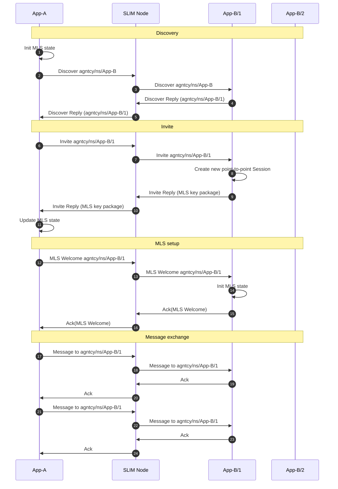
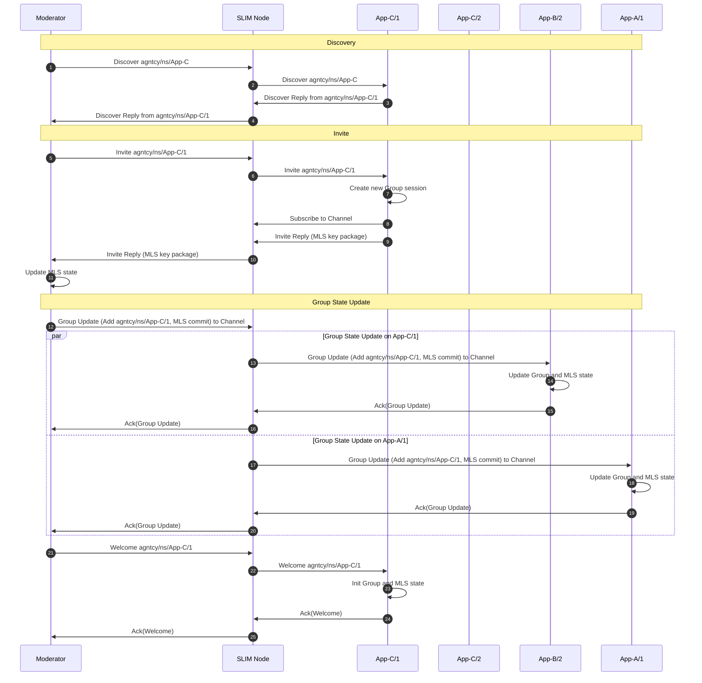
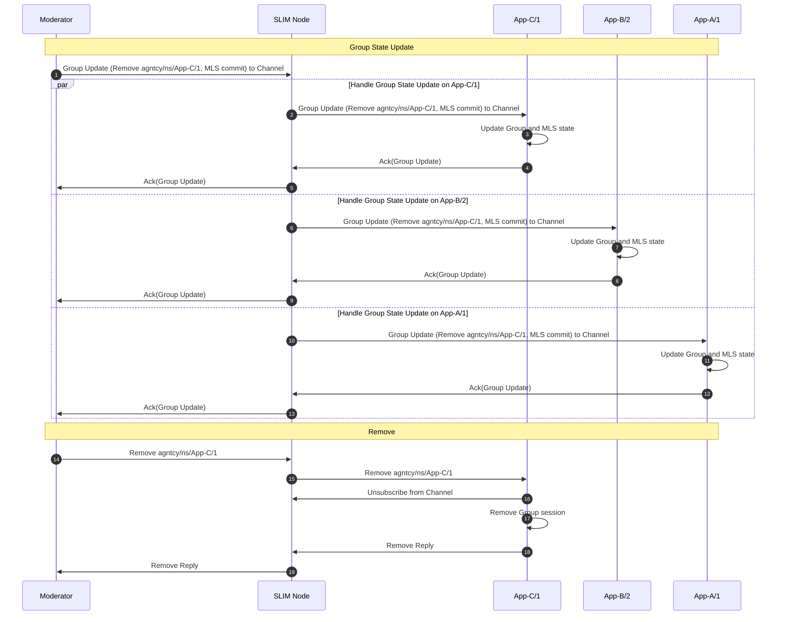

# SLIM Sessions

This document explains the SLIM session layer and the two supported session
types. It helps you understand the two session interfaces, reliability, and security trade‑offs.

The SLIM repository ships with practical, runnable examples for both [Python](https://github.com/agntcy/slim/tree/slim-v1.0.0/data-plane/bindings/python/examples) and [Go](https://github.com/agntcy/slim/tree/slim-v1.0.0/data-plane/bindings/go/examples) that demonstrate how to create sessions and exchange messages between applications. This document uses Python examples as reference.

## Point-to-Point Session

The point-to-point session enables point-to-point communication with a specific
instance. This session performs a discovery phase to bind to one instance and all
subsequent traffic in the session targets that same endpoint. With reliability
enabled, each message in the session must be acked.

If MLS is enabled, the point-to-point session establishes a two‑member MLS group after
discovery. This mirrors the Group flow but with only two participants
(see [Group Session](#group-session)).

The diagram below illustrates a point-to-point session from App-A to agntcy/ns/App-B.
App-A first discovers an available instance (App-B/1), then performs the MLS
setup, and finally sends multiple messages to that same instance, each followed
by an Ack. If MLS is not enabled, the MLS setup is skipped.



### Create a Point-to-Point Session

Using the SLIM Python bindings, you can create a point-to-point session as follows:

```python
# Create session configuration
session_config = slim_bindings.SessionConfig(
    session_type=slim_bindings.SessionType.POINT_TO_POINT,
    enable_mls=enable_mls,
    max_retries=5,
    interval=datetime.timedelta(seconds=5),
    metadata={},
)

# Create session - returns a context with completion and session
session_context = await local_app.create_session_async(
    session_config, remote_name
)

# Wait for session to be established
await session_context.completion.wait_async()

session = session_context.session
```

Config Parameters:

* `session_type` (required, SessionType): Either `POINT_TO_POINT` or `GROUP`.
* `enable_mls` (optional, bool): Enable end‑to‑end encryption (MLS). Default: `False`.
* `max_retries` (optional, int): Retry attempts per message if Ack missing. If not set, the session is best‑effort.
* `interval` (optional, timedelta): Wait per attempt for an Ack before retry.
* `metadata` (optional, dict): Custom metadata key-value pairs for the session.

Create Session Parameters:

* `session_config` (required, SessionConfig): The configuration object for this session.
* `remote_name` (required, Name): Identifier of the remote participant instance.

The `await session_context.completion.wait_async()` guarantees that once returned, all the underlying message exchange
is done and the remote is correctly connected to the session.

### Sending and Replying in a Point-to-Point Session

As the point-to-point session is bound to a single remote instance after discovery,
outbound messages use the implicit destination. Use `publish` for normal sends
and to reply back to the sender.

This example shows how to send and reply in a point-to-point session:

```python
# Send a message using publish; it will reach the endpoint
# specified at session creation
await session.publish_async(
    b"hello",  # payload (bytes): message data to send
    None,      # payload_type (str|None): content type descriptor
    None       # metadata (dict|None): custom key-value pairs for message metadata
)

# Await reply from remote (pattern depends on your control loop)
received_msg = await session.get_message_async(
    timeout=datetime.timedelta(seconds=30)
)
reply = received_msg.payload
print(reply.decode())

# Send a correlated response back (echo style)
# The message will be sent according to the info in the session
await session.publish_async(reply, None, None)  # payload, payload_type, metadata
```

### Point-to-Point Example

This [example](https://github.com/agntcy/slim/blob/slim-v1.0.0/data-plane/bindings/python/examples/point_to_point.py) walks through the creation of a point-to-point session. When running the point-to-point example multiple times, the session binds to different running instances, while the message stream always sticks to the same endpoint.

The example demonstrates how to publish messages, enable reliability, and enable MLS for end‑to‑end security. Run the example using the Taskfile provided in the repository.

## Group Session

The Group session allows many-to-many communication on a named channel. Each
message is delivered to all participants connected to the same session.

The creator of the channel can act as a moderator, meaning that it can add or
remove participants from the session. Moderation can be built into your application
or delegated to a separate control service or the SLIM control plane.

Below are examples using the latest Python bindings, along with explanations of
what happens inside the session layer when a participant is added or removed
from the channel (see [group management](./slim-group.md)).

### Create a Group Session

To create a group session, you need to configure the session with a topic
name and specify reliability and security settings. Here is an
example:

```python
# Create group session configuration
session_config = slim_bindings.SessionConfig(
    session_type=slim_bindings.SessionType.GROUP,
    enable_mls=enable_mls,
    max_retries=5,
    interval=datetime.timedelta(seconds=5),
    metadata={},
)

# Create session - returns a SessionContext
session = local_app.create_session(session_config, chat_channel)

# Wait for session to be established
await session.completion.wait_async()

created_session = session.session
```

Config Parameters:

* `session_type` (required, SessionType): Set to `GROUP` for group sessions.
* `enable_mls` (optional, bool): Enable end‑to‑end encryption (MLS). Default: `False`.
* `max_retries` (optional, int): Retry attempts per message if Ack missing. If not set, the session is best‑effort.
* `interval` (optional, timedelta): Wait per attempt for an Ack before retry.
* `metadata` (optional, dict): Custom metadata key-value pairs for the session.

Create Session Parameters:

* `session_config` (required, SessionConfig): The configuration object for this session.
* `chat_channel` (required, Name): Identifier of the group channel that all participants join.

As in the case of point-to-point sessions, the `await session.completion.wait_async()` guarantees that once returned, all the
underlying message exchange is completed.

### Sending and Replying in a Group Session

In a Group, the session targets a channel: all sends are delivered to all the current
participants. Use `publish_async` to send a message to all the participants in the group.

```python
# Broadcast to the channel
await session.publish_async(b"hello", None, None)  # payload, payload_type, metadata

# Handle inbound messages
received_msg = await session.get_message_async(
    timeout=datetime.timedelta(seconds=30)
)
ctx = received_msg.context
payload = received_msg.payload
print("channel received:", payload.decode())
```

### Invite a New Participant

The creator of the session can invite a new participant to the channel using the `invite`
method after creating the session.

```python
# After creating the session:
for invite in invites:
    invite_name = split_id(invite)
    await local_app.set_route_async(invite_name, conn_id)
    handle = await created_session.invite_async(invite_name)
    await handle.wait_async()
    print(f"{local} -> add {invite_name} to the group")
```

Parameters:

* `invite_name` (required, Name): Identifier of the participant to add.

Notice the `await local_app.set_route_async(invite_name, conn_id)` command before the invite.
This instructs SLIM on how to forward a message with the specified name.
This has to be done by the application for every invite.

After `await handle.wait_async()` returns, you are guaranteed that the remote participant has been
correctly added to the group and all the state on every participant is updated.
When a moderator wants to add a new participant (e.g., an instance of App-C) to
a group session, all the following steps need to be executed (see diagram below):

1. **Discovery Phase:** The moderator initiates a discovery request to find a
    running instance of the desired application (App-C). This request is sent to
    the SLIM Node, which forwards it via anycast to one of the App-C instances.
    In the example, the message is forwarded to App-C/1 that replies with its
    full identifier. The SLIM Node relays this reply back to the moderator.

2. **Invitation:** The moderator sends an invite message for the discovered
    instance (App-C/1) to the SLIM Node, which forwards it to App-C/1. Upon
    receiving the invite, App-C/1 creates a new group session, subscribes to
    the channel, and replies with its MLS (Messaging Layer Security) key
    package. This reply is routed back to the moderator.

3. **Group State Update:** The moderator initiates an MLS commit to add App-C/1
    to the secure group. The message is sent using the channel name and so the
    SLIM Node distributes this commit to all current participants (App-B/2 and
    App-A/1), who update their MLS state and acknowledge the commit. This message
    also contains the new list of participants in the group, in particular the
    newly added participant. The
    moderator collects all acknowledgments for the update message. Once all acknowledgments are
    received, the moderator sends an MLS Welcome message to App-C/1. App-C/1
    initializes its MLS state, gets the current list of participants in the group
    and acknowledges receipt. At the end of this
    process, all participants (including the new one) share a secure group state
    and can exchange encrypted messages on the group channel. If MLS is
    disabled, the update and welcome messages are used only to exchange the new list of
    participants in the group, so that they are all aware of who is connected.



### Remove a Participant

A moderator can remove a participant from the channel using the `remove`
method after creating the session.

This example shows how to remove a participant from a group session:

```python
# To remove a participant from the session:
await session.remove_async(remove_name)
```

Parameter:

* `remove_name` (required, Name): Identifier of the participant to remove.

When a moderator wants to remove a participant (e.g., App-C/1) from a group
session, the following steps occur. All the steps are visualized in the diagram
below:

1. **Group State Update:** The moderator creates an MLS commit to remove App-C/1
    from the secure group. This commit is sent to the group channel and the
    SLIM Node distributes it to all current participants (App-C/1, App-B/2, and
    App-A/1). The message also contains the name of the participant to remove so
    that all the endpoints can update their list of participants.
    Each participant updates its MLS state and acknowledges the
    commit. The moderator collects all acknowledgments. If MLS is
    disabled, only the name of the participant to remove is sent using this message.

2. **Removal:** After the MLS state is updated, the moderator sends a remove
    message to App-C/1. Upon receiving the remove message, App-C/1 unsubscribes
    from the channel, deletes its group session, and replies with a
    confirmation. The SLIM Node relays this confirmation back to the moderator.
    At the end of this process, App-C/1 is no longer a member of the group
    and cannot send or receive messages on the channel.



If the moderator is removed from the group, or it simply closes the session, it sends a
close message on the channel that is received by all the group participants. Upon reception,
all the participants acknowledge that the message was received and they close the local session,
similar to the reception of the remove message (see the diagram). In this way, when the moderator
stops, all participants are removed from the group.

### Group Example

This [example](https://github.com/agntcy/slim/blob/slim-v1.0.0/data-plane/bindings/python/examples/group.py) demonstrates how to create a group session, invite participants, and (if enabled) establish an MLS group for end-to-end encryption. It also shows how to broadcast messages to all current members and handle inbound group messages. Run the example using the Taskfile provided in the repository.
