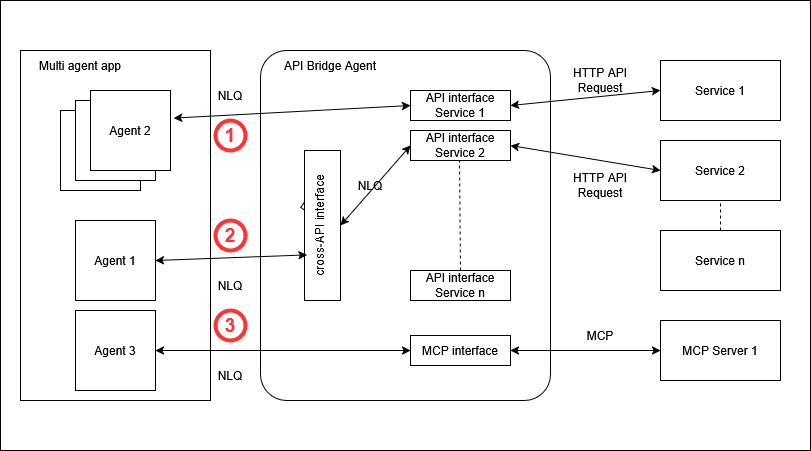

# API Bridge Agent

## About The Project

The [API Bridge Agent](https://github.com/agntcy/api-bridge-agnt) project provides a [Tyk](https://tyk.io/) middleware plugin
that allows users to interact with external services, using natural language. These external services can either offers
traditional REST APIs interface, or MCP interfaces. It acts as a translator between human language and structured API and
MCP Servers, for requests and responses.

Key features:

- Select best services, based on the intent on the query.
- Converts natural language queries into valid API requests based on OpenAPI specifications for service with API interfaces,
or into valid MCP tool calls for MCP Servers.
- Transforms service responses back into natural language explanations.
- Integrates with Tyk API Gateway as a plugin.
- Uses Azure OpenAI's GPT models for language processing.
- Preserves API schema validation and security while enabling conversational interfaces.

This enables developers to build more accessible and user-friendly API interfaces without modifying
the underlying API implementations, or to access to MCP Servers and tools without implementing a MCP Client.

## API Bridge Agent Interfaces

API Agent Bridge support several level of interface:

```

### The API Interfaces

API Bridge Agent provides one endpoint per API (service) supported

i.e. if you add the Github support to API Bridge Agent, with a /github/ configured listen path, then you can address natural language requests directly to this endpoint to access to Github service.

#### Direct Mode

You can request directly the wanted endpoint in the API specification.

For ex:
```shell
curl 'http://localhost:8080/gmail/gmail/v1/users/me/messages/send' \
  --header "Authorization: Bearer YOUR_GOOGLE_TOKEN" \
  --header 'Content-Type: text/plain' \
  --header 'X-Nl-Query-Enabled: yes' \
  --header 'X-Nl-Response-Type: nl' \
  --data 'Send an email to "john.doe@example.com". Explain that we are accepting his offer for Agntcy'
```

In this example
- /gmail/ is the listen path defined on the x-tyk-api-gateway part of the spec
- gmail/v1/users/me/messages/send is the endpoint in the specification

API Bridge Agent will :
- use LLM to translate Natural Language Query (NLQ) to api call for the wanted endpoint
- Tyk will automatically connect to the upstream endpoint and get the response
- use LLM to translate result of api call to NLQ

#### Indirect Mode

In this case, you target a service, but you let API Bridge Agent to choose inside the service the best endpoint to solve the
request.

For ex:
```shell
curl 'http://localhost:8080/gmail/' \
  --header "Authorization: Bearer YOUR_GOOGLE_TOKEN" \
  --header 'Content-Type: text/plain' \
  --header 'X-Nl-Query-Enabled: yes' \
  --header 'X-Nl-Response-Type: nl' \
  --data 'Send an email to "john.doe@example.com". Explain that we are accepting his offer for Agntcy'
```

API Bridge Agent will :
- use a semantic search to select the best endpoint that correspond to the query
- use LLM to translate NLQ to api call for the wanted endpoint
- Tyk will automatically connect to the upstream endpoint and get the response
- use LLM to translate result of api call to NLQ

### The Cross-API Interface

API Bridge Agent provide a specific endpoint /aba/. If you address a natural language request to this endpoint,
API Bridge Agent will search for the best service to solve the request, then it will forward the request to the proper API
interface.

API Bridge Agent will :
- use a semantic search for best service selection.
- forward the request to the selected service (indirect mode: we let the service choose the best endpoint. We don’t select it
at the cross-api interface level)

### The MCP Interface (new)

MCP is an open protocol that standardizes how applications provide context to LLMs. It provides a standardized way to connect
AI models to different data sources and tools.

API Bridge Agent support MCP across a specific endpoint /mcp/. One MCP Client is instantiated per MCP servers connected.

API Bridge Agent will :
- invoke the LLM with the list of available tools that come from all the connected MCP Servers.
- if the LLM needs information coming from the tools, API bridge Agent will request all the needed tools using corresponding
MCP client.
- API Bridge Agent invoke again the LLM with the NLQ, the list of tools, the first response and the list of result of call tools.
- If LLM still need some information, API Bridge Agent loop again and call tools.

See the [Getting Started with API Bridge Agent](../how-to-guides/bridge-howto.md) section for step-by-step instructions.
